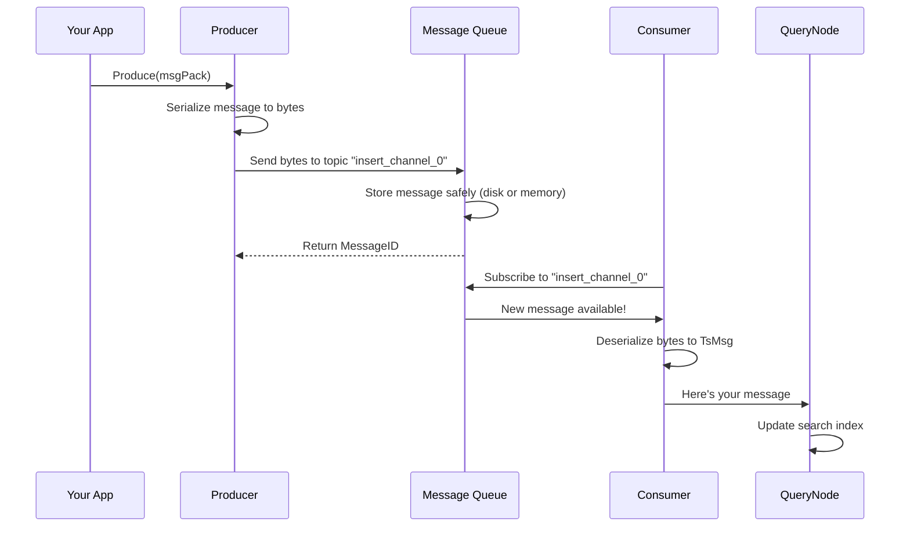

# Chapter 3: Message Queue & Streaming Infrastructure

In [Chapter 2: Configuration Management System](02_configuration_management_system_.md), we learned how Milvus reads and updates configuration settings across a distributed system. But configuration only tells components *how* to behave—it doesn't explain how components **talk to each other**.

Imagine you're still running that Milvus restaurant chain. The kitchen (DataNode) produces dishes, but how does this information reach the delivery team (QueryNode)? If the kitchen just shouts "Order 42 is ready!", nobody can hear it. You need a **messaging system**—a reliable way for one part of the restaurant to notify others about important events.

This is exactly what **Message Queue & Streaming Infrastructure** solves!

## The Problem: Components Need to Communicate Reliably

Milvus is distributed. It has many independent components:

- **Proxy**: Receives requests from clients
- **DataNode**: Stores data and generates events when data changes
- **QueryNode**: Searches data and needs to know when data changed
- **MixCoord**: Orchestrates all other components

These components must communicate without direct connections. Why? Because:
- Components might crash and restart
- Messages might arrive out of order
- Multiple components might need the same information
- Some messages are critical and must not be lost

A **message queue** solves this by being a **trusted messenger** between components.

## Key Concept: What is a Message Queue?

A **message queue** (MQ) is a system where:

```
Component A (Producer)  →  Message Queue  →  Component B (Consumer)
Sends a message         ↓
                    Stores it safely
                        ↓
                   Delivers to anyone
                   who wants to listen
```

Think of it like a bulletin board at your restaurant:

```
Kitchen: "Post a notice on the bulletin board that Order 42 is ready"
         ↓
         [Bulletin Board - Message Queue]
         ↓
Delivery Team: "Check bulletin board - my route is ready!"
Accounting:    "Check bulletin board - I need to log this sale"
```

Everyone can read the same message. Nobody needs to wait. The bulletin board (queue) is the reliable middleman.

## Key Concepts Explained

### 1. Topic (or Channel)

A **topic** is like a category on the bulletin board. Instead of one giant board, you have separate boards for different news:

```
Topics in Milvus:
- "insert_events"      → DataNode posts here when data is inserted
- "query_events"       → QueryNode posts here when searches happen
- "collection_schema"  → MixCoord posts when schema changes
```

### 2. Producer

A **producer** is something that sends messages to a topic:

```go
// DataNode is a producer
dataNode.ProduceMessage(topic="insert_events", 
                        message="Inserted 1000 rows into collection_A")
```

### 3. Consumer

A **consumer** is something that receives messages from a topic:

```go
// QueryNode is a consumer
consumer := mq.Subscribe(topic="insert_events")
// Now QueryNode will receive every message posted to "insert_events"
```

### 4. Message

A **message** is the actual data being sent:

```
Message = {
  ID: "msg_12345",
  Topic: "insert_events",
  Payload: <serialized data>,
  Timestamp: 2024-01-15T10:30:00Z
}
```

## Your First Use Case: Sending a Vector Insert Event

**Goal**: When data is inserted into Milvus, notify all QueryNodes so they can update their search indexes.

**Before Message Queue:**
```
DataNode: "Hey QueryNode, I inserted data!"
QueryNode: "Did you say something? I was sleeping..."
(message lost!)
```

**With Message Queue:**
```
DataNode: "I'm posting this on the bulletin board"
Message Queue: *stores it safely*
QueryNode: "I'll check the board every second"
*finds the message and updates search index*
(message delivered!)
```

## How to Use Message Queues in Milvus

### Step 1: Create a Producer (Send Messages)

The factory pattern creates the right message queue type:

```go
import "github.com/milvus-io/milvus/pkg/v2/mq/msgstream"

// Create a message stream (producer)
producer, err := msgFactory.NewMsgStream(ctx)
if err != nil {
    panic(err)
}

// Tell it which topics to publish to
producer.AsProducer(ctx, []string{"insert_channel_0", "insert_channel_1"})
```

This creates a producer that can send to multiple channels (topics). Think of it as a delivery person with multiple bulletin boards to update.

### Step 2: Send a Message

```go
msgPack := &msgstream.MsgPack{
    Msgs: []msgstream.TsMsg{
        &msgstream.InsertMsg{
            InsertRequest: &msgpb.InsertRequest{
                CollectionName: "my_collection",
                NumRows:        1000,
            },
        },
    },
}

err := producer.Produce(ctx, msgPack)
// Message is now in the queue, delivered to all consumers!
```

When you send a message, the queue automatically distributes it to **all consumers listening on that topic**.

### Step 3: Create a Consumer (Receive Messages)

```go
// Create a message stream (consumer)
consumer, err := msgFactory.NewTtMsgStream(ctx)
if err != nil {
    panic(err)
}

// Subscribe to topics
err := consumer.AsConsumer(ctx, 
    []string{"insert_channel_0"}, 
    "my_consumer_group",
    common.SubscriptionPositionEarliest)
```

This creates a consumer that will receive all messages posted to `insert_channel_0`. The `SubscriptionPositionEarliest` means "give me all messages, even old ones from before I subscribed."

### Step 4: Receive Messages

```go
// Get the message channel
msgChan := consumer.Chan()

// Listen for messages (blocks until message arrives)
for msgPack := range msgChan {
    for _, msg := range msgPack.Msgs {
        log.Info("Received message", zap.String("type", msg.Type().String()))
        // Process the message here
    }
}
```

The consumer receives messages one at a time. This is a **blocking receive**—the code waits until a message arrives.

## How It Works Internally

When you call `producer.Produce(ctx, msgPack)`, many things happen:



**Step by step:**

1. **Serialization**: Convert your message object to bytes (so it can be stored)
2. **Send to Queue**: Producer writes bytes to the queue under the topic name
3. **Persistence**: Queue stores it (ensuring it's not lost if system crashes)
4. **Notification**: Queue tells all consumers "new message available!"
5. **Deserialization**: Consumer converts bytes back to message object
6. **Processing**: Your code receives the message and reacts

## Multiple Message Queue Backends

Milvus supports different backends. Think of these as different courier services—all reliable, but with different pros/cons:

```
┌─────────────────────────────────────────────┐
│     Message Queue Abstraction Layer         │
│  (Unified Producer/Consumer Interface)      │
└─────────────────────────────────────────────┘
        ↓              ↓           ↓          ↓
     RocksMQ        Kafka       Pulsar   Woodpecker
  (Local/simple) (Distributed) (Cloud) (Experimental)
```

### Supported Backends

From the code, Milvus supports:

```go
type WALName commonpb.WALName

const (
    WALNameRocksmq    WALName  // Local embedded queue (good for testing)
    WALNameKafka      WALName  // Distributed queue (production ready)
    WALNamePulsar     WALName  // Cloud-native queue (very reliable)
    WALNameWoodpecker WALName  // New streaming engine (experimental)
)
```

The **abstraction layer** (the interface your code uses) is the same regardless of backend. So you can:

```go
// Using RocksMQ
factory := msgstream.NewRocksmqFactory(path, config)

// Using Kafka
factory := msgstream.NewKmsFactory(config)

// Using Pulsar
factory := msgstream.NewPmsFactory(config.ServiceParam)

// Your code stays the same!
producer, err := factory.NewMsgStream(ctx)
```

This is the **power of abstraction**—you can swap backends without changing your code.

## Code Deep Dive: Understanding the Implementation

### The Factory Pattern

Milvus uses the **factory pattern** to create producers/consumers:

```go
type Factory interface {
    NewMsgStream(ctx context.Context) (MsgStream, error)
    NewTtMsgStream(ctx context.Context) (MsgStream, error)
}
```

Each backend (Kafka, Pulsar, RocksMQ) implements this interface differently:

```go
// Pulsar factory
func (f *PmsFactory) NewMsgStream(ctx context.Context) (MsgStream, error) {
    pulsarClient, err := pulsarmqwrapper.NewClient(/*...*/)
    return NewMqMsgStream(ctx, f.ReceiveBufSize, 
                         f.MQBufSize, pulsarClient, 
                         f.dispatcherFactory.NewUnmarshalDispatcher())
}
```

The factory creates a `MsgStream` object which wraps the backend-specific client.

### Message Serialization

Before a message can be sent, it must be serialized to bytes:

```go
// In producer.Produce()
mb, err := v.Msgs[i].Marshal(v.Msgs[i])  // Convert to protobuf bytes
if err != nil {
    return err
}

m, err := convertToByteArray(mb)  // Convert protobuf to byte array
if err != nil {
    return err
}

msg := &common.ProducerMessage{Payload: m}  // Wrap in producer message
_, err := producer.Send(spanCtx, msg)       // Send to queue
```

The message is converted to bytes, wrapped in a `ProducerMessage`, and sent to the queue.

### Consumer Deserialization

When a consumer receives bytes, it converts them back:

```go
// In consumer.receiveMsg()
packMsg, err = UnmarshalMsg(msg, ms.unmarshal)
if err != nil {
    log.Warn("Failed to unmarshal", zap.Error(err))
    continue
}

// Now packMsg is a proper message object we can use
pos := &msgpb.MsgPosition{
    ChannelName: filepath.Base(msg.Topic()),
    MsgID:       packMsg.GetMessageID(),
}
packMsg.SetPosition(pos)
```

The bytes are deserialized back into a message object with a position (so we remember where we read from).

## Understanding Message Routing

When you send a message with multiple keys, Milvus distributes it intelligently:

```go
// Input: messages with hash keys
hashKeys := msg.HashKeys()  // e.g., [42, 123, 456] (collection IDs)

// Output: which channel should each message go to?
channelNum := len(producerChannels)  // 4 channels available
for i, hashValue := range hashKeys {
    bucketValues[i] = int32(hashValue % channelNum)
    // Hash 42 % 4 = 2   → send to channel 2
    // Hash 123 % 4 = 3  → send to channel 3
    // Hash 456 % 4 = 0  → send to channel 0
}
```

This is like distributing restaurant orders to multiple kitchens based on the order number. It **balances load** across available channels.

## Real Example: Insert Data Flow

Let's trace a complete insert flow:

```
1. Client: Insert 1000 vectors into collection "embeddings"
            ↓
2. Proxy receives request, creates InsertMsg
            ↓
3. Proxy (Producer): "I'll post this on insert_channel_0"
   producer.Produce(ctx, msgPack)
            ↓
4. Message Queue: Stores message safely, notifies all subscribers
            ↓
5. QueryNode (Consumer) receives notification
   "New insert on insert_channel_0!"
            ↓
6. QueryNode: Deserializes message, updates search index
            ↓
7. Client gets success response
```

All of this happens **without the Proxy and QueryNode ever talking directly**—they communicate through the message queue.

## Handling Multiple Consumers (Consumer Groups)

Multiple QueryNodes can consume the same messages:

```go
// QueryNode 0
consumer0.AsConsumer(ctx, 
    []string{"insert_channel_0"}, 
    "query_node_group",  // same group
    common.SubscriptionPositionEarliest)

// QueryNode 1
consumer1.AsConsumer(ctx, 
    []string{"insert_channel_0"}, 
    "query_node_group",  // same group
    common.SubscriptionPositionEarliest)
```

**What happens:**
- If both are in the same consumer group, the queue **divides messages** between them
- If they're in different groups, **both get all messages**

This is crucial for:
- **Load balancing**: Multiple nodes share the work
- **Redundancy**: Multiple nodes get the same data for backup

## Configuration Integration

Remember from [Chapter 2](02_configuration_management_system_.md)? Message queue parameters come from config:

```go
// From configuration (milvus.yaml or environment)
bufSize := paramtable.Get().MQCfg.MQBufSize.GetAsInt64()
receiveBufSize := paramtable.Get().MQCfg.ReceiveBufSize.GetAsInt64()

// Which backend?
mqType := paramtable.Get().ServiceParam.MQCfg.Type.GetValue()
// "kafka", "pulsar", "rocksmq", etc.

// Use this to choose factory
factory := chooseFactory(mqType, config)
```

Configuration and messaging work together—config tells you **which queue backend to use** and **how big the buffers should be**.

## The Abstraction: Same Interface, Different Backends

The beauty of this abstraction:

```go
// YOUR CODE (always the same)
stream, _ := factory.NewMsgStream(ctx)
stream.AsProducer(ctx, channels)
stream.Produce(ctx, msgPack)

// INTERNAL (different per backend)
// - If RocksMQ: Uses local RocksDB as storage
// - If Kafka: Connects to Kafka cluster
// - If Pulsar: Connects to Pulsar broker
// - If Woodpecker: Uses new streaming engine
// BUT YOUR CODE DOESN'T CHANGE!
```

You could run Milvus with Kafka in production and RocksMQ in testing without changing a single line of business logic.

## Message Positioning and Seeking

Sometimes you need to replay messages from a specific point:

```go
// "Give me messages starting from timestamp 2024-01-15T10:00:00Z"
msgPositions := []*MsgPosition{
    {
        ChannelName: "insert_channel_0",
        MsgID:       someMessageID,  // Or a timestamp
    },
}

consumer.Seek(ctx, msgPositions, includeCurrentMsg=true)
```

This is useful for:
- **Recovery**: If QueryNode crashed, replay missed messages
- **Catchup**: If a new node joins, replay old data
- **Debugging**: Replay a specific time period

## The Complete Communication Picture

Here's how message queues fit in the overall Milvus architecture:

```
┌──────────────────────────────────────────────────┐
│          Milvus Distributed System               │
├──────────────────────────────────────────────────┤
│                                                  │
│  ┌─────────┐              ┌──────────────────┐  │
│  │  Proxy  │◄────────────►│ Message Queue    │  │
│  │(Producer│              │ (RocksMQ/Kafka/ │  │
│  │Consumer)│              │  Pulsar/etc)     │  │
│  └─────────┘              └──────────────────┘  │
│      ▲                           ▲   ▲          │
│      │                           │   │          │
│      └───────────────────────────┘   │          │
│                                      │          │
│  ┌──────────┐    ┌──────────┐       │          │
│  │DataNode  │    │QueryNode │◄──────┘          │
│  │(Producer)│    │(Consumer)│                   │
│  └──────────┘    └──────────┘                   │
│                                                  │
│  ┌──────────┐                                    │
│  │ MixCoord │ (Coordinates via messages too!)   │
│  └──────────┘                                    │
│                                                  │
└──────────────────────────────────────────────────┘
```

All components communicate **only through messages**. None talk to each other directly.

## Key Takeaways

| Concept | Meaning |
|---------|---------|
| **Message Queue** | Reliable system for components to communicate asynchronously |
| **Producer** | Component that sends messages |
| **Consumer** | Component that receives messages |
| **Topic/Channel** | Named message stream |
| **Backend** | Actual implementation (Kafka, Pulsar, RocksMQ, etc.) |
| **Abstraction** | Same interface works with any backend |
| **Serialization** | Converting message objects to bytes for storage |
| **Consumer Group** | Multiple consumers coordinate to process messages |
| **Message Position** | Where we've read up to (for replay/recovery) |

## Summary

The Message Queue & Streaming Infrastructure solves a fundamental challenge: **How do distributed components communicate reliably without knowing about each other?**

By providing:
- ✅ A unified producer/consumer interface (same code works with any backend)
- ✅ Support for multiple backends (Kafka, Pulsar, RocksMQ, Woodpecker)
- ✅ Reliable message storage (no messages lost)
- ✅ Asynchronous communication (components don't block waiting for responses)
- ✅ Easy scaling (add more consumers without changing code)

Milvus can distribute computation across many machines while keeping components loosely coupled and independent.

Now that components can communicate through message queues, Milvus needs to **organize and track all the data** being sent through these queues. Learn how Milvus manages metadata and catalogs in [Chapter 4: Metadata & Catalog Management](04_metadata___catalog_management_.md), where we'll explore how the system keeps track of collections, schemas, and partitions!

---

Generated by [AI Codebase Knowledge Builder](https://github.com/The-Pocket/Tutorial-Codebase-Knowledge)