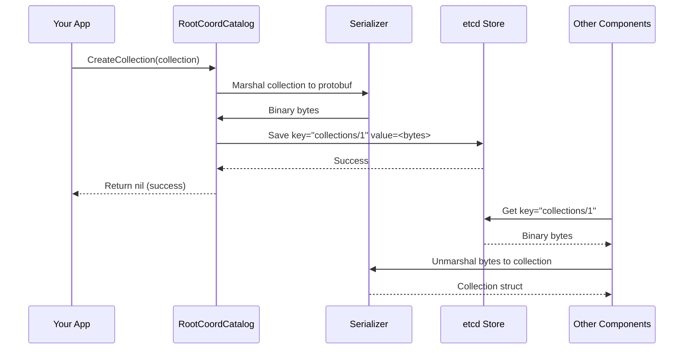

# Chapter 4: Metadata & Catalog Management

In [Chapter 3: Message Queue & Streaming Infrastructure](03_message_queue___streaming_infrastructure_.md), we learned how Milvus components communicate through message queues. But communication alone isn't enough—Milvus needs to remember things. When you create a collection, insert data into segments, or build an index, where is all this information stored? How does Milvus know which segments belong to which collection? How do different coordinators know about the current state of the database?

This is exactly what **Metadata & Catalog Management** solves!

## The Problem: Tracking Database Structure in a Distributed System

Imagine you're managing that Milvus restaurant chain again. Every day, you need to answer questions like:

- "Which dishes (collections) do we have?"
- "For the pasta dish, which ingredients (fields) do we need?"
- "Which locations (segments) are we storing pasta ingredients in?"
- "What kitchen tools (indexes) have we created for the pasta dish?"

If you had to ask each kitchen location individually every time, it would be slow and unreliable. What you need is a **master logbook**—a single source of truth that tracks the entire restaurant structure.

Milvus has the same challenge across many distributed nodes. The **Metadata & Catalog Management** system maintains a centralized logbook that answers all these questions.

## Key Concept: What is Metadata?

**Metadata** is data about data. It's information that describes your database structure:

```
Metadata Examples:
- Collection "user_embeddings" has fields: user_id, embedding_vector, age
- Collection "user_embeddings" has partitions: 2024_Q1, 2024_Q2, 2024_Q3
- Segment 42 contains 1000 rows and belongs to partition 2024_Q1
- Index "my_index" was built on field "embedding_vector" in collection "user_embeddings"
- Segment 42 is currently loaded on QueryNode 5
```

Notice: None of this is the actual data (user IDs, embeddings, etc.)—it's information *about* the data.

## Key Concept: What is a Catalog?

A **Catalog** is a centralized store that manages all this metadata. Think of it like a library's card catalog:

```
┌────────────────────────────────────────┐
│         Catalog (Card Index)           │
├────────────────────────────────────────┤
│  Collection: "user_embeddings"         │
│    ├─ Fields: [...definitions...]      │
│    ├─ Partitions: [2024_Q1, 2024_Q2]  │
│    └─ Indexes: [idx_vector]            │
│                                        │
│  Collection: "product_data"            │
│    ├─ Fields: [...definitions...]      │
│    └─ Partitions: [all_products]       │
│                                        │
│  Segment 42 → Collection: user_emb...  │
│  Segment 43 → Collection: user_emb...  │
└────────────────────────────────────────┘
```

The catalog is the "source of truth"—if the catalog says segment 42 exists, then it exists. If it doesn't say so, it doesn't matter what individual nodes think.

## Multiple Catalog Backends for Different Coordinators

Milvus has different coordinators, each managing different parts of the system. Each needs its own specialized metadata catalog:

```
┌─────────────────────────────────────────────┐
│       Metadata & Catalog System             │
├─────────────────────────────────────────────┤
│                                             │
│  RootCoordCatalog                          │
│  ├─ Collections, Databases, Schemas        │
│  ├─ Partitions, Aliases                    │
│  └─ User Credentials & RBAC                │
│         ↓ (backed by etcd)                 │
│                                             │
│  DataCoordCatalog                          │
│  ├─ Segments, Binlogs, Deltalogs          │
│  ├─ Indexes, Index Status                  │
│  └─ Compaction Tasks                       │
│         ↓ (backed by etcd)                 │
│                                             │
│  QueryCoordCatalog                         │
│  ├─ Collection Load Info                   │
│  ├─ Partition Load Status                  │
│  ├─ Replicas, Resource Groups              │
│  └─ Collection Targets                     │
│         ↓ (backed by etcd)                 │
│                                             │
│  StreamingCoordCatalog                     │
│  ├─ Physical & Virtual Channels            │
│  ├─ WAL Checkpoints                        │
│  └─ Replication Configuration              │
│         ↓ (backed by etcd)                 │
│                                             │
└─────────────────────────────────────────────┘
```

Each catalog is specialized for its coordinator's needs, but they all store data in a shared etcd backend.

## Your First Use Case: Creating and Tracking a Collection

**Goal**: Create a collection with a schema, and have all coordinators remember its structure.

### Step 1: Create a Collection Definition

```go
// Define what the collection should look like
collection := &model.Collection{
    CollectionID: 1,
    Name: "user_embeddings",
    Fields: []*model.Field{
        {FieldID: 1, Name: "user_id", DataType: schemapb.DataType_Int64},
        {FieldID: 2, Name: "embedding", DataType: schemapb.DataType_FloatVector},
    },
}
```

This is like writing a recipe card before opening the restaurant.

### Step 2: Save to RootCoordCatalog

```go
// RootCoord saves the collection structure
rootCoordCatalog := getRootCoordCatalog()
err := rootCoordCatalog.CreateCollection(
    ctx, 
    collection, 
    timestamp,  // When this happened
)
```

Now the collection exists in the catalog. All coordinators can see it!

### Step 3: Query the Catalog Later

```go
// Any component can ask: "Does this collection exist?"
coll, err := rootCoordCatalog.GetCollectionByName(
    ctx,
    dbID,
    dbName,
    "user_embeddings",
    timestamp,
)
// Returns: Collection struct with all fields, partitions, etc.
```

The catalog remembers everything, even if the server restarts!

## Understanding the Catalog Interfaces

Looking at the provided code, each catalog has specific methods. Let's understand the RootCoordCatalog:

```go
// Collections are the main resources
CreateCollection(ctx, collectionInfo, ts) error
GetCollectionByID(ctx, dbID, ts, collectionID) error
ListCollections(ctx, dbID, ts) error
DropCollection(ctx, collectionInfo, ts) error

// Partitions organize collections
CreatePartition(ctx, dbID, partition, ts) error
DropPartition(ctx, dbID, collectionID, partitionID, ts) error
```

Each method takes a **timestamp** (ts) parameter. Why? Because Milvus is a **time-versioned** system—it remembers the state at different points in time. You can query "what was the collection structure at timestamp 1000?"

## How It Works Internally

When you call `rootCoordCatalog.CreateCollection()`, here's what happens:



**Step by step:**
1. **Marshalling**: Convert the collection object to bytes (protobuf format) so it can be stored
2. **Storage**: Save to etcd using a hierarchical key path (e.g., `collections/database_1/collection_1`)
3. **Retrieval**: Any component can load the same bytes and unmarshal back to an object
4. **Consistency**: etcd ensures all coordinators see the same data

## Code Deep Dive: RootCoordCatalog Implementation

The RootCoordCatalog is typically backed by an etcd-based implementation. Here's how collection creation works:

```go
// From internal/metastore/kv/rootcoord/kv_catalog.go
func (kc *KvCatalog) CreateCollection(
    ctx context.Context,
    coll *model.Collection,
    ts typeutil.Timestamp,
) error {
    // Marshal the collection into protobuf format
    pb := MarshalCollectionModel(coll)
    
    // Convert to bytes
    value, _ := proto.Marshal(pb)
    
    // Create etcd key: "by-dev/meta/rootcoord-meta/collection/1"
    key := BuildCollectionKey(coll.CollectionID)
    
    // Save to etcd
    return kc.MetaKv.Save(ctx, key, string(value))
}
```

The `MetaKv` is the underlying etcd client that actually stores the data. Let's trace what happens next.

## Understanding the Key Hierarchy

Metadata is organized in etcd with hierarchical keys:

```
Collections:
  by-dev/meta/rootcoord-meta/collection/{collectionID}
  
Partitions:
  by-dev/meta/rootcoord-meta/partition/{collectionID}/{partitionID}
  
Segments (in DataCoord):
  by-dev/meta/datacoord-meta/segment/{collectionID}
  
Indexes (in DataCoord):
  by-dev/meta/datacoord-meta/field-index/{collectionID}/{indexID}
  
Load Info (in QueryCoord):
  querycoord-collection-loadinfo/{collectionID}
  querycoord-partition-loadinfo/{collectionID}/{partitionID}
```

This hierarchical structure allows for efficient queries like "give me all partitions of collection 1" using prefix matching:

```go
// Get all partitions of collection 1
prefix := "by-dev/meta/rootcoord-meta/partition/1/"
allPartitions := MetaKv.WalkWithPrefix(ctx, prefix)
```

## DataCoordCatalog: Tracking Segments and Indexes

The DataCoord manages segments (chunks of data) and indexes. Its catalog handles:

```go
// From internal/metastore/kv/datacoord/kv_catalog.go
ListSegments(ctx, collectionID) → []*datapb.SegmentInfo
AddSegment(ctx, segment) → error
AlterSegments(ctx, segments) → error  // Update segment info

ListIndexes(ctx) → []*model.Index
CreateIndex(ctx, index) → error
DropIndex(ctx, collectionID, indexID) → error
```

When data is inserted, DataNode creates segments and tells the catalog about them:

```go
segment := &datapb.SegmentInfo{
    ID:             42,
    CollectionID:   1,
    PartitionID:    1,
    NumOfRows:      1000,
    State:          common.SegmentStateGrowing,
}

dataCatalog.AddSegment(ctx, segment)
// Now all components know: "Segment 42 has 1000 rows"
```

## QueryCoordCatalog: Tracking Load Status

The QueryCoord manages which collections are loaded into memory for search. Its catalog tracks:

```go
// From internal/metastore/kv/querycoord/kv_catalog.go
SaveCollection(ctx, collectionLoadInfo, partitions...) error
GetCollections(ctx) []*querypb.CollectionLoadInfo
ReleaseCollection(ctx, collectionID) error
```

When you search a collection, QueryCoord must first load it:

```go
// Create load info
loadInfo := &querypb.CollectionLoadInfo{
    CollectionID: 1,
    ReplicaNumber: 1,
    Status: querypb.LoadStatus_Loaded,
}

queryCatalog.SaveCollection(ctx, loadInfo)
// Now all components know: "Collection 1 is loaded and ready for search"
```

## Real Example: Complete Collection Lifecycle

Let's trace a collection through its entire lifecycle:

```
1. User creates collection "embeddings"
   ↓
   RootCoordCatalog.CreateCollection(collection)
   → Key: "collections/embeddings" 
   → Stored in etcd
   ↓

2. User inserts 1000 vectors
   ↓
   DataNode creates Segment 42 with 1000 rows
   DataCoordCatalog.AddSegment(segment)
   → Key: "segments/collection_1/segment_42"
   → Stored in etcd
   ↓

3. User searches the collection
   ↓
   QueryCoord checks: "Is this collection loaded?"
   QueryCoordCatalog.GetCollections(ctx)
   → Not loaded yet!
   ↓

4. QueryCoord loads the collection
   ↓
   QueryCoordCatalog.SaveCollection(loadInfo)
   → Key: "querycoord-collection-loadinfo/1"
   → Stored in etcd
   ↓

5. Search happens, returns results

6. User drops the collection
   ↓
   RootCoordCatalog.DropCollection(collection)
   DataCoordCatalog.DropSegment(segment)
   QueryCoordCatalog.ReleaseCollection(collectionID)
   → All keys removed from etcd
```

## Understanding Marshalling and Unmarshalling

Since etcd stores strings (or bytes), Milvus must convert complex objects to/from storage format:

```go
// Marshalling: Collection → bytes
pb := MarshalCollectionModel(collection)
// Now pb is a *etcdpb.CollectionInfo protobuf

bytes, _ := proto.Marshal(pb)
// Now bytes is []byte ready for etcd
```

```go
// Unmarshalling: bytes → Collection
pb := &etcdpb.CollectionInfo{}
proto.Unmarshal(bytes, pb)
// Now pb is filled with data

collection := UnmarshalCollectionModel(pb)
// Now collection is a *model.Collection we can use
```

This two-step process (model → protobuf → bytes → etcd → bytes → protobuf → model) ensures:
- **Compatibility**: Different versions can read/write safely
- **Efficiency**: Protobuf is compact and fast
- **Flexibility**: Easy to change structures later

## Integration with Configuration Management

Remember from [Chapter 2: Configuration Management System](02_configuration_management_system_.md)? The catalog configuration comes from there:

```go
// Get catalog backend type from configuration
backendType := paramtable.Get().MetaStoreCfg.MetaStoreType.GetValue()
// Could be "etcd", "tikv", "mysql", etc.

// Use configuration to decide which etcd to connect to
endpoints := paramtable.Get().Etcd.Endpoints.GetAsStrings()
// e.g., ["localhost:2379", "localhost:2380"]

// Catalog is initialized with these settings
catalog := NewCatalog(endpoints, backendType)
```

The catalog backend is pluggable—you could swap etcd for TiKV or MySQL without changing the interface.

## Integration with Message Queues

When metadata changes, how do all components know? Through the message queue system from [Chapter 3](03_message_queue___streaming_infrastructure_.md):

```
RootCoord creates collection
     ↓
RootCoordCatalog.CreateCollection() saves to etcd
     ↓
RootCoord sends message to "collection_events" topic
     ↓
DataCoord, QueryCoord, StreamingCoord receive message
     ↓
They all load the new collection from catalog
     ↓
System consistent!
```

The message queue notifies about changes, and the catalog stores the truth. Together they keep the system synchronized.

## Concurrency and Consistency

Since multiple components might access the catalog simultaneously:

```go
// etcd handles concurrency with transactions
// If two components try to create same collection:

Component A: SaveCollection(id=1)
Component B: SaveCollection(id=1)  // At same time!

// etcd will reject one of them with a conflict error
// The application handles retry logic
```

This is similar to database transactions—etcd ensures ACID properties for metadata operations.

## Practical Example: Querying Metadata

Here's how different parts of Milvus query the catalog:

```go
// RootCoord: "What collections exist?"
collections := rootCatalog.ListCollections(ctx, dbID, ts)
for _, coll := range collections {
    log.Info("Collection", zap.String("name", coll.Name))
}

// DataCoord: "What segments need compaction?"
segments := dataCatalog.ListSegments(ctx, collectionID)
for _, seg := range segments {
    if seg.GetNumOfRows() < threshold {
        // Compact this segment
    }
}

// QueryCoord: "What collections are loaded?"
loaded := queryCatalog.GetCollections(ctx)
for _, coll := range loaded {
    log.Info("Loaded", zap.Int64("collection", coll.CollectionID))
}
```

Each coordinator asks questions relevant to its job, and the catalog provides answers.

## Key Takeaways

| Concept | Meaning |
|---------|---------|
| **Metadata** | Data describing database structure (collections, fields, segments, indexes) |
| **Catalog** | Centralized store of all metadata, source of truth |
| **RootCoordCatalog** | Manages collection schemas and RBAC metadata |
| **DataCoordCatalog** | Manages segment and index metadata |
| **QueryCoordCatalog** | Manages load status and replica metadata |
| **StreamingCoordCatalog** | Manages channel and checkpoint metadata |
| **Marshalling** | Converting objects to bytes for storage |
| **etcd Backend** | Distributed key-value store that persists metadata |
| **Hierarchical Keys** | Organizing metadata by prefix for efficient queries |

## Summary

The Metadata & Catalog Management system solves a fundamental challenge: **How do you maintain a consistent source of truth about database structure across many distributed components?**

By providing:
- ✅ Centralized metadata storage (etcd)
- ✅ Specialized catalogs for different coordinators
- ✅ Efficient hierarchical key organization
- ✅ Transaction support for consistency
- ✅ Serialization/deserialization for storage
- ✅ Integration with message queues for notifications

Milvus ensures all components have the same understanding of the database structure, even as data is continuously added, removed, and reorganized.

You've learned:
- ✅ What metadata is and why it's needed
- ✅ How the catalog acts as a source of truth
- ✅ The different catalogs for different coordinators
- ✅ How metadata is persisted in etcd
- ✅ How metadata changes are communicated

Now that Milvus can manage its structure through metadata, it needs to actually search through data efficiently. Learn how Milvus processes and executes queries in [Chapter 5: Query Processing & Search Pipeline](05_query_processing___search_pipeline_.md), where we'll explore how search requests flow through the system!

---

Generated by [AI Codebase Knowledge Builder](https://github.com/The-Pocket/Tutorial-Codebase-Knowledge)