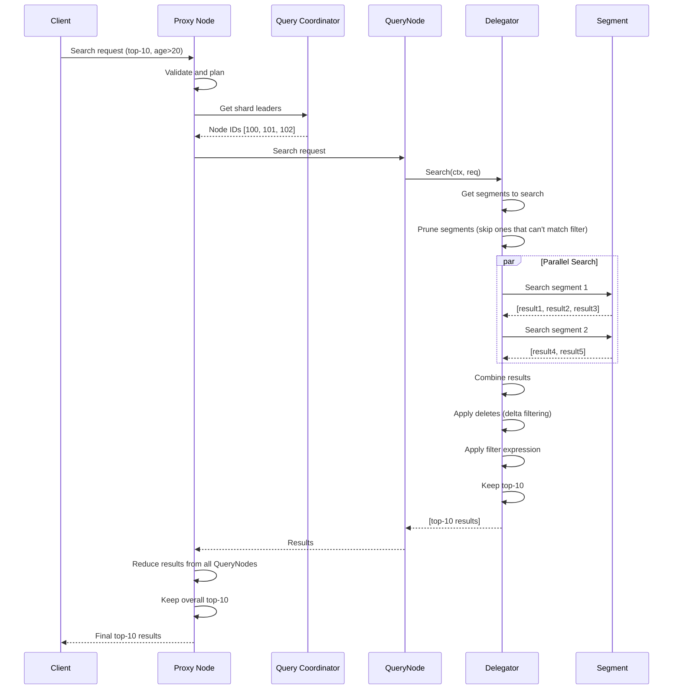

# Chapter 5: Query Processing & Search Pipeline

In [Chapter 4: Metadata & Catalog Management](04_metadata___catalog_management_.md), we learned how Milvus tracks and remembers the structure of your database—what collections exist, which segments contain data, and where everything is stored. But knowing *where* data is doesn't help if we can't *search* through it efficiently!

Now comes the exciting part: when you run a search query in Milvus, how does it actually find the right vectors and return results? How does it coordinate between multiple nodes to search billions of vectors? How does it know which segments to search and which to skip?

This is exactly what **Query Processing & Search Pipeline** solves!

## The Problem: Making Search Fast and Accurate

Imagine you're searching through that restaurant chain's delivery database again. You ask: "Find all orders from customer 12345 that happened in the last week."

Without an organized system, the manager would have to:
1. Check every store's records (slow!)
2. Look at every single order in each store (very slow!)
3. Filter by customer ID (tedious!)
4. Filter by date (more tedious!)
5. Combine results from all stores (error-prone!)

**Milvus has the same challenge.** When you search for vectors similar to a query vector:

```
Query: "Find 10 vectors most similar to [0.1, 0.2, 0.3]"
```

The system needs to:
1. **Segment Pruning**: Decide which data segments to search
2. **Delta Filtering**: Apply any deletes that happened after data was loaded
3. **Search Execution**: Search each segment efficiently
4. **Result Reduction**: Combine results from multiple segments
5. **Return Results**: Give the client the top 10 matches

All of this must happen **efficiently and in parallel** across multiple QueryNodes!

## Key Concept: The Search Request's Journey

A search request travels through several stages, like a letter going through the mail system:

```
1. Client sends search request to Proxy
      ↓
2. Proxy validates and prepares the request
      ↓
3. Query Coordinator determines which nodes to send to
      ↓
4. Multiple QueryNodes search their local segments in parallel
      ↓
5. QueryNode delegators coordinate segment access
      ↓
6. Results are combined and reduced
      ↓
7. Top-K results returned to client
```

Each stage has specific responsibilities and optimizations. Let's explore them!

## Key Concept: Segments and Search Scopes

When searching, you don't search *all* data—you search specific segments. There are two main types:

```
Historical Segments (Sealed)
├─ Data is immutable
├─ Already indexed
├─ Fast to search
└─ Stored on disk or in memory

Streaming Segments (Growing)
├─ Data is still being added
├─ No index yet
├─ Slower to search
└─ Always in memory
```

The search pipeline must handle both types and combine their results!

## Key Concept: Delegators - The Orchestrators

Each QueryNode has a **shard delegator** that acts like a conductor in an orchestra:

```
Shard Delegator
├─ Manages which segments belong to this shard
├─ Decides which segments to search (segment pruning)
├─ Applies deletes to results (delta filtering)
├─ Coordinates distributed search
├─ Reduces and combines results
└─ Returns final results to client
```

Think of it as the segment manager from the metadata system—but specifically for *searching* and filtering results!

## Your First Use Case: Executing a Vector Search

**Goal**: Search for 10 vectors most similar to a query vector, with filters applied.

### Step 1: Client Sends Search Request

```go
searchReq := &milvuspb.SearchRequest{
    CollectionName: "my_collection",
    SearchParams: []*commonpb.KeyValuePair{
        {Key: "anns_field", Value: "embedding"},
        {Key: "topk", Value: "10"},
        {Key: "metric_type", Value: "L2"},
    },
    Expr: "age > 20",  // Filter: only search vectors where age > 20
    PlaceholderGroup: vectorBytes,  // Query vector [0.1, 0.2, 0.3]
}
```

The request says: "Search for top-10 vectors similar to my query, but only consider rows where age > 20"

### Step 2: Proxy Prepares the Request

```go
// Proxy validates collection exists and gets its schema
schema, err := globalMetaCache.GetCollectionSchema(
    ctx, dbName, collectionName)

// Translate the filter expression to an executable plan
plan, err := planparserv2.CreateSearchPlan(schema, expr)
```

The Proxy converts the human-readable filter (`age > 20`) into an internal format the QueryNodes can execute.

### Step 3: Proxy Routes to QueryNodes

```go
// Ask metadata about which QueryNodes have this collection loaded
shardLeaders := getShardLeaders(
    ctx, collectionName, partitionNames)

// Send search request to each QueryNode for its segments
for nodeID, qn := range shardLeaders {
    go qn.Search(ctx, modifySearchRequest(searchReq, nodeID))
}
```

The Proxy sends the same search request to multiple QueryNodes in parallel. Each QueryNode will search the segments it owns.

### Step 4: QueryNode Receives Search Request

On the QueryNode side, a delegator handles the request:

```go
// Delegator receives search request
delegator.Search(ctx, searchReq)

// Get list of segments to search (with pruning optimization)
sealed, growing := delegator.GetSegmentsToSearch(searchReq)
```

The delegator decides: "I have 100 segments, but based on statistics and filters, I only need to search 20 of them!"

## Understanding Segment Pruning - A Powerful Optimization

**Segment pruning** is like deciding which stores to visit based on their inventory:

```
Question: "Find customers over 50 years old"

Store A's ages: [18, 22, 25, 19, 20]  ← No one over 50, SKIP!
Store B's ages: [45, 51, 30, 62, 58]  ← Has people over 50, SEARCH
Store C's ages: [unknown]              ← Unknown, better SEARCH to be safe
```

Each segment stores **partition statistics** (min/max values):

```go
// Segment statistics
stats := &storage.PartitionStatsSnapshot{
    AgeMinValue: 50,   // Minimum age in this segment
    AgeMaxValue: 75,   // Maximum age in this segment
}

// Filter: age > 20
// This segment has min=50, max=75
// Minimum value (50) > filter (20), so ALL rows match!
// Or at least some definitely match
canPruneSegment := isSegmentPrunable(filter, stats)
```

This optimization can skip entire segments without reading them!

Looking at the code in `delegator.go`:

```go
if paramtable.Get().QueryNodeCfg.EnableSegmentPrune.GetAsBool() {
    // Prune segments based on partition statistics
    PruneSegments(ctx, sd.partitionStats, req.GetReq(), 
                  nil, sd.collection.Schema(), sealed,
                  PruneInfo{filterRatio: ...})
}
```

## Understanding Delta Filtering - Handling Deletes

When you delete a vector, it's not immediately removed from segments (especially sealed segments on disk). Instead, deletes are tracked separately and applied during search:

```
Original segment: [vec1, vec2, vec3, vec4, vec5]
Deletes: [vec2 was deleted, vec4 was deleted]

Search result (before delta filtering): [vec1, vec2, vec3, vec4, vec5]
Search result (after delta filtering):  [vec1,      vec3,      vec5]
```

The delegator maintains a **delete buffer**:

```go
// Delegator has a delete buffer
deleteBuffer := deletebuffer.NewListDeleteBuffer[*deletebuffer.Item](...)

// When results come back, apply deletes
func (sd *shardDelegator) applyDeletes(results []*internalpb.SearchResults) {
    for _, result := range results {
        // Remove any IDs that are in the delete buffer
        result.Ids = filterOutDeletedIDs(result.Ids, sd.deleteBuffer)
    }
}
```

This ensures deleted vectors never appear in search results, even if they're still in the index!

## How It Works Internally: The Search Flow

When you call `delegator.Search()`, here's the internal flow:



**What happens at each step:**

1. **Planning**: Convert filter expression to executable form
2. **Distribution**: Send to multiple QueryNodes in parallel
3. **Local Search**: Each QueryNode searches its segments
4. **Pruning**: Skip segments that can't match
5. **Filtering**: Apply expression filters (`age > 20`)
6. **Reduction**: Combine results from all segments
7. **Global Reduction**: Combine results from all QueryNodes
8. **Return**: Send top-10 to client

## Code Deep Dive: Delegator's Search Method

Let's look at how a delegator actually performs search:

```go
// From delegator.go
func (sd *shardDelegator) Search(ctx context.Context, 
    req *querypb.SearchRequest) ([]*internalpb.SearchResults, error) {
    
    // Step 1: Get list of segments
    sealed, growing := sd.distribution.PeekSegments(true)
    
    // Step 2: If we have partition statistics, try pruning
    if paramtable.Get().QueryNodeCfg.EnableSegmentPrune.GetAsBool() {
        PruneSegments(ctx, sd.partitionStats, req.GetReq(), 
                     nil, sd.collection.Schema(), sealed, pruneInfo)
    }
```

Notice how simple it is at this level? The complexity is hidden in helper functions.

## Code Deep Dive: How Results Are Reduced

After getting results from multiple segments, they must be combined intelligently:

```go
// Simplified version of result reduction
func reduceSearchResults(results []*internalpb.SearchResults, topk int64) {
    // Start with empty result
    merged := make([]*SearchResult, 0, topk)
    
    // For each result from each segment, add to merged
    for _, segmentResult := range results {
        for _, hit := range segmentResult.Hits {
            merged = append(merged, hit)
        }
    }
    
    // Sort all results by distance/score
    sort.Slice(merged, func(i, j int) bool {
        return merged[i].Distance < merged[j].Distance
    })
    
    // Keep only top-K
    return merged[:topk]
}
```

It's like merging sorted lists—each segment gives you sorted results, and you merge them to get the overall top-K!

## Code Deep Dive: Query Task in Proxy

The Proxy side is in `proxy/task_query.go`. A query task goes through Pre-Execute, Execute, Post-Execute phases:

```go
// Step 1: Pre-Execute (validation and planning)
func (t *queryTask) PreExecute(ctx context.Context) error {
    // Get collection schema
    schema := globalMetaCache.GetCollectionSchema(ctx, collName)
    
    // Create execution plan
    t.plan = planparserv2.CreateRetrievePlan(schema, t.request.Expr)
}

// Step 2: Execute (send to QueryNodes)
func (t *queryTask) Execute(ctx context.Context) error {
    err := t.lb.Execute(ctx, CollectionWorkLoad{
        collectionID: t.CollectionID,
        exec: t.queryShard,  // Execute on each shard
    })
}

// Step 3: PostExecute (reduce results)
func (t *queryTask) PostExecute(ctx context.Context) error {
    reducer := createMilvusReducer(ctx, t.queryParams, ...)
    t.result = reducer.Reduce(toReduceResults)
}
```

The three phases ensure queries are executed in a structured way!

## Integration with Previous Systems

The Query Processing system ties together everything we've learned:

```
┌─ Configuration (Chapter 2)
│  ├─ Segment pruning enabled?
│  ├─ How many threads for search?
│  └─ Timeout limits?
│
├─ Message Queues (Chapter 3)
│  ├─ Search requests distributed via message queue
│  └─ Results collected from all nodes
│
├─ Metadata & Catalog (Chapter 4)
│  ├─ Know which segments exist
│  ├─ Partition statistics for pruning
│  └─ Schema information for filtering
│
└─ Query Processing (THIS CHAPTER)
   ├─ Distribute search to nodes
   ├─ Prune unnecessary segments
   ├─ Apply filters and deletes
   ├─ Reduce results
   └─ Return to client
```

All the pieces fit together!

## Understanding Task Scheduling

Milvus doesn't execute queries immediately—it schedules them:

```go
// Proxy has a task scheduler
scheduler := newTaskScheduler(ctx, tsoAllocator)

// When query arrives, add to scheduler
task := &queryTask{...}
scheduler.Enqueue(task)

// Scheduler executes tasks in order, with resource limits
// This prevents overwhelming the QueryNodes
```

This is important because:
- Multiple clients might send queries simultaneously
- You need to fairly distribute resources
- You want to prevent one expensive query from blocking others

## Real Example: Complete Search Flow

Let's trace a complete search:

```
1. Client: "Search for 10 vectors similar to [0.1, 0.2] where age > 30"
   ↓
2. Proxy validates, creates plan
   ↓
3. Proxy sends to QueryNodes [100, 101, 102]
   ↓
4. QueryNode 100:
   - Has 50 segments
   - Prunes to 15 segments (age stats exclude others)
   - Searches 15 segments in parallel
   - Gets results [r1, r2, r3, ..., r50]
   - Applies deletes: [r1, r3, r5, ..., r48] (remove deleted ones)
   - Returns top-10 to Proxy
   ↓
5. QueryNode 101: Same process, returns top-10
   ↓
6. QueryNode 102: Same process, returns top-10
   ↓
7. Proxy receives three lists of top-10 (30 results total)
   ↓
8. Proxy reduces: merge and keep final top-10
   ↓
9. Client gets final top-10 results
```

The whole process might take 50-100ms, even searching billions of vectors!

## Key Takeaways

| Concept | Meaning |
|---------|---------|
| **Search Request** | Query asking for K most similar vectors with optional filters |
| **Segment Pruning** | Skip segments that can't match the filter based on statistics |
| **Delta Filtering** | Apply deletes to results so deleted vectors don't appear |
| **Delegator** | Coordinator managing segment search on a QueryNode |
| **Result Reduction** | Combine results from multiple segments into final top-K |
| **Task Scheduling** | Queue and execute queries fairly with resource limits |
| **Pipeline** | Series of stages (validate → plan → execute → reduce → return) |
| **Historical Segments** | Sealed, indexed segments with no more writes |
| **Streaming Segments** | Growing segments still receiving data |

## Summary

The Query Processing & Search Pipeline solves a fundamental challenge: **How do you search through billions of vectors across many nodes efficiently while applying filters and handling deletes?**

By providing:
- ✅ Intelligent segment pruning (skip segments we don't need)
- ✅ Delta filtering (apply deletes correctly)
- ✅ Distributed search (search multiple nodes in parallel)
- ✅ Smart result reduction (merge results efficiently)
- ✅ Task scheduling (prevent overwhelming nodes)
- ✅ Pipeline architecture (structured query execution)

Milvus can return search results in milliseconds, even on massive datasets with billions of vectors.

You've learned:
- ✅ How search requests flow through the system
- ✅ What segment pruning does and why it's important
- ✅ How deletes are applied without re-indexing
- ✅ How results from multiple nodes are combined
- ✅ How the system coordinates distributed search

Now that we understand how queries are processed and executed, we need to learn how all this data is physically stored and organized. Learn about persistent storage and how Milvus manages data on disk in [Chapter 6: Persistent Storage & Chunk Management](06_persistent_storage___chunk_management_.md), where we'll explore how vectors are organized into chunks and persisted efficiently!

---

Generated by [AI Codebase Knowledge Builder](https://github.com/The-Pocket/Tutorial-Codebase-Knowledge)