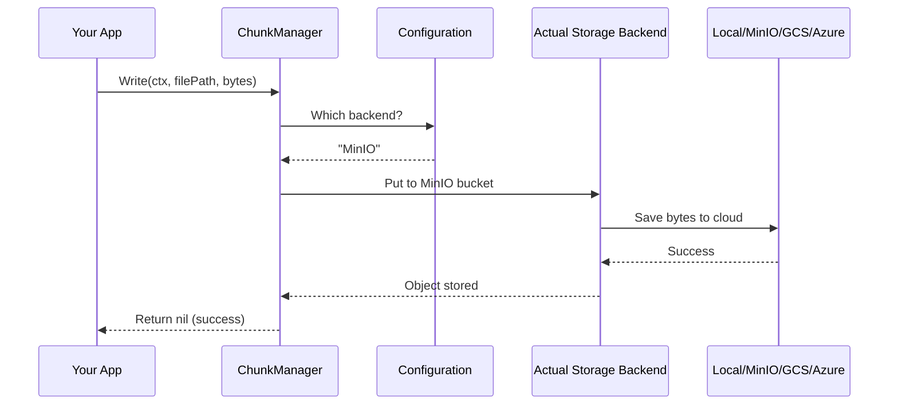

# Chapter 6: Persistent Storage & Chunk Management

In [Chapter 5: Query Processing & Search Pipeline](05_query_processing___search_pipeline_.md), we learned how Milvus efficiently searches through vectors across multiple nodes. But there's a critical question we haven't answered: **Where does all the data actually live?** When you insert a million vectors, they can't just exist in RAM—they need to be saved to disk or cloud storage so they survive even if the system crashes. And they need to be organized efficiently so searches are fast.

This is exactly what **Persistent Storage & Chunk Management** solves!

## The Problem: Storing Billions of Vectors Reliably

Imagine you're running that Milvus restaurant chain again. The kitchen (DataNode) receives orders throughout the day:

```
10:00 AM: Insert 1000 vectors
10:15 AM: Insert 500 vectors
10:30 AM: Insert 2000 vectors
```

The manager needs to:
1. **Organize** all this data into manageable pieces (chunks)
2. **Serialize** the data (convert from objects to bytes) so it can be saved
3. **Store** it somewhere reliable (local disk, MinIO cloud, GCS, Azure, etc.)
4. **Retrieve** it quickly when needed for searching
5. **Survive crashes** - if the kitchen explodes, can still access the data

If the manager just saves everything as one giant file, searching would be slow. If they don't serialize properly, the bytes won't make sense when loaded back. If they hard-code "save to local disk only," they can't use cloud storage.

**Milvus solves this with an abstraction layer** that handles all these concerns, similar to how restaurants have standardized ways to store ingredients regardless of which warehouse they use.

## Key Concept: What is a Chunk?

A **chunk** is a piece of organized data—think of it like a shipment container:

```
Chunk = {
  FieldID: 101 (embedding vector field),
  SegmentID: 42,
  Data: [binary bytes of the actual vectors],
  Timestamp: 2024-01-15T10:30:00Z
}
```

Instead of saving all data to one file, Milvus breaks it into chunks organized by:
- **Field**: Which column (embeddings, metadata, etc.)
- **Segment**: Which group of rows
- **Timestamp**: When this data was created

This is like organizing a restaurant's inventory: "Cheese from supplier A, stored in warehouse B, arrived on date C."

## Key Concept: ChunkManager - The Storage Abstraction

A **ChunkManager** is like a warehouse manager—it doesn't care if the warehouse is local or in the cloud, it just knows how to:
- **Write** chunks to storage
- **Read** chunks back
- **Check** if a chunk exists
- **Delete** chunks

```
Your Code
   ↓
ChunkManager Interface (abstraction)
   ↓
Actual Storage:  Local Disk  |  MinIO  |  GCS  |  Azure
```

The beauty: **Your code stays the same** regardless of which storage backend you use!

## Key Concept: Serialization - Converting Data to Bytes

Before data can be saved to disk, it must be **serialized**—converted from objects to bytes:

```
In Memory:              On Disk:
Vector {               Binary Bytes:
  values: [0.1, 0.2]   → 0xAB 0xCD 0xEF ...
  dim: 2               → ...
}
```

When you load it back, you **deserialize** it—converting bytes back to objects. Milvus uses **Apache Arrow** format, which is like a standardized shipping container for data—efficient, language-independent, and widely supported.

## Your First Use Case: Saving Inserted Vectors to Persistent Storage

**Goal**: When vectors are inserted into a segment, save them reliably to disk (or cloud) so they survive crashes and can be searched later.

### Step 1: Create a ChunkManager

```go
import "github.com/milvus-io/milvus/pkg/v2/storage"

// Factory decides which backend to use
factory := storage.NewChunkManagerFactoryWithParam(params)

// Create the manager (could be local, MinIO, GCS, etc.)
cm, err := factory.NewPersistentStorageChunkManager(ctx)
```

The factory reads your configuration to decide: "Should I use local disk, MinIO, or GCS?" Then it creates the appropriate manager automatically.

### Step 2: Serialize the Vector Data

```go
// Your vectors in memory
fieldData := createFieldData(field.FieldID, vectors)

// Convert to Arrow format
record, err := serializeRecord(fieldData, schema)
```

This converts your vector objects into efficient Arrow bytes—think of it as vacuum-sealing data before storing it.

### Step 3: Write to Storage

```go
// Decide where to save it
filePath := fmt.Sprintf(
    "milvus/segment_%d/field_%d/data.parquet",
    segmentID, fieldID)

// Write to storage (local disk, cloud, etc.)
err := cm.Write(ctx, filePath, serializedBytes)
```

The ChunkManager automatically saves to the right place—if you configured MinIO, it goes to MinIO. If you configured local disk, it goes there instead.

### Step 4: Read Back When Searching

```go
// When you need to search this segment
data, err := cm.Read(ctx, filePath)

// Deserialize back to objects
fieldData, err := deserializeRecord(data, schema)
```

The ChunkManager retrieves the data, then you deserialize it back to vectors for searching.

## How It Works Internally

When you call `cm.Write(ctx, filePath, bytes)`, what actually happens depends on the backend:



**The flow:**
1. App calls ChunkManager.Write()
2. ChunkManager checks configuration: "What storage backend am I using?"
3. ChunkManager delegates to the appropriate backend (MinIO, Local, GCS, Azure)
4. Backend saves the bytes to actual storage
5. Success is returned to your code

The magic: **your code doesn't know about step 3**—it just calls Write() and the ChunkManager handles the rest!

## Understanding Multiple Storage Backends

Milvus supports different storage types. Think of these as different warehouse types:

```
Storage Backends:
├─ Local Disk (Simple, for testing/single machine)
├─ MinIO (S3-compatible, self-hosted cloud storage)
├─ GCS (Google Cloud Storage, native Google cloud)
└─ Azure (Azure Blob Storage, native Azure cloud)
```

All use the same interface. Let's see how this works:

```go
// Configuration tells which backend to use
storageType := paramtable.Get().CommonCfg.StorageType.GetValue()
// Result: "minio", "local", "gcs", or "azure"

// Factory creates appropriate manager
if storageType == "local" {
    return NewLocalChunkManager(...)
} else if storageType == "minio" {
    return NewRemoteChunkManager(...)  // for MinIO
}
```

Looking at `factory.go`, it uses configuration to decide which backend to create—but your code always sees the same interface!

## Code Deep Dive: How LocalChunkManager Works

For local disk storage, let's see how writing works:

```go
// From local_chunk_manager.go
func (lcm *LocalChunkManager) Write(ctx context.Context, 
    filePath string, content []byte) error {
    
    dir := path.Dir(filePath)
    os.MkdirAll(dir, os.ModePerm)  // Create directories if needed
    return WriteFile(filePath, content, os.ModePerm)
}
```

It's simple:
1. Extract the directory path
2. Create directories if they don't exist (like `mkdir -p`)
3. Write the bytes to the file

Reading is even simpler:

```go
func (lcm *LocalChunkManager) Read(ctx context.Context, 
    filePath string) ([]byte, error) {
    return ReadFile(filePath)  // Just read the file
}
```

## Code Deep Dive: How RemoteChunkManager Works

For cloud storage (MinIO, GCS, Azure), it's more complex. Let's see the MinIO version:

```go
// From minio_object_storage.go
func (mos *MinioObjectStorage) PutObject(ctx context.Context, 
    bucketName, objectName string, reader io.Reader, 
    objectSize int64) error {
    
    _, err := mos.Client.PutObject(ctx, bucketName, 
        objectName, reader, objectSize, minio.PutObjectOptions{})
    return err
}
```

It uploads to a MinIO bucket just like uploading to S3:
1. Specify bucket name (like "milvus-data")
2. Specify object name (like "segment_42/field_101/data.parquet")
3. Provide the data reader
4. MinIO handles everything else

For reading:

```go
func (mos *MinioObjectStorage) GetObject(ctx context.Context,
    bucketName, objectName string, offset int64, 
    size int64) (FileReader, error) {
    
    opts := minio.GetObjectOptions{}
    if offset > 0 {
        opts.SetRange(offset, offset+size-1)  // Partial read!
    }
    return mos.Client.GetObject(ctx, bucketName, 
        objectName, opts)
}
```

Notice the **partial read capability**—you can read just bytes 1000-2000 without downloading the entire file! This is crucial for large files.

## Understanding Serialization with Arrow

Before data goes to storage, it must be serialized. Milvus uses Apache Arrow, which is like a standardized format for tables:

```
Your Data:                    Arrow Format:
┌─────────────────┐          ┌──────────────────┐
│ Vectors (floats)│    →     │ Columns          │
│ IDs (integers)  │          │ Metadata         │
│ Timestamps      │          │ Efficient storage│
└─────────────────┘          └──────────────────┘
```

Looking at `serde.go`, there's a serialization entry for each data type:

```go
m[schemapb.DataType_FloatVector] = serdeEntry{
    arrowType: func(dim int, _) arrow.DataType {
        // 4 bytes per float, so dim * 4 bytes total
        return &arrow.FixedSizeBinaryType{ByteWidth: dim * 4}
    },
    deserialize: func(a arrow.Array, i int, ...) (any, bool) {
        // Convert bytes back to float32 slice
        return arrow.Float32Traits.CastFromBytes(...), true
    },
    serialize: func(b array.Builder, v any, ...) bool {
        // Convert float32 slice to bytes
        builder.Append(...)
        return true
    },
}
```

Each type (float vectors, binary vectors, strings, etc.) knows how to:
1. **Serialize**: Convert to bytes
2. **Deserialize**: Convert back from bytes
3. **Arrow Type**: What Arrow type represents this

This is like having a translator for each data type—the translator knows both "object form" and "byte form."

## Code Deep Dive: Writing Data with SerializeWriter

When inserting data, a special writer serializes and saves it:

```go
// Create a writer that serializes and saves
writer := NewSerializeRecordWriter(
    recordWriter,  // Where to write
    serializer,    // How to serialize
    batchSize)     // How many rows per batch

// Write data one by one
for _, value := range values {
    err := writer.WriteValue(value)  // Serializes and buffers
}

// When buffer is full, automatically writes to storage
err := writer.Close()  // Flush and close
```

The writer batches data—writes multiple rows at once for efficiency, like shipping multiple packages together instead of one at a time.

## Understanding File Organization

Data is organized hierarchically in storage:

```
milvus/
├── segment_42/          (segment directory)
│   ├── field_101/       (embedding field)
│   │   ├── data.parquet (the actual data)
│   │   └── index        (index file if exists)
│   ├── field_102/       (metadata field)
│   │   └── data.parquet
│   └── field_103/       (delete marks)
│       └── data.parquet
├── segment_43/
│   └── ...
```

This organization means:
- **Easy to find data**: Know segment ID → find directory
- **Easy to search**: All embeddings of a segment in one place
- **Modular**: Can delete/update specific fields without affecting others

## Integration with Previous Systems

Persistent storage fits into the bigger picture:

```
┌─ Configuration (Chapter 2)
│  ├─ Which storage backend? (local/minio/gcs/azure)
│  └─ Storage paths and credentials
│
├─ Message Queues (Chapter 3)
│  └─ Notifications when data inserted → trigger storage write
│
├─ Metadata Catalog (Chapter 4)
│  ├─ Know which files correspond to which segment
│  └─ Catalog says "segment_42 has these fields stored at X"
│
├─ Query Processing (Chapter 5)
│  ├─ Need to load data from storage for searching
│  └─ Uses ChunkManager to read chunks
│
└─ Persistent Storage (THIS CHAPTER)
   ├─ Serialize data to bytes
   ├─ Store to local/cloud backends
   └─ Retrieve when needed
```

Everything depends on reliable storage!

## Real Example: Complete Insert-to-Storage Flow

Let's trace inserting vectors from start to finish:

```
1. Client: "Insert 1000 vectors into collection A"
   ↓
2. Proxy receives request, validates schema
   ↓
3. DataNode creates InsertMsg with vectors
   ↓
4. Message Queue delivers to appropriate DataNode
   ↓
5. DataNode groups vectors into a new Segment
   ↓
6. DataNode serializes vectors to Arrow format
   ↓
7. ChunkManager.Write() is called
   ├─ If local: Write to /data/segment_42/field_101/data.parquet
   ├─ If MinIO: Upload to bucket/segment_42/field_101/data.parquet
   ├─ If GCS: Upload to gs://bucket/segment_42/field_101/data.parquet
   └─ If Azure: Upload to blob/segment_42/field_101/data.parquet
   ↓
8. Metadata Catalog records: "Segment 42 has 1000 rows, stored at X"
   ↓
9. When user searches: Load from storage, search, return results
```

The vectors survived! Even if the system crashes, they're safely stored and can be recovered.

## Handling Different Data Types

Milvus stores many data types efficiently. Looking at the serialization map in `serde.go`:

```
Data Type           How Stored
───────────────────────────────────────
FloatVector         4 bytes per float
BinaryVector        Compressed binary
Int64 (IDs)         8 bytes per int
Float (scores)      4 bytes per float
String (text)       Variable length
JSON                Binary blob
```

For example, a Float Vector with dimension 128:
- In memory: `[float32, float32, ..., float32]` (128 floats)
- Serialized: 512 bytes (128 * 4 bytes per float)
- In storage: Efficient Arrow fixed-size binary

## Practical Operations: Common Tasks

### Check if Data Exists

```go
// Before loading, check if segment exists
exists, err := cm.Exist(ctx, "segment_42/field_101/data.parquet")
if !exists {
    // Load from other source or report missing
}
```

### Get File Size

```go
// How big is the segment file?
size, err := cm.Size(ctx, "segment_42/field_101/data.parquet")
// size: 104857600 (100MB)
```

### Delete Old Data

```go
// Clean up old segments after compaction
err := cm.Remove(ctx, "segment_42/field_101/data.parquet")

// Or delete entire segment directory
err := cm.RemoveWithPrefix(ctx, "segment_42/")
```

### Walk Through All Segments

```go
// Scan all segment files
err := cm.WalkWithPrefix(ctx, "segment_", true, 
    func(info *ChunkObjectInfo) bool {
        fmt.Println("Found:", info.FilePath)
        return true  // Continue walking
    })
```

It's like asking: "Give me all files starting with 'segment_'" and processing each one.

## Key Takeaways

| Concept | Meaning |
|---------|---------|
| **Chunk** | Piece of organized data (vectors, metadata, etc.) |
| **ChunkManager** | Abstraction for reading/writing chunks to any storage backend |
| **Serialization** | Converting objects to bytes for storage |
| **Deserialization** | Converting bytes back to objects for use |
| **Backend** | Actual storage (local disk, MinIO, GCS, Azure) |
| **Arrow Format** | Efficient columnar storage format |
| **Abstraction** | Same interface works with any backend |
| **Hierarchical Storage** | Organized in segment/field/data structure |

## Summary

The Persistent Storage & Chunk Management system solves a fundamental challenge: **How do you reliably store billions of vectors across different storage backends (local disk, cloud, etc.) while keeping serialization/deserialization efficient and transparent?**

By providing:
- ✅ A unified ChunkManager interface (same code, any storage backend)
- ✅ Support for multiple backends (local, MinIO, GCS, Azure)
- ✅ Efficient serialization with Apache Arrow format
- ✅ Hierarchical file organization (easy to find and manage data)
- ✅ Partial read capability (read just the bytes you need)
- ✅ Flexible operations (read, write, delete, list, walk)

Milvus can reliably persist billions of vectors across any storage infrastructure, survive crashes without losing data, and search massive datasets efficiently.

You've learned:
- ✅ What chunks are and why they're needed
- ✅ How ChunkManager abstracts away storage backend differences
- ✅ How serialization converts objects to bytes efficiently
- ✅ Which backends Milvus supports and how to configure them
- ✅ How data is organized hierarchically in storage
- ✅ How to perform common storage operations

Now that we understand how data is persisted reliably, we need to learn how Milvus manages data **growth and optimization**. As data accumulates, segments get fragmented and searching becomes slower. Learn how Milvus automatically reorganizes and optimizes data in [Chapter 7: Data Coordination & Compaction Strategy](07_data_coordination___compaction_strategy_.md), where we'll explore how segments are compacted, merged, and optimized for better search performance!

---

Generated by [AI Codebase Knowledge Builder](https://github.com/The-Pocket/Tutorial-Codebase-Knowledge)