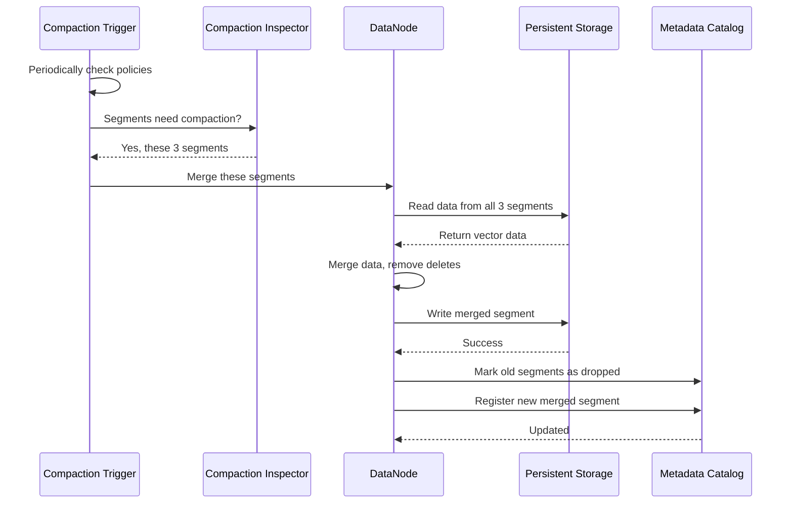

# Chapter 7: Data Coordination & Compaction Strategy

In [Chapter 6: Persistent Storage & Chunk Management](06_persistent_storage___chunk_management_.md), we learned how Milvus stores vector data reliably to disk or cloud storage. But there's a critical problem that happens over time: as data keeps getting inserted, segments become small and fragmented, making searches slower and storage inefficient. Imagine a restaurant's delivery system where each order creates a separate delivery route—eventually you'd have hundreds of half-empty routes crisscrossing the city! You need to consolidate them.

This is exactly what **Data Coordination & Compaction Strategy** solves! Milvus automatically reorganizes and optimizes data by merging small segments into larger ones, removing deleted data, and rebuilding indexes—all while the system is running.

## The Problem: Data Fragmentation Over Time

When vectors are inserted into Milvus, they flow like this:

```
INSERT 1000 vectors
    ↓
Create Segment A (1000 rows)
    ↓

INSERT 500 vectors
    ↓
Create Segment B (500 rows)
    ↓

INSERT 2000 vectors
    ↓
Create Segment C (2000 rows)
```

Now you have three separate segments, and searching means searching all three! Plus, if you delete vectors from Segment A, those deleted rows still exist on disk—they're just marked as deleted. The more deletions happen, the slower searches become.

**Without compaction**: Many small, fragmented segments with deleted data
**With compaction**: Fewer, larger, cleaner segments with better search performance

It's like consolidating 100 small bank accounts into 10 large ones—less overhead, better efficiency!

## Key Concept: The Segment Lifecycle

Each segment in Milvus goes through a **lifecycle**, like a food item in the restaurant:

```
Growing → Sealed → Flushed → Compacted → (optionally back to Growing or Dropped)
```

Let me explain each state:

### 1. Growing Segment
New data keeps being added. Think of it like a pot on the stove—still being filled.

### 2. Sealed Segment
No more data can be added. All rows are finalized. Think of it like a sealed box ready to ship.

### 3. Flushed Segment
Data is written to persistent storage (disk/cloud). Think of it like the box arriving at the warehouse.

### 4. Compacted Segment
Multiple segments were merged together. Think of it like combining several boxes into one larger shipment.

Looking at the code in `segment_manager.go`, the segment manager tracks which segments are in which state:

```go
// Get growing segments (still receiving data)
growing, _ := s.channel2Growing.Get(channelName)

// Get sealed segments (no more data being added)
sealed, _ := s.channel2Sealed.Get(channelName)
```

The manager maintains two sets per channel—one for growing, one for sealed.

## Key Concept: L0, L1, L2 Segments (Hierarchy)

Milvus organizes segments into **levels**:

```
L0 Segments (Delta/Temporary)
├─ Very small, temporary segments
├─ Created during streaming writes
└─ Get merged quickly

L1 Segments (Active)
├─ Normal size, actively used
├─ Can be grown or sealed
└─ Searched frequently

L2 Segments (Large/Historical)
├─ Very large, immutable segments
├─ Result of compaction
└─ Contain lots of data
```

Think of it like a warehouse organization:
- **L0**: Small receiving area (temporary)
- **L1**: Main shelves (active)
- **L2**: Archive storage (large, historical)

## Key Concept: Compaction Triggers

Compaction doesn't happen randomly—it's **triggered** by **policies**. A policy is a rule like:

```
IF (single_segment has too many deleted rows) THEN trigger compaction
IF (collection has grown by X MB since last compaction) THEN trigger compaction
IF (data hasn't been compacted in 1 hour) THEN trigger compaction
```

Looking at `compaction_policy_single.go`, there's a policy that checks:

```go
func (policy *singleCompactionPolicy) Trigger(ctx context.Context) 
    (map[CompactionTriggerType][]CompactionView, error) {
    
    // For each collection...
    for _, collection := range collections {
        // Check if any segment needs compaction
        views, err := policy.triggerOneCollection(ctx, collection.ID)
    }
}
```

The trigger runs periodically and decides: "Which segments should be compacted?"

## Your First Use Case: Automatically Compacting Fragmented Segments

**Goal**: As vectors are inserted and deleted over time, automatically compact small/fragmented segments into larger, cleaner ones without user intervention.

### Step 1: Enable Compaction

```go
// In configuration
enabled := Params.DataCoordCfg.EnableAutoCompaction.GetAsBool()
// Result: true or false based on config
```

Compaction is controlled by configuration from [Chapter 2: Configuration Management System](02_configuration_management_system_.md).

### Step 2: Policies Trigger Compaction

```go
// Single segment policy: if a segment has too many deletes
hasTooManyDeletions := func(segment *SegmentInfo) bool {
    return segment.GetDeletedRowCount() > threshold
}
```

The policy checks each segment. If it qualifies, it creates a **compaction view** (a blueprint for compaction).

### Step 3: Compaction Executes

```go
// Multiple segments are merged
input := []*SegmentInfo{segmentA, segmentB, segmentC}
// Result after compaction:
output := []*SegmentInfo{segmentMerged}
```

Several small segments become one large segment with no deleted data!

### Step 4: Result is Stored

```go
// New merged segment is persisted
err := chunkManager.Write(ctx, mergedSegmentPath, data)
// Metadata is updated
catalog.UpdateSegment(mergedSegment)
```

The new compacted segment is stored, and metadata reflects the change via the catalog from [Chapter 4: Metadata & Catalog Management](04_metadata___catalog_management_.md).

## How It Works Internally

When compaction is triggered, here's what happens step-by-step:



**What happens at each step:**

1. **Trigger decides**: Periodically check if compaction is needed
2. **Inspector identifies**: Which segments to compact
3. **DataNode reads**: Load data from all segments
4. **DataNode merges**: Combine data, remove deleted rows
5. **DataNode writes**: Save merged segment to storage
6. **Catalog updates**: Old segments marked dropped, new segment registered
7. **Searches use new**: Future searches use the merged segment

## Code Deep Dive: How Compaction Policies Work

Looking at `server.go`, the DataCoord initializes compaction:

```go
func (s *Server) initCompaction() {
    cph := newCompactionInspector(s.meta, s.allocator, 
                                  s.handler, s.globalScheduler)
    s.compactionInspector = cph
    s.compactionTrigger = newCompactionTrigger(...)
}
```

The server creates two key objects:
1. **Inspector**: Manages ongoing compaction tasks
2. **Trigger**: Decides when to start new compaction tasks

Then it starts the trigger:

```go
func (s *Server) startCompaction() {
    if s.compactionTrigger != nil {
        s.compactionTrigger.start()
    }
}
```

This runs a loop that periodically checks policies and triggers compactions.

## Code Deep Dive: Single Segment Compaction Policy

From `compaction_policy_single.go`, the single-segment policy handles cases where **one segment** has too many deletions:

```go
func hasTooManyDeletions(segment *SegmentInfo) bool {
    ratio := float64(segment.GetDeletedRowCount()) / 
             float64(segment.GetNumOfRows())
    return ratio > deletionThreshold
}
```

This checks: "If more than X% of rows are deleted, compact this segment alone."

Then it creates a view (blueprint):

```go
view := &MixSegmentView{
    label:         segmentViews[0].label,
    segments:      []*SegmentView{segment},
    collectionTTL: collectionTTL,
    triggerID:     newTriggerID,
}
```

A view represents: "Here are the segments to compact, here's the metadata about them."

## Code Deep Dive: Clustering Compaction Policy

From `compaction_policy_clustering.go`, there's another policy for **clustering**—organizing data by partition key:

```go
func (policy *clusteringCompactionPolicy) triggerOneCollection(
    ctx context.Context, collectionID int64, manual bool,
) ([]CompactionView, int64, error) {
    
    clusteringKeyField := clustering.GetClusteringKeyField(
        collection.Schema)
    
    if clusteringKeyField == nil {
        // No clustering key, skip
        return nil, 0, nil
    }
}
```

This policy checks: "Does this collection have a clustering key?" If yes, organize data by that key for better query performance.

## Code Deep Dive: Segment Manager and Segment Lifecycle

From `segment_manager.go`, the SegmentManager tracks segment transitions:

```go
// When segment should be sealed
func (s *SegmentManager) tryToSealSegment(ctx context.Context, 
    ts Timestamp, channel string) error {
    
    for _, policy := range s.segmentSealPolicies {
        if shouldSeal, reason := policy.ShouldSeal(info, ts); 
           shouldSeal {
            s.meta.SetState(ctx, id, commonpb.SegmentState_Sealed)
        }
    }
}
```

This checks multiple seal policies to decide when a growing segment becomes sealed. Policies check things like:
- Has the segment been growing for too long?
- Is the segment full (reached size limit)?
- Has it been idle too long?

## Understanding Flush Operations

Before segments can be compacted, they must be **flushed** to persistent storage:

```go
// From server.go - handle segments in Flushing state
func (s *Server) handleFlushingSegments(ctx context.Context) {
    for _, segment := range segments {
        s.flushFlushingSegment(ctx, segment.ID)
    }
}
```

Flushing writes all data to disk so it survives crashes. Only after flushing can segments be compacted.

## Integration with Previous Systems

Data coordination and compaction work with everything we've learned:

```
┌─ Configuration (Chapter 2)
│  ├─ Enable compaction?
│  ├─ Compaction thresholds?
│  └─ How often to trigger?
│
├─ Message Queues (Chapter 3)
│  ├─ Compaction tasks sent via queues
│  └─ DataNodes notified via messages
│
├─ Metadata Catalog (Chapter 4)
│  ├─ Old segments marked as dropped
│  ├─ New merged segment registered
│  └─ Segment state transitions tracked
│
├─ Query Processing (Chapter 5)
│  ├─ Searches skip dropped segments
│  └─ Use new merged segments
│
├─ Persistent Storage (Chapter 6)
│  ├─ Read data from old segments
│  ├─ Write merged segment
│  └─ Delete old segment files
│
└─ Data Coordination (THIS CHAPTER)
   ├─ Decide when to compact
   ├─ Manage segment lifecycle
   ├─ Execute compaction tasks
   └─ Optimize storage and search
```

All systems work together for efficient data management!

## Real Example: Complete Compaction Flow

Let's trace a complete compaction scenario:

```
1. DataNode receives 100 delete requests
   ↓
2. Segment A now has 30% deleted rows
   ↓
3. Compaction trigger runs (every 10 seconds)
   ↓
4. Single-segment policy checks: "30% > threshold?"
   → YES! Create compaction view
   ↓
5. Compaction Inspector receives view
   ↓
6. Inspector allocates ID for compaction task
   ↓
7. DataNode is assigned the compaction task
   ↓
8. DataNode:
   - Reads Segment A from storage
   - Filters out deleted rows (removes 30% of data)
   - Writes cleaned data back
   ↓
9. Metadata Catalog updated:
   - Old Segment A marked as dropped
   - New Segment A' registered (cleaned)
   ↓
10. Future searches:
    - See Segment A' (cleaned)
    - Don't see dropped Segment A
    - Searches are faster!
```

The whole process is automatic and transparent to users!

## Practical Operations: Monitoring Compaction

You can monitor compaction status through metrics and checks:

```go
// Get compaction tasks for a collection
tasks := meta.compactionTaskMeta.GetCompactionTasksByCollection(
    collectionID)
// Returns map of all compaction tasks for this collection

// Check if segment is compacting
isCompacting := segment.isCompacting
```

These let you see: "Is compaction happening? Which segments are involved? When will it finish?"

## L0 Compaction: Special Case for Streaming Data

L0 segments are special—they're created by streaming writes and need **fast compaction**:

```go
// L0 segments get compacted quickly
if segment.Level == datapb.SegmentLevel_L0 {
    // Trigger compaction more aggressively
    shouldCompact := true
}
```

L0 segments don't stay long—they're quickly merged into L1 segments by specialized policies.

## Understanding Compaction Costs

Compaction isn't free—it has costs:

```
CPU Cost:        Merging and filtering data
Memory Cost:     Loading multiple segments into memory
Storage Cost:    Reading + writing data (temporary 2x space)
Search Impact:   Segments being compacted are slower to search
```

This is why compaction policies are tuned carefully:
- Don't compact too often (wastes resources)
- Don't compact too rarely (segments become too fragmented)

Milvus finds a balance through configurable policies and thresholds.

## Key Takeaways

| Concept | Meaning |
|---------|---------|
| **Compaction** | Merging multiple segments into larger, cleaner ones |
| **Segment Lifecycle** | Growing → Sealed → Flushed → Compacted → Dropped |
| **L0/L1/L2 Segments** | Hierarchy of segment sizes and ages |
| **Compaction Trigger** | Policy that decides when to compact |
| **Compaction Inspector** | Manages ongoing compaction tasks |
| **Flushing** | Writing segment data to persistent storage |
| **Deleted Data** | Rows marked for deletion (removed during compaction) |
| **Fragmentation** | Problem of having too many small segments |

## Summary

The Data Coordination & Compaction Strategy system solves a fundamental challenge: **How do you automatically optimize and reorganize data over time as it grows, fragments, and gets deleted, while keeping searches fast and storage efficient?**

By providing:
- ✅ Multiple compaction policies (single-segment, clustering, time-based, size-based)
- ✅ Automatic triggering (runs without user intervention)
- ✅ Segment lifecycle management (Growing → Sealed → Flushed → Compacted)
- ✅ Hierarchical organization (L0/L1/L2 segments)
- ✅ Background optimization (doesn't block user queries)
- ✅ Integration with storage and metadata systems

Milvus keeps data organized, fragmentation minimal, and search performance high—even as billions of vectors flow through the system over time.

You've learned:
- ✅ Why data fragmentation happens and why compaction matters
- ✅ The lifecycle of segments in Milvus
- ✅ How compaction policies decide when to compact
- ✅ How segments are merged and optimized
- ✅ How compaction integrates with the rest of Milvus

Now that we understand how Milvus manages and optimizes data throughout its lifetime, the next crucial challenge is handling **changes to the database structure itself**. What happens when you need to add a new field to a collection, or migrate to a new Milvus version? Learn how Milvus handles these changes gracefully in [Chapter 8: Version Migration & Schema Evolution](08_version_migration___schema_evolution_.md), where we'll explore how schema can be modified and how systems can migrate between versions without losing data!

---

Generated by [AI Codebase Knowledge Builder](https://github.com/The-Pocket/Tutorial-Codebase-Knowledge)