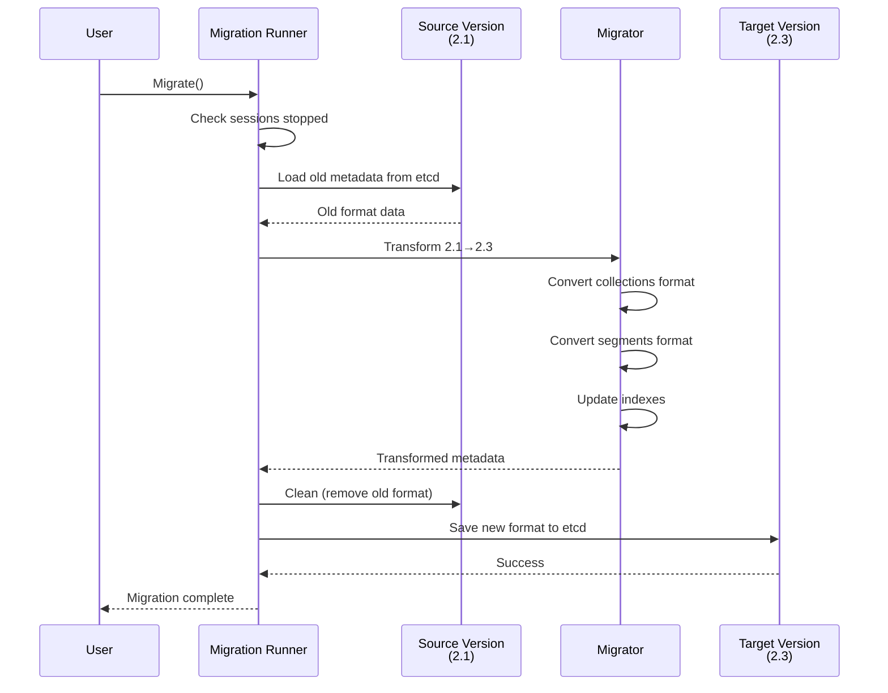

# Chapter 8: Version Migration & Schema Evolution

In [Chapter 7: Data Coordination & Compaction Strategy](07_data_coordination___compaction_strategy_.md), we learned how Milvus automatically optimizes and reorganizes data over time as it grows and evolves. But there's another kind of evolution that happens at a different level: **the evolution of Milvus itself**. As the database software gets updated with new features and improvements, what happens to existing systems? When you upgrade from Milvus 2.1 to Milvus 2.3, how does all your data and metadata survive the transition? What if you need to change the structure of your collections—add a new field, change an index, or reorganize how data is stored?

This is exactly what **Version Migration & Schema Evolution** solves! It's the system that allows Milvus to evolve over time while keeping your data safe and accessible.

## The Problem: Systems Need to Change Without Losing Data

Imagine you're managing that Milvus restaurant chain again. The chain started with Milvus 2.1, storing simple data. But now they want to upgrade to Milvus 2.3 because it has better search performance. Here are the challenges:

```
Challenge 1: Metadata Format Changed
Version 2.1: Stored metadata as {"collections": [...], "segments": [...]}
Version 2.3: Stores metadata differently: {"resources": {...}, "schemas": {...}}
What happens to existing data during the upgrade?

Challenge 2: New Features in Schema
Version 2.1: Collections had basic fields
Version 2.3: Collections now support new field types and clustering keys
Should existing collections automatically get these features?

Challenge 3: Index Structure Changed
Version 2.1: Built indexes one way
Version 2.3: Better index format
Do existing indexes need to be rebuilt?
```

If you just restart Milvus with new code, it would be confused by the old data format. You need a **migration framework** that:
1. Detects the current version
2. Understands what changed between versions
3. Transforms old data to new format
4. Backs up data before making changes
5. Validates everything worked correctly

## Key Concept: What is a Schema?

A **schema** describes the structure of your data:

```
Schema = {
  Fields: [
    {Name: "id", Type: Int64},
    {Name: "embedding", Type: FloatVector, Dimension: 128},
    {Name: "metadata", Type: String}
  ],
  PrimaryKey: "id",
  Indexes: [
    {Field: "embedding", Type: "HNSW"}
  ]
}
```

It's like a blueprint that says: "This collection has these columns, with these types, and these indexes."

When Milvus versions change, sometimes the schema format changes too. The migration system converts old schemas to new format.

## Key Concept: Version Detection

Before migrating, Milvus needs to know: **What version are we upgrading from?**

```
Detection happens by:
1. Read version marker from metadata storage (etcd)
2. Compare with current Milvus version code
3. Determine if migration is needed
4. Decide which migration path to take
```

Looking at the provided code in `versions/version.go`, Milvus has specific version constants:

```go
const (
    version210Str = "2.1.0"
    version220Str = "2.2.0"
    version230Str = "2.3.0"
)
```

This tells you: "We know how to migrate between these versions."

## Key Concept: Backward Compatibility

**Backward compatibility** means: "New code can still read/use old data format."

```
Ideal Case:
Old Format Data → New Code → Works perfectly, no conversion needed

Our Case (Usually):
Old Format Data → Needs Migration → New Format Data → New Code → Works

Worst Case (Avoided):
Old Format Data → New Code → Crash! (MUST AVOID)
```

Milvus uses migration to ensure the ideal case stays true—even after major version jumps, old data is safely converted to work with new code.

## Your First Use Case: Upgrading from Milvus 2.1 to 2.3

**Goal**: You have a running Milvus 2.1 system with collections and data. You want to upgrade to Milvus 2.3. How do you do it safely without losing data?

### Step 1: Backup Everything

Before any migration, always back up!

```go
runner := migration.NewRunner(ctx, config)
err := runner.Backup()
// Creates backup file with all metadata and data info
// Path: /path/to/backup/milvus_2_1_backup.tar.gz
```

The backup saves the complete state. If anything goes wrong, you can restore to this point.

### Step 2: Check Compatibility

```go
err := runner.Validate()  // 2.1 → 2.3 valid?
compatible := runner.CheckCompatible()
// Returns true if migration is supported
```

Not all version jumps are supported (e.g., no jump from 2.3 back to 2.1—only forward upgrades allowed).

### Step 3: Check All Services are Stopped

```go
err := runner.CheckSessions()
// Makes sure no other Milvus processes are running
// If found, returns error: "there are still sessions alive"
```

This prevents corruption—can't have two versions modifying metadata simultaneously!

### Step 4: Perform Migration

```go
err := runner.Migrate()
// This is where the magic happens!
// Loads old metadata, transforms it, saves new format
```

This calls the actual migration logic that transforms data.

### Step 5: Start with New Version

```bash
# Now start Milvus with new code
./milvus run standalone  # Runs version 2.3
```

The new code reads the migrated metadata and starts up normally!

## How It Works Internally

When you call `runner.Migrate()`, here's what happens behind the scenes:



**What happens at each step:**

1. **Check Services**: Ensure no Milvus processes are running
2. **Load Old Format**: Read metadata stored in the old version's format
3. **Transformation**: Convert each piece of metadata to new format
4. **Clean Old**: Remove old format from storage
5. **Save New**: Write converted metadata in new format
6. **Verify**: Check that everything worked

## Code Deep Dive: How Migration Transforms Data

The actual transformation happens in `meta/210_to_220.go`. Let's look at one example—converting collections:

```go
func collection210ToCollection220(coll *pb.CollectionInfo) 
    *model.Collection {
    // Simply unmarshal from old protobuf format to new model
    return model.UnmarshalCollectionModel(coll)
}
```

It uses protobuf's capability to read old data and convert to new structure. This is simple because protobuf is designed for backward compatibility!

But some transformations are more complex. Look at index migration:

```go
// Old format had separate segment index metadata
// New format combines it differently
func combineToSegmentIndexesMeta220(
    segmentIndexes SegmentIndexesMeta210,
    indexBuildMeta IndexBuildMeta210) (SegmentIndexesMeta220, error) {
    
    segmentIndexModels := make(SegmentIndexesMeta220)
    for segID := range segmentIndexes {
        for indexID := range segmentIndexes[segID] {
            record := segmentIndexes[segID][indexID]
            // Combine segment index info with build metadata
            buildMeta := indexBuildMeta[record.GetBuildID()]
            
            // Create new format
            segmentIndexModel := &model.SegmentIndex{
                SegmentID: segID,
                IndexID:   indexID,
                // ... copy other fields with transformations
            }
        }
    }
    return segmentIndexModels, nil
}
```

This shows how the migration handles structural changes—combining separate data structures into one unified format.

## Code Deep Dive: The Migration Orchestrator

From `migration/runner.go`, here's how the runner orchestrates everything:

```go
func (r *Runner) Migrate() error {
    migrator, err := NewMigrator(r.cfg.SourceVersion, 
                                 r.cfg.TargetVersion)
    source, err := backend.NewBackend(r.cfg.MilvusConfig, 
                                      r.cfg.SourceVersion)
    metas, err := source.Load()  // Load old format
    source.Clean()               // Remove old
    targetMetas, err := migrator.Migrate(metas)  // Transform
    target, err := backend.NewBackend(r.cfg.MilvusConfig, 
                                      r.cfg.TargetVersion)
    target.Save(targetMetas)     // Save new
}
```

It's a sequence:
1. Create migrator for the specific version pair
2. Load old metadata using old version's backend
3. Clean the old format
4. Migrate the data
5. Save in new version's format

## Understanding Version Ranges

Milvus doesn't support migrating every possible version combination. It supports specific ranges:

```go
func Range21x(version semver.Version) bool {
    return version.GTE(Version210) && version.LT(Version220)
}

func Range22x(version semver.Version) bool {
    return version.GTE(Version220) && version.LT(Version230)
}
```

This means:
- 2.1.0, 2.1.1, 2.1.2 are all in "2.1.x range"
- 2.2.0, 2.2.1, 2.2.2 are all in "2.2.x range"
- Within-range migrations are supported
- Cross-range migrations (2.1 → 2.3) are done step-by-step

## Session Management During Migration

A critical concern: what if something goes wrong during migration? Or what if another process tries to connect?

```go
func (r *Runner) RegisterSession() error {
    r.session.Register()  // Register migration session
    r.session.LivenessCheck(r.ctx, func() {})
}

func (r *Runner) CheckSessions() error {
    // Verify no other Milvus sessions exist
    sessions, _, err := r.session.GetSessions("milvus-datanode/*")
    if len(sessions) > 0 {
        return fmt.Errorf("services still running!")
    }
}
```

The migration registers itself so:
1. No other migration can run simultaneously
2. Other Milvus processes can't interfere
3. If migration crashes, the session expires after 60 seconds (allowing retry)

This is like putting a "DO NOT DISTURB - MIGRATION IN PROGRESS" sign on the system!

## Understanding Backup and Restore

Backup creates a snapshot so you can rollback if needed:

```go
func (r *Runner) Backup() error {
    source, _ := backend.NewBackend(cfg, sourceVersion)
    return source.BackupV2(r.cfg.BackupFilePath)
    // Creates: /path/to/backup/milvus_backup_2024_01_15.tar.gz
}
```

Restore reverts to the backup:

```go
func (r *Runner) Rollback() error {
    source, _ := backend.NewBackend(cfg, sourceVersion)
    source.Clean()  // Remove migrated data
    source.Restore(backupFile)  // Restore from backup
    // System is back to pre-migration state
}
```

Rollback is a safety net. If migration fails or the new version has issues, you can go back!

## Real Example: Upgrading from 2.1 to 2.3 Complete Flow

Let's trace a real upgrade scenario:

```
Day 1: Running Milvus 2.1
├─ Collections: "user_embeddings", "product_catalog"
├─ Total rows: 10 million
└─ Metadata stored in etcd (2.1 format)

Upgrade to 2.3:
├─ Step 1: ./milvus migrate --config config.yaml
├─ Migration Runner:
│  ├─ Backup: Saves all metadata to backup file ✓
│  ├─ Validate: 2.1→2.3 supported? Yes ✓
│  ├─ Check: No services running? Verified ✓
│  ├─ Transform:
│  │  ├─ Convert collections format
│  │  ├─ Convert segments format
│  │  ├─ Merge index metadata
│  │  └─ Update partition info
│  ├─ Clean: Remove old 2.1 metadata
│  └─ Save: Write 2.3 metadata to etcd
├─ Step 2: Start Milvus 2.3
├─ Milvus loads new format metadata
└─ Collections available, all data intact!

If something went wrong:
├─ ./milvus migrate --rollback --config config.yaml
├─ Metadata cleaned
├─ Restored from backup file
└─ Milvus 2.1 runs again
```

Everything is reversible!

## Schema Evolution: Adding New Features

Beyond version migration, Milvus also supports **schema evolution**—changing the structure of existing collections:

```go
// Example: Add clustering key to existing collection
collection.ClusteringKeyField = "timestamp"

// Or: Add new field type support
field := &model.Field{
    Name: "json_metadata",
    DataType: schemapb.DataType_JSON,  // New in 2.3
}
```

When you modify a schema, the changes are:
1. Validated for compatibility
2. Persisted to the catalog (from [Chapter 4](04_metadata___catalog_management_.md))
3. Communicated via message queues (from [Chapter 3](03_message_queue___streaming_infrastructure_.md))
4. Applied to all future queries and operations

Old data continues to exist as-is. New data uses the updated schema.

## Integration with Previous Systems

Version migration and schema evolution work with everything we've learned:

```
┌─ Configuration (Chapter 2)
│  └─ Migration settings, backup paths
│
├─ Message Queues (Chapter 3)
│  └─ Notify components of schema changes
│
├─ Metadata Catalog (Chapter 4)
│  ├─ Load old metadata format
│  ├─ Store new metadata format
│  └─ Broadcast changes
│
├─ Query Processing (Chapter 5)
│  ├─ Handle schema evolution in filters
│  └─ Support new field types
│
├─ Persistent Storage (Chapter 6)
│  ├─ Backup and restore data
│  └─ Migrate segment metadata
│
├─ Data Coordination (Chapter 7)
│  └─ May trigger compaction after migration
│
└─ Version Migration (THIS CHAPTER)
   ├─ Detect version
   ├─ Transform metadata
   ├─ Backup/restore
   └─ Support schema changes
```

All systems ensure migration succeeds!

## Handling Breaking Changes

Sometimes a version introduces **breaking changes**—things that can't be automatically converted:

```go
// Example: A data type is removed
if oldField.DataType == "DEPRECATED_TYPE" {
    log.Warn("Field uses deprecated type, manual intervention needed",
        zap.String("fieldName", oldField.Name))
    // Migration continues but warns user
}
```

For breaking changes, Milvus:
1. Detects the incompatibility
2. Logs detailed warnings
3. Provides migration guidance
4. May require manual intervention

The philosophy: **Always preserve data, even if conversion is imperfect.**

## Practical Operations: Common Migration Tasks

### Dry Run (Check if migration would work)

```go
// Simulate migration without making changes
migrator := NewMigrator("2.1.0", "2.3.0")
dryRun := migrator.DryRun(oldMetadata)
if dryRun.HasErrors() {
    fmt.Println("Migration would fail:", dryRun.Errors)
}
```

This lets you check compatibility before committing!

### Progressive Migration

For very large systems, migrate step-by-step:

```
2.1.0 → 2.2.0 → 2.3.0
```

Migrating through intermediate versions is safer than giant jumps.

### Validation After Migration

```go
// After migration, validate everything
validator := NewMigrationValidator(oldMeta, newMeta)
issues := validator.Validate()
if len(issues) > 0 {
    // Something went wrong, consider rollback
    runner.Rollback()
}
```

Always verify the migration succeeded before running production queries!

## Key Takeaways

| Concept | Meaning |
|---------|---------|
| **Version Migration** | Transforming data between different Milvus versions |
| **Schema Evolution** | Modifying collection structure over time |
| **Backward Compatibility** | New code can understand old data formats |
| **Metadata Transformation** | Converting metadata from old to new format |
| **Backup/Restore** | Safety net for rolling back failed migrations |
| **Session Management** | Ensuring migrations don't conflict with running services |
| **Version Detection** | Identifying which version you're upgrading from |
| **Breaking Changes** | Incompatibilities that require manual handling |
| **Dry Run** | Checking if migration would succeed without making changes |

## Summary

The Version Migration & Schema Evolution system solves a fundamental challenge: **How do you evolve a database system, adding new features and changing internal structures, while guaranteeing existing data survives intact and without losing access to collections?**

By providing:
- ✅ Automatic version detection (what version are we running?)
- ✅ Metadata transformation (convert old formats to new)
- ✅ Backup/restore capability (safety net for rollbacks)
- ✅ Schema evolution support (modify collections dynamically)
- ✅ Session management (prevent concurrent modifications)
- ✅ Validation and dry-run (verify before committing)
- ✅ Breaking change detection (warn about incompatibilities)

Milvus can evolve continuously, adding features and optimizations, while letting existing systems upgrade safely without data loss.

You've learned:
- ✅ Why version migration is needed
- ✅ How schema describes data structure
- ✅ What happens during a version upgrade
- ✅ How to backup and restore
- ✅ How schema can evolve over time
- ✅ How migrations integrate with all other systems

Now that we understand how Milvus manages structure and evolution, the final piece is understanding **how the system itself stays healthy and observable**. When something goes wrong, how do you know? How do you debug issues across distributed nodes? Learn about logging and observability in [Chapter 9: Logging & Observability Infrastructure](09_logging___observability_infrastructure_.md), where we'll explore how Milvus tracks its own health and behavior!

---

Generated by [AI Codebase Knowledge Builder](https://github.com/The-Pocket/Tutorial-Codebase-Knowledge)