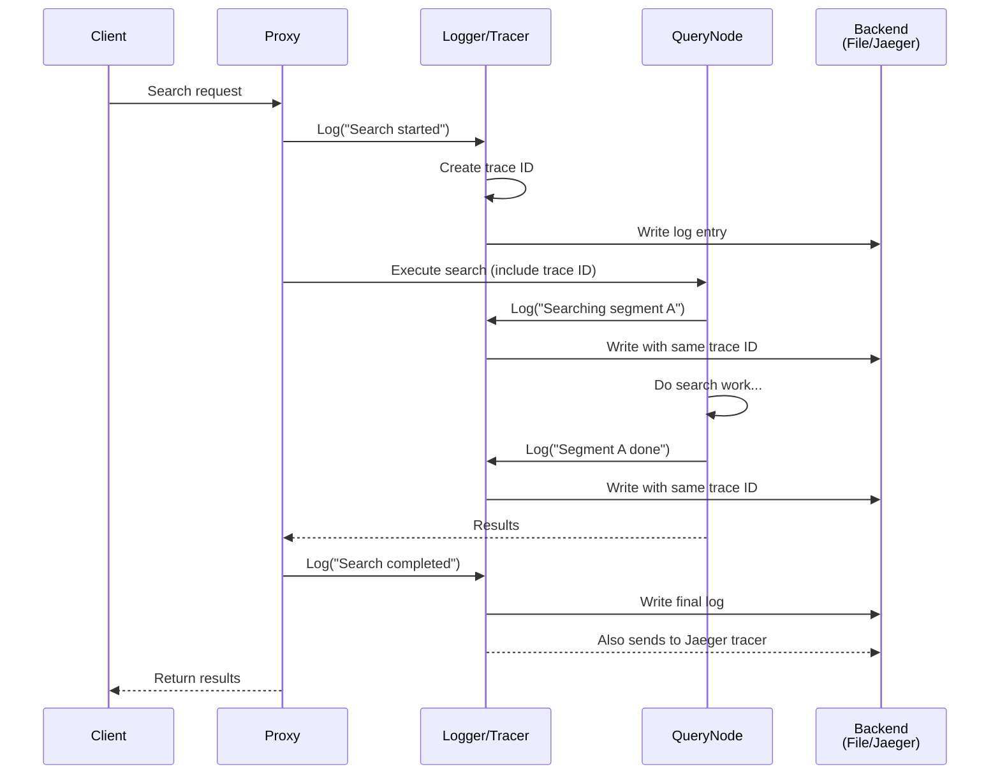

# Chapter 9: Logging & Observability Infrastructure

In [Chapter 8: Version Migration & Schema Evolution](08_version_migration___schema_evolution_.md), we learned how Milvus safely evolves and upgrades while keeping your data intact. But as Milvus runs and processes thousands of requests per second, a critical challenge emerges: **How do you know what's happening inside the system?** When something goes wrong, how do you debug it? When performance drops, how do you find the bottleneck? When a user reports an issue, how do you investigate?

This is exactly what **Logging & Observability Infrastructure** solves! It's the system that lets you see inside Milvus—what it's doing, how fast it's doing it, and when things go wrong.

## The Problem: Understanding a Complex Distributed System

Imagine you're running that Milvus restaurant chain again. Every day, hundreds of orders flow through different kitchens, delivery drivers, and cashiers. If a customer complains "my order took 2 hours," how do you find out why?

You need to know:
- **Logs**: "At 2:00 PM, kitchen A received order 42. At 2:15 PM, it started cooking. At 2:45 PM, it was ready."
- **Traces**: "Order 42 went: Cashier → Kitchen A → Delivery Driver → Customer. Total time: 2 hours."
- **Metrics**: "Kitchen A processed 100 orders today. Average time: 30 minutes. Max time: 2 hours."

With this information, you can see: "Oh, the kitchen took 30 minutes when it usually takes 15. The delay was in the kitchen, not delivery."

Milvus has the exact same challenge. When a search query is slow or a background process fails, you need to:
- **Log** what happened (structured records of events)
- **Trace** the request path (follow a request through all components)
- **Measure** performance metrics (throughput, latency, resource usage)

## Key Concept: What is a Log?

A **log** is a structured record of what happened:

```
Log Entry = {
  Timestamp: 2024-01-15T10:30:45.123Z,
  Level: "INFO",
  Component: "QueryNode",
  Message: "Search query executed",
  Fields: {
    collection_name: "embeddings",
    query_id: 42,
    duration_ms: 1234,
    result_count: 10
  }
}
```

Logs answer: **"What happened and when?"** They're permanent records you can search through later.

Unlike print statements that just show text, logs are **structured**—each piece of information is tagged with a label. This makes it easy to search: "Show me all searches that took more than 1000ms."

## Key Concept: What is a Trace?

A **trace** is like following a single request through the entire system:

```
User Request: "Search for similar vectors"
              ↓
          [Request ID: abc123]
              ↓
    Proxy component logs: "Received search"
              ↓
    QueryCoord logs: "Routed to 3 nodes"
              ↓
    QueryNode 1 logs: "Searching segment A... found 5 results"
    QueryNode 2 logs: "Searching segment B... found 3 results"
    QueryNode 3 logs: "Searching segment C... found 2 results"
              ↓
    Proxy logs: "Combining results... returning top 10"
              ↓
    Total time: 125ms
```

Traces answer: **"Where did this request go and how long did each step take?"** They're crucial for debugging performance issues.

## Key Concept: What are Metrics?

**Metrics** are statistical measurements aggregated over time:

```
Metric = {
  Name: "query_latency_milliseconds",
  Type: "Histogram",  // Records distribution of values
  Values: [100, 120, 105, 110, 98, ...],
  Percentiles: {
    p50: 105ms,   // 50% of queries are faster than this
    p95: 150ms,   // 95% of queries are faster than this
    p99: 200ms    // 99% of queries are faster than this
  }
}
```

Metrics answer: **"How is the system performing overall?"** They're perfect for dashboards and alerts.

## Your First Use Case: Debugging a Slow Search Query

**Goal**: A user reports: "Search is slow today. It used to take 100ms, now takes 500ms." How do you debug this?

### Step 1: Enable Logging

```go
// Configure logging in your setup
config := &log.Config{
    Level: "info",      // Log level: debug, info, warn, error
    Stdout: true,       // Also print to console
    File: {
        Filename: "/var/log/milvus.log",  // Where to save logs
        MaxSize: 100,   // Rotate when file is 100MB
    },
}

logger, props, err := log.InitLogger(config)
log.ReplaceGlobals(logger, props)  // Use this logger globally
```

Now Milvus will write logs to both console and file.

### Step 2: Log During Search

When the search happens, code logs what's happening:

```go
log.Ctx(ctx).Info("Search started",
    zap.String("collection", "embeddings"),
    zap.Int64("topk", 10))

// ... perform search ...

log.Ctx(ctx).Info("Search completed",
    zap.Duration("elapsed", elapsed),
    zap.Int("results_count", len(results)))
```

Each log entry includes a **context** (ctx) which carries a trace ID that links all logs for one request.

### Step 3: Check the Logs

```bash
# Find slow queries in the log file
grep -i "Search completed" /var/log/milvus.log | grep "elapsed.*500ms"
# Output: ...Search completed elapsed=500ms

# Check what happened before that slow search
grep "abc123" /var/log/milvus.log  # All logs with trace ID abc123
```

The logs show the sequence of events!

### Step 4: Use Tracing for Deep Dive

If logs aren't enough, use distributed tracing:

```go
// Tracing is automatic—just configure the exporter
tracer.Init()  // Reads config, connects to Jaeger or OTLP
```

Then use a tracing UI (like Jaeger) to visualize:
```
Request Timeline:
├─ Proxy receives (1ms)
├─ QueryCoord routes (2ms)
├─ QueryNode 1 searches (450ms)  ← Slow!
├─ QueryNode 2 searches (48ms)
└─ Results combined (2ms)
```

You see immediately: **QueryNode 1 is the bottleneck!** It took 450ms out of 500ms total.

### Step 5: Check Metrics

```go
// Query a metrics dashboard (Prometheus + Grafana)
// Shows real-time graphs:
- Average search latency over time (was 100ms, now 500ms)
- QueryNode 1 CPU usage (was 30%, now 95%)
- Disk read rate (was 100MB/s, now 900MB/s)
```

You discover: **QueryNode 1 is running out of disk bandwidth!** Its storage is slow.

**Solution**: Add faster storage or distribute data to another node. Problem solved!

## How It Works Internally

When a search happens, logging and tracing work automatically behind the scenes:



**What happens:**

1. **Trace ID Creation**: When Proxy receives the request, a unique trace ID is created (like `abc123`)
2. **Context Propagation**: This trace ID is added to the context and sent to all components
3. **Automatic Logging**: Each component logs with the trace ID attached
4. **Centralization**: All logs with the same trace ID can be collected and viewed together
5. **Visualization**: Tracing systems show the complete journey as a timeline

## Code Deep Dive: Structured Logging with Zap

Looking at `pkg/log/log.go`, Milvus uses **Zap**, a structured logging library. Let's see how it works:

```go
// Global logger (available everywhere)
logger := log.L()  // Get the global logger

// Logging with structured fields
logger.Info("Query executed",
    zap.String("collection", "embeddings"),
    zap.Int64("topk", 10),
    zap.Duration("elapsed", 125*time.Millisecond))
```

Each `zap.Field` is a key-value pair. Instead of `"collection name is embeddings"` (human-readable but hard to parse), you get `collection=embeddings` (machine-readable, easy to search).

**Output might look like:**

```
2024-01-15T10:30:45.123Z  INFO  QueryNode  collection=embeddings topk=10 elapsed=125ms
```

A logging system can parse this and let you filter: "Show me all queries where collection='embeddings' and elapsed > 1000ms."

Looking at `pkg/log/mlogger.go`, there's a special logger with **rate limiting**:

```go
// Only log every Nth message to avoid spam
logger.RatedInfo(1.0, "Message",  // 1.0 = log all
    zap.String("field", "value"))

logger.RatedWarn(0.1, "Warning",  // 0.1 = log 10% of them
    zap.String("reason", "too many"))
```

This is crucial! If a network is failing and generating thousands of error logs per second, it could crash the system. Rate limiting keeps the log volume manageable.

## Code Deep Dive: Contextual Logging

The most powerful feature is **contextual logging**—attaching trace information automatically:

```go
// In pkg/log/log.go
func Ctx(ctx context.Context) *zap.Logger {
    // Extract trace ID from context
    traceID := trace.SpanFromContext(ctx).SpanContext().TraceID()
    
    // Return logger pre-configured with this trace ID
    return log.L().With(
        zap.String("trace_id", traceID))
}
```

When you call `log.Ctx(ctx)`, you get a logger that automatically includes the trace ID. No manual tracking needed!

```go
// In multiple components, all with the same context:
func (proxy *Proxy) Search(ctx context.Context, req *SearchRequest) {
    log.Ctx(ctx).Info("Proxy received search")  // Includes trace_id
}

func (node *QueryNode) Execute(ctx context.Context, req *SearchRequest) {
    log.Ctx(ctx).Info("QueryNode executing search")  // Same trace_id!
}
```

Later, you can grep the log file: `grep "trace_id=abc123"` and see every log from that request!

## Code Deep Dive: Distributed Tracing with OpenTelemetry

From `pkg/tracer/tracer.go`, Milvus uses **OpenTelemetry**, an industry standard for tracing:

```go
func Init() error {
    params := paramtable.Get()

    // Create exporter (sends trace data somewhere)
    exp, err := CreateTracerExporter(params)
    
    // Configure global tracer
    SetTracerProvider(exp, params.TraceCfg.SampleFraction.GetAsFloat())
    
    log.Info("Tracing initialized",
        zap.String("exporter", params.TraceCfg.Exporter.GetValue()))
}
```

The exporter decides where trace data goes:

```go
switch params.TraceCfg.Exporter.GetValue() {
case "jaeger":
    // Send to Jaeger (popular tracing system)
    return jaeger.New(jaeger.WithCollectorEndpoint(...))
case "otlp":
    // Send to OpenTelemetry Protocol (standard)
    return otlptracegrpc.New(...)
case "stdout":
    // Print to console (for debugging)
    return stdout.New()
}
```

This abstraction means: **Your code doesn't care if traces go to Jaeger, OTLP, or stdout!** The configuration decides.

**Sample fraction** controls how many traces to record:

```go
// If SampleFraction = 0.1 (10%), only record 10% of requests
// Reduces overhead while still getting representative data
```

## Code Deep Dive: Prometheus Metrics

From `pkg/metrics/metrics.go`, Milvus collects **Prometheus metrics**:

```go
var NumNodes = prometheus.NewGaugeVec(
    prometheus.GaugeOpts{
        Namespace: "milvus",
        Name:      "num_node",
        Help:      "number of nodes",
    },
    []string{"node_id", "role_name"},  // Labels for filtering
)
```

This creates a metric called `milvus_num_node` that measures how many nodes are active. You can ask Prometheus:
- "How many nodes do I have?" → `milvus_num_node{role_name="QueryNode"}`
- "How many nodes failed?" → `milvus_num_node{role_name="QueryNode"}` over time

Metrics are registered globally:

```go
func Register(r prometheus.Registerer) {
    r.MustRegister(NumNodes)
    r.MustRegister(LockCosts)  // How long locks take
    // ... more metrics
}
```

Then Prometheus scrapes them periodically (every 15 seconds by default) and stores the time series data for dashboards and alerts.

## Integration with Previous Systems

Logging and observability work with everything we've learned:

```
┌─ Configuration (Chapter 2)
│  ├─ Log level, file paths, trace exporter
│  └─ Metrics sampling rate
│
├─ Message Queues (Chapter 3)
│  └─ Log when messages are sent/received
│
├─ Metadata Catalog (Chapter 4)
│  └─ Log catalog operations (create, update, delete)
│
├─ Query Processing (Chapter 5)
│  ├─ Log each search step
│  ├─ Trace from Proxy → QueryCoord → QueryNode
│  └─ Metrics: query latency, result count
│
├─ Persistent Storage (Chapter 6)
│  └─ Log read/write operations and duration
│
├─ Data Coordination (Chapter 7)
│  ├─ Log compaction triggers and progress
│  └─ Metrics: compaction throughput
│
├─ Version Migration (Chapter 8)
│  └─ Log migration steps and duration
│
└─ Logging & Observability (THIS CHAPTER)
   ├─ Structured logging with Zap
   ├─ Distributed tracing with OpenTelemetry
   ├─ Prometheus metrics collection
   └─ Monitoring and debugging tools
```

Every system generates logs and metrics so operators can monitor everything!

## Real Example: Debugging a Complete Issue

Let's trace a real debugging scenario:

```
1. User reports: "Collection operations are slow"

2. Check metrics dashboard (Grafana):
   ├─ Catalog operation latency: 100ms avg (was 10ms)
   └─ etcd CPU usage: 95% (was 20%)

3. Check logs for pattern (search in Kibana or similar):
   grep "catalog" /var/log/milvus.log | grep "latency"
   └─ Output: Multiple operations taking 50-150ms

4. Enable trace collection (if not already):
   Check Jaeger dashboard for a slow operation
   └─ Trace shows: etcd is responding slowly

5. Investigation:
   - Check etcd cluster health: "One etcd node is failing!"
   - Check network: "Network latency spike at 10:30"
   - Check disk: "etcd disk is full"

6. Solution:
   - Add more etcd nodes or fix the failing one
   - Clean up old metadata from etcd
   - Results improve immediately
```

With logs, traces, and metrics, you can quickly identify and fix issues!

## Understanding Log Levels

Logs are organized by severity:

```
DEBUG   - Very detailed, for debugging (verbose)
INFO    - General information (normal operation)
WARN    - Warning, something might be wrong (needs attention)
ERROR   - An error occurred but system continues
FATAL   - System is shutting down due to critical error
```

Configuration controls which levels are recorded:

```go
// In config
log_level: "info"
```

This means:
- DEBUG logs are skipped (too verbose for production)
- INFO, WARN, ERROR, FATAL are logged

For troubleshooting, temporarily set to DEBUG to see everything!

## Practical Operations: Common Debugging Tasks

### Find a Specific Request

```bash
# Search for request with ID 12345
grep "request_id=12345" /var/log/milvus.log
# Shows all logs from that request, in order
```

### Find Slow Operations

```bash
# Find all operations taking more than 1 second
grep "elapsed" /var/log/milvus.log | awk -F'elapsed=' '{print $2}' | \
    awk '$1 > 1000'
# Shows slow operations for investigation
```

### Monitor in Real-Time

```bash
# Watch logs as they arrive
tail -f /var/log/milvus.log | grep -i error
# See errors as they happen
```

### Check System Health via Metrics

```
Prometheus Query: `rate(milvus_search_total[5m])`
Result: 1000 searches per minute
Timeline: Shows search rate staying constant → sudden drop → increases again

Analysis: Search rate dropped for 2 minutes. Something was wrong (check logs).
Then recovered. Problem was temporary.
```

## Event Logging: Special Case

From `pkg/eventlog/global.go`, Milvus has **event logging** for important business events:

```go
// Record important events
Record(evt)  // Could be: "Collection created", "Data indexed", etc.

// Structured events can be consumed by external systems
// (different from regular logs which go to files)
```

Event logs are often sent to separate systems for compliance/auditing:
- "Who created which collections and when?"
- "When was sensitive data accessed?"
- "What administrative changes were made?"

## Key Takeaways

| Concept | Meaning |
|---------|---------|
| **Log** | Structured record of what happened with timestamp and level |
| **Trace** | Complete journey of a request through all components |
| **Trace ID** | Unique identifier linking all logs from one request |
| **Metrics** | Statistical measurements aggregated over time |
| **Zap** | Structured logging library Milvus uses |
| **OpenTelemetry** | Industry standard for distributed tracing |
| **Prometheus** | Time-series database for collecting metrics |
| **Context Propagation** | Passing trace ID through function calls automatically |
| **Rate Limiting** | Controlling log volume to prevent spam |
| **Sampling** | Recording only X% of traces to reduce overhead |

## Summary

The Logging & Observability Infrastructure system solves a fundamental challenge: **How do you understand what's happening inside a complex distributed system, debug problems when they occur, and monitor performance over time?**

By providing:
- ✅ Structured logging with Zap (searchable, machine-readable logs)
- ✅ Contextual logging (trace ID automatically included)
- ✅ Distributed tracing with OpenTelemetry (follow requests across components)
- ✅ Prometheus metrics (performance and health monitoring)
- ✅ Multiple backends (logs to file, traces to Jaeger, metrics to Prometheus)
- ✅ Rate limiting (prevent log spam)
- ✅ Configuration-driven (adjust log levels and exporters without code changes)

Milvus becomes observable—operators can see what's happening, debug issues quickly, and monitor system health continuously.

You've learned:
- ✅ Why observability is critical for distributed systems
- ✅ The three pillars: logging, tracing, and metrics
- ✅ How to log structured information
- ✅ How to trace requests through multiple components
- ✅ How to collect and analyze metrics
- ✅ Practical debugging techniques
- ✅ Integration with all previous systems

---

**Congratulations!** You've completed the core Milvus architecture tutorial! You now understand:

1. ✅ How components are orchestrated and managed
2. ✅ How configuration flows through the system
3. ✅ How components communicate via message queues
4. ✅ How metadata is centrally managed
5. ✅ How search queries are executed efficiently
6. ✅ How data is persisted reliably
7. ✅ How data is continuously optimized
8. ✅ How the system evolves safely
9. ✅ How to monitor and debug everything

These nine concepts form the **complete Milvus architecture**. Each builds on the others to create a robust, scalable, observable vector database that can handle billions of vectors efficiently.

As you continue learning Milvus, remember these fundamentals. Every feature, optimization, and component you encounter will fit into one of these nine categories. You've learned to think like a Milvus architect!

The next chapter, [Chapter 10: Code Quality & Static Analysis Rules](10_code_quality___static_analysis_rules_.md), covers how Milvus maintains code quality and consistency as it evolves—ensuring that all the sophisticated systems you've learned about are built on a foundation of excellent, maintainable code.

---

Generated by [AI Codebase Knowledge Builder](https://github.com/The-Pocket/Tutorial-Codebase-Knowledge)