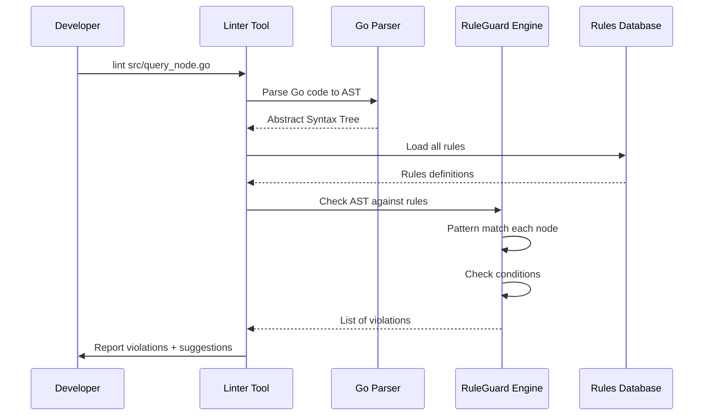

# Chapter 10: Code Quality & Static Analysis Rules

In [Chapter 9: Logging & Observability Infrastructure](09_logging___observability_infrastructure_.md), we learned how Milvus tracks what's happening inside the system through logs, traces, and metrics. But there's one more layer to maintaining a healthy system: **code quality**. As thousands of developers contribute to Milvus across different parts of the codebase, how do you ensure everyone writes code consistently and catches mistakes before they become problems? How do you prevent common bugs that could cause searches to fail or data to corrupt?

This is exactly what **Code Quality & Static Analysis Rules** solves! It's an automated system that reads through code *before* it's merged and says: "Hey, I found 5 potential problems here. You might want to fix those first."

## The Problem: Maintaining Quality Across a Large Codebase

Imagine you're still running that Milvus restaurant chain. Different managers work in different locations and write procedures differently:

```
Manager A: "If inventory < 50, we need to order more"
Manager B: "Hmm, should it be if inventory != 50 or inventory < 50?"
Manager C: "Wait, I'm comparing timestamps wrong in my code"
Manager D: "I accidentally locked a resource but released the wrong lock type"
```

Without rules and guidelines, quality becomes inconsistent. Some procedures are excellent, others have subtle bugs that only show up months later under specific conditions.

Milvus needs:
1. **Automated checks** that run on every code change
2. **Consistent rules** that all developers follow
3. **Early detection** of problems before code goes to production
4. **Helpful guidance** showing developers *how* to fix issues

This is what **static analysis rules** provide. Think of them as an automated code reviewer that never sleeps, never misses a pattern, and always gives the same feedback.

## Key Concept: What is Static Analysis?

**Static analysis** means analyzing code *without running it*. Like a teacher grading a homework assignment by reading it carefully, not by executing it.

```
❌ Dynamic Analysis (runs code):
   Write test → Run code → Check results

✅ Static Analysis (reads code):
   Read code → Check for patterns → Report issues
```

**Examples of patterns static analysis checks:**

```go
// Pattern 1: Unnecessary type conversion
int(x)  // Bad if x is already an int!

// Pattern 2: Using == with time.Time
if time1 == time2  // Bad! Use .Equal() instead

// Pattern 3: Self-assignment
x = x  // Useless! Did you mean something else?

// Pattern 4: Odd nested conditions
if x { if !x { ... } }  // Contradictory! Always false
```

None of these patterns cause compile errors—the Go compiler accepts them. But they're *suspicious* and usually indicate a mistake.

## Key Concept: RuleGuard - The Rule Engine

Milvus uses a tool called **RuleGuard** to check code against patterns. RuleGuard is like a sophisticated pattern matcher:

```
Your Code:
  int(x)  ← Does this match any rule pattern?
        ↓
RuleGuard Rules:
  Rule 1: "int($x)" where x is already int → Report!
        ↓
Report:
  "unnecessary conversion: int(x) → x"
```

Think of RuleGuard as a "find and replace" tool, but for finding code *patterns* instead of just text strings.

## Your First Use Case: Catching Unnecessary Type Conversions

**Goal**: Someone writes `int64(myVar)` but `myVar` is already `int64`. Your linter should catch this and suggest removing it.

### Step 1: Define the Rule

In `pkg/gorules/rules.go`, the rule looks like this:

```go
func unconvert(m dsl.Matcher) {
    m.Match("int64($x)").
        Where(m["x"].Type.Is("int64") && !m["x"].Const).
        Report("unnecessary conversion").
        Suggest("$x")
}
```

This rule says: "Find any code that looks like `int64($x)`, and if `$x` is already `int64`, report it as unnecessary."

Let me break down what each part means:
- **Match**: The code pattern to look for (`int64($x)`)
- **Where**: Conditions that must be true (`$x` is type `int64`)
- **Report**: The message to show developers
- **Suggest**: What to replace it with

### Step 2: Run the Linter

When a developer submits code, the linter runs:

```bash
# Run linter on the code
./linter check src/query_node.go

# Output:
# src/query_node.go:123: unnecessary conversion: int64(x) → x
```

The linter found the problem and suggests the fix!

### Step 3: Developer Fixes It

```go
// Before (flagged by linter)
result := int64(myVar)

// After (fixed)
result := myVar
```

The unnecessary conversion is removed. Code is simpler and faster (no conversion overhead).

## Understanding the Rule Categories

Looking at `pkg/gorules/rules.go`, rules are organized by what they detect:

### 1. Type Conversion Issues

```go
// Unnecessary conversions
unconvert(m dsl.Matcher)
// Detects: int(x) where x is already int
```

**Why it matters**: Unnecessary conversions are slower and confusing to read.

### 2. Time Comparison Issues

```go
// Don't use == or != with time.Time
timeeq(m dsl.Matcher)
// Detects: t1 == t2 where both are time.Time
```

**Why it matters**: Time comparison has precision issues. Should use `.Equal()` method instead.

### 3. Logic Errors

```go
// Odd nested conditions
oddnestedif(m dsl.Matcher)
// Detects: if x { if !x { ... } }
```

**Why it matters**: Contradictory conditions indicate logic errors that never work correctly.

### 4. Self-Assignment

```go
// Useless assignments
selfassign(m dsl.Matcher)
// Detects: x = x
```

**Why it matters**: Usually a typo or copy-paste error. Almost never intentional.

### 5. Resource Management

```go
// Wrong lock/unlock pairs
badlock(m dsl.Matcher)
// Detects: Lock() then RUnlock() (mismatched!)
```

**Why it matters**: Can cause deadlocks or race conditions in concurrent code.

## How It Works Internally

When you run the linter on your code, here's what happens:



**Step by step:**

1. **Parsing**: Convert Go source code into an Abstract Syntax Tree (AST) - a computer-friendly representation
2. **Loading Rules**: Read all rule definitions from the rules database
3. **Pattern Matching**: For each rule, check if any code matches the pattern
4. **Condition Checking**: If pattern matches, verify additional conditions are true
5. **Reporting**: Display violations to developer with suggestions

## Code Deep Dive: Understanding Rule Syntax

Looking at `pkg/gorules/rules.go`, let's understand the pattern matching syntax:

```go
m.Match("int64($x)")
```

This matches code that looks like `int64(` followed by something (`$x`) followed by `)`.

The `$x` is a **variable pattern**—it matches any expression and stores it so you can reference it later:

```go
m.Match("$x = $x")  // Matches self-assignments like "x = x"
                    // First $x must match second $x
```

The **Where** clause adds conditions:

```go
Where(m["x"].Type.Is("int64"))
// Only report if x is actually int64 type
```

This is crucial! Without the `Where`, you'd report ALL `int64()` calls, even the valid ones. The `Where` makes the rule specific.

## Real Example: Catching a Time Comparison Bug

Let's see a real bug the linter would catch:

```go
// Developer writes this (WRONG!)
if createdAt == modifiedAt {
    log.Info("Just created")
}

// RuleGuard rule detects:
m.Match("$t0 == $t1").
    Where(m["t0"].Type.Is("time.Time")).
    Report("using == with time.Time")

// Linter reports:
// ❌ using == with time.Time (line 42)
// Better: use .Equal() method
```

Why is `==` wrong with `time.Time`? Nanosecond precision issues can cause unexpected results. The fix:

```go
// Developer changes to (CORRECT!)
if createdAt.Equal(modifiedAt) {
    log.Info("Just created")
}
```

The `.Equal()` method handles time comparison correctly.

## Code Deep Dive: Complex Rule Example

Some rules are more sophisticated. Look at the `timeeq` rule for checking time comparison:

```go
func timeeq(m dsl.Matcher) {
    m.Match("$t0 == $t1").
        Where(m["t0"].Type.Is("time.Time")).
        Report("using == with time.Time")
    
    m.Match("$t0 != $t1").
        Where(m["t0"].Type.Is("time.Time")).
        Report("using != with time.Time")
}
```

This rule checks **two patterns**:
1. Equality check `==` with time.Time
2. Inequality check `!=` with time.Time

Both are problematic, so both are caught!

## Understanding Rule Organization

Rules are organized into functions by category:

```
unconvert()        → Type conversion issues
timeeq()           → Time comparison issues
oddnestedif()      → Contradictory conditions
selfassign()       → Self-assignments
oddbitwise()       → Suspicious bitwise operations
badlock()          → Lock/unlock mismatches
```

Each function groups related rules together. When the linter runs, it calls all rule functions and aggregates the violations.

## Integration with Previous Systems

Code quality rules work with everything:

```
┌─ Component Architecture (Chapter 1)
│  └─ Ensure components are written correctly
│
├─ Configuration (Chapter 2)
│  └─ Linter configuration (which rules to enable/disable)
│
├─ Message Queues (Chapter 3)
│  └─ Check message handling code for bugs
│
├─ Metadata Catalog (Chapter 4)
│  └─ Catch concurrency bugs in catalog access
│
├─ Query Processing (Chapter 5)
│  └─ Detect logic errors in search code
│
├─ Persistent Storage (Chapter 6)
│  └─ Catch file handling bugs
│
├─ Data Coordination (Chapter 7)
│  └─ Verify compaction logic is correct
│
├─ Version Migration (Chapter 8)
│  └─ Check migration code carefully
│
├─ Logging & Observability (Chapter 9)
│  └─ Ensure logging calls are correct
│
└─ Code Quality (THIS CHAPTER)
   ├─ Catch bugs before code merge
   ├─ Enforce consistent patterns
   ├─ Improve code reliability
   └─ Make code faster
```

Code quality is the **foundation** everything else builds on!

## Common Rules in Milvus

Let's look at specific rules Milvus uses:

### Rule: Unnecessary Conversions

```go
m.Match("uint32($x)").
    Where(m["x"].Type.Is("uint32") && !m["x"].Const).
    Report("unnecessary conversion").
    Suggest("$x")
```

Catches developer errors like: `uint32(alreadyUint32Variable)`

### Rule: String Errors Instead of Checking Type

```go
m.Match("strings.Contains($err.Error(), $text)").
    Where(m["text"].Text.Matches("\".*closed network connection.*\"")).
    Report("use errors.Is() instead").
    Suggest("errors.Is($err, net.ErrClosed)")
```

Catches fragile error checking. Instead of comparing error message strings, use proper error type checking.

### Rule: Odd Loop Counters

```go
m.Match("for $i := $x; $i < $y; $i += $z { $*_ }").
    Where(m["i"].Type.Is("float64")).
    Report("floating point for loop counter")
```

Catches dangerous floating-point loop counters. Floating-point arithmetic isn't precise enough for loop control!

### Rule: Lock/Unlock Mismatches

```go
m.Match(`$mu.Lock(); defer $mu.RUnlock()`).
    Report(`maybe $mu.RLock() was intended?`)
```

Catches deadlock bugs where you lock with one method but unlock with another.

## How Developers Use This

### During Development

```bash
# Developer checks their code locally
go run github.com/milvus-io/milvus/cmd/lint ./pkg/...

# Output:
# pkg/query_node.go:123: unnecessary conversion
# pkg/data_node.go:456: using == with time.Time
# pkg/segment_manager.go:789: odd nested ifs
```

Developer sees issues and fixes them **before** submitting for review.

### In CI/CD Pipeline

```bash
# Automated check on every pull request
./scripts/run-linter.sh

# If violations found:
if [ violations > 0 ]; then
    echo "Linter found issues. Fix before merging."
    exit 1
fi
```

The linter **blocks merging** until code passes all checks!

## Practical Example: Complete Flow

Let's trace a real scenario:

```
1. Developer writes code:
   if timestamp == otherTime {
       // handle equal times
   }
   ↓

2. Developer runs linter locally:
   ./lint ./src/segment.go
   ↓

3. Linter reports:
   ❌ using == with time.Time (line 42)
   Suggestion: Use .Equal() method instead
   ↓

4. Developer reads the report and fixes:
   if timestamp.Equal(otherTime) {
       // handle equal times
   }
   ↓

5. Developer runs linter again:
   No violations found! ✓
   ↓

6. Developer submits pull request
   ↓

7. CI/CD runs linter automatically
   No violations found! ✓
   ↓

8. PR is approved and merged
   Code quality assured!
```

Without this linting, the buggy code would make it to production!

## Custom Rules for Milvus

Beyond standard Go patterns, Milvus can define custom rules. For example:

```go
// Example custom rule (not in the code, hypothetical)
func noDirectEtcdAccess(m dsl.Matcher) {
    m.Match("etcd.Put($_, $_)").
        Report("use Catalog API instead of direct etcd").
        Suggest("catalog.Create() or catalog.Update()")
}
```

This enforces that developers use the abstraction layer (Catalog) instead of accessing etcd directly. This keeps the codebase consistent!

## Understanding False Positives

Sometimes the linter reports an issue that's actually intentional:

```go
// Linter would flag this as self-assignment
x = x  // Intentional: reset to initial value due to reason X

// Developer can suppress it with comment
x = x  //nolint:selfassign - intentional reset
```

Most linters support `//nolint` comments to suppress specific checks when they're wrong.

## Integration with Code Review

Code linting works alongside human code review:

```
┌─────────────────────────┐
│   Developer Submits PR  │
└──────────────┬──────────┘
              ↓
┌─────────────────────────┐
│   Linter Runs (Auto)    │
│   • No violations? ✓    │
│   • Has issues? ✗       │
└──────────────┬──────────┘
              ↓
┌─────────────────────────┐
│   Human Code Review     │
│   • Logic correct?      │
│   • Performance OK?     │
│   • Follows patterns?   │
└──────────────┬──────────┘
              ↓
┌─────────────────────────┐
│   Merge to Main Branch  │
└─────────────────────────┘
```

The linter catches **mechanical issues** (syntax patterns, type mismatches), so human reviewers focus on **logic issues** (correctness, performance, design).

## Key Takeaways

| Concept | Meaning |
|---------|---------|
| **Static Analysis** | Analyzing code without running it |
| **RuleGuard** | Tool that implements pattern matching rules |
| **Pattern Matching** | Finding code that matches specific structures |
| **Conditions (Where)** | Additional checks beyond just pattern matching |
| **Rule Function** | Groups related rules together |
| **Violation** | Code that matches a rule's pattern |
| **False Positive** | Rule reports issue that's actually correct |
| **Linting** | Running static analysis checks on code |
| **CI/CD Integration** | Running linter automatically on every PR |
| **Suppress** | Tell linter to ignore specific issues (when intentional) |

## Summary

The Code Quality & Static Analysis Rules system solves a fundamental challenge: **How do you automatically catch common mistakes, enforce coding patterns, and maintain consistency across thousands of code changes without slowing down development?**

By providing:
- ✅ Automatic pattern detection (catch bugs before code merges)
- ✅ Multiple rule categories (type errors, logic errors, resource management, etc.)
- ✅ Clear suggestions (show developers how to fix issues)
- ✅ Fast feedback (runs in seconds, not minutes)
- ✅ CI/CD integration (blocks merging when violations found)
- ✅ Custom rules (enforce Milvus-specific patterns)
- ✅ Suppression mechanism (allow intentional violations with comments)

Milvus maintains high code quality across a large, distributed codebase while keeping development velocity high.

You've learned:
- ✅ What static analysis is and why it matters
- ✅ How RuleGuard patterns work
- ✅ Common categories of code quality issues
- ✅ How rules are defined and organized
- ✅ How the linter integrates with development workflow
- ✅ Practical debugging with linting

---

## 🎉 Congratulations! You've Completed the Milvus Architecture Tutorial!

You now understand the **complete Milvus architecture**, all nine core systems:

1. ✅ [Component Architecture & Lifecycle Management](01_component_architecture___lifecycle_management_.md) - How components start, run, and stop
2. ✅ [Configuration Management System](02_configuration_management_system_.md) - How settings flow through the system
3. ✅ [Message Queue & Streaming Infrastructure](03_message_queue___streaming_infrastructure_.md) - How components communicate reliably
4. ✅ [Metadata & Catalog Management](04_metadata___catalog_management_.md) - How structure is tracked centrally
5. ✅ [Query Processing & Search Pipeline](05_query_processing___search_pipeline_.md) - How searches execute efficiently
6. ✅ [Persistent Storage & Chunk Management](06_persistent_storage___chunk_management_.md) - How data survives crashes
7. ✅ [Data Coordination & Compaction Strategy](07_data_coordination___compaction_strategy_.md) - How data stays optimized over time
8. ✅ [Version Migration & Schema Evolution](08_version_migration___schema_evolution_.md) - How systems evolve safely
9. ✅ [Logging & Observability Infrastructure](09_logging___observability_infrastructure_.md) - How to see inside the system
10. ✅ [Code Quality & Static Analysis Rules](10_code_quality___static_analysis_rules_.md) - How code stays reliable (**this chapter**)

**Each concept builds on the others**, forming a complete, sophisticated system that:
- Manages billions of vectors efficiently
- Maintains consistency across distributed nodes
- Optimizes data automatically
- Evolves safely over time
- Stays observable and debuggable
- Keeps code quality high

**You now think like a Milvus architect!** You understand not just *what* Milvus does, but *how* and *why* each piece is essential to the whole. As you continue working with Milvus, every feature and optimization you encounter will fit into one of these ten categories.

The foundation is now solid. Go build amazing things with Milvus! 🚀

---

Generated by [AI Codebase Knowledge Builder](https://github.com/The-Pocket/Tutorial-Codebase-Knowledge)