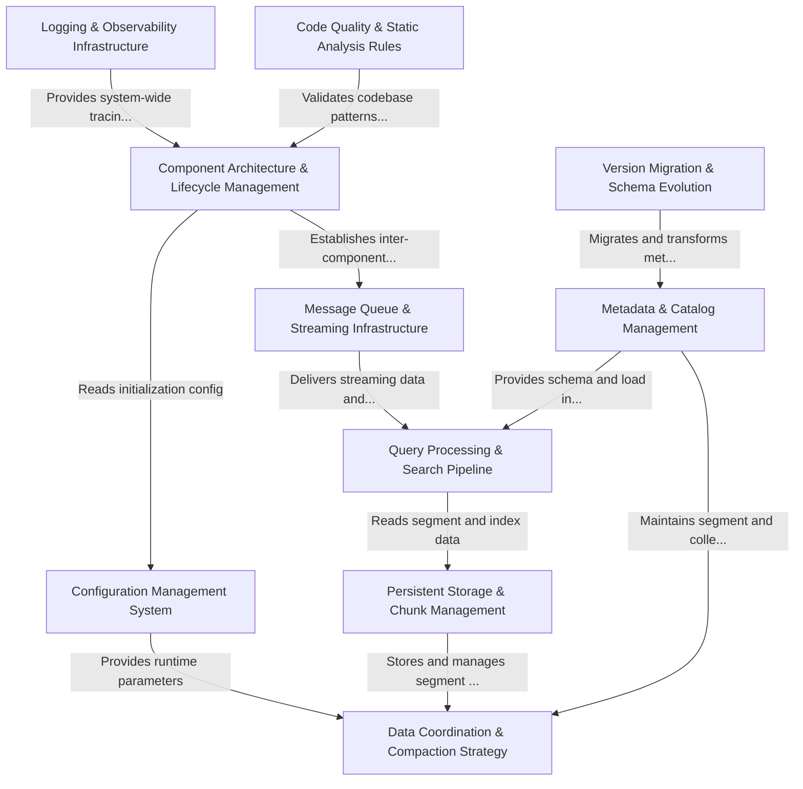

# Tutorial: milvus

**Milvus** is a distributed **vector database** designed for efficient storage, retrieval, and management of high-dimensional vector data at scale. The system implements a sophisticated *multi-component architecture* where **data coordinators** manage segment distribution and compaction, **query nodes** process search operations, and **metadata catalogs** maintain the collection schemas and load information. Through centralized *configuration management*, pluggable *message queue backends*, and *persistent storage abstractions*, Milvus provides a flexible, horizontally-scalable platform for AI-powered vector similarity search with features like automatic compaction, version migration, and comprehensive observability through structured logging.

**Source Repository:** [None](None)

## Chapters

1. [Component Architecture & Lifecycle Management
](01_component_architecture___lifecycle_management_.md)
2. [Configuration Management System
](02_configuration_management_system_.md)
3. [Message Queue & Streaming Infrastructure
](03_message_queue___streaming_infrastructure_.md)
4. [Metadata & Catalog Management
](04_metadata___catalog_management_.md)
5. [Query Processing & Search Pipeline
](05_query_processing___search_pipeline_.md)
6. [Persistent Storage & Chunk Management
](06_persistent_storage___chunk_management_.md)
7. [Data Coordination & Compaction Strategy
](07_data_coordination___compaction_strategy_.md)
8. [Version Migration & Schema Evolution
](08_version_migration___schema_evolution_.md)
9. [Logging & Observability Infrastructure
](09_logging___observability_infrastructure_.md)
10. [Code Quality & Static Analysis Rules
](10_code_quality___static_analysis_rules_.md)

---

Generated by [AI Codebase Knowledge Builder](https://github.com/The-Pocket/Tutorial-Codebase-Knowledge)