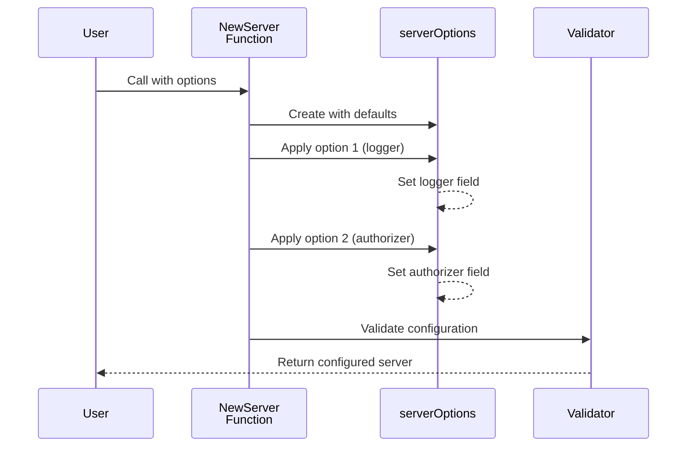

# Chapter 1: Server Configuration Options Pattern

## What Problem Does This Solve?

Imagine you're ordering at a restaurant. The chef could require you to tell them *everything* you want at once in one long sentence: "I want pancakes with extra syrup, bacon, no onions, and a large orange juice, with ice, but only 3 ice cubes, and the glass should be from the cold section." That would be complicated and error-prone.

Instead, restaurants use a menu system where you pick and choose what you want. You might say: "I'll have the pancake special, add bacon, hold the onions, and an orange juice with ice."

The **Server Configuration Options Pattern** works the same way! Instead of forcing users to set up every detail when creating a server (through many constructor parameters), we provide a menu of options that users can choose from. Each option modifies the server's behavior without cluttering the code.

### The Real-World Use Case

Let's say you're starting a Temporal server. You might want to:
- Use a custom logger (for your company's logging system)
- Enable TLS for secure communication
- Set up a custom database for persistence
- Add authorization rules
- Configure how services talk to each other

Without the options pattern, you'd need a massive constructor like:
```go
NewServer(logger, tlsProvider, authz, persistenceResolver, ...)
```

With the options pattern, you pick only what you need:
```go
NewServer(WithLogger(myLogger), WithAuthorizer(myAuthz))
```

Much cleaner! Let's learn how this works.

## Key Concept 1: Options are Functions

The core idea is simple: **each option is a function that modifies the server's internal settings**.

Think of it like a recipe where each instruction modifies the dish step-by-step. In code, each option is a function that takes the server's configuration and adjusts one piece of it.

Here's the basic interface:

```go
type ServerOption interface {
	apply(*serverOptions)
}
```

This says: "A ServerOption is anything that can be applied to serverOptions." Pretty simple!

## Key Concept 2: Concrete Options Using `applyFunc`

To make it easy to create options, the code provides a helper called `applyFunc`:

```go
type applyFunc func(*serverOptions)

func (f applyFunc) apply(s *serverOptions) { f(s) }
```

This is saying: "A function can be an option too!" It's like saying both a checklist item *and* a note can modify your task list.

## Key Concept 3: Pre-made Options for Common Needs

The code provides many pre-made options for things you commonly want to configure:

```go
WithLogger(logger log.Logger)          // Set a custom logger
WithAuthorizer(authorizer)             // Set authorization rules
WithTLSConfigFactory(tlsProvider)      // Enable TLS
ForServices([]string)                  // Choose which services to start
```

Each one is built using the `applyFunc` pattern. Let's look at one:

```go
func WithLogger(logger log.Logger) ServerOption {
	return applyFunc(func(s *serverOptions) {
		s.logger = logger
	})
}
```

**What's happening here?**
1. We define a function `WithLogger` that takes a logger
2. It returns an `applyFunc` (which satisfies `ServerOption`)
3. That function, when applied, sets `s.logger` to the provided logger

It's like saying: "Here's an instruction card that, when followed, sets the logger to this value."

## How to Use It: A Practical Example

Let's say you want to create a Temporal server with a custom logger and specific services. Here's how simple it is:

```go
server, err := temporal.NewServer(
	WithLogger(myCustomLogger),
	ForServices([]string{"frontend", "history"}),
)
```

**What happens?**
1. You pass in options (like menu items)
2. `NewServer` creates a fresh server with defaults
3. Each option modifies the server's configuration
4. The server is ready with your customizations!

It's like placing an order: you say what you want, and the chef makes it exactly that way.

## Internal Implementation: How It All Works

Let's peek under the hood to understand the journey of these options:

### Step 1: Collection and Application

When you call `NewServer`, it receives your options and applies them one-by-one:

```go
func newServerOptions(opts []ServerOption) *serverOptions {
	so := &serverOptions{
		persistenceServiceResolver: resolver.NewNoopResolver(),
		// Other defaults...
	}
	for _, opt := range opts {
		opt.apply(so)  // Each option modifies 'so'
	}
	return so
}
```

**What's happening?**
1. Create a fresh `serverOptions` with sensible defaults
2. Loop through each option you provided
3. Call `apply()` on each one, which modifies the `serverOptions`
4. Return the fully configured options

It's like starting with a blank form and filling in each field based on your instructions.

### Step 2: Internal Storage

All the configured values live in the `serverOptions` struct:

```go
type serverOptions struct {
	logger              log.Logger
	authorizer          authorization.Authorizer
	tlsConfigProvider   encryption.TLSConfigProvider
	// ... many more fields
}
```

This struct is the single source of truth for all server configuration.

### Step 3: Validation

After all options are applied, the code validates everything is correct:

```go
func (so *serverOptions) loadAndValidate() error {
	// Check that all services are valid
	// Load and validate the config file
	return nil
}
```

It's like a quality check: "Does everything make sense together?"

## Visual Journey: Sequence Diagram

Here's what happens step-by-step when you create a server:



## Deeper Dive: Configuration Loading

One important option is configuration loading. Let's see how it works:

```go
func WithConfigLoader(configDir, env, zone string) ServerOption {
	return applyFunc(func(s *serverOptions) {
		s.configDir, s.env, s.zone = configDir, env, zone
	})
}
```

This option stores the paths and environment. Later, when validation happens, it actually loads the configuration file:

```go
func (so *serverOptions) loadConfig() error {
	so.config = &config.Config{}
	err := config.Load(so.env, so.configDir, so.zone, so.config)
	return err
}
```

**Why separate steps?**
- First, you provide where to look (the option)
- Later, when you're ready, the code actually loads it

This is smart because it delays expensive operations (file reading) until you really need them.

## Real Code Example: Multiple Options Together

Let's look at a realistic scenario with several options:

```go
server := temporal.NewServer(
	ForServices([]string{"frontend", "history", "matching"}),
	WithLogger(logger),
	WithAuthorizer(authorizer),
	WithConfigLoader("./config", "production", "us-west"),
)
```

This says:
1. Start these three services
2. Use my logger
3. Use my authorization rules
4. Find config files in `./config` for the `production` environment in `us-west` zone

Each option is applied in order, building up the configuration piece by piece.

## Why Is This Pattern Useful?

1. **Backward Compatible**: You can add new options without breaking old code
2. **Flexible**: Users only set what they need; everything else has sensible defaults
3. **Clear**: Reading the code tells you exactly what's being configured
4. **Testable**: Easy to test different configurations

## Summary & What's Next

You've learned the **Server Configuration Options Pattern**—a flexible way to configure servers without messy constructors. The key ideas:

- Options are functions that modify server settings
- Each option focuses on one piece of configuration
- Users pick and choose what they need
- Defaults handle everything else

This pattern makes Temporal's server easy to customize for different environments and use cases.

Now that you understand how to configure the server, the next step is understanding how the server itself manages all its internal dependencies. 

**[Next: Dependency Injection via Fx Framework](02_dependency_injection_via_fx_framework_.md)**

---

Generated by [AI Codebase Knowledge Builder](https://github.com/The-Pocket/Tutorial-Codebase-Knowledge)