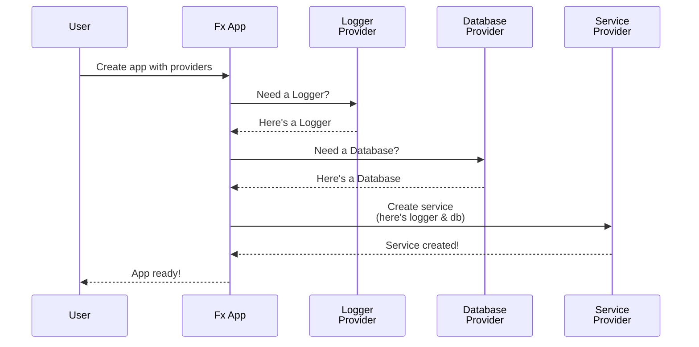
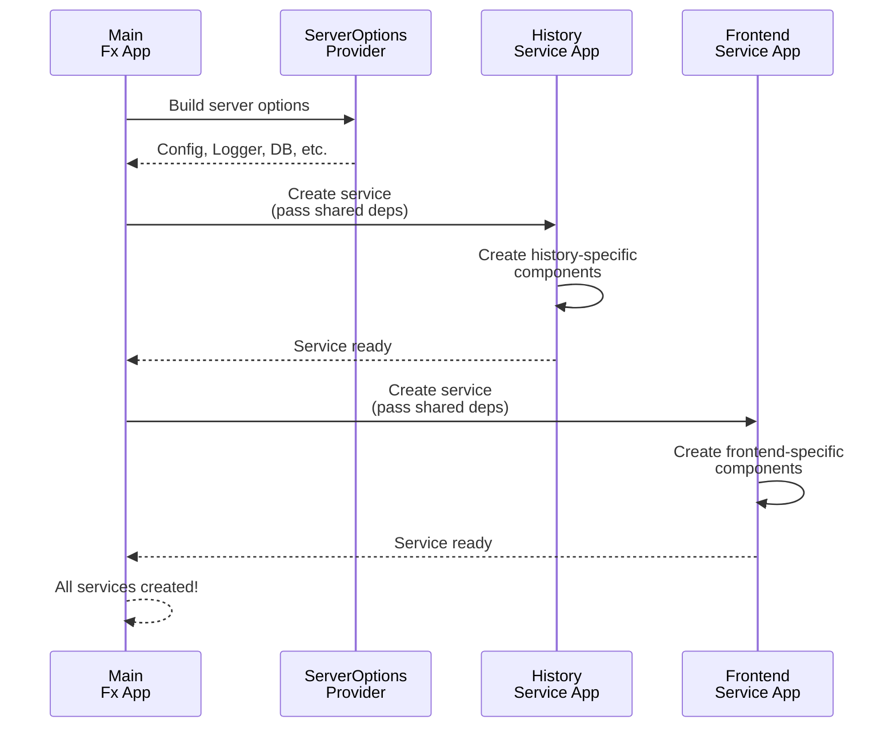

# Chapter 2: Dependency Injection via Fx Framework

[Now that you understand how to configure the server](01_server_configuration_options_pattern_.md), it's time to learn how the server actually manages its internal dependencies. When you have multiple services that need to talk to each other, passing them around manually becomes complex. This is where Dependency Injection comes in!

## What Problem Does This Solve?

Imagine you're building a restaurant kitchen. You have different stations: grilling, plating, dishwashing. Each station needs specific tools and needs to communicate with other stations.

One approach: Have a head chef who manually carries ingredients and tools between stations, saying "Here's what you need!" This is messy and error-prone.

A better approach: Have a manager (Dependency Injection container) who knows what each station needs, creates all the tools once, connects them, and makes sure they're available when needed.

**Dependency Injection via Fx Framework** is like that manager. It:
1. Knows what each service needs (its dependencies)
2. Creates all dependencies in the right order
3. Automatically "wires" them together
4. Manages their lifecycle (startup and shutdown)

### The Real-World Use Case

Imagine your Temporal server needs:
- A logger (for logging what's happening)
- A database connection (for storing data)
- A metrics handler (for monitoring)
- Multiple services (Frontend, History, Matching, Worker)

Each service needs some of these dependencies. Without Fx, you'd manually create and pass them around:

```go
logger := createLogger()
db := connectDatabase()
metrics := createMetrics()
frontend := createFrontendService(logger, db, metrics)
history := createHistoryService(logger, db, metrics)
matching := createMatchingService(logger, db, metrics)
// Getting messy fast!
```

With Fx, you declare what you need, and it figures out the rest:

```go
// Service declares what it needs
func MyService(logger Logger, db Database) *Service {
    return &Service{log: logger, db: db}
}
// Fx sees this and automatically creates it!
```

Much cleaner!

## Key Concept 1: What Are Dependencies?

A **dependency** is something a piece of code needs to work. For example:

```go
type HistoryService struct {
    logger    log.Logger           // This is a dependency
    database  persistence.Client   // This too!
}
```

The `HistoryService` depends on a logger and a database client. Without them, it can't work.

## Key Concept 2: Provider Functions

In Fx, you create dependencies using **provider functions**. A provider is a function that creates something:

```go
func ProvideLogger() log.Logger {
    return log.NewZapLogger(...)
}
```

This says: "Here's how to create a logger. Whenever you need a logger, call me!"

When a service needs a logger, Fx calls this provider function to create one.

## Key Concept 3: Automatic Wiring

Fx uses Go's type system to automatically connect dependencies. If a function *requires* something and another function *provides* it, Fx matches them up:

```go
// Provider: creates a logger
func ProvideLogger() log.Logger { ... }

// Consumer: needs a logger
func NewHistoryService(logger log.Logger) *HistoryService {
    return &HistoryService{logger: logger}
}

// Fx sees: "Hey, HistoryService needs a logger,
// and we have a provider for that!" 
// Fx automatically calls ProvideLogger() and passes it!
```

It's like Fx is a puzzle that automatically fits the pieces together by their shapes!

## Key Concept 4: The Application (fx.App)

An `fx.App` is a container that holds all these providers and manages them:

```go
app := fx.New(
    fx.Provide(ProvideLogger),
    fx.Provide(ProvideDatabase),
    fx.Provide(NewHistoryService),
)
```

This says: "Create an Fx app with these three providers."

## How to Use Fx: A Practical Example

Let's say you want to create a simple service that uses a logger and a database:

```go
// Provider 1: Create a logger
func ProvideLogger() log.Logger {
    return log.NewZapLogger(...)
}

// Provider 2: Create a database
func ProvideDatabase() persistence.Client {
    return persistence.NewClient(...)
}
```

Now create a service that needs both:

```go
// Service that needs logger and database
type MyService struct {
    Logger   log.Logger
    Database persistence.Client
}

// Provider 3: Create the service
func NewMyService(
    logger log.Logger, 
    database persistence.Client,
) *MyService {
    return &MyService{Logger: logger, Database: database}
}
```

Now tell Fx about all of them:

```go
app := fx.New(
    fx.Provide(ProvideLogger),
    fx.Provide(ProvideDatabase),
    fx.Provide(NewMyService),
)
```

Fx automatically figures out:
1. First, create a logger (via `ProvideLogger`)
2. Second, create a database (via `ProvideDatabase`)
3. Third, create `MyService` with those two things

**Magic!** You didn't have to manually pass them around.

## Internal Implementation: How It Works

### Step 1: Build the Dependency Graph

When you create an `fx.App`, Fx scans all your provider functions and builds a **dependency graph**—a map showing what depends on what.

For our example:
```
MyService depends on: Logger, Database
Logger depends on: (nothing)
Database depends on: (nothing)
```

Fx figures this out by looking at each function's parameters!

### Step 2: Execute in Order

Fx then figures out the correct execution order:

1. Create Logger (no dependencies)
2. Create Database (no dependencies)
3. Create MyService (needs Logger and Database)

### Step 3: Inject the Dependencies

As it creates each thing, Fx injects what it needs:

```
→ ProvideLogger() called → logger created
→ ProvideDatabase() called → db created
→ NewMyService(logger, db) called → service created with both
```

Here's a visual sequence:



## Key Concept 5: Lifecycle Management

Services often need setup and cleanup. Fx handles this with **lifecycle hooks**:

```go
lc.Append(fx.Hook{
    OnStart: func(ctx context.Context) error {
        // Called when service starts
        logger.Info("Service starting!")
        return nil
    },
    OnStop: func(ctx context.Context) error {
        // Called when service stops
        logger.Info("Service stopping!")
        return nil
    },
})
```

This is like saying: "When the server boots up, run this. When it shuts down, run that."

## Deep Dive: Temporal's Fx Implementation

Let's look at how Temporal actually uses Fx. In the code, there's a big `TopLevelModule`:

```go
var TopLevelModule = fx.Options(
    fx.Provide(ServerOptionsProvider),
    fx.Provide(HistoryServiceProvider),
    fx.Provide(FrontendServiceProvider),
    // ... more providers
    fx.Invoke(ServerLifetimeHooks),
)
```

This says: "Here are all the providers for building a Temporal server."

The `ServerOptionsProvider` function is special—it takes your configuration options and converts them into injectable dependencies:

```go
func ServerOptionsProvider(
    opts []ServerOption,
) (serverOptionsProvider, error) {
    so := newServerOptions(opts)
    err := so.loadAndValidate()
    if err != nil {
        return serverOptionsProvider{}, err
    }
    // Returns a struct with all the things services need
    return serverOptionsProvider{
        Config: so.config,
        Logger: logger,
        DynamicConfigClient: dcClient,
        // ... etc
    }, nil
}
```

It's like a translator: "Take the configuration options, process them, and turn them into things services can use."

## Key Concept 6: Services as Modules

In Temporal, each service (Frontend, History, etc.) is its own Fx app! Here's how:

```go
func HistoryServiceProvider(
    params ServiceProviderParamsCommon,
) (ServicesGroupOut, error) {
    serviceName := primitives.HistoryService
    
    // Create a NEW Fx app just for this service
    app := fx.New(
        params.GetCommonServiceOptions(serviceName),
        history.Module,
        replication.Module,
    )
    
    return NewService(app, serviceName, params.Logger), 
           app.Err()
}
```

What's happening:
1. The server creates a main Fx app
2. Each service gets its own mini Fx app
3. The server passes common dependencies to each service's app
4. Each service can have its own specific providers

It's like the head chef creating independent stations, but giving them shared tools!

## How They Connect Together

Here's the flow:



## Real Code Example: Breaking It Down

Let's look at a simplified version of how Temporal sets up the database dependency:

```go
// Provider 1: Create the database
func ProvidePersistenceFactory(
    config *config.Config,
) persistence.Factory {
    return persistence.NewFactory(config)
}
```

This creates a database factory based on the config. Then services that need it can do:

```go
// Service that needs the database
type HistoryService struct {
    persistenceFactory persistence.Factory
}

func NewHistoryService(
    factory persistence.Factory,
) *HistoryService {
    return &HistoryService{
        persistenceFactory: factory,
    }
}
```

Fx automatically:
1. Creates the database factory
2. Passes it to `NewHistoryService`
3. Everyone's happy!

## Why Use Fx Instead of Manual Wiring?

1. **Automatic**: No manual passing around of objects
2. **Clear**: You can see what each component needs by looking at function parameters
3. **Testable**: Easy to swap dependencies for testing (more on this in [Chapter 9](09_test_server_infrastructure_.md))
4. **Organized**: Dependencies are managed in one place
5. **Error Handling**: Fx catches circular dependencies and other issues early

## Summary & What's Next

You've learned **Dependency Injection via Fx Framework**—a powerful way to automatically wire up complex object graphs. Key takeaways:

- **Providers** are functions that create dependencies
- **Fx** automatically connects providers to consumers by matching types
- An **fx.App** manages all providers and creates dependencies in the right order
- **Lifecycle hooks** handle startup and shutdown
- Services can be built as separate Fx apps that share common dependencies

Now that you understand how dependencies are created and wired, the next step is understanding how the server initializes these services and manages their lifecycle.

**[Next: Server Initialization & Lifecycle Management](03_server_initialization___lifecycle_management_.md)**

---

Generated by [AI Codebase Knowledge Builder](https://github.com/The-Pocket/Tutorial-Codebase-Knowledge)