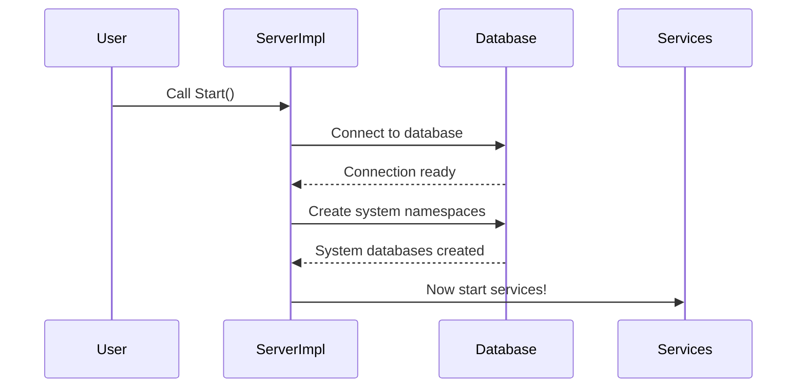
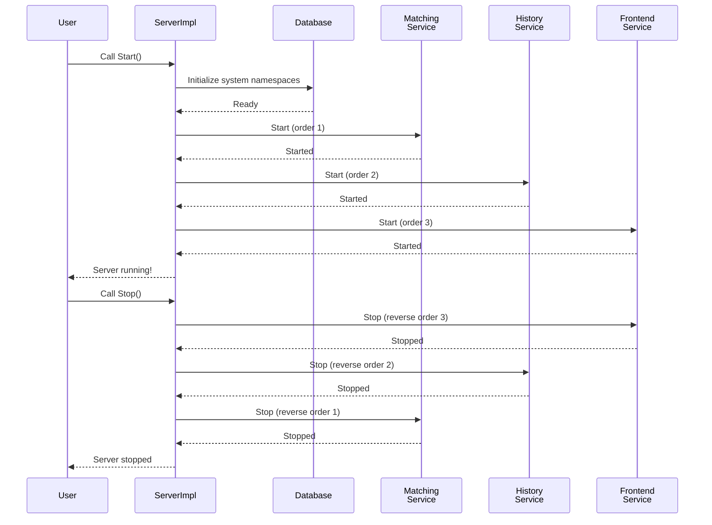

# Chapter 3: Server Initialization & Lifecycle Management

Now that you understand [how dependencies are created and wired together with Fx Framework](02_dependency_injection_via_fx_framework_.md), it's time to learn about the "conductor" that orchestrates everything: the Server!

## What Problem Does This Solve?

Imagine you're the manager of a restaurant that's about to open for the day. You can't just flip a switch and have everything work perfectly. Instead, you need to:

1. **Wake up the team in the right order**: Start with the dishwashers (they prep the workspace), then the prep cooks (they need a clean workspace), then the line cooks (they need ingredients ready)
2. **Initialize the kitchen**: Turn on ovens, fill water systems, stock the ingredient stations
3. **Stay in touch**: Know what each station is doing and make sure they're working correctly
4. **Close properly**: Stop services in reverse order (line cooks stop first, then prep cooks, then dishwashers), turn off equipment safely
5. **Handle problems**: If something breaks during startup, rollback smoothly instead of leaving everything in a broken state

**Server Initialization & Lifecycle Management** is exactly this! The Server is like the restaurant manager. It:

1. **Starts** all services in the correct order
2. **Initializes** system components (like system namespaces in a database)
3. **Monitors** everything is working
4. **Stops** all services in reverse order when shutting down
5. **Handles errors** gracefully

Let's say you want to start a Temporal server with multiple services (Frontend, History, Matching, Worker). Without proper lifecycle management, you might:
- Start services that depend on other services before they're ready (chaos!)
- Accidentally leave half-started services running when something fails (broken state!)
- Try to stop services in the wrong order (causing cascading failures!)

The Server abstraction solves all of this by being the central orchestrator.

## Key Concept 1: The Server Interface - Your Conductor's Baton

The Server interface is simple but powerful:

```go
type Server interface {
    Start() error
    Stop() error
}
```

This says: "A Server can be started and stopped." That's it! Think of it like a conductor's baton—you raise it to start the orchestra, lower it to stop. Everything else happens automatically.

## Key Concept 2: ServerImpl - The Real Conductor

The interface is simple, but the real work happens in `ServerImpl`. Here's what it tracks:

```go
type ServerImpl struct {
    servicesMetadata []*ServicesMetadata  // List of services
    logger          log.Logger             // For logging
    persistenceConfig config.Persistence   // Database config
    // ... more important fields
}
```

**What's happening here?**
- `servicesMetadata`: A list of all the services that need to be managed (Frontend, History, Matching, Worker)
- `logger`: Logs what's happening so you can debug
- `persistenceConfig`: Configuration for the database

The ServerImpl is like having a detailed checklist and clipboard!

## Key Concept 3: Service Initialization Order - Critical Sequencing

Here's something crucial: **services must be started in a specific order**, otherwise they'll fail. Some services depend on others being ready first.

Temporal defines this order:

```go
var initOrder = map[primitives.ServiceName]int{
    primitives.MatchingService:         1,
    primitives.HistoryService:          2,
    primitives.InternalFrontendService: 3,
    primitives.FrontendService:         3,
    primitives.WorkerService:           4,
}
```

**What does this mean?**
- **Matching Service starts first** (level 1): It's a foundational service that others depend on
- **History Service starts second** (level 2): It depends on Matching being ready
- **Frontend Services start third** (level 3): They depend on History and Matching
- **Worker Service starts last** (level 4): It depends on everything else being ready!

It's like building a house: you lay the foundation first (Matching), then build walls (History), then install doors and windows (Frontend), then add furniture (Worker).

## Key Concept 4: System Namespaces - Pre-creating Important Databases

Before the server can work, it needs to set up some special system namespaces (think of them as important internal databases). The Server does this automatically:

```go
err := initSystemNamespaces(
    ctx,
    &persistenceConfig,
    clusterName,
    persistenceFactory,  // Can create databases
    logger,
)
```

**Why is this important?**
System namespaces are like essential infrastructure. Before workers can work, we need a "control room" database where they can record information. The Server creates these automatically when it starts.

## How to Use It: A Practical Example

Remember from earlier chapters that you create a server like this:

```go
server, err := temporal.NewServer(
    WithLogger(myLogger),
    ForServices([]string{"frontend", "history"}),
)
if err != nil {
    return err
}
```

Now you start it:

```go
err := server.Start()
if err != nil {
    fmt.Println("Failed to start:", err)
}
```

**What happens under the hood?**
1. System namespaces are initialized
2. Services are sorted into the correct order
3. Each service is started one-by-one in order
4. If all succeed, the server is running!

When you're done:

```go
err := server.Stop()
```

**What happens?**
1. Services are stopped in **reverse order** (Worker stops first, then Frontend, etc.)
2. Each service is given time to shut down gracefully
3. Resources are cleaned up
4. The server is stopped

Simple!

## Key Concept 5: Graceful Shutdown - The Polite Way to Stop

Notice that stopping has a **timeout**:

```go
const serviceStopTimeout = time.Duration(5) * time.Minute
```

This means: "Give each service 5 minutes to shut down gracefully. If it takes longer, stop it anyway."

**Why?** Imagine you're closing the restaurant. You don't just turn off the lights and leave. You let customers finish their meals (graceful shutdown), give the staff time to clean (graceful shutdown), then lock the door. But if someone won't leave after closing time, you have to make them (timeout).

## Internal Implementation: How It Works

Let's walk through what happens when you call `server.Start()`:

### Step 1: Initialize System Namespaces

First, the server initializes critical system databases:



Let's look at the code that does this:

```go
func (s *ServerImpl) Start(ctx context.Context) error {
    s.logger.Info("Starting server for services", 
                  tag.Value(s.so.serviceNames))
    
    err := initSystemNamespaces(ctx, ...)
    if err != nil {
        return err  // If this fails, stop everything
    }
    
    return s.startServices()
}
```

**What's happening?**
1. Log that we're starting
2. Initialize system namespaces (the control databases)
3. If that succeeds, start the actual services

Simple and linear!

### Step 2: Sort Services Into Correct Order

Before starting services, they must be sorted. Here's the code:

```go
svcs := slices.Clone(s.servicesMetadata)  // Copy list
slices.SortFunc(svcs, func(a, b *ServicesMetadata) int {
    return cmp.Compare(
        initOrder[a.serviceName], 
        initOrder[b.serviceName]
    )
})
```

**What's happening?**
1. Make a copy of the services list (don't modify the original)
2. Sort them using the `initOrder` map we saw earlier
3. Now they're in the right sequence!

### Step 3: Start Each Service in Order

Now the server starts services one-by-one:

```go
for _, svc := range svcs {
    err := svc.app.Start(ctx)  // Start this service
    if err != nil {
        allErrs = multierr.Append(allErrs, err)
    }
}
```

**What's happening?**
1. Loop through services in order
2. Call `Start()` on each service's Fx app (remember from [Chapter 2](02_dependency_injection_via_fx_framework_.md)!)
3. Collect any errors
4. Continue even if one fails (so you can see all errors at once)

### Step 4: Stop in Reverse Order

When stopping, the code reverses the order:

```go
slices.SortFunc(svcs, func(a, b *ServicesMetadata) int {
    return -cmp.Compare(  // Note the NEGATIVE sign!
        initOrder[a.serviceName], 
        initOrder[b.serviceName]
    )
})
for _, svc := range svcs {
    svc.Stop(ctx)  // Stop in reverse order
}
```

**Why the negative sign?** It reverses the sort order! So if we started them 1, 2, 3, 4, we stop them 4, 3, 2, 1. Perfect!

## Deep Dive: Connection to Fx Framework

Remember from [Chapter 2](02_dependency_injection_via_fx_framework_.md) that Fx manages component lifecycles? The Server uses Fx lifecycle hooks:

```go
func ServerLifetimeHooks(
    lc fx.Lifecycle,
    svr *ServerImpl,
) {
    lc.Append(fx.StartStopHook(
        svr.Start,   // Call this on startup
        svr.Stop,    // Call this on shutdown
    ))
}
```

**What's happening?**
1. We tell Fx: "When the Fx app starts, call `svr.Start()`"
2. We tell Fx: "When the Fx app stops, call `svr.Stop()`"
3. Fx automatically calls these at the right times!

This means the Server's lifecycle is managed by Fx. Fx handles when to call `Start()` and `Stop()`, and the Server handles the details of starting and stopping individual services.

## Real Code Example: The Complete Flow

Let's trace through what happens when you create and start a server:

```go
// Step 1: Create server with options
server, err := temporal.NewServer(
    ForServices([]string{"matching", "history", "frontend"}),
)

// Behind the scenes:
// - ServerOptionsProvider converts options to dependencies
// - Fx creates the ServerImpl
// - Fx sets up ServerLifetimeHooks
```

Then when you start:

```go
// Step 2: Start the server
err := server.Start()

// Behind the scenes:
// - initSystemNamespaces() called
// - Services sorted: [Matching, History, Frontend]
// - Each service's Start() called in order
// - Server is now running!
```

And when you stop:

```go
// Step 3: Stop the server
err := server.Stop()

// Behind the scenes:
// - Services sorted in REVERSE: [Frontend, History, Matching]
// - Each service's Stop() called in reverse order
// - Resources cleaned up
// - Server is stopped
```

## Why This Pattern Is Powerful

1. **Order Guaranteed**: Services always start in the right sequence
2. **Graceful Shutdown**: Services get time to clean up properly
3. **Error Handling**: If something fails, you get clear error messages
4. **Observable**: Logs tell you exactly what's happening
5. **Testable**: You can mock services for testing

## A Visual Summary

Here's the complete lifecycle in one diagram:



## Summary & What's Next

You've learned about **Server Initialization & Lifecycle Management**—the central conductor that orchestrates the entire Temporal server. Key takeaways:

- **The Server interface** is simple: `Start()` and `Stop()`
- **ServerImpl** manages the lifecycle details
- **Services must be started in the correct order** (defined by `initOrder`)
- **System namespaces** are initialized before services start
- **Stopping happens in reverse order** for graceful shutdown
- **Fx handles when to call Start/Stop**, ServerImpl handles the details

The Server brings together everything from [Chapter 1](01_server_configuration_options_pattern_.md) (configuration) and [Chapter 2](02_dependency_injection_via_fx_framework_.md) (dependency injection) into a working system!

Now that you understand how the server initializes and manages services, the next step is understanding how the services themselves are organized and how they provide their functionality.

**[Next: Service Provider Architecture](04_service_provider_architecture_.md)**

---

Generated by [AI Codebase Knowledge Builder](https://github.com/The-Pocket/Tutorial-Codebase-Knowledge)