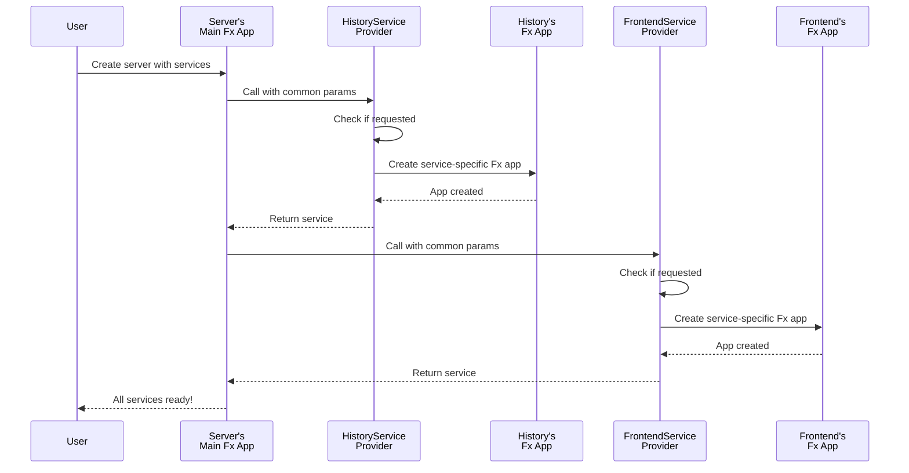
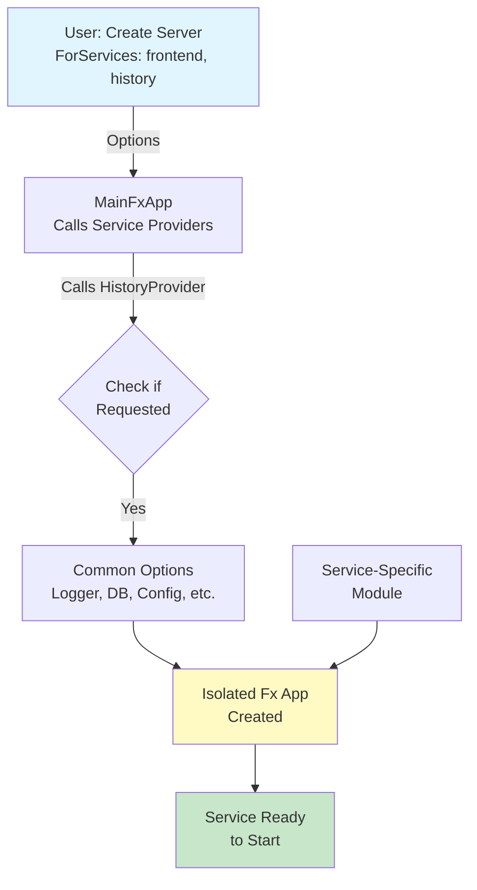

# Chapter 4: Service Provider Architecture

Now that you understand [how the server initializes and orchestrates multiple services](03_server_initialization___lifecycle_management_.md), it's time to learn how each service itself is created and configured. When you have many services with similar but distinct needs, manually creating each one becomes messy. This is where the **Service Provider Architecture** comes in!

## What Problem Does This Solve?

Imagine you own a restaurant chain and need to set up three different types of branches:
- **Pizza branch**: Needs ovens, pizza peels, special flour, a pizza-making staff training program
- **Sushi branch**: Needs refrigeration, raw fish suppliers, sushi-making staff training
- **Burger branch**: Needs grills, bun suppliers, burger-assembly staff training

Each branch is different, but they all need:
- A manager (to run things)
- A basic kitchen layout
- Health inspection records
- A payment system
- Delivery coordination

One approach: Build each branch from scratch each time, figuring out all the details yourself. Messy and error-prone!

A better approach: Have a **standardized branch setup process** that says:
1. Start with the common infrastructure (manager, kitchen layout, payment system)
2. Then add branch-specific components (ovens for pizza, refrigeration for sushi, etc.)

**Service Provider Architecture** works the same way! Instead of manually creating each service (Frontend, History, Matching, Worker) with all their complex dependencies, we have **service providers** that:

1. Take common dependencies (logger, database, configuration)
2. Check if the service is actually needed
3. Create a service-specific Fx application (remember [Fx from Chapter 2](02_dependency_injection_via_fx_framework_.md)!) with service-specific modules
4. Return a ready-to-use service

This keeps the code clean, consistent, and maintainable.

### The Real-World Use Case

Remember from [Chapter 3](03_server_initialization___lifecycle_management_.md) that the server creates multiple services:

```go
// User wants to start a Temporal server with specific services
server, err := temporal.NewServer(
    ForServices([]string{"frontend", "history", "matching"}),
)
```

Behind the scenes, the server needs to create three different services. Each one is different:
- **Frontend Service**: Handles external API requests
- **History Service**: Manages workflow history
- **Matching Service**: Finds available workers for tasks

But they all need some common things:
- A logger (for logging)
- Database access
- Configuration
- Metrics tracking

The Service Provider Architecture elegantly handles this: it provides a standard pattern for creating each service without code duplication.

## Key Concept 1: The Service Provider Pattern - A Factory with Standards

A **service provider** is like a factory assembly line. It's a function that:

1. Takes common dependencies as input
2. Checks if the service is requested
3. Creates the service-specific Fx app
4. Returns the service

Here's the basic idea:

```go
func HistoryServiceProvider(
    params ServiceProviderParamsCommon,
) (ServicesGroupOut, error) {
    // Step 1: Check if service is requested
    if _, ok := params.ServiceNames[serviceName]; !ok {
        return ServicesGroupOut{}, nil  // Not requested, skip
    }
    
    // Step 2 & 3: Create service-specific Fx app
    app := fx.New(
        params.GetCommonServiceOptions(serviceName),
        history.Module,  // History-specific module
    )
    
    // Step 4: Return service
    return NewService(app, serviceName, params.Logger), nil
}
```

**What's happening?**
1. The provider receives `ServiceProviderParamsCommon` - a struct with all common dependencies
2. It checks: "Is someone asking for the History service?"
3. If yes, it creates a new Fx app for that service
4. It returns the service wrapped in `ServicesGroupOut`

It's like saying: "Here's a template for building any service. Plug in the common stuff, add service-specific modules, and you get a working service!"

## Key Concept 2: ServiceProviderParamsCommon - The Common Ingredients

All services need certain common dependencies. These are bundled into `ServiceProviderParamsCommon`:

```go
type ServiceProviderParamsCommon struct {
    Logger              log.Logger          // For logging
    Config              *config.Config      // Configuration
    DynamicConfigClient dynamicconfig.Client // Dynamic settings
    MetricsHandler      metrics.Handler     // Monitoring
    EsClient            esclient.Client     // Search database
    // ... more common dependencies
}
```

Think of this like the "common ingredients shelf" in a restaurant. All branches can grab from it: salt, oil, basic spices, pans, etc.

## Key Concept 3: Service-Specific Modules - The Special Ingredients

Each service has its own special Fx module with service-specific components:

```go
// History Service gets its own special module
app := fx.New(
    params.GetCommonServiceOptions(serviceName),
    history.Module,  // ← Special for History!
    replication.Module,  // ← Also special for History!
)

// Matching Service gets different special modules
app := fx.New(
    params.GetCommonServiceOptions(serviceName),
    matching.Module,  // ← Special for Matching!
)
```

Each service says: "I need the common stuff, BUT I also need these special components."

It's like the pizza branch saying: "Give me the common kitchen setup, and I need a pizza oven and pizza peels too!"

## Key Concept 4: Isolated Fx Applications - Each Service Gets Its Own Mini-Container

Here's the crucial insight: **Each service gets its own Fx application!**

```go
// Server creates a main Fx app with all services
// |
// ├─ History Service's own Fx app (isolated!)
// │  └─ history.Module + common options
// ├─ Frontend Service's own Fx app (isolated!)
// │  └─ frontend.Module + common options
// └─ Matching Service's own Fx app (isolated!)
//    └─ matching.Module + common options
```

Why is this important? Each service can:
- Have its own dependency graph
- Initialize components in its own order
- Be started/stopped independently
- Have isolated configuration

Think of it like franchises: each branch has its own Fx app managing its own components, but they all share access to common resources.

## How to Use It: The Complete Flow

Let's trace through the complete flow of how services are created:

### Step 1: User Creates Server with Services

```go
server, err := temporal.NewServer(
    ForServices([]string{"matching", "history", "frontend"}),
)
```

This tells the server: "I want these three services."

### Step 2: Server Creates All Service Providers

Behind the scenes, the server's main Fx app calls all service providers:

```go
var TopLevelModule = fx.Options(
    fx.Provide(HistoryServiceProvider),
    fx.Provide(MatchingServiceProvider),
    fx.Provide(FrontendServiceProvider),
    // ... more providers
)
```

Fx sees these providers and calls them with `ServiceProviderParamsCommon`.

### Step 3: Each Provider Creates Its Service

The History Service Provider, for example:

```go
// Called by Fx with common params
func HistoryServiceProvider(params ServiceProviderParamsCommon) (ServicesGroupOut, error) {
    // Check if requested
    if _, ok := params.ServiceNames[primitives.HistoryService]; !ok {
        return ServicesGroupOut{}, nil  // Skip if not requested
    }
    
    // Create service-specific Fx app
    app := fx.New(
        params.GetCommonServiceOptions(primitives.HistoryService),
        history.Module,
        replication.Module,
    )
    
    return NewService(app, primitives.HistoryService, params.Logger), nil
}
```

**Result**: A History Service with its own Fx app, ready to be started!

### Step 4: Services Are Collected and Started

All services are collected into a group:

```go
type ServicesGroupOut struct {
    fx.Out
    Services *ServicesMetadata `group:"services"`
}
```

The server then starts each one in the correct order (remember from [Chapter 3](03_server_initialization___lifecycle_management_.md)!).

## Internal Implementation: How It Works

Let's walk through the step-by-step process:



**What's happening?**
1. User creates a server with requested services
2. Server's main Fx app starts calling each service provider
3. Each provider checks: "Am I requested?"
4. If yes, it creates its own isolated Fx app with service-specific modules
5. All services are collected together
6. Server has a list of ready-to-use services!

## Deep Dive: Understanding the Code

Let's look at the actual implementation. First, here's how the main server module provides these service providers:

```go
var TopLevelModule = fx.Options(
    fx.Provide(HistoryServiceProvider),
    fx.Provide(MatchingServiceProvider),
    fx.Provide(FrontendServiceProvider),
    fx.Provide(InternalFrontendServiceProvider),
    fx.Provide(WorkerServiceProvider),
)
```

This tells Fx: "These five functions create services. Call them and collect the results."

Now, here's a concrete service provider in detail:

```go
func MatchingServiceProvider(
    params ServiceProviderParamsCommon,
) (ServicesGroupOut, error) {
    serviceName := primitives.MatchingService
    
    // Decision point: Is this service requested?
    if _, ok := params.ServiceNames[serviceName]; !ok {
        params.Logger.Info("Service not requested, skipping.",
            tag.Service(serviceName))
        return ServicesGroupOut{}, nil
    }
    
    // Create service-specific Fx app
    app := fx.New(
        params.GetCommonServiceOptions(serviceName),
        matching.Module,
    )
    
    return NewService(app, serviceName, params.Logger), nil
}
```

**Breaking this down:**

1. **Get service name**: `primitives.MatchingService` is just a string constant like `"matching"`

2. **Check if requested**: 
   ```go
   if _, ok := params.ServiceNames[serviceName]; !ok {
       // Not in the list, return empty
   }
   ```
   This checks: "Is 'matching' in the list of services the user requested?"

3. **Get common options**:
   ```go
   params.GetCommonServiceOptions(serviceName)
   ```
   This returns all the common dependencies (logger, database, config, etc.) wrapped as Fx options

4. **Add service-specific module**:
   ```go
   matching.Module  // Only Matching Service needs this
   ```

5. **Create and return service**:
   ```go
   NewService(app, serviceName, params.Logger)
   ```

Here's what `GetCommonServiceOptions` does:

```go
func (params ServiceProviderParamsCommon) GetCommonServiceOptions(
    serviceName primitives.ServiceName,
) fx.Option {
    return fx.Options(
        // Supply common dependencies as Fx providers
        fx.Provide(
            func() log.Logger { return params.Logger },
            func() *config.Config { return params.Cfg },
            func() dynamicconfig.Client { return params.DynamicConfigClient },
            // ... more common dependencies
        ),
    )
}
```

**What's this doing?**
It's converting the common dependencies from structs into Fx providers. Why? Because each service's Fx app needs to be independent. By wrapping them as providers, the service's Fx app can depend on them without knowing where they came from.

It's like saying: "Here are all the common resources. Treat them as if they're available for dependency injection in your service's Fx app."

## Real Code Example: Two Services

Let's see how two different services are created using this pattern:

### History Service
```go
app := fx.New(
    params.GetCommonServiceOptions(primitives.HistoryService),
    history.Module,        // History-specific
    replication.Module,    // Also history-specific
)
```

### Matching Service
```go
app := fx.New(
    params.GetCommonServiceOptions(primitives.MatchingService),
    matching.Module,       // Matching-specific (different!)
)
```

**Same pattern, different modules!** The History Service gets `history.Module + replication.Module`. The Matching Service gets `matching.Module`. But both follow the exact same pattern.

This is powerful because:
- Adding a new service? Just create a new provider function!
- Changing common dependencies? Update `GetCommonServiceOptions` once, all services benefit!
- Maintaining services? Each is isolated in its own Fx app!

## Why This Pattern Is Powerful

1. **Consistency**: All services follow the same creation pattern (check if requested → create isolated Fx app)
2. **Extensibility**: Want to add a new service? Create a new provider function following the same pattern
3. **Isolation**: Each service has its own Fx app, so components don't leak between services
4. **DRY (Don't Repeat Yourself)**: Common dependencies aren't duplicated; they're shared via `GetCommonServiceOptions`
5. **Flexibility**: Services can be started, stopped, or skipped independently
6. **Testability**: Easy to test individual services in isolation (more on this in [Chapter 9](09_test_server_infrastructure_.md)!)

## A Visual Summary

Here's the complete picture of how services are created:



## Summary & What's Next

You've learned **Service Provider Architecture**—a powerful pattern for uniformly creating different service instances with their specific dependencies. Key takeaways:

- **Service Providers** are functions that check if a service is requested, then create isolated Fx applications
- **ServiceProviderParamsCommon** bundles all common dependencies (logger, database, config)
- **GetCommonServiceOptions** converts common dependencies into Fx providers for each service
- Each service gets its **own isolated Fx app** with service-specific modules
- The pattern is: **Common Options + Service-Specific Module = Ready Service**

This architecture brings together configuration (from [Chapter 1](01_server_configuration_options_pattern_.md)), dependency injection (from [Chapter 2](02_dependency_injection_via_fx_framework_.md)), and lifecycle management (from [Chapter 3](03_server_initialization___lifecycle_management_.md)) into a clean, extensible pattern for creating services!

Now that you understand how services are created and orchestrated, the next step is understanding how the server manages cluster-wide metadata that coordinates all these services.

**[Next: Cluster Metadata Management](05_cluster_metadata_management_.md)**

---

Generated by [AI Codebase Knowledge Builder](https://github.com/The-Pocket/Tutorial-Codebase-Knowledge)