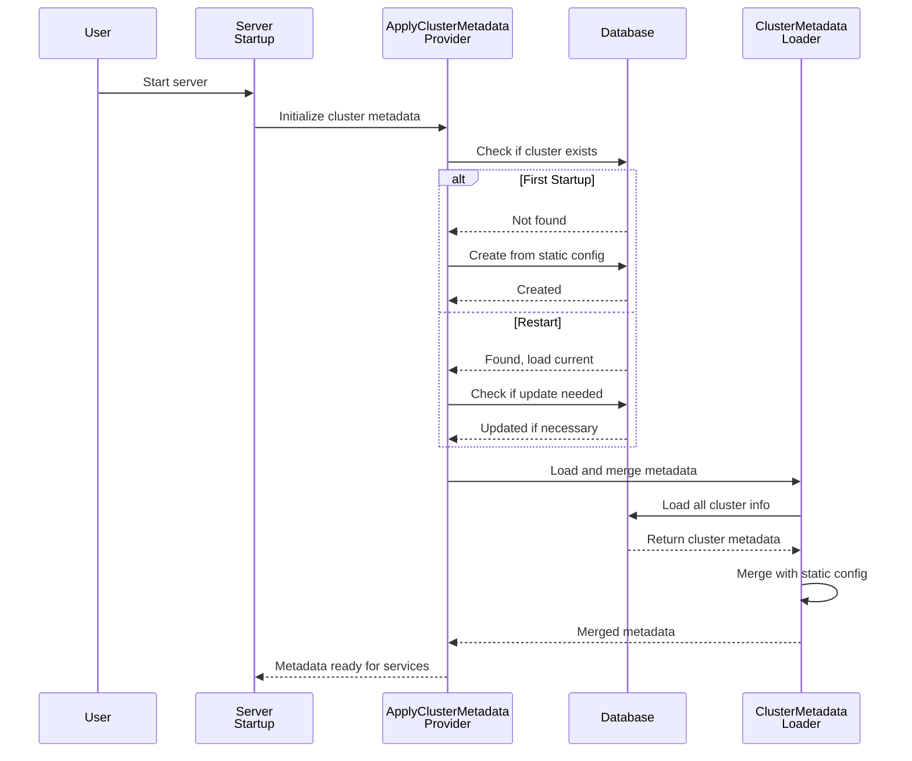
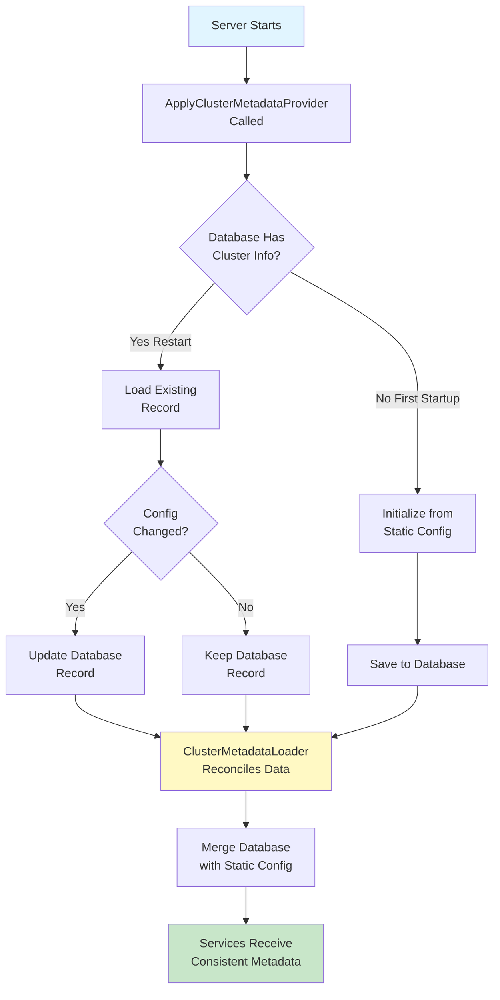

# Chapter 5: Cluster Metadata Management

Now that you understand [how services are created and configured with the Service Provider Architecture](04_service_provider_architecture_.md), it's time to learn about something that coordinates all those services: **Cluster Metadata Management**.

## What Problem Does This Solve?

Imagine you're managing a multi-location business with headquarters in New York and branches in London and Tokyo. Each location has information that needs to be consistent:

- **In your headquarters:** A binder with all location details (addresses, phone numbers, manager names)
- **On each building's door:** A plaque with "Branch Manager: Jane Smith, 123 Main St"
- **In the main database:** Updated records showing that the manager changed to "John Jones" and the building moved to "456 Oak Ave"

Now you have a problem! The binder says the old info, but the database says the new info. Which is true? And which location should other branches contact?

**Without a system**, people get confused, send mail to the wrong address, and things break. 

**With Cluster Metadata Management**, there's a clear rule: "The database is the source of truth, but we merge it with the static configuration files to create a complete picture." When you start the server, it:

1. Loads cluster information from the database (the authoritative record)
2. Loads cluster information from static configuration files (what was specified in setup)
3. Reconciles any differences
4. Makes sure all services get consistent information

This is exactly what happens in Temporal. A Temporal cluster needs to know:
- How many shards (data partitions) exist
- What other clusters it can talk to (for failover)
- Where each service is located (hostnames and ports)
- Version numbers for coordinating updates

Some of this info is in configuration files. Some is in the database. Cluster Metadata Management ensures they're always in sync.

### The Real-World Use Case

Let's say you're starting a Temporal cluster for your company. You have:

**Static Configuration File** (`config.yaml`):
```
clusterMetadata:
  currentClusterName: "production"
  clusterInformation:
    production:
      rpcAddress: "temporal-server.example.com:7233"
      numShards: 4
```

**Database** (created on first startup):
- Same cluster info, but now it's been running for months
- Someone changed the RPC address to a new hostname
- Someone increased shards to 8

When you restart the server, which value wins? Without Cluster Metadata Management, you'd have to manually reconcile them. With it, the system automatically:
1. Loads the new values from the database (the source of truth)
2. Applies any static config overrides where appropriate
3. Ensures all services see consistent information

Perfect!

## Key Concept 1: Two Sources of Truth - Static vs. Persistent

Cluster metadata comes from two places:

**Static Configuration** (from files):
- What you specified when first setting up the cluster
- Doesn't change unless you edit the file and restart
- Human-readable and version-controllable

**Persistent Metadata** (from database):
- Initialized from static config, but can be updated
- Survives server restarts
- Updated dynamically without restarting

```go
// Static config (from file)
staticClusterInfo := config.ClusterInformation[clusterName]

// Persistent metadata (from database)
dbClusterInfo := GetFromDatabase(clusterName)
```

Think of static config as your "original plan" and persistent metadata as "what's actually running right now."

**The key rule**: Once the cluster is initialized, the database is the source of truth!

## Key Concept 2: Reconciliation - Merging Two Sources

Reconciliation is like being a referee in a disagreement. It answers: "When static config and database disagree, what should we do?"

The answer depends on whether this is the **first startup** or a **restart**:

```go
// First startup: Database is empty
if database.IsEmpty() {
    // Create database record from static config
    InitializeFromStaticConfig()
} else {
    // Restart: Database exists
    // Use database as source of truth
    MergeWithDatabase()
}
```

When restarting with existing database:
- RPC addresses can come from static config (for failover scenarios)
- Shard counts come from database (not changed after initialization)
- Global namespace settings come from database (authoritative)

It's like a referee saying: "For the address, use what's in the config file (static). For the shard count, use what's in the database (immutable)."

## Key Concept 3: The ClusterMetadataLoader - The Reconciler

The `ClusterMetadataLoader` is the component that does the actual reconciliation work:

```go
loader := NewClusterMetadataLoader(
    clusterMetadataManager,  // Access to database
    logger,                   // For logging
)

// Merge database metadata with static config
err := loader.LoadAndMergeWithStaticConfig(
    context.Background(),
    svc,  // Config object to update
)
```

**What does it do?**
1. Loads all cluster info from the database
2. For each cluster, compares with static config
3. Applies merge rules to reconcile differences
4. Updates the config object with the final result

It's like a manager reviewing both the binder and the database, then creating the "official truth."

## How to Use It: A Practical Example

When the server starts, here's what happens automatically:

### Step 1: System Initializes Metadata (If Needed)

On first startup, the system creates database records from static config:

```go
// Only happens if database is empty
err := initCurrentClusterMetadataRecord(
    ctx,
    clusterMetadataManager,
    svc,  // Static config
    logger,
)
// Now database has the cluster info
```

**What's happening?** The system says: "Let me write the cluster info from the config file to the database so it persists."

### Step 2: Update Database If Configuration Changed

On restart, if someone changed the static config, apply updates to the database:

```go
// Load current database state
currentRecord := GetFromDatabase()

// Check if we need to update
if configAddress != currentRecord.Address {
    // Update the database record
    UpdateDatabase(newRecord)
}
```

**What's happening?** The system says: "Someone edited the config file. Let me update the database record accordingly."

### Step 3: Load and Merge

Finally, load everything from the database and merge:

```go
loader.LoadAndMergeWithStaticConfig(
    context.Background(),
    svc,
)
// Now svc has the final reconciled metadata
```

**What's happening?** The system says: "Let me get the truth from the database and any necessary info from static config, then give services the complete picture."

## Internal Implementation: How It Works

Let's trace through what happens when you start a Temporal server with Cluster Metadata Management:



**What's happening step-by-step:**
1. Server starts and asks: "Set up cluster metadata!"
2. Provider checks: "Does database have this cluster?"
3. If no (first startup): Create database record from static config
4. If yes (restart): Check if static config changed, update if needed
5. Loader reads database
6. Loader merges with static config using reconciliation rules
7. Result: Services get consistent, reconciled metadata

## Deep Dive: Understanding the Code

Let's look at the `ApplyClusterMetadataConfigProvider` function. This is called early in server startup:

```go
func ApplyClusterMetadataConfigProvider(
    logger log.Logger,
    svc *config.Config,
    clusterMetadataManager persistence.ClusterMetadataManager,
    // ... more params
) (*cluster.Config, config.Persistence, error) {
    // Check if cluster exists in database
    resp, err := clusterMetadataManager.GetClusterMetadata(
        ctx,
        &persistence.GetClusterMetadataRequest{
            ClusterName: clusterName,
        },
    )
    // ... handle error or create
}
```

**What's happening?**
1. Try to get cluster info from database
2. If it exists (no error), update it if needed
3. If it doesn't exist (NotFound error), create it
4. Return the final metadata

This function is like a checkpoint: "Before any service starts, ensure cluster metadata is correct."

### Reconciliation Rules

Here's how the system decides when to update database records:

```go
func updateCurrentClusterMetadataRecord(
    ctx context.Context,
    clusterMetadataManager persistence.ClusterMetadataManager,
    svc *config.Config,
    currentRecord *persistence.GetClusterMetadataResponse,
) error {
    updateNeeded := false
    
    // Check RPC address
    if currentRecord.ClusterAddress != 
       svc.ClusterInformation[name].RPCAddress {
        currentRecord.ClusterAddress = 
            svc.ClusterInformation[name].RPCAddress
        updateNeeded = true
    }
    
    if updateNeeded {
        // Save to database
        clusterMetadataManager.SaveClusterMetadata(ctx, ...)
    }
    return nil
}
```

**What's happening?**
1. Compare database address with config file address
2. If different, update database to match config
3. Save the update

It's a simple rule: "If the config file says something different, update the database to match."

### The ClusterMetadataLoader

Once everything is initialized and updated, the loader merges all info:

```go
func (c *ClusterMetadataLoader) LoadAndMergeWithStaticConfig(
    ctx context.Context,
    svc *config.Config,
) error {
    // Load all clusters from database
    iter := cluster.GetAllClustersIter(ctx, c.manager)
    
    for iter.HasNext() {
        item, err := iter.Next()
        dbMetadata := cluster.ClusterInformationFromDB(item)
        
        // Merge with static config
        c.mergeMetadataFromDBWithStaticConfig(
            svc,
            item.ClusterName,
            dbMetadata,
        )
    }
    return nil
}
```

**What's happening?**
1. Loop through all clusters in database
2. For each cluster, convert database record to metadata
3. Merge with what's in static config
4. Update the config object

The merge function handles special cases:

```go
func (c *ClusterMetadataLoader) mergeMetadataFromDBWithStaticConfig(
    svc *config.Config,
    clusterName string,
    dbMetadata *cluster.ClusterInformation,
) {
    // Special handling for current cluster
    if clusterName == svc.ClusterMetadata.CurrentClusterName {
        // Keep RPC address from static config
        dbMetadata.RPCAddress = 
            svc.ClusterInformation[clusterName].RPCAddress
    }
    
    // Update config with final metadata
    svc.ClusterMetadata.ClusterInformation[clusterName] = 
        *dbMetadata
}
```

**What's happening?**
1. If this is the current (local) cluster, use RPC address from static config
2. For other (remote) clusters, use everything from database
3. Replace the config's cluster info with the merged result

## Real Code Example: First Startup vs. Restart

Let's see how the system handles different scenarios:

### Scenario 1: First Startup (Empty Database)

Static config has:
```
rpcAddress: "localhost:7233"
numShards: 4
```

What happens:
```go
// Database is empty, so create record
err := initCurrentClusterMetadataRecord(ctx, ...)
// Database now has: rpcAddress, numShards = 4
```

Result: Config and database match!

### Scenario 2: Restart (Database Exists, Config Unchanged)

Database has:
```
rpcAddress: "localhost:7233"
numShards: 4
```

Static config still has:
```
rpcAddress: "localhost:7233"
numShards: 4
```

What happens:
```go
// Check if update needed
if dbAddress != configAddress {
    // No difference, skip update
}

// Load and merge
loader.LoadAndMergeWithStaticConfig(ctx, svc)
// Result: Everything matches, services get consistent data
```

Result: No changes needed!

### Scenario 3: Restart (Database Exists, Config Changed)

Database has:
```
rpcAddress: "localhost:7233"
numShards: 4
```

Someone edited static config to:
```
rpcAddress: "new-host:7233"
numShards: 4
```

What happens:
```go
// Check if update needed
if dbAddress != configAddress {
    // They're different! Update database
    dbRecord.ClusterAddress = "new-host:7233"
    clusterMetadataManager.SaveClusterMetadata(ctx, dbRecord)
}

// Load and merge
loader.LoadAndMergeWithStaticConfig(ctx, svc)
// Result: Services get new RPC address
```

Result: Database updated to match config!

## A Visual Summary: The Complete Flow

Here's the entire Cluster Metadata Management process:



## Why This Pattern Matters

1. **Consistency**: All services see the same cluster information
2. **Persistence**: Changes survive server restarts
3. **Authority**: Database is the source of truth, eliminating conflicts
4. **Flexibility**: Static config can be updated without database corruption
5. **Safety**: Changes are validated before persisting

## Summary & What's Next

You've learned about **Cluster Metadata Management**—how Temporal ensures cluster information stays consistent between configuration files and the database. Key takeaways:

- **Two sources**: Static config files and persistent database
- **Clear hierarchy**: Database is the source of truth once initialized
- **Reconciliation rules**: Clear logic for when to update and what to keep
- **The ClusterMetadataLoader**: Merges both sources into a single consistent view
- **Automatic process**: Happens transparently during server startup

This brings together everything from previous chapters: [Server Configuration](01_server_configuration_options_pattern_.md) (static config), [Dependency Injection](02_dependency_injection_via_fx_framework_.md) (how components are created), [Server Initialization](03_server_initialization___lifecycle_management_.md) (when metadata is set up), and [Service Provider Architecture](04_service_provider_architecture_.md) (who receives the metadata).

Now that you understand how cluster-wide metadata is managed, the next step is learning how the database itself is set up and managed.

**[Next: Database Schema Management Tools](06_database_schema_management_tools_.md)**

---

Generated by [AI Codebase Knowledge Builder](https://github.com/The-Pocket/Tutorial-Codebase-Knowledge)