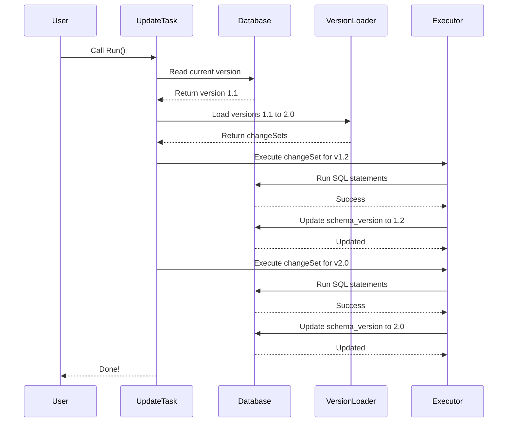
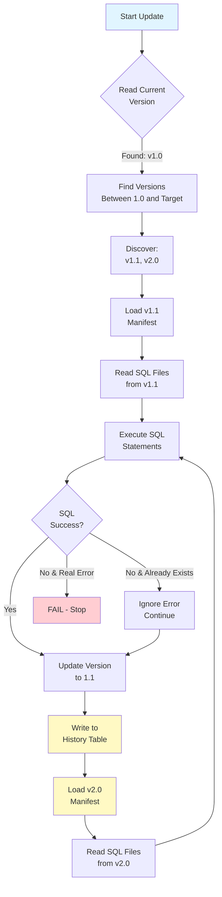

# Chapter 6: Database Schema Management Tools

Now that you understand [how Temporal manages cluster-wide metadata](05_cluster_metadata_management_.md), it's time to learn about an equally important aspect: **Database Schema Management Tools**.

## What Problem Does This Solve?

Imagine you're running a restaurant that's been open for 5 years. When you first opened, you had a simple order tracking system:

```
Orders table:
- order_id
- customer_name
- total_price
```

But now you need to expand! You want to add:
- A `status` column (to track if order is pending, completed, etc.)
- A `creation_time` column (to know when the order was placed)

So you carefully modify the database table to add these columns. Everything works great!

But now you have a problem: if you hire a new employee and they need to set up the system from scratch, they'll get the *original* simple table without these new columns. Your new employee's system will be broken!

**What you need:** A system that:
1. **Tracks all changes** made to the database schema over time
2. **Records versions** (v1.0, v1.1, v2.0, etc.)
3. **Can apply changes in order** when setting up a new database
4. **Survives restarts** if something goes wrong halfway through

**Database Schema Management Tools** does exactly this! It:
- Keeps a manifest (checklist) of all schema changes
- Tracks which version the database is currently at
- Can update to the next version automatically
- Can set up a fresh database with all versions applied
- Keeps history for rollback capability

### The Real-World Use Case

When you start a Temporal cluster, it needs multiple databases with specific structures. For example:
- The History service needs a table to store workflow history
- The Matching service needs a table to store available workers
- The Visibility service needs a table for workflow searches

Some of these databases might have been set up years ago. Others might be newly created. The Database Schema Management Tools ensure that:
1. **New databases** get all schema changes from the beginning
2. **Existing databases** are updated incrementally to the latest version
3. **All databases** end up in the same state, regardless of when they were created

This prevents the restaurant employee problem: confusion about what the database looks like.

## Key Concept 1: Setup vs. Update - Two Different Operations

There are two main operations you need to understand:

**Setup Operation:**
"I'm creating a brand new database from scratch. Give me all the schema changes from the beginning!"

```go
// Example: Setting up a fresh Temporal database
err := Setup(cli, db, logger)
// Result: New database with current schema applied
```

**Update Operation:**
"My database exists and is at version 1.0. Update it to version 2.0 (or the latest)!"

```go
// Example: Updating existing Temporal database
err := Update(cli, db, logger)
// Result: Database updated to newer version
```

Think of it like cooking:
- **Setup**: Making a brand new dish from scratch
- **Update**: Taking your current dish and adding the new ingredients you just learned about

## Key Concept 2: Versioning - Knowing Where You Are

The database tracks its current version like a book tracks its edition:

```
Database schema versions:
- v1.0: Initial schema (tables created)
- v1.1: Added status column
- v1.2: Added created_time column
- v2.0: Redesigned the table structure
```

When you query the database, it tells you: "I'm currently at version 1.1." Then the update system says: "Great! I need to apply v1.2 and v2.0 to get you to the latest."

The database stores this in a special table:

```
schema_version table:
- current_version: "1.2"
- min_compatible_version: "1.0"
- creation_time: 2024-01-15
```

## Key Concept 3: Manifest Files - The Change Descriptions

Each schema version has a manifest file (a JSON file that describes what changes to make):

```json
{
  "CurrVersion": "1.2",
  "MinCompatibleVersion": "1.0",
  "Description": "Add created_time and updated_time columns",
  "SchemaUpdateCqlFiles": [
    "cassandra_update_1.sql",
    "cassandra_update_2.sql"
  ]
}
```

**What's this saying?**
- This version is 1.2
- The oldest compatible version is 1.0 (older versions can't talk to this)
- Here's a description of what changed
- These are the SQL files that have the actual schema change statements

It's like a recipe card: "Here's what to do, and here are the ingredients."

## Key Concept 4: Idempotency - Handling Retries Safely

Imagine you're applying schema changes and your server crashes halfway through. When you restart:
- Some changes were applied ✓
- Some changes weren't applied yet ✗

You restart the update. The system must not fail because it tries to apply already-applied changes!

**Idempotency** means: "It's safe to run the same operation multiple times; the result is the same whether you run it once or 100 times."

The system handles this by gracefully ignoring errors like:
- "This table already exists" ← Ignore it, we already created it
- "This column already exists" ← Ignore it, we already added it

```go
// From the code:
alreadyExists := strings.Contains(err.Error(), "already exist")
if alreadyExists {
    task.logger.Warn("Already applied, skipping...")
    continue  // Move to next statement
}
```

It's like saying: "If the restaurant already hired the new chef, don't hire them again!"

## How to Use It: A Practical Example

### Scenario 1: Setting Up a New Database

You have a new database and want to set it up with all current schema:

```go
// Create a setup configuration
config := &SetupConfig{
    SchemaName: "temporal",      // Use built-in schema
    InitialVersion: "1.2",       // Start from version 1.2
    DisableVersioning: false,    // Track versions
}

// Run the setup
task := NewSetupSchemaTask(db, config, logger)
err := task.Run()
```

**What happens?**
1. System creates version tracking tables
2. System reads all schema files up to version 1.2
3. System applies them to the database
4. System records that database is now at version 1.2

Result: Brand new database with full schema!

### Scenario 2: Updating an Existing Database

Your database is at version 1.1, but you need version 2.0:

```go
// Create an update configuration
config := &UpdateConfig{
    SchemaName: "temporal",      // Use built-in schema
    TargetVersion: "2.0",        // Update to version 2.0
}

// Run the update
task := NewUpdateSchemaTask(db, config, logger)
err := task.Run()
```

**What happens?**
1. System reads current database version (1.1)
2. System finds all versions between 1.1 and 2.0 (just v2.0)
3. System applies v2.0 changes
4. System records version history
5. System updates current version to 2.0

Result: Database updated to version 2.0!

## Internal Implementation: How It Works

Let's trace through what happens when you update a database:



**What's happening:**
1. System reads: "What version are we at?"
2. System finds: "All changes between now and target"
3. For each change:
   - Execute the SQL statements
   - Handle any "already exists" errors gracefully
   - Update the version tracker
   - Record this in history
4. Done!

## Deep Dive: Understanding the Code

Let's look at how the system finds which versions to apply:

```go
verDirs, err := readSchemaDir(fsys, dir, currVer, 
                               config.TargetVersion, logger)
// This returns a list of version directories
// Example result: ["v1.2", "v2.0"]
```

**What's happening?**
- Read all version directories from the schema folder
- Filter: Only versions greater than current (1.1) and up to target (2.0)
- Sort them in order
- Return as a list

It's like looking at your cookbook and saying: "Give me all recipes between 'chicken' and 'pasta dishes'."

Now for each version, the system reads its manifest:

```go
m, err := readManifest(fsys, dirPath)
// Result: A manifest struct with:
// - CurrVersion: "1.2"
// - MinCompatibleVersion: "1.0"
// - SchemaUpdateCqlFiles: ["update_1.sql", "update_2.sql"]
```

**What's happening?**
- Read the manifest.json file from that version directory
- Parse the JSON
- Validate that everything makes sense

Then, the system reads the SQL files mentioned in the manifest:

```go
stmts, err := task.parseSQLStmts(fsys, dirPath, m)
// Result: A list of SQL statements
// Example: ["ALTER TABLE add column x",
//          "CREATE INDEX on column x"]
```

**What's happening?**
- For each SQL file listed in the manifest
- Read the file contents
- Split into individual SQL statements (by semicolon)
- Return as a list of statements

Now comes the actual execution:

```go
err := task.execStmts(cs.version, cs.cqlStmts)
// Execute each statement one by one
// For each statement:
// - Try to execute it
// - If "already exists" error, ignore it
// - If other error, fail
// - If success, continue
```

**What's happening?**
- Loop through each SQL statement
- Try to execute it
- Check for idempotency errors (already exists, not found) and ignore them
- Continue with the next statement
- If a real error happens, stop and report it

Finally, after all statements succeed, update the version:

```go
err := task.db.UpdateSchemaVersion(newVersion, minCompatibleVersion)
err := task.db.WriteSchemaUpdateLog(oldVer, newVer, manifestMD5, desc)
// Updates the schema_version table
// Writes to schema_update_history table
```

**What's happening?**
- Record: "We're now at version X.Y"
- Write to history: "Updated from 1.1 to 1.2 at [timestamp]"

It's like checking off a box on your progress tracker!

## Real Code Example: The Complete Update Flow

Let's trace through a complete example. Suppose you have:
- Database at version 1.0
- Want to update to version 2.0
- v1.1 and v2.0 need to be applied

**Step 1: Read current version**

```go
currVer, err := task.db.ReadSchemaVersion()
// Result: "1.0"
```

**Step 2: Build change sets**

```go
updates, err := task.buildChangeSet(currVer)
// Reads all version directories
// Filters: only 1.0 < version <= 2.0
// Result: [changeSet{version: "1.1", ...}, 
//          changeSet{version: "2.0", ...}]
```

**Step 3: Execute updates**

```go
for _, cs := range updates {
    // Execute v1.1 changes
    err := task.execStmts(cs.version, cs.cqlStmts)
    // Update version to 1.1
    err := task.updateSchemaVersion("1.0", &cs)
    
    // Execute v2.0 changes
    err := task.execStmts(cs.version, cs.cqlStmts)
    // Update version to 2.0
    err := task.updateSchemaVersion("1.1", &cs)
}
```

**Result:** Database is now at version 2.0!

## Multi-Backend Support: One Pattern, Many Databases

Temporal supports multiple databases (Cassandra, MySQL, PostgreSQL, SQLite). The system uses the same pattern for each:

```go
// Each database has its own implementation
type DB interface {
    Exec(stmt string) error                    // Run SQL
    ReadSchemaVersion() (string, error)        // Get current version
    UpdateSchemaVersion(ver string) error      // Update version
    ListTables() ([]string, error)             // List tables
}
```

Each database (Cassandra, MySQL, etc.) provides its own implementation. The schema management tools work the same way regardless of which database you use!

It's like: "The recipe is the same, but the kitchen equipment is different. Cassandra has different tools than MySQL, but the same recipe works."

## Why This Pattern Is Powerful

1. **Safe Updates**: Idempotency ensures you can retry without corruption
2. **Trackable**: History shows exactly what changed and when
3. **Testable**: You can set up fresh databases for testing
4. **Multi-Backend**: Same pattern works for Cassandra, MySQL, PostgreSQL, SQLite
5. **Version Control**: You can always tell what database version you're at
6. **Reversible**: History tracking enables rollback planning

## A Visual Summary: The Complete Schema Management Flow



## A Common Scenario: First-Time Temporal Setup

When you set up Temporal for the first time:

```go
// User: "Set up Temporal with current schema"
err := Setup(cli, db, logger)

// Behind the scenes:
// 1. Detect database is empty
// 2. Create version tracking tables
// 3. Apply all schema changes from v1.0 to current
// 4. Record as version 1.0
// 5. Write to history: "Created at version 1.0"
```

Result: Temporal is ready to use!

Then a few months later:

```go
// Temporal developers released v2.0
// User: "Update my Temporal deployment"
err := Update(cli, db, logger)

// Behind the scenes:
// 1. Read current version: "1.0"
// 2. Find versions between 1.0 and latest (v2.0)
// 3. Apply v2.0 schema changes
// 4. Update version to 2.0
// 5. Write to history: "Updated from 1.0 to 2.0"
```

Result: Temporal is updated to the latest!

## Summary & What's Next

You've learned about **Database Schema Management Tools**—a robust system for setting up, updating, and versioning database schemas. Key takeaways:

- **Two operations**: Setup (create from scratch) and Update (migrate existing)
- **Versioning system**: Track what version the database is currently at
- **Manifest files**: Describe what changes each version makes
- **Idempotency**: Safely handle retries without corruption
- **History tracking**: Record all schema changes for auditing and rollback
- **Multi-backend**: Same pattern works for different databases

This brings together everything from previous chapters: [Server Configuration](01_server_configuration_options_pattern_.md) (options for configuring schema), [Dependency Injection](02_dependency_injection_via_fx_framework_.md) (how tools are created), [Server Initialization](03_server_initialization___lifecycle_management_.md) (when schema setup happens), [Service Provider Architecture](04_service_provider_architecture_.md) (which services need which schemas), and [Cluster Metadata Management](05_cluster_metadata_management_.md) (metadata about databases).

Now that you understand how the database itself is set up and managed, the next step is learning how Temporal organizes work into different categories and executes them.

**[Next: Task Category Registry & Execution](07_task_category_registry___execution_.md)**

---

Generated by [AI Codebase Knowledge Builder](https://github.com/The-Pocket/Tutorial-Codebase-Knowledge)