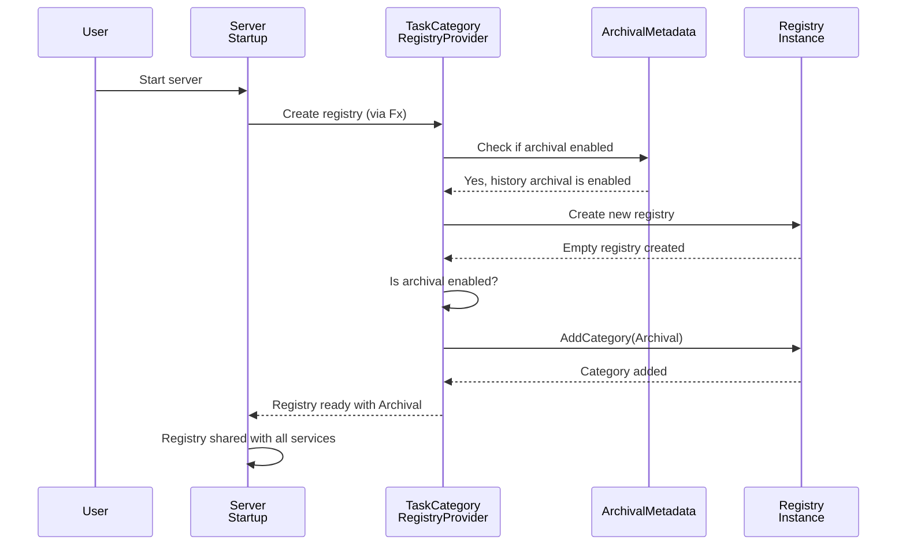
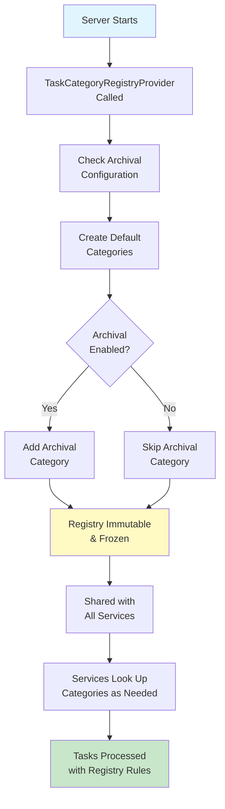

# Chapter 7: Task Category Registry & Execution

Now that you understand [how databases are set up and managed with schema management tools](06_database_schema_management_tools_.md), it's time to learn about something equally important: **Task Category Registry & Execution**.

## What Problem Does This Solve?

Imagine you own a delivery company with multiple types of deliveries:
- **Express deliveries**: Small packages, fast routing, need urgent handling
- **Bulk deliveries**: Large orders, special packaging, need warehouse coordination
- **Scheduled deliveries**: Pre-planned, can be batched, flexible timing
- **Fragile deliveries**: Breakables, special handling, need careful drivers

When a new delivery arrives, you need to:
1. **Identify what type it is**: "Is this fragile? Express? Bulk?"
2. **Route it correctly**: "Express deliveries go to the fast team, bulk deliveries to the warehouse"
3. **Process it appropriately**: "Fragile items get wrapped carefully; express items get expedited tracking"

If you didn't have a system for this:
- You might send fragile items with the wrong team (broken packages!)
- You might route express items slowly (angry customers!)
- You might not know what processing rules apply (chaos!)

**Task Category Registry & Execution** solves this exact problem for Temporal's internal work system. Temporal has many types of internal tasks (work items) it needs to process:
- **Transfer Tasks**: Moving data between shards
- **Timer Tasks**: Scheduled work that needs to happen later
- **Visibility Tasks**: Indexing workflow information for searching
- **Replication Tasks**: Syncing data across clusters
- **Archival Tasks**: Moving old data to long-term storage

Each task type needs:
- Its own executor (the team that handles it)
- Its own processing rules (the special handling)
- Its own queue (the priority system)

Without a registry, the code would be messy:
```go
// Bad: Without a registry - messy case statements everywhere!
if taskType == "transfer" {
    // Handle transfer logic
} else if taskType == "timer" {
    // Handle timer logic
} else if taskType == "visibility" {
    // Handle visibility logic
}
// ... repeated everywhere in the codebase!
```

With a Task Category Registry:
```go
// Good: Clean and organized!
category := registry.GetCategoryByID(taskID)
executor := category.GetExecutor()
executor.Execute(task)
```

Much cleaner!

## Key Concept 1: What Is a Task Category?

A **task category** is a container that holds all the information about one type of internal task. Think of it like a job description card:

```go
type TaskCategory struct {
    ID          TaskCategoryID    // "What type am I?" (e.g., "archival")
    Name        string            // Human-readable name
    Properties  CategoryProperties // Special rules for me
}
```

**What does the category tell us?**
- **ID**: Unique identifier (like "0001" for archival tasks)
- **Name**: Human-readable name ("Archival Task Category")
- **Properties**: Special information like:
  - "How many workers do I need?"
  - "What's my priority level?"
  - "What validation rules apply to me?"

## Key Concept 2: The Registry - The Master List

A **Task Category Registry** is like a master filing system that holds all task categories. When you need information about a task type, you ask the registry:

```go
// Ask the registry: "Tell me about archival tasks"
category, exists := registry.GetCategoryByID(
    tasks.CategoryIDArchival,
)
if exists {
    // Found it! Now we know how to handle archival tasks
}
```

The registry is created once when the server starts and is shared by all services. It's like a company handbook: everyone reads from the same copy.

## Key Concept 3: Immutability - Once Set, Never Changed

Here's something important: **the registry is immutable**. Once created, it never changes during the server's lifetime!

**Why?** Because if the registry changed while tasks were being processed, you'd have chaos:
- Task A says: "Use rule v1.0 for archival tasks"
- Registry updates: "Now use rule v2.0!"
- Task B says: "Use rule v2.0 for archival tasks"
- Result: Inconsistency! Bugs!

By keeping it immutable, you guarantee:
- All tasks processed use the same rules
- No surprise behavior changes
- Predictable execution

## Key Concept 4: Conditional Categories - Only Include What You Need

Not all tasks are always active. For example:
- **Archival tasks** are only created if archival is enabled
- If archival is disabled, including the archival category wastes resources

So the registry is smart: it only includes categories that are actually needed!

```go
// Check if archival is enabled
if archivalConfig.IsEnabled() {
    registry.AddCategory(tasks.CategoryArchival)
}
```

This is like a restaurant:
- If you don't serve fish, don't staff a sushi station!
- Save resources for what you actually use

## How to Use It: A Practical Example

Let's say you're implementing a task executor. Here's how you'd use the registry:

### Step 1: Get the Registry Injected

The registry is created at server startup and injected where needed:

```go
type TaskExecutor struct {
    registry tasks.TaskCategoryRegistry  // Injected!
    logger   log.Logger
}
```

**What's happening?** The server creates the registry, and your component receives it automatically (via [Dependency Injection](02_dependency_injection_via_fx_framework_.md)).

### Step 2: Look Up Task Information

When you receive a task, look it up in the registry:

```go
func (e *TaskExecutor) Execute(task Task) error {
    // "What type of task is this?"
    category, exists := e.registry.GetCategoryByID(task.CategoryID)
    
    if !exists {
        e.logger.Warn("Unknown task category", 
                      tag.Value(task.CategoryID))
        return errors.New("unknown category")
    }
    
    return nil
}
```

**What's happening?**
1. Extract the category ID from the task
2. Look it up in the registry
3. If it doesn't exist, log a warning and error out
4. If it exists, you can use it

### Step 3: Use the Category Information

Now that you have the category, use it:

```go
// Get the properties
props := category.Properties

// Use them to decide how to process
priority := props.Priority          // How urgent?
timeout := props.DefaultTimeout     // How long?
maxRetries := props.MaxRetries      // How many attempts?

// Process the task according to its category
result := processWithPriority(task, priority, timeout)
```

**What's happening?** The category tells you the rules for this task type, so you can apply them.

## Internal Implementation: How It Works

Let's trace through what happens when the server starts and creates the task category registry:



**What's happening step-by-step:**
1. Server starts and asks for a registry
2. Provider checks archival configuration
3. Provider creates a fresh registry
4. If archival is enabled, add the archival category
5. Registry is now ready and frozen (immutable)
6. All services receive the same registry

## Deep Dive: Understanding the Code

Let's look at how the registry is actually created. Here's the provider function:

```go
func TaskCategoryRegistryProvider(
    archivalMetadata archiver.ArchivalMetadata,
) tasks.TaskCategoryRegistry {
    registry := tasks.NewDefaultTaskCategoryRegistry()
    
    // Check if either history or visibility archival is enabled
    if archivalMetadata.GetHistoryConfig().StaticClusterState() == 
       archiver.ArchivalEnabled ||
       archivalMetadata.GetVisibilityConfig().StaticClusterState() == 
       archiver.ArchivalEnabled {
        // Add the archival category
        registry.AddCategory(tasks.CategoryArchival)
    }
    
    return registry
}
```

**Breaking this down:**

1. **Create default registry**:
```go
registry := tasks.NewDefaultTaskCategoryRegistry()
```
This creates a registry with all the standard categories (Transfer, Timer, Visibility, Replication). These always exist.

2. **Check archival status**:
```go
archivalMetadata.GetHistoryConfig().StaticClusterState()
```
This asks: "Is history archival enabled?" (comes from configuration)

3. **Add archival category if needed**:
```go
registry.AddCategory(tasks.CategoryArchival)
```
Only if archival is enabled, add the archival category.

4. **Return the registry**:
```go
return registry
```
The registry is immutable after this - no more changes!

## Real Code Example: Task Processing Flow

Let's see a complete example of how tasks are processed using the registry. Imagine the History Service processes a task:

### Step 1: Registry Is Created at Startup

During [Server Initialization](03_server_initialization___lifecycle_management_.md):

```go
// From fx.go - called during startup
registry := TaskCategoryRegistryProvider(archivalMetadata)
// registry now has default categories + archival (if enabled)
```

### Step 2: Service Receives the Registry

The History Service gets the registry injected:

```go
type HistoryService struct {
    registry tasks.TaskCategoryRegistry  // Injected from Fx!
}
```

### Step 3: Task Arrives for Processing

A task arrives and needs to be processed:

```go
func (s *HistoryService) ProcessTask(task *Task) error {
    // Look up the task's category
    category, found := s.registry.GetCategoryByID(task.CategoryID)
    if !found {
        return errors.New("unknown task type")
    }
    
    return nil  // Task is valid!
}
```

**What happens?**
1. Extract category ID from task (e.g., "archival")
2. Look it up in the registry
3. If found, the task is valid and can be processed
4. If not found, reject the task immediately

This is like a bouncer at a nightclub:
- "What type of patron are you?"
- "Let me check my list..."
- "You're on the list, come in!"
- (or "You're not on the list, go away!")

## Why This Pattern Matters

1. **Single Source of Truth**: All services use the same registry, so everyone agrees on task types
2. **Centralized Configuration**: Task rules are defined in one place (the category)
3. **Validation**: Invalid tasks are rejected immediately instead of causing silent bugs
4. **Efficient**: Archival category only exists if needed (no wasted resources)
5. **Immutable**: Guarantees consistency - no surprise rule changes during processing

## A Visual Summary: Registry Lifecycle

Here's the complete picture:



## Connection to Previous Concepts

Remember from previous chapters:

- **[Chapter 1](01_server_configuration_options_pattern_.md)**: Configuration options determine if archival is enabled
- **[Chapter 2](02_dependency_injection_via_fx_framework_.md)**: The registry is created via Fx and injected where needed
- **[Chapter 3](03_server_initialization___lifecycle_management_.md)**: The registry is created during server initialization
- **[Chapter 4](04_service_provider_architecture_.md)**: Each service receives the registry when it's created
- **[Chapter 5](05_cluster_metadata_management_.md)**: Cluster metadata might affect what categories are available

Everything connects!

## Real-World Scenario: Handling a New Task Type

Imagine Temporal adds a new task type called "Callback Tasks" for future versions. Here's how it would work with the registry:

### Current State (Without New Type)

```go
// taskRegistry has: Transfer, Timer, Visibility, Replication, Archival
category, found := registry.GetCategoryByID(
    tasks.CategoryIDCallback,
)
// found = false (Callback doesn't exist yet)
```

### Future State (With New Type)

```go
// taskRegistry now has: Transfer, Timer, Visibility, Replication, 
// Archival, Callback (new!)

category, found := registry.GetCategoryByID(
    tasks.CategoryIDCallback,
)
// found = true (Callback now exists!)
properties := category.Properties
// Use properties to process callback tasks
```

The beauty? The rest of the code doesn't change! The pattern stays the same:
1. Look up category
2. Get properties
3. Process accordingly

## Summary & What's Next

You've learned about **Task Category Registry & Execution**—the system that manages and routes different types of internal tasks in Temporal. Key takeaways:

- **Task Categories** group tasks by type and define how they should be processed
- **The Registry** maintains all categories in a centralized, immutable structure
- **Conditional Categories**: Only include categories that are needed (e.g., archival if enabled)
- **Single Source of Truth**: All services use the same registry, ensuring consistency
- **Clean Routing**: Instead of messy if-else statements, use the registry to route tasks appropriately
- **Dependency Injection**: The registry is created at startup and injected where needed

This brings together everything from previous chapters: configuration determines what's enabled, Fx creates the registry, the server initializes it at startup, and services receive it when they're created.

Now that you understand how internal tasks are categorized and routed, the next step is learning how external communication works through RPC client code generation.

**[Next: RPC Client Code Generation](08_rpc_client_code_generation_.md)**

---

Generated by [AI Codebase Knowledge Builder](https://github.com/The-Pocket/Tutorial-Codebase-Knowledge)