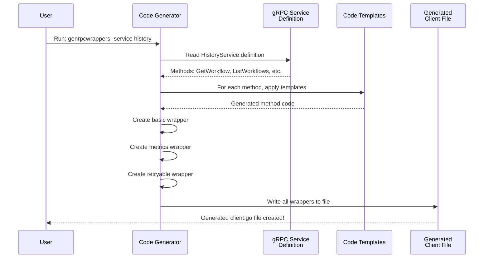
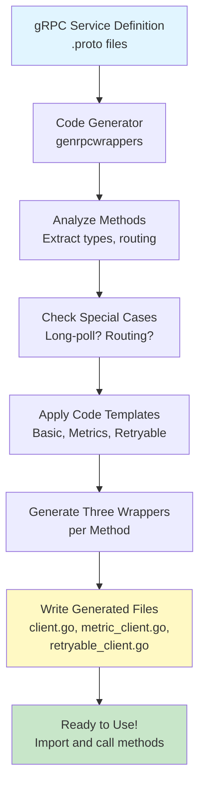

# Chapter 8: RPC Client Code Generation

Now that you understand [how internal tasks are categorized and routed with the Task Category Registry](07_task_category_registry___execution_.md), it's time to learn about something equally important for external communication: **RPC Client Code Generation**.

## What Problem Does This Solve?

Imagine you're building a restaurant reservation system. You have multiple services:
- **Booking Service**: Handles reservations (other services need to call it)
- **Payment Service**: Processes payments (other services need to call it)
- **Notification Service**: Sends confirmations (other services need to call it)

When the Booking Service wants to call the Payment Service, it needs to:
1. Create a connection to the Payment Service
2. Format the request correctly
3. Handle timeouts (if payment takes too long)
4. Retry if something fails (network glitch)
5. Track metrics (how long did payment take?)
6. Handle errors gracefully
7. Deserialize the response

Without a system for this, you'd write the same code over and over:

```go
// Booking Service calling Payment Service
conn := createConnection()
req := &PaymentRequest{...}
ctx, cancel := context.WithTimeout(ctx, 5*time.Second)
defer cancel()
resp, err := conn.Payment(ctx, req)
if err != nil {
    metrics.RecordError(err)
    return err
}
```

Every single place you call Payment Service, you'd repeat this! And if you need to add retry logic, you'd have to update *everywhere*.

**RPC Client Code Generation** solves this by automatically generating all the boilerplate code. Instead of manually writing client methods, a code generator reads your service definitions (the menu) and creates all the client methods automatically!

Think of it like having a robot chef who reads a recipe format and automatically creates the cooking instructions. Once you tell the robot the format, it can generate instructions for any recipe.

### The Real-World Use Case

In Temporal, different services (History Service, Matching Service, Frontend Service) need to call each other:

```go
// Frontend Service needs to call History Service
historyClient.GetWorkflow(ctx, request)

// History Service needs to call Matching Service
matchingClient.GetTaskQueue(ctx, request)
```

Each method call needs:
- **Routing logic**: "Which History Service instance handles this shard?"
- **Retry policies**: "How many times should we retry this?"
- **Metrics tracking**: "How long did this call take?"
- **Context handling**: "What timeout should I use?"
- **Error handling**: "How should I handle different error types?"

Instead of writing each method manually (which would be 100+ methods across multiple services), the system **generates them all automatically** from the service definitions!

## Key Concept 1: Code Generation - A Template Engine for RPC

**Code generation** means: "Read a definition (like a gRPC service), then write code based on that definition."

It's like filling out a form with different information each time. The form template stays the same, but the values change.

```go
// Template idea:
// "For each method {METHOD_NAME} in service {SERVICE_NAME}:
//  - Create a function called {METHOD_NAME}
//  - Add retry logic {RETRY_POLICY}
//  - Add routing logic {ROUTING_LOGIC}"
```

The code generator reads all gRPC services and generates code following this template.

## Key Concept 2: Multiple Wrappers - Client, Metrics, Retryable

For each service method, the system generates **three different wrapper layers**:

**1. Basic Client Wrapper**
```go
func (c *clientImpl) GetWorkflow(
    ctx context.Context,
    request *GetWorkflowRequest,
) (*GetWorkflowResponse, error) {
    return c.client.GetWorkflow(ctx, request)
}
```
**What it does**: Just calls the remote service, plain and simple.

**2. Metrics Client Wrapper**
```go
func (c *metricClient) GetWorkflow(
    ctx context.Context,
    request *GetWorkflowRequest,
) (*GetWorkflowResponse, error) {
    startTime := time.Now()
    resp, err := c.client.GetWorkflow(ctx, request)
    metrics.RecordLatency(time.Since(startTime))
    return resp, err
}
```
**What it does**: Calls the service and tracks how long it took.

**3. Retryable Client Wrapper**
```go
func (c *retryableClient) GetWorkflow(
    ctx context.Context,
    request *GetWorkflowRequest,
) (*GetWorkflowResponse, error) {
    return backoff.ThrottleRetry(
        func() (*GetWorkflowResponse, error) {
            return c.client.GetWorkflow(ctx, request)
        },
        c.retryPolicy,
    )
}
```
**What it does**: Calls the service, and if it fails, automatically retry up to N times.

Think of these as three security guards at a building entrance:
- **Basic guard**: Just lets people in
- **Metrics guard**: Lets people in and writes down their arrival time
- **Retryable guard**: Let's people in, and if they forget something, lets them back in to try again

## Key Concept 3: Routing - Smart Service Selection

Some methods need **routing logic**: "Which instance of this service should I call?"

For example, the History Service stores data across multiple shards (partitions). When you call `GetWorkflow`, you need to route to the correct shard:

```go
// "Which shard handles this workflow?"
shardID := c.shardIDFromWorkflowID(
    request.GetNamespaceId(),
    request.GetWorkflowId(),
)

// "Route to that shard's History Service"
client := c.getClientForShard(shardID)
```

The code generator detects which methods need routing and automatically generates it!

## Key Concept 4: Retry Policies - Automated Resilience

Different methods have different retry needs:

**Long-poll requests** (waiting for work):
```go
// Poll for tasks might need to wait 1 minute
// Don't retry if it times out normally
retryPolicy := CreatePollPolicy()  // Special timeout
```

**Normal requests**:
```go
// Quick requests can retry aggressively
retryPolicy := CreateNormalPolicy()  // Fast retries
```

The code generator knows which policy to use for each method!

## How to Use It: A Practical Example

### Step 1: Define Your Service (Already Done!)

You already have your service definition as a gRPC `.proto` file:

```protobuf
service HistoryService {
  rpc GetWorkflow(GetWorkflowRequest) 
    returns (GetWorkflowResponse);
}
```

### Step 2: Run the Code Generator

You run the code generation tool:

```bash
go run ./cmd/tools/genrpcwrappers -service history
```

**What happens?**
1. Generator reads the HistoryService definition
2. Finds all methods (GetWorkflow, etc.)
3. Generates three wrappers for each method
4. Writes to `history/client.go`, `history/metric_client.go`, `history/retryable_client.go`

### Step 3: Use the Generated Code

Now you can use the generated clients:

```go
// Use the basic client
response, err := historyClient.GetWorkflow(ctx, request)

// Use the metrics client (tracks latency)
response, err := metricsClient.GetWorkflow(ctx, request)

// Use the retryable client (automatically retries)
response, err := retryableClient.GetWorkflow(ctx, request)
```

**What's happening?** The generated code automatically handles routing, retries, metrics, and timeouts! You just call the method.

## Internal Implementation: How It Works

Let's trace through what happens when the code generator runs:



**What's happening step-by-step:**

1. **Read Service Definition**: The generator reads the gRPC service file to find all methods
2. **For Each Method**: Loop through every method in the service
3. **Analyze Method**: Extract the request type, response type, method name
4. **Check Special Handling**: Is this a long-poll request? Does it need routing?
5. **Apply Templates**: Fill in code templates with the method details
6. **Generate Three Wrappers**: Create basic, metrics, and retryable versions
7. **Write to File**: Save all generated code to output files

## Deep Dive: Understanding the Code

Let's look at how the generator actually works. Here's the main file: `cmd/tools/genrpcwrappers/main.go`

First, the generator defines services to process:

```go
var services = []service{
    {
        name: "history",
        clientType: reflect.TypeOf((*historyservice.HistoryServiceClient)(nil)),
        clientGenerator: generateHistoryClient,
    },
    // ... more services
}
```

**What's happening?**
- Define which services to generate code for
- For each service, specify the Go type that represents it
- Specify a generator function for that service

Then, for each service, the generator loops through methods:

```go
func writeTemplatedMethods(w io.Writer, service service, impl string, tmpl string) {
    sType := service.clientType.Elem()
    for n := 0; n < sType.NumMethod(); n++ {
        writeTemplatedMethod(w, service, impl, sType.Method(n), tmpl)
    }
}
```

**What's happening?**
- Get the service type (e.g., HistoryServiceClient)
- Loop through each method in that type
- For each method, write templated code

For each method, the generator analyzes it:

```go
mt := m.Type  // Get method signature
reqType := mt.In(1)   // 1st param: request type
respType := mt.Out(0) // 1st return: response type

fields := map[string]string{
    "Method": m.Name,
    "RequestType": reqType.String(),
    "ResponseType": respType.String(),
}
```

**What's happening?**
- Extract the method name, request type, response type
- Put them in a dictionary
- These values are used to fill in the code template

Then, the generator checks for special cases:

```go
if longPollContext[key] {
    fields["LongPoll"] = "LongPoll"  // Use long poll context
}

if largeTimeoutContext[key] {
    fields["WithLargeTimeout"] = "WithLargeTimeout"  // Use large timeout
}
```

**What's happening?**
- Check: "Is this a long-poll request?"
- Check: "Does this need a large timeout?"
- Mark these so the template can add special handling

Finally, the generator fills in the template:

```go
tmpl := `
func (c *clientImpl) {{.Method}}(
    ctx context.Context,
    request {{.RequestType}},
    opts ...grpc.CallOption,
) ({{.ResponseType}}, error) {
    // ... generated code
}
`
codegen.GenerateTemplateToWriter(tmpl, fields, w)
```

**What's happening?**
- This is a Go template (uses `{{.FieldName}}` syntax)
- The generator fills in `{{.Method}}` with actual method name (e.g., "GetWorkflow")
- Fill in `{{.RequestType}}` with actual request type
- The result is generated code

## Real Code Example: History Service Routing

Let's see how the generator handles History Service routing. History Service needs special logic to route to the correct shard:

The generator checks if routing is needed:

```go
if service.name == "history" {
    routingOptions := historyRoutingOptions(reqType)
    if routingOptions.Custom {
        return  // Skip, has custom handling
    }
    fields["GetClient"] = makeGetHistoryClient(reqType, routingOptions)
}
```

**What's happening?**
- Check: Is this a History Service method?
- Read routing options from the method definition
- Generate the routing logic

The routing logic is generated based on the routing options:

```go
// If routing by workflow ID:
return fmt.Sprintf(
    "shardID := c.shardIDFromWorkflowID(%s, %s)",
    toGetter(namespaceIdField),    // How to get namespace
    toGetter(routingOptions.WorkflowId), // How to get workflow ID
)
```

**What's happening?**
- Generate code to extract namespace and workflow ID from request
- Call a function to map those to a shard ID
- Use that shard ID to route to the correct History Service instance

The generated code looks like:

```go
func (c *clientImpl) GetWorkflow(
    ctx context.Context,
    request *GetWorkflowRequest,
) (*GetWorkflowResponse, error) {
    shardID := c.shardIDFromWorkflowID(
        request.GetNamespaceId(),
        request.GetWorkflowId(),
    )
    // ... rest of method
}
```

**What's happening?**
- Automatically generated routing logic!
- No manual coding needed
- Consistent across all methods

## Real Code Example: Matching Service with Partitions

Matching Service is even more complex. It has task queues that are split into partitions:

```go
if service.name == "matching" {
    fields["GetClient"] = makeGetMatchingClient(reqType)
}
```

The generator analyzes the request type to find the task queue:

```go
func makeGetMatchingClient(reqType reflect.Type) string {
    t := reqType.Elem()
    
    // Find TaskQueue field
    tq := findOneNestedField(t, "TaskQueue", "request", 2)
    
    // Find TaskQueueType field
    tqt := findOneNestedField(t, "TaskQueueType", "request", 2)
    
    // Find NamespaceId field
    nsID := findOneNestedField(t, "NamespaceId", "request", 1)
    
    // Generate partition calculation code
    return fmt.Sprintf(...)
}
```

**What's happening?**
- Search the request type for task queue fields
- Search for task queue type field
- Search for namespace field
- Generate code to calculate the partition

The generated code looks like:

```go
func (c *clientImpl) AddActivityTask(
    ctx context.Context,
    request *AddActivityTaskRequest,
) (*AddActivityTaskResponse, error) {
    p := tqid.PartitionFromProto(
        request.GetTaskQueue(),
        request.GetNamespaceId(),
        request.GetTaskQueueType(),
    )
    client, err := c.getClientForTaskQueuePartition(p)
    // ... rest of method
}
```

**What's happening?**
- Automatically calculated which Matching Service partition to use!
- All done by code generation

## Server Interceptors - The Other Side

The system also generates **server interceptors** that handle incoming requests. These automatically extract routing information from requests:

```go
// For a GetWorkflow request:
// Extract workflow_id from request
// Extract run_id from request
// Pass them to logging/monitoring

func interceptGetWorkflow(request *GetWorkflowRequest) {
    workflowId := request.GetExecution().GetWorkflowId()
    runId := request.GetExecution().GetRunId()
    // ... add tags to logging
}
```

This is generated from the request message structure!

## Why This Pattern Is Powerful

1. **Consistency**: All clients follow the same pattern (routing, retries, metrics)
2. **Correctness**: Reduces manual errors - code is generated from definitions
3. **Maintainability**: Change one template, all clients update automatically
4. **Extensibility**: Add a new method to gRPC service? Client is generated automatically!
5. **Reduces Boilerplate**: No repetitive copy-paste across hundreds of methods
6. **Automatic Updates**: When retry policies change, regenerate and all clients update

## A Visual Summary: Complete Generation Pipeline



## Connection to Previous Concepts

This brings together everything from earlier chapters:

- **[Chapter 1](01_server_configuration_options_pattern_.md)**: Configuration options might affect which retry policies are used
- **[Chapter 2](02_dependency_injection_via_fx_framework_.md)**: Generated clients are injected where needed via Fx
- **[Chapter 4](04_service_provider_architecture_.md)**: Each service provides clients for other services to use
- **[Chapter 5](05_cluster_metadata_management_.md)**: Cluster metadata helps determine where to route requests
- **[Chapter 7](07_task_category_registry___execution_.md)**: Task routing works similarly to RPC client routing

## Summary & What's Next

You've learned about **RPC Client Code Generation**—an automated system that generates strongly-typed RPC client wrappers from service definitions. Key takeaways:

- **Code generation** reads gRPC service definitions and automatically writes client code
- **Three wrapper layers**: Basic client, metrics client, and retryable client
- **Routing logic**: Automatically detects where to send requests (which shard? which partition?)
- **Special handling**: Long-poll contexts, large timeouts, retry policies
- **Consistency**: All clients follow the same patterns
- **Reduced boilerplate**: From manually writing 100+ methods to generating them all

This eliminates manual RPC client code, ensuring consistency and reducing errors across all service-to-service communication!

Now that you understand how services communicate with each other through generated RPC clients, the next step is learning about the infrastructure for testing these services.

**[Next: Test Server Infrastructure](09_test_server_infrastructure_.md)**

---

Generated by [AI Codebase Knowledge Builder](https://github.com/The-Pocket/Tutorial-Codebase-Knowledge)