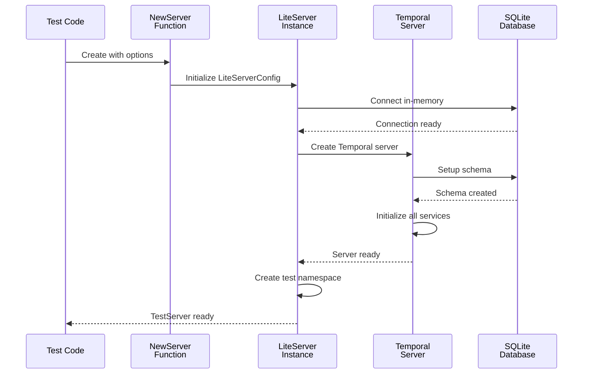
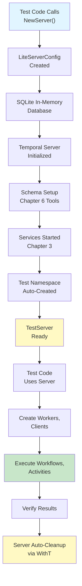

# Chapter 9: Test Server Infrastructure

Now that you understand [how RPC clients are automatically generated to communicate between services](08_rpc_client_code_generation_.md), it's time to learn about something essential for development: **Test Server Infrastructure**.

## What Problem Does This Solve?

Imagine you're a video game developer working on an online multiplayer game. To test your game client, you have two options:

**Option 1: Connect to Production Server**
- "I'll just connect to the real game server to test my changes"
- Problem: Other players get disrupted by your testing
- Problem: If you test something that breaks, real players suffer
- Problem: You need a stable internet connection
- Problem: You can't easily reset the game state

**Option 2: Run a Local Test Server**
- "I'll run the complete game server on my laptop for testing"
- Benefit: Only affects your testing, nobody else
- Benefit: You can restart and reset everything instantly
- Benefit: No internet needed
- Benefit: Safe to try wild experiments

Developers almost always choose Option 2! They need a **lightweight, self-contained server** for development and testing.

**Test Server Infrastructure** provides exactly this for Temporal. Instead of connecting to a real production Temporal cluster (which would be messy), you run a complete lightweight Temporal server right in your test code. This server:
- Starts in-memory (no files on disk, unless you want persistence)
- Is ephemeral (disappears when the test finishes)
- Is complete (has all services working: Frontend, History, Matching, Worker)
- Creates namespaces automatically for testing
- Provides client connections for your test code
- Starts and stops instantly

It's like having a miniature complete Temporal cluster just for testing!

### The Real-World Use Case

Imagine you're building a workflow using the Temporal SDK:

```go
// Your workflow
func MyWorkflow(ctx workflow.Context) error {
    // ... workflow logic
}
```

To test this, you need a Temporal server to run it against. Without Test Server Infrastructure:
- You'd need to set up a real Temporal cluster
- You'd need to install databases, configure networking, manage services
- Every developer on your team would need their own setup
- CI/CD systems would need complex server setup

With Test Server Infrastructure:
- You start a test server in 3 lines of code
- It works everywhere: your laptop, your teammate's laptop, CI/CD systems
- It resets completely between tests (clean slate)
- Multiple developers can test simultaneously without conflicts

Perfect!

## Key Concept 1: Ephemeral vs. Persistent

The test server has two modes:

**Ephemeral Mode** (Default):
```go
// Data is stored in RAM, lost when server stops
// Perfect for tests - clean slate every time
```

All data lives in memory. When the test ends, everything is gone. This is perfect because:
- Each test starts fresh
- Tests don't interfere with each other
- No disk files to clean up

**Persistent Mode**:
```go
// Data is stored in a file on disk
// Useful for manual testing
DatabaseFilePath: "/tmp/temporal.db"
```

Data survives between restarts. This is useful for:
- Manual testing where you want to inspect the database later
- Development where you want state to persist across restarts

## Key Concept 2: In-Memory SQLite - A Full Database That Fits in RAM

The test server uses SQLite in-memory mode. Think of it like:
- **SQLite**: A complete, real database that's small enough to embed
- **In-memory mode**: Instead of writing to disk, store everything in RAM

It's like having a full restaurant kitchen (SQLite) that exists only in your imagination (in-memory) and disappears when you stop thinking about it.

Benefits:
- **Fast**: No disk I/O, everything in RAM
- **Complete**: It's a real database, not a mock
- **No dependencies**: Doesn't need separate database software
- **Automatic schema setup**: Creates tables and indexes automatically

## Key Concept 3: Auto-Generated Test Namespaces

When you create a test server, it automatically creates one or more namespaces for you:

```go
// Creates namespace like: "temporaltest-123456"
ts := temporaltest.NewServer()
ns := ts.GetDefaultNamespace()
// ns = "temporaltest-123456"
```

**Why?** Every workflow needs a namespace (like a project or folder). Instead of making you create one, the test server creates it automatically with a random name (so multiple tests don't conflict).

## Key Concept 4: Automatic Cleanup with Testing.T

The test server integrates with Go's testing framework to clean up automatically:

```go
func TestMyWorkflow(t *testing.T) {
    ts := temporaltest.NewServer(
        temporaltest.WithT(t),  // Add this!
    )
    // No need to call ts.Stop()!
    // It stops automatically when test ends
}
```

By passing `WithT(t)`, you tell the server: "When this test finishes, automatically clean up my server." It's like telling a robot: "When I'm done working, please put away all the tools."

## How to Use It: A Practical Example

Let's solve a complete use case: testing a simple workflow.

### Step 1: Create a Test Server

```go
func TestMyWorkflow(t *testing.T) {
    // Create the test server
    ts := temporaltest.NewServer(
        temporaltest.WithT(t),
    )
    
    // Server is now running!
}
```

**What happens?**
- A complete Temporal server starts in-memory
- A namespace is auto-created
- SQLite database is initialized with all schema
- Server is ready to use

### Step 2: Register Your Workflow and Activity

```go
// Create a worker on a task queue
w := ts.NewWorker("my-task-queue", 
    func(r worker.Registry) {
        r.RegisterWorkflow(MyWorkflow)
        r.RegisterActivity(MyActivity)
    },
)
// Worker is now running and processing tasks
```

**What happens?**
- A worker is created for your task queue
- Your workflow and activity are registered
- The worker is started and listening for work
- When workflow executes, this worker will handle it

### Step 3: Get a Client and Execute Your Workflow

```go
// Get the default client
c := ts.GetDefaultClient()

// Start a workflow
opts := client.StartWorkflowOptions{
    ID:        "workflow-1",
    TaskQueue: "my-task-queue",
}
run, err := c.ExecuteWorkflow(
    context.Background(),
    opts,
    MyWorkflow,
)
if err != nil {
    t.Fatal(err)
}

// Wait for completion
var result MyResult
err = run.Get(context.Background(), &result)
```

**What happens?**
- Client connects to the test server
- Workflow is submitted to Temporal
- Worker picks it up and executes it
- Result is returned to you
- Test can verify the result

### Complete Example

```go
func TestMyWorkflow(t *testing.T) {
    // Setup
    ts := temporaltest.NewServer(
        temporaltest.WithT(t),
    )
    
    // Register workflow
    w := ts.NewWorker("default",
        func(r worker.Registry) {
            r.RegisterWorkflow(MyWorkflow)
        },
    )
    
    // Execute workflow
    c := ts.GetDefaultClient()
    opts := client.StartWorkflowOptions{
        ID: "test-1", TaskQueue: "default"}
    run, _ := c.ExecuteWorkflow(
        context.Background(), opts, MyWorkflow)
    
    // Verify
    var result string
    run.Get(context.Background(), &result)
    if result != "expected" {
        t.Fail()
    }
}
```

## Internal Implementation: How It Works

Let's trace through what happens when you create a test server:



**What's happening step-by-step:**
1. Test code calls `NewServer()` with options
2. Configuration is built with defaults
3. SQLite in-memory database is created
4. Temporal server is initialized (all services)
5. Database schema is set up
6. Test namespace is created
7. Server is ready for the test

## Deep Dive: Understanding the Code

Let's look at the main entry point. From `temporaltest/server.go`:

```go
func NewServer(opts ...TestServerOption) *TestServer {
    testNamespace := fmt.Sprintf(
        "temporaltest-%d", 
        rand.Intn(1e6),
    )
    ts := TestServer{
        defaultTestNamespace: testNamespace,
    }
    // ... apply options
}
```

**What's happening?**
1. Generate a random namespace name
2. Create a TestServer struct
3. Apply any options passed by the user

Then it creates the internal LiteServer:

```go
s, err := temporalite.NewLiteServer(
    &temporalite.LiteServerConfig{
        Namespaces: []string{
            ts.defaultTestNamespace,
        },
        Ephemeral: true,  // In-memory mode
        Logger: log.NewNoopLogger(),
    },
)
```

**What's happening?**
1. Create a LiteServer with the test namespace
2. Enable ephemeral (in-memory) mode
3. Create a no-op logger (tests don't need logs)

The LiteServer configures SQLite. From `temporaltest/internal/lite_server.go`:

```go
if cfg.Ephemeral {
    sqliteConfig.ConnectAttributes["mode"] = "memory"
    sqliteConfig.ConnectAttributes["cache"] = "shared"
}
```

**What's happening?**
1. If ephemeral mode: Use `mode=memory` (data in RAM)
2. Use `cache=shared` (multiple connections to same memory database)

Then the server applies schema. If the database file doesn't exist, it creates it:

```go
if !liteConfig.Ephemeral {
    if _, err := os.Stat(
        liteConfig.DatabaseFilePath,
    ); os.IsNotExist(err) {
        err := sqlite.SetupSchema(sqlConfig)
    }
}
```

**What's happening?**
1. Check: Is this persistent mode (not ephemeral)?
2. Check: Does the database file exist?
3. If not: Run schema setup (creates tables, indexes)

This schema setup uses the [Database Schema Management Tools](06_database_schema_management_tools_.md) we learned about in Chapter 6!

## Real Code Example: Test Server with Custom Options

Let's see how to customize the test server:

### Option 1: Using Default Settings

```go
ts := temporaltest.NewServer(
    temporaltest.WithT(t),
)
```

This creates a server with all defaults: in-memory, ephemeral, default namespace.

### Option 2: Custom Client Options

```go
ts := temporaltest.NewServer(
    temporaltest.WithT(t),
    temporaltest.WithBaseClientOptions(
        client.Options{
            HostPort: "localhost:7233",
        },
    ),
)
```

**What's happening?** Configure how clients connect to the server.

### Option 3: Custom Worker Options

```go
ts := temporaltest.NewServer(
    temporaltest.WithT(t),
    temporaltest.WithBaseWorkerOptions(
        worker.Options{
            MaxConcurrentActivityExecutionSize: 10,
        },
    ),
)
```

**What's happening?** Configure how workers process activities.

### Option 4: Persistent Database (for Manual Testing)

```go
tempDir := t.TempDir()  // Create temp directory
dbPath := filepath.Join(tempDir, "temporal.db")

ts := temporaltest.NewServer(
    temporaltest.WithT(t),
    temporaltest.WithBaseServerOptions(
        // ... custom server options
    ),
)
```

**What's happening?** This creates a persistent database that survives test restarts.

## How Clients and Workers Are Created

When you call `ts.GetDefaultClient()`, here's what happens:

```go
func (ts *TestServer) GetDefaultClient() client.Client {
    if ts.defaultClient == nil {
        ts.defaultClient = ts.NewClientWithOptions(
            ts.defaultClientOptions,
        )
    }
    return ts.defaultClient
}
```

**What's happening?**
1. Check: Do we already have a client?
2. If not: Create one and cache it
3. Return the client

When you call `ts.NewWorker()`, here's what happens:

```go
func (ts *TestServer) NewWorker(
    taskQueue string,
    registerFunc func(registry worker.Registry),
) worker.Worker {
    w := worker.New(
        ts.GetDefaultClient(),
        taskQueue,
        ts.defaultWorkerOptions,
    )
    registerFunc(w)
    if err := w.Start(); err != nil {
        ts.fatal(err)
    }
    return w
}
```

**What's happening?**
1. Create a new worker on the task queue
2. Call the registration function (to register workflows/activities)
3. Start the worker (begins listening for work)
4. Return the worker

## Connection to Previous Concepts

This chapter brings together everything from earlier:

- **[Chapter 1](01_server_configuration_options_pattern_.md)**: `TestServerOption` follows the same pattern as `ServerOption`!
- **[Chapter 2](02_dependency_injection_via_fx_framework_.md)**: The test server uses Fx internally to manage components
- **[Chapter 3](03_server_initialization___lifecycle_management_.md)**: The test server handles startup/shutdown automatically
- **[Chapter 4](04_service_provider_architecture_.md)**: Each service is created by service providers
- **[Chapter 5](05_cluster_metadata_management_.md)**: Cluster metadata is auto-configured
- **[Chapter 6](06_database_schema_management_tools_.md)**: Schema is automatically set up on start
- **[Chapter 7](07_task_category_registry___execution_.md)**: Task categories work normally
- **[Chapter 8](08_rpc_client_code_generation_.md)**: Generated RPC clients work normally

The test server is like a **"preview build"** of the real Temporal server - it's the same code, just configured for testing!

## A Visual Summary: Test Server Lifecycle



## Real-World Testing Scenarios

### Scenario 1: Simple Workflow Test

```go
func TestSimpleWorkflow(t *testing.T) {
    ts := temporaltest.NewServer(
        temporaltest.WithT(t),
    )
    w := ts.NewWorker("default",
        func(r worker.Registry) {
            r.RegisterWorkflow(SimpleWorkflow)
        },
    )
    c := ts.GetDefaultClient()
    run, _ := c.ExecuteWorkflow(
        context.Background(),
        client.StartWorkflowOptions{
            ID: "wf1",
            TaskQueue: "default",
        },
        SimpleWorkflow,
    )
}
```

**What's happening?** Basic workflow execution test.

### Scenario 2: Workflow with Activities

```go
func TestWorkflowWithActivity(t *testing.T) {
    ts := temporaltest.NewServer(
        temporaltest.WithT(t),
    )
    w := ts.NewWorker("tasks",
        func(r worker.Registry) {
            r.RegisterWorkflow(WorkflowWithActivity)
            r.RegisterActivity(MyActivity)
        },
    )
    // Activities are now registered and available
}
```

**What's happening?** Both workflows and activities are registered.

### Scenario 3: Multiple Workers (Parallel Processing)

```go
ts := temporaltest.NewServer(temporaltest.WithT(t))
w1 := ts.NewWorker("queue1", register1)
w2 := ts.NewWorker("queue2", register2)
// Two workers on different queues
```

**What's happening?** Simulate multiple workers processing different queues simultaneously.

## Why This Pattern Is Powerful

1. **Ease of Testing**: No server setup needed, just `NewServer()`
2. **Isolation**: Each test gets its own server instance
3. **Speed**: In-memory database is very fast
4. **Completeness**: Full Temporal server, not a mock
5. **Automatic Cleanup**: With `WithT`, no manual cleanup needed
6. **CI/CD Friendly**: Works everywhere without configuration
7. **Consistency**: Same code runs locally and in CI/CD

## Common Patterns and Best Practices

**Pattern 1: Reusable Helper Function**

```go
func setupTestServer(t *testing.T) *temporaltest.TestServer {
    return temporaltest.NewServer(
        temporaltest.WithT(t),
    )
}
```

Create a helper so all your tests use the same setup.

**Pattern 2: Table-Driven Tests**

```go
testCases := []struct{
    name string
    input string
    want string
}{
    {"case1", "input1", "output1"},
    {"case2", "input2", "output2"},
}
for _, tc := range testCases {
    t.Run(tc.name, func(t *testing.T) {
        ts := setupTestServer(t)
        // ... test with tc
    })
}
```

Test multiple scenarios with a fresh server each time.

**Pattern 3: Fixture Workflows**

```go
// Register common workflows/activities once
var commonRegister = func(r worker.Registry) {
    r.RegisterWorkflow(MyWorkflow)
    r.RegisterActivity(MyActivity)
}

// Reuse in multiple tests
w := ts.NewWorker("default", commonRegister)
```

Avoid repeating registration code.

## Summary & What's Next

You've learned about **Test Server Infrastructure**—a complete, lightweight Temporal server designed for testing. Key takeaways:

- **Ephemeral mode**: In-memory SQLite, perfect for tests with clean slate each time
- **Auto-configuration**: Namespace and schema are created automatically
- **Integration with Go testing**: `WithT(t)` enables automatic cleanup
- **Same code as production**: It's the real Temporal server, just configured for testing
- **Easy client and worker creation**: Built-in helpers simplify test setup
- **No external dependencies**: Runs entirely in-process, no network or databases needed

This test server brings together ALL the concepts from previous chapters (configuration, dependency injection, server initialization, service providers, cluster metadata, database schema, task routing, and RPC) into a complete system designed specifically for testing!

Now that you understand how to test Temporal applications and services, the next step is learning about advanced testing with automatic retries and detecting issues.

**[Next: Test Runner with Retry & Alert Detection](10_test_runner_with_retry___alert_detection_.md)**

---

Generated by [AI Codebase Knowledge Builder](https://github.com/The-Pocket/Tutorial-Codebase-Knowledge)