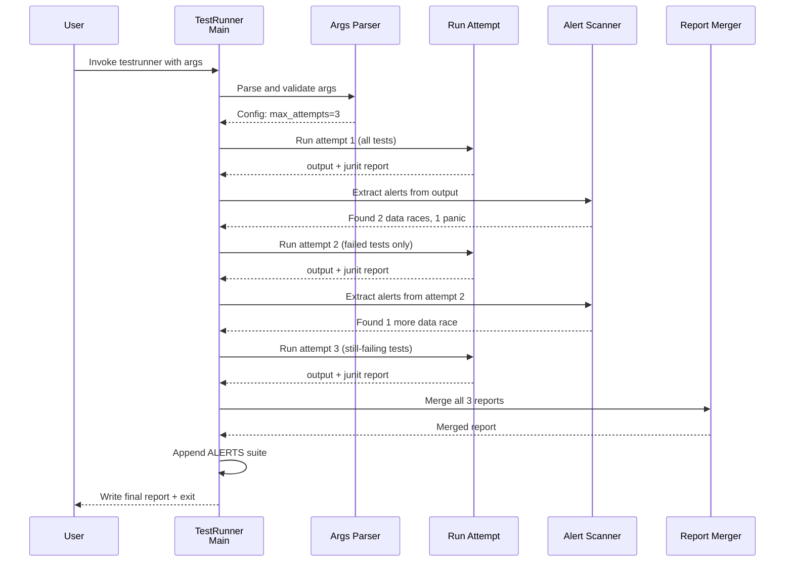
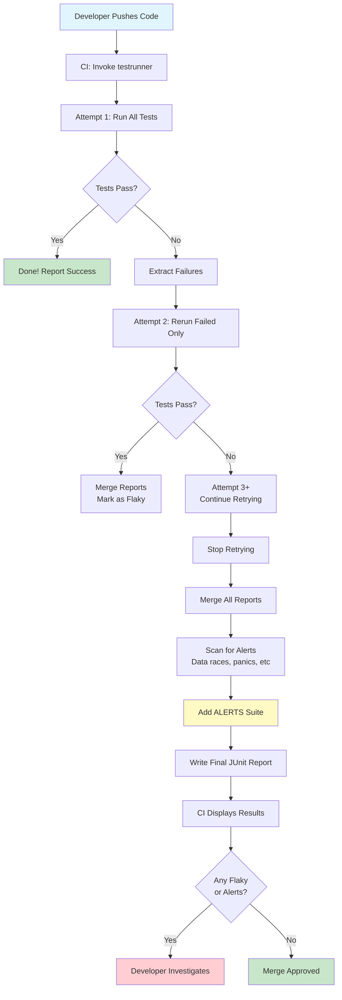

# Chapter 10: Test Runner with Retry & Alert Detection

Now that you understand [how to set up and use a lightweight test server for development](09_test_server_infrastructure_.md), it's time to learn about something equally important for production-like testing: **Test Runner with Retry & Alert Detection**.

## What Problem Does This Solve?

Imagine you're an airline quality assurance manager. You test every plane before it carries passengers. A typical testing day:

1. **Run flight simulation tests**: 100 tests of different systems
2. **Something fails**: "Hydraulics test failed - but only sometimes!"
3. **What now?**
   - Option A: Say the plane is broken and ground it forever
   - Option B: Rerun the test to see if it was a fluke (network hiccup? temporary sensor glitch?)
   - Option C: Run it multiple times and analyze the pattern

You'd choose Option B or C! Some failures are real bugs. Others are **flaky tests** (failures that come and go randomly due to timing, race conditions, or environmental factors).

Then, suppose during testing you discover:
- **Data race detected!** (Two systems writing to the same memory simultaneously - very bad!)
- **System panic!** (Unexpected crash - very bad!)
- **Fatal error!** (Unrecoverable system state - very bad!)

These are **high-priority alerts** that demand immediate attention, even if other tests passed.

**Test Runner with Retry & Alert Detection** solves all of this! It:
1. **Reruns failed tests** automatically to detect flaky tests
2. **Detects data races** and panics during test execution
3. **Surfaces high-priority alerts** to make them impossible to miss
4. **Merges results** from multiple test attempts into a single report
5. **Generates JUnit reports** that CI systems understand
6. **Narrows down failures** on retry (only reruns the tests that actually failed)

It's like having a quality assurance system that says: "Run this test multiple times. If it fails consistently, it's a real bug. If it fails only sometimes, it's flaky. And if it crashes or corrupts data, alert everyone immediately!"

### The Real-World Use Case

Imagine you're part of a team that maintains Temporal. Before every release, you run 5,000 tests across multiple services. Some fail due to real bugs (great catch!). Others fail due to timing issues or flakiness. And occasionally, a test detects a data race (potential corruption!).

Without Test Runner with Retry & Alert Detection:
- A single flaky test failure blocks the release
- You manually rerun tests to see if they fail again
- Critical alerts (like data races) might be buried in verbose logs
- Your JUnit report shows failures from multiple attempts that confuse CI systems

With it:
- Flaky tests are automatically rerun to confirm they're real failures
- Data races and panics are automatically detected and surfaced
- JUnit reports merge multiple attempts into a clear summary
- CI systems immediately see the critical alerts

Perfect!

## Key Concept 1: Flaky Tests - Failures That Come and Go

A **flaky test** is one that sometimes passes and sometimes fails, even when the code hasn't changed. Causes:
- **Timing issues**: "This thread started too slow, so the test failed"
- **Race conditions**: "Two operations happened in unexpected order"
- **Resource conflicts**: "Tests ran simultaneously and fought over the database"
- **Environment sensitivity**: "It works on my laptop but fails in CI"

The solution: **Retry the test multiple times**. If it passes after retrying, it was probably flaky. If it fails consistently, it's a real bug.

## Key Concept 2: High-Priority Alerts - Issues You Can't Ignore

Some test failures are worse than others. A regular test failure might be "Oh, this feature doesn't work yet." But these are critical:

**Data Race Alert**:
```
WARNING: DATA RACE
Write at 0x123abc by goroutine 5
Read at 0x123abc by goroutine 7
```
**Why critical?** Two parts of the code are fighting over the same memory. This can cause silent data corruption that's incredibly hard to debug.

**Panic Alert**:
```
panic: runtime error: index out of range
```
**Why critical?** The program crashed unexpectedly. This might cause production outages.

**Fatal Alert**:
```
fatal error: too many concurrent operations
```
**Why critical?** The system hit a hard limit and shut down. This indicates resource leaks or algorithmic problems.

## Key Concept 3: Multiple Attempts - Trying Again with Smarter Logic

When tests fail, instead of just retrying the same way, the system gets smarter:

**Attempt 1**: Run all requested tests
- If all pass → Done! 
- If some fail → Proceed to attempt 2

**Attempt 2**: Run only the failed tests (not the ones that passed)
- This saves time (why rerun 10,000 tests if only 50 failed?)
- If all pass this time → Probably flaky
- If some still fail → Proceed to attempt 3 (if configured)

**Attempt 3+**: Keep retrying the stubborn failures with special handling
- Narrow down: Only run the ones still failing
- This is like debugging: "I found the broken part, now let me study it closely"

## Key Concept 4: Alert Detection - Scanning Test Output for Danger Signs

The test runner **scans test output** for patterns that indicate high-priority problems:

- **"WARNING: DATA RACE"** → Alert: Data race detected
- **"panic:"** → Alert: Panic detected  
- **"fatal error:"** → Alert: Fatal error detected

These alerts are extracted and **highlighted in the final report** so they're impossible to miss.

## Key Concept 5: JUnit Report Merging - Combining Multiple Attempts

When you run tests multiple times, you get multiple JUnit reports. The system **merges them intelligently**:

```
Attempt 1 report (50 failures):
├─ TestA ✗
├─ TestB ✗
└─ ... 48 more failures

Attempt 2 report (30 failures):
├─ TestA ✓ (passed this time!)
├─ TestB ✗ (still failing)
└─ ... 29 more failures

Merged report:
├─ TestA (flaky - passed on retry)
├─ TestB (real failure - still failing)
└─ ALERTS (data races/panics detected)
```

The merged report shows the definitive state: what was flaky, what's really broken, and what alerts were found.

## How to Use It: A Practical Example

Let's solve the complete use case: testing a Temporal service with automatic retry and alert detection.

### Step 1: Understand the Basic Invocation

You invoke the test runner like this:

```bash
# Run tests with max 3 attempts, save reports
go run ./tools/testrunner test \
  --max-attempts=3 \
  --gotestsum-path=/path/to/gotestsum \
  -coverprofile=coverage.out \
  --junitfile=results.xml \
  ./...
```

**What's happening?**
- `test` command: Run tests (not crash reporting)
- `--max-attempts=3`: If tests fail, retry up to 3 times
- `--gotestsum-path`: Where to find the gotestsum tool (runs tests)
- `-coverprofile`: Save code coverage data
- `--junitfile`: Save JUnit report

### Step 2: What the Runner Does Internally

```
Attempt 1:
  Run: gotestsum ... -run '.*' -coverprofile=coverage_0.out
  Result: 50 test failures detected
  
Attempt 2:
  Extract: Which tests failed in attempt 1?
  Run: gotestsum ... -run 'TestA|TestB|...' -coverprofile=coverage_1.out
  Result: 30 test failures detected (20 passed on retry!)
  
Attempt 3:
  Extract: Which tests still failed?
  Run: gotestsum ... -run 'TestB|TestC|...' -coverprofile=coverage_2.out
  Result: 15 test failures (15 still failing - real bugs!)
  
Merge Reports:
  Combine all three attempts into one JUnit report
  
Scan for Alerts:
  Extract data races, panics, fatals from all outputs
  Add them to the report in an ALERTS suite
  
Final Report:
  - Flaky tests: 35 (failed but passed on retry)
  - Real failures: 15 (failed consistently)
  - Alerts: 3 data races, 1 panic, 0 fatals
```

**Result:** A clear picture of what's really broken!

### Step 3: Interpreting the Results

The final JUnit report shows:

```xml
<testsuites>
  <testsuite name="pkg/path" tests="100">
    <testcase name="TestA" />
    <testcase name="TestB">
      <failure message="assertion failed" />
    </testcase>
    ...
  </testsuite>
  <testsuite name="ALERTS" tests="4">
    <testcase name="DATA RACE: Write at 0x123 — in TestRaceDetector">
      <failure message="DATA RACE" />
    </testcase>
    <testcase name="PANIC: index out of range — in TestPanicDetector">
      <failure message="PANIC" />
    </testcase>
    ...
  </testsuite>
</testsuites>
```

**What this tells you:**
- Most tests passed
- TestB is really failing (not flaky)
- 4 critical alerts were detected
- A data race and panic are marked for immediate investigation

Perfect! CI systems can now see these alerts prominently!

## Internal Implementation: How It Works

Let's trace through what happens when you invoke the test runner:



**What's happening step-by-step:**
1. Parse command-line arguments to understand what we're testing
2. Run tests in attempt 1 with all tests
3. Scan output for critical alerts
4. If failures detected, rerun only the failed tests
5. Continue retrying with narrower test selection
6. Merge all JUnit reports together
7. Add an ALERTS suite with high-priority issues
8. Write final report

## Deep Dive: Understanding the Code

Let's look at the main test running logic. From `tools/testrunner/testrunner.go`:

### Step 1: Parsing Arguments

```go
args, err := r.sanitizeAndParseArgs(command, os.Args[2:])
if err != nil {
    log.Fatalf("failed to parse options: %v", err)
}
```

**What's happening?**
The runner parses arguments and extracts:
- `maxAttempts`: How many times to retry
- `junitOutputPath`: Where to save the report
- `coverProfilePath`: Where to save coverage data
- `gotestsumPath`: Path to the gotestsum tool

### Step 2: Running Each Attempt

```go
for a := 1; a <= r.maxAttempts; a++ {
    currentAttempt := r.newAttempt()
    stdout, err := currentAttempt.run(ctx, args)
    // ... process output
}
```

**What's happening?**
- Loop for each attempt (1 to maxAttempts)
- Create a new attempt with unique file paths
- Run the test command via gotestsum
- Process the output

### Step 3: Extracting Test Failures

The runner reads the JUnit report to find which tests failed:

```go
if err = currentAttempt.junitReport.read(); err != nil {
    log.Fatal(err)
}
failures := currentAttempt.junitReport.collectTestCaseFailures()
```

**What's happening?**
- Parse the XML JUnit report (generated by gotestsum)
- Extract the names of tests that failed
- These will be the tests to retry

### Step 4: Filtering for Next Attempt

For the next attempt, the runner builds a `-run` flag that only runs the failed tests:

```go
args = stripRunFromArgs(args)
for i, failure := range failures {
    failures[i] = goTestNameToRunFlagRegexp(failure)
}
failureArg := strings.Join(failures, "|")
args = append(args, "-run", failureArg)
```

**What's happening?**
- Remove any existing `-run` flag from previous attempt
- Convert test names to Go regexp format (e.g., "TestA" → "^TestA$")
- Join with "|" to create a regex OR pattern: "^TestA$|^TestB$|..."
- Add to arguments: `-run "^TestA$|^TestB$|..."`
- Now gotestsum will only run those specific tests!

### Step 5: Detecting Critical Alerts

The runner scans test output for danger signs:

```go
alerts := parseAlerts(stdout)
```

Let's look at how alerts are detected. From `tools/testrunner/log.go`:

```go
func parseAlerts(stdout string) []alert {
    lines := strings.Split(stdout, "\n")
    var alerts []alert
    for i := 0; i < len(lines); i++ {
        if a, next, ok := tryParseDataRace(lines, i, line); ok {
            alerts = append(alerts, a)
            i = next
            continue
        }
        // ... similar for panic, fatal
    }
    return alerts
}
```

**What's happening?**
- Loop through output line-by-line
- Check for "WARNING: DATA RACE" → Alert!
- Check for "panic:" → Alert!
- Check for "fatal error:" → Alert!
- Extract the full alert block (multi-line error message)
- Add to alerts list

### Step 6: Merging Reports

After all attempts, merge the JUnit reports:

```go
mergedReport, err := mergeReports(r.allReports())
if err != nil {
    log.Fatal(err)
}
```

The merge function from `tools/testrunner/junit.go`:

```go
func mergeReports(reports []*junitReport) (*junitReport, error) {
    var combined junit.Testsuites
    
    for i, report := range reports {
        combined.Tests += report.Testsuites.Tests
        combined.Failures += report.Testsuites.Failures
        
        for _, suite := range report.Testsuites.Suites {
            newSuite := suite
            if i > 0 {
                newSuite.Name += fmt.Sprintf(" (retry %d)", i)
            }
            combined.Suites = append(combined.Suites, newSuite)
        }
    }
    return &junitReport{Testsuites: combined}, nil
}
```

**What's happening?**
- Combine test counts from all attempts
- Add each attempt's test suites to the result
- Mark retry attempts in the name: "suite (retry 1)", "suite (retry 2)"
- Result: A single report showing all attempts

### Step 7: Adding Alerts Suite

The critical alerts are added as a special test suite:

```go
mergedReport.appendAlertsSuite(r.alerts)
```

From `tools/testrunner/junit.go`:

```go
func (j *junitReport) appendAlertsSuite(alerts []alert) {
    var cases []junit.Testcase
    for _, a := range alerts {
        name := fmt.Sprintf(
            "%s: %s — in %s", 
            a.Kind, a.Summary, primaryTestName(a.Tests),
        )
        cases = append(cases, junit.Testcase{
            Name: name,
            Failure: &junit.Result{Message: string(a.Kind)},
        })
    }
    
    suite := junit.Testsuite{
        Name: "ALERTS",
        Testcases: cases,
    }
    j.Suites = append(j.Suites, suite)
}
```

**What's happening?**
- Create a test case for each alert
- Test name format: "DATA RACE: Write at 0x123 — in TestRaceDetector"
- Mark as failure so it shows up prominently
- Add to a special "ALERTS" suite
- CI systems will see ALERTS suite first!

## Real Code Example: Complete Flow

Let's trace a complete example with specific numbers:

```
Initial run (Attempt 1):
  Command: gotestsum test -run '.*' -coverprofile=coverage_0.out
  Result: 100 tests ran, 85 passed, 15 failed ✗
  Alerts: 2 data races detected
  
Parser extracts failures:
  Failed tests: TestA, TestB, TestC, TestD, TestE, ...
  
Retry run (Attempt 2):
  Command: gotestsum test -run '^TestA$|^TestB$|...' -coverprofile=coverage_1.out
  Result: 15 tests ran, 10 passed, 5 failed ✗
  Alerts: Same 2 data races detected
  
Parser extracts failures:
  Still failing: TestB, TestD, TestE, TestJ, TestK
  
Retry run (Attempt 3):
  Command: gotestsum test -run '^TestB$|^TestD$|...' -coverprofile=coverage_2.out
  Result: 5 tests ran, 2 passed, 3 failed ✗
  Alerts: Same 2 data races detected
  
Merge reports:
  Attempt 1: 85 passed, 15 failed
  Attempt 2: 10 passed (retries), 5 failed
  Attempt 3: 2 passed (retries), 3 failed
  
Final statistics:
  - Flaky (passed after retry): 12 tests
  - Real failures (failed all attempts): 3 tests
  - Alerts: 2 data races
  
Final JUnit report:
  SUITES:
    - pkg/path (attempt 1): 15 failures
    - pkg/path (retry 1): 5 failures
    - pkg/path (retry 2): 3 failures
    - ALERTS: 2 failures (DATA RACE x2)
```

CI system sees this and immediately notices:
- "3 tests are consistently failing - real bugs!"
- "2 data races detected - URGENT!"

## Connection to Previous Concepts

This chapter brings together everything:

- **[Chapter 1](01_server_configuration_options_pattern_.md)**: `TestRunnerOption` follows the same pattern!
- **[Chapter 2](02_dependency_injection_via_fx_framework_.md)**: The test runner invokes gotestsum which uses Fx internally
- **[Chapter 3](03_server_initialization___lifecycle_management_.md)**: Test server starts and stops for each test run
- **[Chapter 6](06_database_schema_management_tools_.md)**: Tests run with clean database each time
- **[Chapter 9](09_test_server_infrastructure_.md)**: The test server that runs tests (this runner coordinates the testing)

The test runner is the **quality gate** that stands in front of releases, ensuring only high-quality code passes!

## Real-World Scenarios

### Scenario 1: A Flaky Race Condition Test

Test runs:
- Attempt 1: FAIL (race condition happened to occur)
- Attempt 2: PASS (race condition didn't occur this time)
- Attempt 3: N/A (already passed on retry)

**Result:** Marked as flaky in the report. The dev team knows to investigate the timing but it's not a hard blocker.

### Scenario 2: A Real Failure

Test runs:
- Attempt 1: FAIL (assertion failed)
- Attempt 2: FAIL (same assertion failed)
- Attempt 3: FAIL (still failing)

**Result:** Marked as real failure. The dev team must fix it before merge.

### Scenario 3: A Data Race Alert

Test runs:
- Attempt 1: Test passes but output contains "WARNING: DATA RACE"
- Attempt 2 onwards: Same data race appears

**Result:** Added to ALERTS suite with HIGH priority. Even though the test technically passes, the race condition indicates a serious bug.

## Why This Pattern Is Powerful

1. **Distinguishes flaky from broken**: Retry logic identifies which failures are real
2. **Catches critical issues**: Data races and panics are surfaced prominently
3. **CI-friendly**: JUnit reports with ALERTS suite are understood by all CI systems
4. **Efficient**: Only reruns the tests that actually failed
5. **Traceable**: Multiple reports show progression and retry success
6. **Comprehensive**: Single report shows the complete picture after all attempts
7. **Safe for release**: No flaky tests block your release; only real bugs do

## A Visual Summary: Complete Testing Pipeline



## Summary & What's Next

You've learned about **Test Runner with Retry & Alert Detection**—a sophisticated system that intelligently reruns failing tests, detects critical issues, and produces clear reports. Key takeaways:

- **Automatic retry logic**: Distinguish between flaky tests and real failures
- **Alert detection**: Automatically detect data races, panics, and fatal errors
- **Smart narrowing**: Only rerun tests that actually failed, saving time
- **Report merging**: Combine multiple attempts into a single clear report
- **CI integration**: JUnit reports with ALERTS suite that CI systems understand
- **Efficiency**: Intelligently balance thoroughness with speed

This brings together everything from the entire tutorial: configuration, dependency injection, server lifecycle, service architecture, metadata management, schema setup, task routing, RPC generation, test infrastructure, and finally, intelligent test execution!

Now that you've learned about comprehensive testing infrastructure, the final step is learning about operational tools for debugging and administration.

**[Next: Temporal Debugger & Admin CLI Tools](11_temporal_debugger___admin_cli_tools_.md)**

---

Generated by [AI Codebase Knowledge Builder](https://github.com/The-Pocket/Tutorial-Codebase-Knowledge)