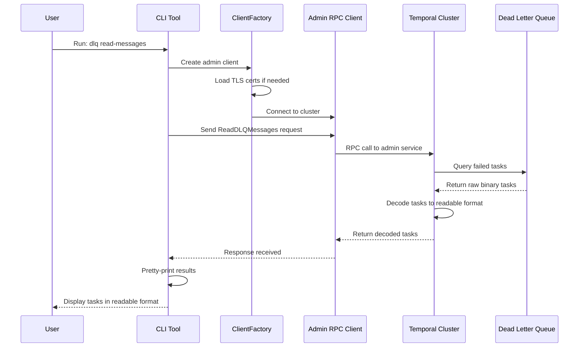
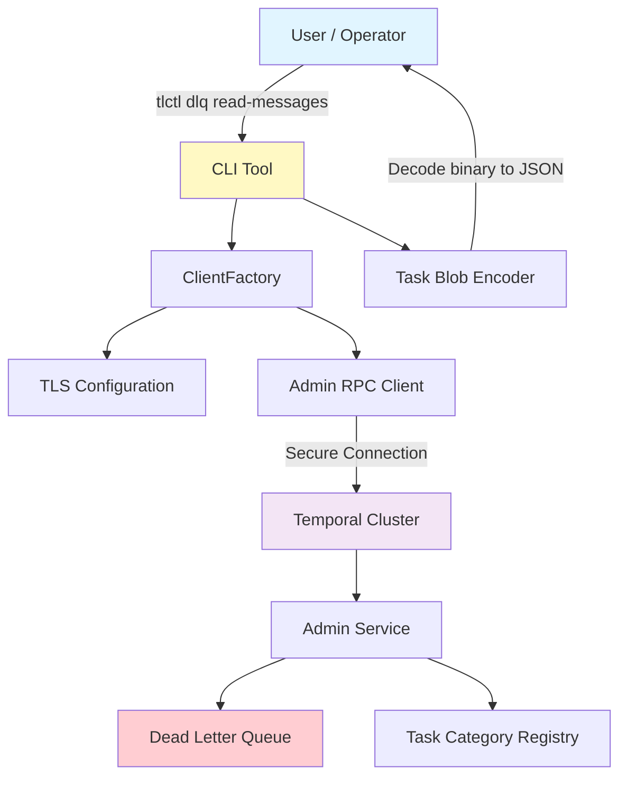

# Chapter 11: Temporal Debugger & Admin CLI Tools

Now that you understand [how to run comprehensive tests with automatic retry and alert detection](10_test_runner_with_retry___alert_detection_.md), it's time to learn about something equally crucial for production systems: **Temporal Debugger & Admin CLI Tools**.

## What Problem Does This Solve?

Imagine you're a doctor working in a hospital. Everything is running smoothly... until a patient comes in feeling unwell. You need to investigate! You'd:

1. **Ask questions**: "Where does it hurt? When did it start? What symptoms?"
2. **Run tests**: "Let me check your blood work, X-rays, heart rate"
3. **Inspect records**: "Let me look at your medical history"
4. **Perform procedures**: "I need to prescribe treatment or perform surgery"
5. **Monitor progress**: "Let me check if the treatment is working"

If you couldn't ask questions or inspect records, you'd be flying blind! You couldn't diagnose the problem or know how to fix it.

**Temporal Debugger & Admin CLI Tools** are like a doctor's toolkit for your Temporal cluster! When something goes wrong in production:
- A workflow is stuck
- Tasks aren't processing
- A Dead Letter Queue (DLQ) is filling up with failed tasks
- You need to understand what's happening inside the cluster

The tools let you:
1. **Inspect workflows**: "What state is this workflow in? What tasks is it executing?"
2. **View task queues**: "Which workers are available? How many tasks are waiting?"
3. **Examine dead letter queues**: "What tasks failed? Why did they fail?"
4. **Decode task data**: "What actual data is inside this serialized task?"
5. **Perform operations**: "Merge these failed tasks back into the queue for retry"
6. **Filter and search**: "Show me only the tasks that failed due to timeout"

Without these tools, debugging a stuck Temporal cluster would be nearly impossible! You'd have no visibility into what's happening inside.

### The Real-World Use Case

Let's say it's 3 AM, your phone buzzes, and you get an alert: "Dead Letter Queue is growing exponentially!" 

Scenarios you need to handle:
1. "Are tasks failing across all workflows or just one?"
2. "Why are they failing? Network issue? Database issue? Bug in my code?"
3. "Can I safely retry them, or will they fail again?"
4. "How many failures can I safely ignore?"
5. "Can I merge the good failures back to retry?"

With Admin CLI Tools:
```bash
# Check what's in the DLQ
temporal dlq read-messages \
  --cluster production \
  --namespace my-namespace \
  --dlq-type history

# See the task details decoded
# Make a decision: merge or purge?
```

Without them: You're blind. You'd have to ask an engineer to SSH into servers and query databases directly (risky, slow, error-prone).

## Key Concept 1: The Admin Client - Your Remote Control

An **Admin Client** is like a remote control for your Temporal cluster. It connects to the server and can:
- Query internal state
- Execute commands
- Retrieve detailed information
- Trigger operations

Think of it like connecting to a server via SSH to run commands, except it's type-safe and uses the proper RPC interface.

```go
// Create a connection to the cluster
client := clientFactory.AdminClient(ctx)

// Now you can query the cluster
response, err := client.GetTaskQueueTasks(ctx, request)
```

**What's happening?** The client connects to the cluster's admin service and can ask it questions or request operations.

## Key Concept 2: Dead Letter Queues (DLQ) - Holding Pen for Failures

A **Dead Letter Queue** is like a holding pen for tasks that failed multiple times.

Here's the journey of a failed task:

1. Task arrives for processing
2. Worker tries to execute it
3. It fails (network timeout, validation error, etc.)
4. Worker retries (attempt 2, 3, 4...)
5. After N retries, it finally gives up
6. Task goes to the **Dead Letter Queue**

The DLQ says: "This task failed so many times that I'm giving up. I'm parking it here for an admin to examine."

**Why is this important?** Without a DLQ:
- Task would be lost forever
- You'd never know it failed
- Data could be silently corrupted

With a DLQ:
- Failed tasks are preserved
- Admin can examine them
- Admin can decide to retry them or investigate why they're failing

## Key Concept 3: DLQ Versions - Two Different Systems (V1 and V2)

Temporal has two versions of DLQs (they improved the system over time):

**DLQ V1** (Older):
- Simple queue for failures
- Limited filtering
- Namespace-based organization

**DLQ V2** (Newer):
- More sophisticated
- Task-category based (archival, replication, visibility, etc.)
- Better filtering and introspection

The tools support both, and you specify which version to use:

```bash
temporal dlq read-messages \
  --dlq-version v2 \
  --dlq-type history
```

**What's happening?** Telling the tool to use the V2 system and look at the history DLQ (tasks related to history service).

## Key Concept 4: Task Decoding - Turning Bytes Into Readable Data

Tasks are stored as **binary data** (bytes) in the database. This is efficient but not human-readable:

```
Raw task data: 0x0A 0x1F 0x08 0x03 0x12 0x08 0x00 0xFF...
↓ (what does this mean?)
```

A **Task Blob Encoder** decodes this binary data into a readable format:

```
Decoded task:
{
  "task_id": 123456,
  "type": "workflow_task",
  "namespace_id": "default",
  "workflow_id": "order-processing-123",
  "timestamp": "2024-01-15T10:30:00Z"
}
```

Now you can read it! This is essential for understanding what tasks are in the DLQ.

## Key Concept 5: Prompting for Confirmation - Safety First

When you're about to perform **destructive operations** (like deleting failed tasks), the tool prompts you for confirmation:

```
Are you sure you want to PURGE 1000 messages from the DLQ? [y/N]:
```

This prevents accidents like:
- Accidentally deleting all your tasks
- Running a command twice by mistake
- Typos that cause data loss

Unless you pass `--yes`, the tool always asks for confirmation.

## How to Use It: Complete Workflow

Let's solve the complete use case: investigating and fixing a stuck Temporal cluster with a growing DLQ.

### Step 1: List Available DLQs

First, see what DLQs exist:

```bash
temporal dlq list-queues \
  --cluster production \
  --namespace my-namespace
```

**What happens?**
- Admin tool connects to the cluster
- Queries for all DLQs
- Shows you which task categories have failures

Example output:
```
DLQ Summary:
- Replication: 15 messages
- Archival: 0 messages
- History: 1243 messages ← Oh no! Lots of failures!
```

### Step 2: Read Messages from DLQ

Now examine the messages in the DLQ:

```bash
temporal dlq read-messages \
  --cluster production \
  --namespace my-namespace \
  --dlq-type history \
  --page-size 10
```

**What happens?**
- Tool connects to the DLQ
- Retrieves messages (10 at a time)
- Decodes the binary data
- Displays readable task information
- Shows you what failed and when

Example output:
```
Message 1:
  WorkflowID: order-123
  RunID: first-run
  Error: timeout after 30 seconds
  Timestamp: 2024-01-15T10:00:00Z

Message 2:
  WorkflowID: payment-456
  RunID: second-run
  Error: database connection refused
  Timestamp: 2024-01-15T10:05:00Z
```

### Step 3: Analyze What You Found

Looking at the messages, you notice:
- Some failures are timeouts (probably transient)
- Some are database connection errors (probably transient too!)
- They all happened in the last hour (not old failures)

**Hypothesis**: Maybe something temporary happened (database maintenance) and these should be retried.

### Step 4: Merge Messages Back (Retry)

Instead of purging (deleting), try merging messages back to the queue:

```bash
temporal dlq merge-messages \
  --cluster production \
  --namespace my-namespace \
  --dlq-type history \
  --count 100
```

**What happens?**
- Tool prompts: "Sure about merging 100 messages? [y/N]:"
- You type: "y"
- Tool moves messages from DLQ back to normal queue
- Workers pick them up and retry them
- If they succeed, great! If they fail again, they go back to DLQ

**Result**: The DLQ shrinks. Workflows resume. Crisis averted!

### Step 5: If That Doesn't Work - Investigate Further

If merging didn't help and messages keep failing:

```bash
temporal task-queue describe \
  --cluster production \
  --namespace my-namespace \
  --task-queue my-queue
```

**What happens?**
- Shows detailed information about the task queue
- How many workers are connected?
- What are they doing?
- Are there bottlenecks?

This helps you understand if the problem is:
- Worker shortage (too few workers)?
- Worker overload (too many tasks, workers can't keep up)?
- Task queue misconfiguration?

## Internal Implementation: How It Works

Let's trace through what happens when you run a DLQ command:



**What's happening step-by-step:**

1. **Parse arguments**: Extract cluster name, namespace, filters
2. **Create client**: Connect to the cluster (handle TLS certificates)
3. **Send RPC request**: Ask the cluster's admin service for DLQ messages
4. **Cluster processes**: Query the DLQ database for messages
5. **Decode data**: Convert binary task data to readable format
6. **Return results**: Send back to CLI tool
7. **Display**: Pretty-print the results for you

## Deep Dive: Understanding the Code

Let's look at the actual implementation. From the provided code in `tools/tdbg/dlq_service.go`:

### Creating the DLQ Service

```go
func (p *DLQServiceProvider) GetDLQService(
    c *cli.Context,
) (DLQService, error) {
    version := c.String(FlagDLQVersion)
    if version == "v2" {
        return getDLQV2Service(...)
    }
    return NewDLQV1Service(...)
}
```

**What's happening?**
- Check which DLQ version to use
- Create the appropriate service (V1 or V2)
- Return it ready to use

The service is created once and then can be reused for multiple operations.

### Reading Messages

From `tools/tdbg/task_queue_commands.go`:

```go
paginationFunc := func(paginationToken []byte) ([]interface{}, []byte, error) {
    response, err := client.GetTaskQueueTasks(ctx, req)
    if err != nil {
        return nil, nil, err
    }
    
    var items []interface{}
    for _, task := range response.Tasks {
        items = append(items, task)
    }
    return items, response.NextPageToken, nil
}
```

**What's happening?**
1. Make RPC call to admin service
2. Get back a batch of tasks and a token for the next page
3. Convert to displayable format
4. Return results and token for pagination (to fetch the next batch)

### Handling User Prompts

From `tools/tdbg/prompter.go`:

```go
func (p *Prompter) Prompt(msg string) {
    if p.flagLookup.Bool(FlagYes) {
        return  // Skip prompt if --yes flag used
    }
    
    fmt.Print(msg + " [y/N]: ")
    text, _ := reader.ReadString('\n')
    
    if textLower != "y" && textLower != "yes" {
        os.Exit(1)  // User said no, exit with error
    }
}
```

**What's happening?**
1. Check if user passed `--yes` flag (skip confirmation)
2. If not, print the prompt
3. Read user input
4. Exit if user didn't confirm (safety first!)

This prevents accidental data deletion!

### Creating Secure Connections

From `tools/tdbg/factory.go`:

```go
func (b *clientFactory) createTLSConfig(c *cli.Context) (*tls.Config, error) {
    certPath := c.String(FlagTLSCertPath)
    keyPath := c.String(FlagTLSKeyPath)
    
    if certPath != "" {
        cert, err := tls.LoadX509KeyPair(certPath, keyPath)
        if err != nil {
            return nil, err
        }
        tlsConfig.Certificates = []tls.Certificate{cert}
    }
    return tlsConfig, nil
}
```

**What's happening?**
1. Load TLS certificate and key from files
2. Create TLS configuration
3. Return for use in gRPC connection
4. This secures the connection to the cluster

Clients can authenticate to the cluster without passing credentials on the command line (more secure).

## Real Code Example: Complete DLQ Operation

Let's trace a complete DLQ read operation:

```bash
# Command line
temporal dlq read-messages \
  --cluster prod \
  --namespace default \
  --dlq-type history
```

Here's what happens internally:

**Step 1: Parse CLI arguments**
```go
cluster := "prod"
namespace := "default"
dlqType := "history"
```

**Step 2: Create client with TLS**
```go
factory := NewClientFactory()
client := factory.AdminClient(ctx)
// Client now connected securely to prod cluster
```

**Step 3: Build request**
```go
req := &adminservice.GetDLQMessagesRequest{
    Cluster:    cluster,
    Namespace:  namespace,
    DLQType:    toQueueType(dlqType),
}
```

**Step 4: Send RPC call**
```go
response, err := client.GetDLQMessages(ctx, req)
// Cluster receives request and responds
```

**Step 5: Decode and display**
```go
for _, msg := range response.Messages {
    decoded := taskBlobEncoder.Decode(msg.Data)
    fmt.Printf("Task: %+v\n", decoded)
}
```

**Result**: Human-readable task information displayed to you!

## Connection to Previous Concepts

This chapter brings together everything from the entire tutorial:

- **[Chapter 1](01_server_configuration_options_pattern_.md)**: CLI options follow the same pattern!
- **[Chapter 2](02_dependency_injection_via_fx_framework_.md)**: The admin service itself uses Fx (from Chapter 2's service architecture)
- **[Chapter 3](03_server_initialization___lifecycle_management_.md)**: The admin service is started as part of server initialization
- **[Chapter 5](05_cluster_metadata_management_.md)**: We use cluster metadata to know where to connect
- **[Chapter 6](06_database_schema_management_tools_.md)**: The DLQ is stored in the database that was set up
- **[Chapter 7](07_task_category_registry___execution_.md)**: We use the task registry to understand task types
- **[Chapter 8](08_rpc_client_code_generation_.md)**: The admin client is generated from gRPC definitions!
- **[Chapter 9](09_test_server_infrastructure_.md)**: You can test admin commands with a test server
- **[Chapter 10](10_test_runner_with_retry___alert_detection_.md)**: If something goes wrong, these tools help debug

These tools are the **culmination of everything** - they're the interface operators use to manage and debug the entire system!

## A Visual Summary: Admin Tools Architecture



## Real-World Scenarios

### Scenario 1: Dead Letter Queue Investigation

```
1. Get alert: "DLQ growing!"
2. Run: temporal dlq read-messages
3. See: Timeouts due to slow database
4. Action: Optimize database query
5. Retry: temporal dlq merge-messages
6. Result: DLQ shrinks, workflows resume
```

**Outcome**: Found root cause (slow DB) and fixed it!

### Scenario 2: Task Queue Debugging

```
1. Users report: "Workflows are stuck"
2. Run: temporal task-queue describe --task-queue my-queue
3. See: 0 workers connected
4. Action: Restart worker process
5. Check: Workers now connected
6. Result: Workflows resume processing
```

**Outcome**: Identified missing workers and restored them!

### Scenario 3: Workflow Inspection

```
1. User asks: "Where's my workflow?"
2. Run: temporal workflow describe --workflow-id my-123
3. See: Stuck on decision task, waiting for worker
4. Check: Worker is hung
5. Action: Kill and restart worker
6. Run: temporal workflow reset --reset-type-first
7. Result: Workflow resumes from beginning
```

**Outcome**: Recovered stuck workflow without data loss!

## Common Use Cases

| Problem | Tool | Command |
|---------|------|---------|
| Growing DLQ | DLQ read | `temporal dlq read-messages` |
| Tasks stuck | Workflow describe | `temporal workflow describe` |
| No workers | Task queue describe | `temporal task-queue describe` |
| Bad task data | Task decode | `temporal task decode` |
| Many failures | DLQ filter | `temporal dlq read-messages --filter` |
| Recover workflow | Workflow reset | `temporal workflow reset` |

## Why This Pattern Is Powerful

1. **Direct Access**: View internal state without SSH or database access
2. **Safe Operations**: Confirmation prompts prevent accidents
3. **Secure**: TLS support for production clusters
4. **Readable**: Decodes binary data into JSON you can understand
5. **Flexible**: Multiple filters and options for different scenarios
6. **Comprehensive**: Covers workflows, tasks, queues, and DLQs
7. **Production-Ready**: Battle-tested in real deployments

## Summary & What's Next

You've learned about **Temporal Debugger & Admin CLI Tools**—the operator's toolkit for managing and debugging Temporal clusters. Key takeaways:

- **Admin Client**: A remote control for querying cluster state
- **Dead Letter Queues**: Holding pens for failed tasks, preserving data and enabling recovery
- **DLQ Versions**: V1 for simple scenarios, V2 for advanced filtering
- **Task Decoding**: Converting binary task data into human-readable format
- **Confirmation Prompts**: Safety mechanism preventing accidental data loss
- **Multiple Operations**: Read, merge, purge, and filter tasks
- **Secure Connections**: TLS support for production environments

These tools bring together everything from all 10 previous chapters - they're the interface that operators use to manage and debug the entire Temporal system!

---

## Congratulations! 🎉

You've completed the entire **Temporal Server Architecture Tutorial**! 

### What You've Learned

1. **[Chapter 1](01_server_configuration_options_pattern_.md)**: How servers are configured with flexible options
2. **[Chapter 2](02_dependency_injection_via_fx_framework_.md)**: How components are created and wired together
3. **[Chapter 3](03_server_initialization___lifecycle_management_.md)**: How services are started and stopped in the right order
4. **[Chapter 4](04_service_provider_architecture_.md)**: How different services are created uniformly
5. **[Chapter 5](05_cluster_metadata_management_.md)**: How cluster information is kept consistent
6. **[Chapter 6](06_database_schema_management_tools_.md)**: How databases are set up and versioned
7. **[Chapter 7](07_task_category_registry___execution_.md)**: How internal tasks are categorized and routed
8. **[Chapter 8](08_rpc_client_code_generation_.md)**: How service-to-service communication is generated
9. **[Chapter 9](09_test_server_infrastructure_.md)**: How Temporal servers are tested in development
10. **[Chapter 10](10_test_runner_with_retry___alert_detection_.md)**: How tests are run with intelligent retry and alert detection
11. **[Chapter 11](11_temporal_debugger___admin_cli_tools_.md)**: How operators debug and manage production clusters (this chapter!)

### From Theory to Practice

You now understand the complete architecture of a production-grade distributed system. Everything from user-facing configuration options to deep debugging tools. This knowledge applies far beyond Temporal - it's fundamental to understanding any large-scale distributed system!

### Next Steps

- **Experiment**: Try setting up a Temporal cluster with the concepts you've learned
- **Contribute**: Help improve Temporal with this architectural knowledge
- **Apply**: Use these patterns in your own systems
- **Share**: Teach others what you've learned

Happy building! 🚀

---

Generated by [AI Codebase Knowledge Builder](https://github.com/The-Pocket/Tutorial-Codebase-Knowledge)