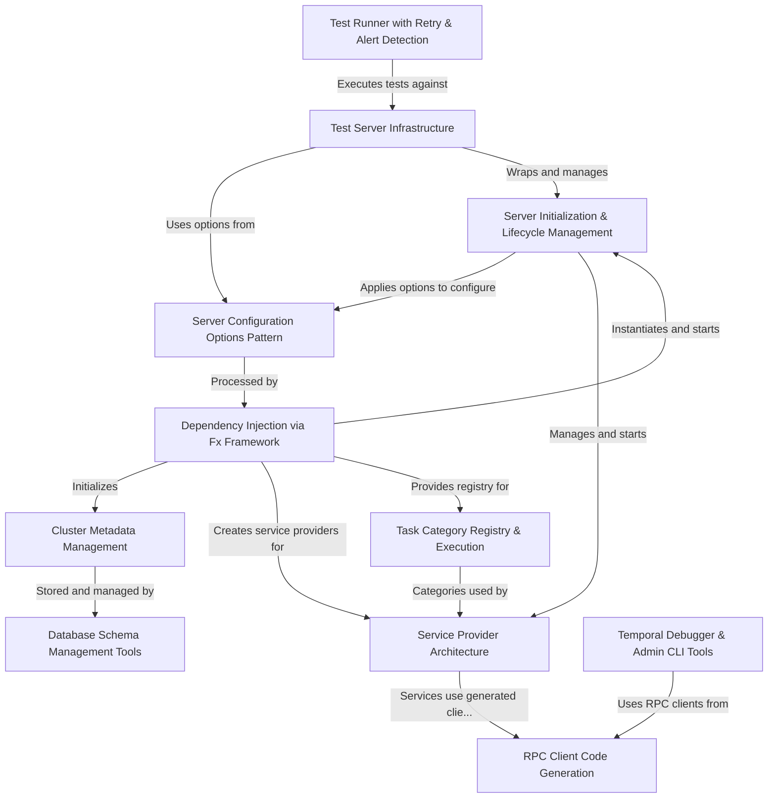

# Tutorial: temporal

**Temporal** is a sophisticated **distributed workflow orchestration platform** that manages complex, long-running business processes across multiple services. The project provides a **server** that coordinates *frontend*, *history*, *matching*, and *worker* services to execute and monitor workflows at scale. At its core, it uses **Uber's Fx framework** for dependency injection, **flexible configuration options** for customization, **cluster metadata management** for distributed deployments, and includes tools for **schema management**, **RPC client generation**, **testing**, and **debugging**. The architecture is designed to be modular, testable, and production-ready with comprehensive observability and reliability features.

**Source Repository:** [None](None)

## Chapters

1. [Server Configuration Options Pattern
](01_server_configuration_options_pattern_.md)
2. [Dependency Injection via Fx Framework
](02_dependency_injection_via_fx_framework_.md)
3. [Server Initialization & Lifecycle Management
](03_server_initialization___lifecycle_management_.md)
4. [Service Provider Architecture
](04_service_provider_architecture_.md)
5. [Cluster Metadata Management
](05_cluster_metadata_management_.md)
6. [Database Schema Management Tools
](06_database_schema_management_tools_.md)
7. [Task Category Registry & Execution
](07_task_category_registry___execution_.md)
8. [RPC Client Code Generation
](08_rpc_client_code_generation_.md)
9. [Test Server Infrastructure
](09_test_server_infrastructure_.md)
10. [Test Runner with Retry & Alert Detection
](10_test_runner_with_retry___alert_detection_.md)
11. [Temporal Debugger & Admin CLI Tools
](11_temporal_debugger___admin_cli_tools_.md)

---

Generated by [AI Codebase Knowledge Builder](https://github.com/The-Pocket/Tutorial-Codebase-Knowledge)