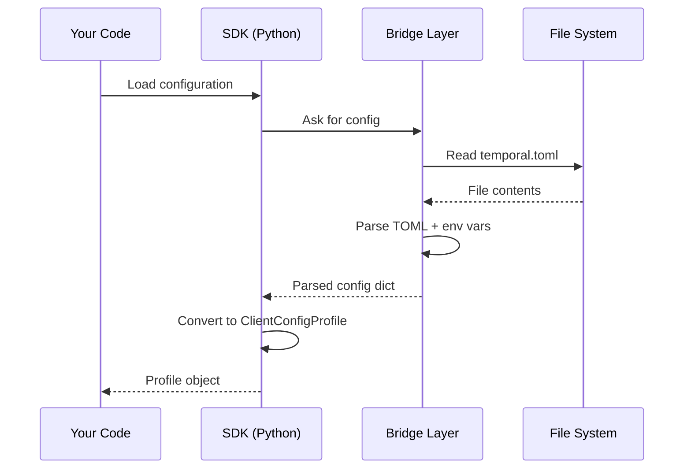
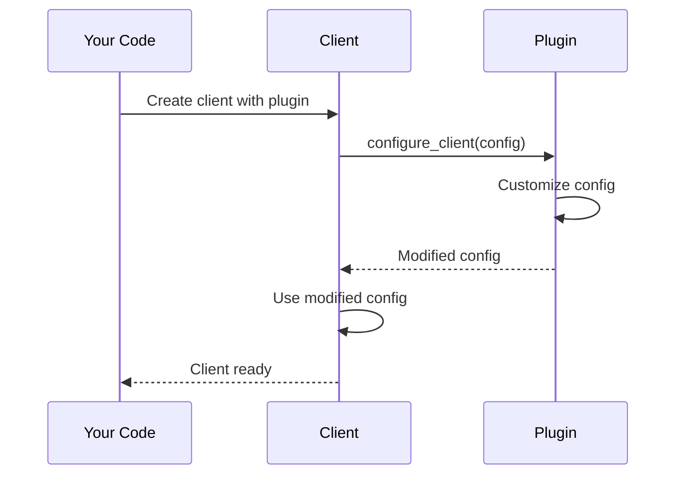

# Chapter 1: Configuration & Plugins

Welcome! This is your first step into the Temporal Python SDK. In this chapter, we'll learn how to configure the SDK flexibly without modifying code, and how to customize its behavior through plugins.

## The Problem We're Solving

Imagine you're building a distributed application with Temporal. You might need to:

- **Connect to different Temporal servers** depending on whether you're in development, staging, or production
- **Change serialization behavior** without rewriting code
- **Add monitoring or logging** across your application
- **Use different certificates or credentials** in different environments

Hardcoding these settings into your application would be messy. You'd have to recompile code for every environment change!

**The Solution:** Temporal provides two powerful mechanisms:
1. **Configuration** - Load settings from files or environment variables
2. **Plugins** - Customize behavior by providing your own implementations

Think of it like a restaurant menu: the base recipe (your code) stays the same, but you can customize the ingredients (configuration) and request special preparation (plugins) without changing the kitchen's core operations.

## Key Concepts

Let's break this down into digestible pieces:

### 1. Configuration: Settings Without Code Changes

Configuration allows you to specify how the SDK should behave by providing settings externally. Instead of writing:

```python
client = await temporalio.client.Client.connect(
    "localhost:7233",
    namespace="production"
)
```

You can write:

```python
config = temporalio.envconfig.ClientConfigProfile.load()
connect_config = config.to_client_connect_config()
client = await temporalio.client.Client.connect(**connect_config)
```

Now your actual settings come from files or environment variables - no code changes needed!

### 2. Plugins: Customizing Behavior

Plugins let you inject custom components into the SDK. Instead of the SDK using its default serialization, you can say "use my custom serializer instead." Or "whenever you send data, also log it."

Think of plugins like adding extensions to a web browser - the browser works fine out of the box, but you can add plugins to enhance it.

### 3. Environment Variables vs. TOML Files

Configuration can come from two sources:

- **Environment Variables** - Set `TEMPORAL_ADDRESS=localhost:7233` in your shell
- **TOML Files** - Create a config file like:
  ```toml
  [default]
  address = "localhost:7233"
  namespace = "production"
  ```

Both methods achieve the same goal: configuration without code changes.

## How to Use Configuration

Let's walk through a concrete example:

### Step 1: Create a TOML Configuration File

Create a file named `temporal.toml`:

```toml
[default]
address = "localhost:7233"
namespace = "my-namespace"
```

This defines a "profile" called `default` with your server address and namespace.

### Step 2: Load the Configuration in Python

```python
from temporalio.envconfig import ClientConfigProfile

profile = ClientConfigProfile.load()
connect_config = profile.to_client_connect_config()
print(connect_config)  # Shows all loaded settings
```

**What happens:** The SDK reads your `temporal.toml` file and creates a configuration profile. The `to_client_connect_config()` converts it into settings you can pass to the client.

### Step 3: Use It to Connect

```python
import temporalio.client

connect_config = profile.to_client_connect_config()
client = await temporalio.client.Client.connect(**connect_config)
```

**Result:** Your client is now connected using settings from the TOML file, not hardcoded in code!

### Step 4: Override with Environment Variables

You can override settings via environment variables:

```bash
export TEMPORAL_ADDRESS=production.temporal.io
export TEMPORAL_NAMESPACE=prod
```

Now when you load the configuration, these environment variables override what's in the file. This is perfect for deploying the same code to different environments!

## How to Use Plugins

Plugins let you customize behavior. Here's a simple example:

### Step 1: Import the Plugin System

```python
from temporalio.plugin import SimplePlugin
from temporalio import converter

plugin = SimplePlugin(
    name="my-plugin",
    data_converter=converter.JSONDataConverter()
)
```

**What this does:** Creates a plugin that tells the SDK to use JSON for serialization instead of the default method.

### Step 2: Use the Plugin When Creating a Client

```python
client = await temporalio.client.Client.connect(
    "localhost:7233",
    plugins=[plugin]
)
```

**Result:** Your client now uses the custom JSON serializer from your plugin!

### Step 3: Create a More Complex Plugin

```python
from temporalio.plugin import SimplePlugin

plugin = SimplePlugin(
    name="production-plugin",
    data_converter=my_custom_converter,
    client_interceptors=[my_logging_interceptor]
)
```

This plugin now:
- Uses a custom data converter for serialization
- Adds logging via an interceptor

**Interceptors** are like middleware - they intercept SDK operations to add logging, monitoring, or other functionality. We'll learn more about them in [Chapter 9: Interceptor](09_interceptor.md).

## Internal Implementation: How It All Works

Let's peek under the hood to understand what happens when configuration and plugins are used.

### Configuration Loading Flow

Here's what happens when you call `ClientConfigProfile.load()`:



**Step-by-step:**

1. You call `ClientConfigProfile.load()` in your Python code
2. Python asks the Bridge Layer (C++ code) to load configuration
3. The Bridge Layer checks for a `temporal.toml` file
4. It parses the TOML and checks for environment variable overrides
5. The Bridge returns the parsed data as a dictionary
6. Python wraps this dictionary in a `ClientConfigProfile` object
7. You get back an object with all your settings organized

### Plugin Application Flow

Here's what happens when you use a plugin:



**Step-by-step:**

1. You pass a plugin when creating a client
2. The client calls the plugin's `configure_client()` method
3. The plugin can modify the client configuration
4. The client receives the modified configuration
5. The client is created with these customizations

## Code Deep Dive

Let's look at the actual implementation:

### Configuration Source Handling

In `temporalio/envconfig.py`, the SDK supports three types of configuration sources:

```python
# Source can be a file path, string content, or bytes
profile = ClientConfigProfile.load(
    config_source=Path("my-config.toml")
)
```

This flexibility means you can:
- Load from a file: `config_source=Path("temporal.toml")`
- Load from a string: `config_source="address = 'localhost:7233'"`
- Load from bytes: `config_source=b"address = 'localhost:7233'"`

The SDK internally converts all these to a consistent format for processing.

### TLS Configuration Example

Configuration also handles complex settings like TLS certificates:

```python
from temporalio.envconfig import ClientConfigTLS

tls = ClientConfigTLS(
    server_name="example.com",
    server_root_ca_cert=Path("ca.pem")
)
```

**What this does:** Creates a TLS configuration that:
- Sets the server name for validation
- Points to a CA certificate file for verification

This can be embedded in your TOML file, and the SDK handles the complexity of reading and applying it.

### Plugin Parameter Resolution

In `temporalio/plugin.py`, the `SimplePlugin` class uses a helper concept called `PluginParameter`:

```python
# A PluginParameter can be:
# - None (don't customize)
# - A value (use this value)
# - A callable (modify the existing value)

data_converter = my_resolver(
    existing=default_converter,
    parameter=my_plugin.data_converter
)
```

This allows three ways to customize:

```python
# Option 1: Don't customize
plugin = SimplePlugin("p1", data_converter=None)

# Option 2: Replace entirely
plugin = SimplePlugin("p1", data_converter=JSONDataConverter())

# Option 3: Modify existing
plugin = SimplePlugin("p1", 
    data_converter=lambda existing: wrap_with_logging(existing)
)
```

This flexibility lets plugins be as simple or complex as needed.

## Putting It All Together

Here's a practical example combining configuration and plugins:

```python
from temporalio.envconfig import ClientConfigProfile
from temporalio.plugin import SimplePlugin
import temporalio.client

# Load configuration from file/environment
profile = ClientConfigProfile.load()

# Create a plugin for custom behavior
plugin = SimplePlugin("my-plugin", ...)

# Connect using both
config_dict = profile.to_client_connect_config()
client = await temporalio.client.Client.connect(
    **config_dict,
    plugins=[plugin]
)
```

The result: Your settings come from configuration files, and your behavior is customized through plugins - all without modifying code for different environments!

## Conclusion

You've learned the foundation of Temporal SDK customization:

- **Configuration** lets you manage settings (server address, namespace, etc.) externally through TOML files or environment variables
- **Plugins** let you customize SDK behavior by providing custom implementations
- Together, they enable flexible, environment-aware applications without code changes

This is the first step toward building sophisticated Temporal applications. Next, we'll learn about the [Service Client](02_service_client_.md), which handles the actual communication with the Temporal server.

---

Generated by [AI Codebase Knowledge Builder](https://github.com/The-Pocket/Tutorial-Codebase-Knowledge)