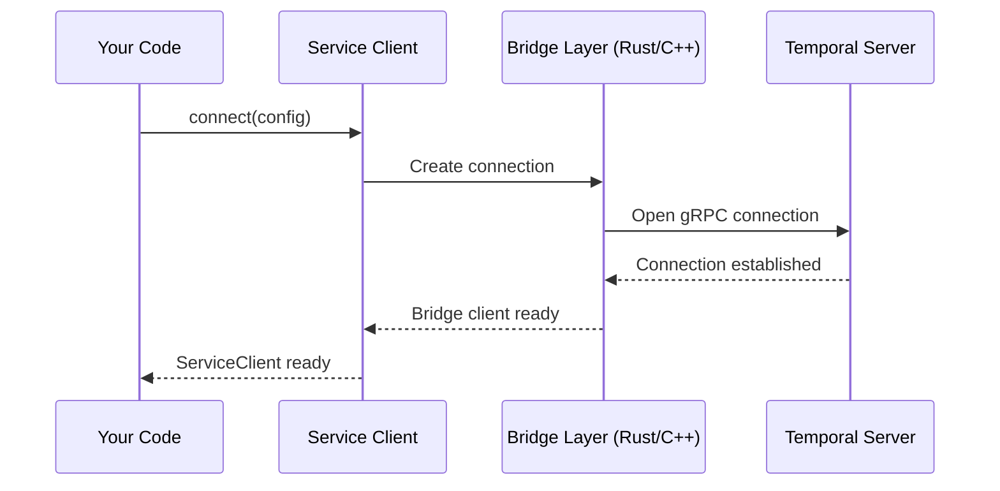
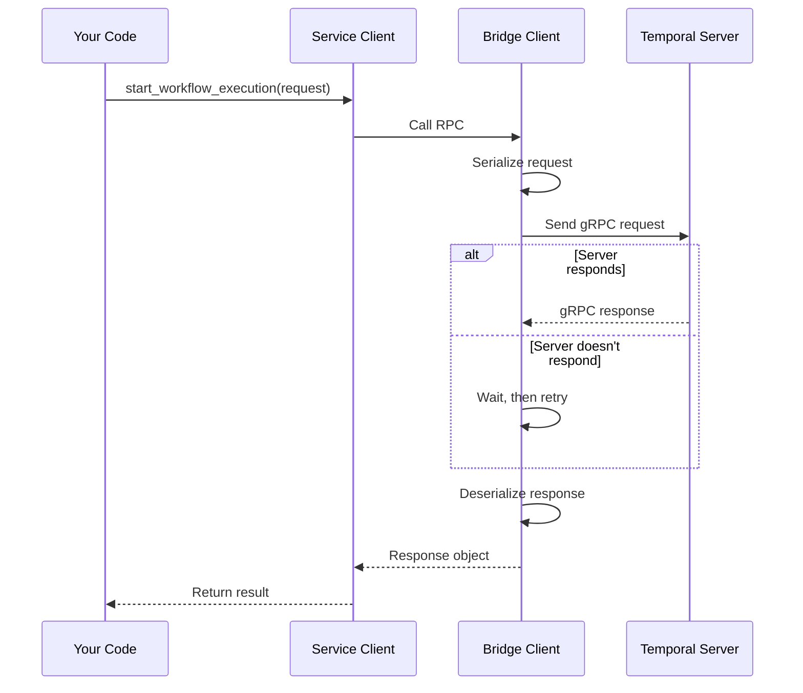

# Chapter 2: Service Client

In the previous chapter ([Configuration & Plugins](01_configuration___plugins_.md)), you learned how to configure the Temporal SDK and customize its behavior. Now you're ready to take the next step: actually communicating with the Temporal server!

## The Problem We're Solving

Imagine you've configured everything perfectly. Your settings are loaded, your plugins are ready. Now what?

You need a way to actually *talk* to the Temporal server. You need to:

- **Start a new workflow** - "Hey server, please run this workflow"
- **Check workflow status** - "Hey server, is my workflow still running?"
- **Query workflows** - "Hey server, what's the current state of my workflow?"
- **Handle connection issues** - "Hey server, if you don't respond, please retry"

Without a proper gateway, you'd have to manage all these details yourself: opening connections, handling authentication, dealing with retries, managing timeouts. That would be messy!

**The Solution:** The Service Client acts like a telephone operator at your company. You tell the operator what you need, they handle all the complexity of connecting to the right department, retrying if the line is busy, and delivering your request. You just get back the result.

## Key Concepts

Let's understand what a Service Client does:

### 1. It's a Gateway to the Server

A Service Client is your single entry point to communicate with Temporal servers. Think of it like a post office:

- You write a letter (your request)
- You hand it to the post office (Service Client)
- The post office delivers it and brings back the response
- You get your answer

```python
# Rough idea - we'll see the real code next
service_client = await ServiceClient.connect(config)
# Now you can send requests through it
response = await service_client.workflow_service.start_workflow(request)
```

The Service Client handles all the postal logistics for you.

### 2. It Groups Services by Type

Temporal servers provide different services:

- **WorkflowService** - Start workflows, query them, get history
- **OperatorService** - Admin operations like creating namespaces
- **HealthService** - Check if the server is alive

Instead of managing separate connections to each service, the Service Client organizes them all:

```python
# All services accessible through one client
client.workflow_service     # For workflow operations
client.operator_service     # For admin operations
client.health_service       # For health checks
```

This is like having one main receptionist who knows how to route you to the right department.

### 3. It Handles Reliability Concerns

Real networks aren't perfect. Services can be temporarily unavailable. The Service Client handles:

- **Retries** - If a request fails, try again automatically
- **Timeouts** - Don't wait forever for a response
- **Authentication** - Make sure you're allowed to access the server
- **Connection pooling** - Reuse connections efficiently

You just make a request, and the client handles all this behind the scenes.

## How to Use the Service Client

Let's solve our central use case: **Starting a workflow and checking its status**.

### Step 1: Connect to the Server

```python
from temporalio.service import ConnectConfig, ServiceClient

config = ConnectConfig(target_host="localhost:7233")
client = await ServiceClient.connect(config)
```

**What happens:**
- Creates a connection configuration pointing to your Temporal server
- Establishes the actual connection
- Returns a ready-to-use Service Client

**Output:** You now have a `client` object that can talk to the server.

### Step 2: Start a Workflow

```python
from temporalio.api.workflowservice.v1 import StartWorkflowExecutionRequest

request = StartWorkflowExecutionRequest(
    namespace="default",
    workflow_id="my-workflow-123",
    workflow_type_name="MyWorkflow"
)
response = await client.workflow_service.start_workflow_execution(request)
```

**What happens:**
- You create a request object describing what workflow to start
- You send it through the workflow service
- The Service Client handles retries, timeouts, and authentication
- You get back a response with the run ID

**Output:** `response.run_id` contains a unique identifier for this workflow execution.

### Step 3: Check Workflow Status

```python
from temporalio.api.workflowservice.v1 import DescribeWorkflowExecutionRequest

request = DescribeWorkflowExecutionRequest(
    namespace="default",
    execution=WorkflowExecution(
        workflow_id="my-workflow-123"
    )
)
status = await client.workflow_service.describe_workflow_execution(request)
```

**What happens:**
- You ask the Service Client to describe a specific workflow
- It sends the request to the server with retries if needed
- You get back details about the workflow's current state

**Output:** `status` contains information like whether the workflow is running, completed, or failed.

### Step 4: Handle Connection Details

You don't have to worry about any of this:

```python
# All handled automatically by Service Client:
# ✓ Retrying if server is temporarily down
# ✓ Using TLS encryption
# ✓ Adding API key to requests
# ✓ Keeping the connection alive with keep-alive pings
# ✓ Timing out requests that take too long
```

The Service Client's configuration handles all these concerns.

## Understanding the Internal Implementation

Now let's peek under the hood to understand how Service Client works.

### What Happens When You Connect

Here's the flow when you call `ServiceClient.connect()`:



**Step-by-step:**

1. You call `ServiceClient.connect()` with your configuration
2. The Service Client creates a Bridge Layer client (we'll learn about this in [Chapter 3: Runtime](03_runtime_.md))
3. The Bridge Layer opens a real gRPC connection to the Temporal server
4. Once connected, the server acknowledges
5. The Bridge returns a reference to the connection
6. You get back a Service Client ready to use

### What Happens When You Make a Request

Here's what happens when you send a request through the Service Client:



**Key points:**

- Requests are **serialized** (converted to bytes) before sending
- Responses are **deserialized** (converted back to objects) after receiving
- If the server doesn't respond, the Bridge Client automatically retries
- The whole process respects your timeout settings

## Code Deep Dive

Let's look at the actual implementation:

### The ConnectConfig Class

The `ConnectConfig` class holds all your connection settings:

```python
from temporalio.service import ConnectConfig, TLSConfig

config = ConnectConfig(
    target_host="temporal.mycompany.com:7233",
    api_key="my-secret-key",
    tls=True  # Use encryption
)
```

**What each field does:**
- `target_host` - Where the Temporal server is located
- `api_key` - Your authentication token
- `tls` - Whether to use secure encryption

Under the hood, this gets converted to a bridge configuration:

```python
bridge_config = config._to_bridge_config()
# Now it's ready to be passed to the Rust bridge layer
```

### The ServiceClient Class

In `temporalio/service.py`, `ServiceClient` is the main gateway:

```python
class ServiceClient(ABC):
    def __init__(self, config: ConnectConfig) -> None:
        self.config = config
        self.workflow_service = WorkflowService(self)
        self.operator_service = OperatorService(self)
        self.health_service = HealthService(self)
```

**What happens:**
- Stores the connection configuration
- Creates instances of different services
- Each service uses this client to make requests

### The Actual RPC Call

When you call `client.workflow_service.start_workflow_execution()`, here's what happens:

```python
async def _rpc_call(
    self,
    rpc: str,           # "StartWorkflowExecution"
    req: Message,       # Your request object
    resp_type: Type,    # Response class to expect
    **options           # timeout, retry, metadata, etc.
) -> Message:
    client = await self._connected_client()
    resp = await client.call(
        service="workflow",
        rpc=rpc,
        req=req,
        resp_type=resp_type,
        **options
    )
    return resp
```

**What it does:**
1. Gets or creates a connection to the server
2. Serializes your request to bytes
3. Sends it through the gRPC connection
4. Waits for the response
5. Deserializes the response back to an object
6. Returns it to you

### Error Handling

If something goes wrong, the Service Client converts errors to Python exceptions:

```python
from temporalio.service import RPCError, RPCStatusCode

try:
    response = await client.workflow_service.start_workflow_execution(request)
except RPCError as err:
    print(f"Status: {err.status}")  # e.g., PERMISSION_DENIED
    print(f"Message: {err.message}")  # Detailed error message
```

The `RPCStatusCode` enum has values like:
- `NOT_FOUND` - Workflow not found
- `ALREADY_EXISTS` - Workflow ID already in use
- `PERMISSION_DENIED` - Not authorized
- `UNAVAILABLE` - Server is down

## Practical Example: Complete Workflow

Let's put it all together - a complete example starting a workflow and checking its status:

```python
from temporalio.service import ConnectConfig, ServiceClient
from temporalio.api.workflowservice.v1 import StartWorkflowExecutionRequest
from temporalio.api.common.v1 import WorkflowExecution

# Step 1: Connect
config = ConnectConfig(target_host="localhost:7233")
client = await ServiceClient.connect(config)

# Step 2: Start workflow
start_req = StartWorkflowExecutionRequest(
    namespace="default",
    workflow_id="my-first-workflow"
)
response = await client.workflow_service.start_workflow_execution(start_req)
print(f"Started workflow with run ID: {response.run_id}")
```

**Output:** 
```
Started workflow with run ID: 12345-67890
```

This simple code, thanks to the Service Client:
- ✓ Handled all connection details
- ✓ Retried if the server was temporarily unavailable
- ✓ Serialized your request
- ✓ Sent it over the network
- ✓ Deserialized the response
- ✓ Returned a clean Python object

## Conclusion

You've now learned how the Service Client works:

- **It's a gateway** to all Temporal services - a single entry point for communication
- **It organizes services** into logical groups (WorkflowService, OperatorService, etc.)
- **It handles reliability** - retries, timeouts, authentication, all automatically
- **It abstracts complexity** - you work with Python objects, not bytes and network calls

The Service Client is how your Python code actually talks to Temporal servers. With it, you can start workflows, check their status, and manage them - all without worrying about the networking details.

Now that you understand how to connect to Temporal and send requests, you're ready to learn about the [Runtime](03_runtime_.md) - the engine that powers all of this behind the scenes!

---

Generated by [AI Codebase Knowledge Builder](https://github.com/The-Pocket/Tutorial-Codebase-Knowledge)