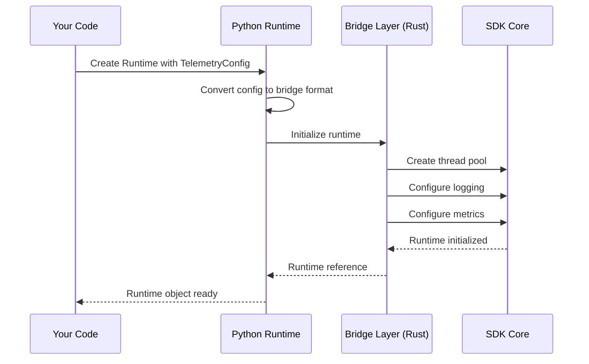
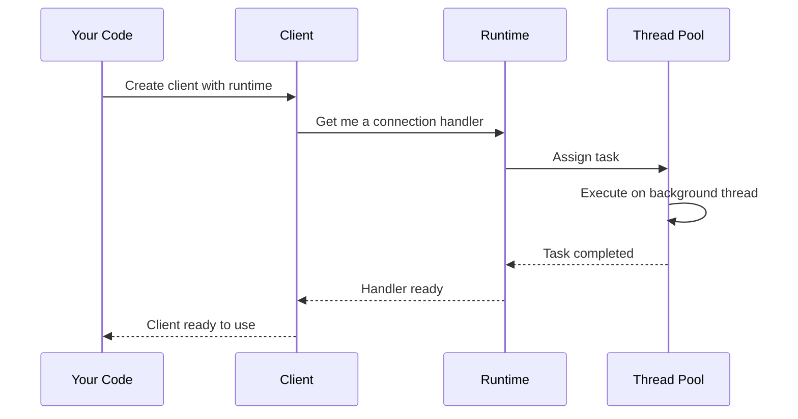

# Chapter 3: Runtime

In the previous chapter, [Service Client](02_service_client_.md), you learned how to connect to Temporal servers and send requests. Now you're ready to understand what powers everything behind the scenes: the **Runtime**.

## The Problem We're Solving

Imagine you've built a Temporal application. Your workflows are running, and everything seems to be working. But then:

- **Your application crashes, and you don't know why.** Where are the error logs?
- **Your boss asks: "How fast are our workflows?"** You have no way to measure performance.
- **You need to debug a specific workflow, but you can't see what the SDK is doing internally.** You're flying blind.
- **You need to run workflows on multiple machines.** How do you coordinate them efficiently?

All of these problems require an "engine" underneath the SDK that handles:

- **Logging** - Recording what's happening so you can debug problems
- **Metrics** - Measuring performance (how long workflows take, how many run, etc.)
- **Thread management** - Running multiple tasks efficiently without overwhelming your machine
- **Resource allocation** - Making sure your application doesn't consume too much memory or CPU

Hardcoding all this would be messy. You'd need separate logging libraries, separate metrics libraries, and manual thread management.

**The Solution:** The Runtime is the engine that powers the entire SDK. Think of it like the engine in a car. You don't need to understand how pistons work to drive a car — you just turn the key and the engine takes care of everything. Similarly, the Runtime handles all the background operations automatically.

## Key Concepts

Let's break down what the Runtime does:

### 1. The Runtime: The Central Hub

The Runtime is a single object that manages everything. When you create a Runtime, you're essentially saying:

> "Here's how I want you to handle logging. Here's how I want you to track metrics. Now please create a thread pool and manage everything."

```python
from temporalio.runtime import Runtime, TelemetryConfig

# Create a Runtime with default settings
runtime = Runtime(telemetry=TelemetryConfig())
```

**What happens:**
- A thread pool is created internally
- Logging is configured
- Metrics collection is set up
- Everything is now ready to power your SDK operations

**Output:** You get back a `runtime` object that will manage background operations for the entire application.

### 2. Telemetry: Observability Without Code Changes

Telemetry is a fancy word for "observing what's happening." The Runtime can collect two types of telemetry:

**Logging** - What is the SDK doing right now?
- "Started workflow execution"
- "Workflow completed successfully"  
- "Error: connection timeout"

**Metrics** - How well is the SDK performing?
- How many workflows are running?
- How long do workflows take on average?
- How many errors occurred?

```python
from temporalio.runtime import LoggingConfig

logging_config = LoggingConfig(
    filter="ERROR"  # Only show ERROR level logs
)
```

**What this does:** Tells the Runtime to only log errors, filtering out debug messages. This keeps your logs clean and focused.

### 3. The Default Runtime: Reuse Across Your App

You probably don't want to create a new Runtime for every client or worker. That would be wasteful! Instead, use the default Runtime that's shared across your entire application:

```python
from temporalio.runtime import Runtime

# Get the shared default Runtime
runtime = Runtime.default()
```

**What happens:**
- If no default Runtime exists, it's created automatically with sensible defaults
- If one already exists, you get that same instance
- All your clients and workers share this single Runtime

**Output:** A single Runtime that powers your entire application.

### 4. Thread Pools: Behind-the-Scenes Workers

The Runtime creates internal thread pools — these are collections of "worker threads" that run tasks in the background. Think of them like a team of employees:

```
Your Application Code (Main Thread)
        ↓
        │ "Please handle this task"
        ↓
    ╔═══════════╗
    ║ Thread 1  ║  ← Working on task A
    ║ Thread 2  ║  ← Working on task B
    ║ Thread 3  ║  ← Waiting for work
    ╚═══════════╝
    (Thread Pool in Runtime)
```

You don't create these threads manually. The Runtime does it for you! You just request work, and the Runtime's thread pool handles it.

## How to Use the Runtime

Let's solve the central problem: **Creating a logging and metrics-aware application**.

### Step 1: Set Up Logging

```python
from temporalio.runtime import Runtime, LoggingConfig

logging = LoggingConfig(filter="WARN")
runtime = Runtime(telemetry=TelemetryConfig(logging=logging))
```

**What happens:**
- The Runtime is created with logging enabled
- Only WARN level and above (WARN, ERROR) will be logged
- DEBUG and INFO messages are filtered out to keep logs clean

### Step 2: Forward Logs to Python Logger

You can have the Runtime send logs to your Python logger:

```python
import logging
from temporalio.runtime import LogForwardingConfig

python_logger = logging.getLogger("temporal")
forward = LogForwardingConfig(logger=python_logger)
logging_config = LoggingConfig(filter="INFO", forwarding=forward)
```

**What happens:**
- SDK logs are captured and sent to your Python logger
- Your existing logging configuration (file output, etc.) now applies to SDK logs
- You see SDK logs mixed with your application logs in one place

### Step 3: Set Up OpenTelemetry Metrics

If you're using OpenTelemetry (a standard for observability):

```python
from temporalio.runtime import OpenTelemetryConfig

otel = OpenTelemetryConfig(
    url="http://localhost:4317"  # Your OpenTelemetry collector
)
runtime = Runtime(telemetry=TelemetryConfig(metrics=otel))
```

**What happens:**
- Metrics are sent to your OpenTelemetry collector
- You can visualize them in tools like Grafana
- You now have visibility into how fast/slow your workflows are

### Step 4: Use the Default Runtime

In your actual application:

```python
runtime = Runtime.default()

# Now create clients/workers with this runtime
client = await temporalio.client.Client.connect(
    "localhost:7233",
    runtime=runtime
)
```

**What happens:**
- Your client uses the configured Runtime
- All logging and metrics go to your configured destinations
- You get observability "for free" without any other code changes

## Understanding the Internal Implementation

Now let's peek under the hood to understand what happens when the Runtime is created.

### What Happens When You Create a Runtime

Here's the flow:



**Step-by-step:**

1. You create a Python Runtime with a TelemetryConfig
2. Python converts your telemetry configuration to a format the Rust bridge understands
3. Python calls the bridge to initialize the core runtime
4. The bridge (Rust code) creates thread pools, sets up logging, and configures metrics in the SDK Core
5. SDK Core completes initialization and returns a reference
6. The bridge passes this reference back to Python
7. You get a Runtime object ready to use

### What Happens When You Use the Runtime

When you create a client with the Runtime:



**Step-by-step:**

1. You pass the Runtime to create a client
2. The client uses the Runtime's thread pool for background operations
3. The Runtime assigns work to available threads
4. Threads execute the work in the background
5. Results come back through the Runtime
6. Everything completes cleanly

## Code Deep Dive

Let's look at how Runtime is implemented:

### The Runtime Class Structure

In `temporalio/runtime.py`:

```python
class Runtime:
    @staticmethod
    def default() -> Runtime:
        """Get or create the shared default Runtime."""
        global _default_runtime
        if not _default_runtime:
            _default_runtime = Runtime(
                telemetry=TelemetryConfig()
            )
        return _default_runtime
```

**What this does:**
- The first time you call `Runtime.default()`, a new Runtime is created
- Future calls return that same instance
- This ensures you have one shared Runtime across your whole app

### Creating a Runtime

```python
def __init__(self, *, telemetry: TelemetryConfig) -> None:
    self._core_runtime = temporalio.bridge.runtime.Runtime(
        telemetry=telemetry._to_bridge_config()
    )
```

**What happens:**
1. Your Python `TelemetryConfig` is converted to a bridge config
2. The bridge creates the actual runtime in Rust
3. The reference is stored in `self._core_runtime`

### Converting Configuration to Bridge Format

```python
def _to_bridge_config(self) -> BridgeTelemetryConfig:
    return BridgeTelemetryConfig(
        logging=self.logging._to_bridge_config(),
        metrics=self.metrics._to_bridge_config()
    )
```

**Why conversion?**
- Python and Rust have different data structures
- We need to translate "Python speak" to "Rust speak"
- The bridge layer handles this translation

### LoggingConfig: Controlling What Gets Logged

```python
@dataclass(frozen=True)
class LoggingConfig:
    filter: Union[TelemetryFilter, str]
    forwarding: Optional[LogForwardingConfig] = None
```

**The two parts:**

1. **filter** - What level to log (ERROR, WARN, INFO, DEBUG, TRACE)
2. **forwarding** - Where to send the logs (Python logger, etc.)

```python
# Example: Only log errors, send to Python logger
config = LoggingConfig(
    filter="ERROR",
    forwarding=LogForwardingConfig(logger=my_logger)
)
```

### MetricsConfig: Different Metrics Backends

You can choose where to send metrics:

```python
# Option 1: OpenTelemetry
otel = OpenTelemetryConfig(url="http://collector:4317")
runtime = Runtime(telemetry=TelemetryConfig(metrics=otel))

# Option 2: Prometheus
prometheus = PrometheusConfig(bind_address="0.0.0.0:8888")
runtime = Runtime(telemetry=TelemetryConfig(metrics=prometheus))

# Option 3: Buffer metrics locally
buffer = MetricBuffer(buffer_size=10000)
runtime = Runtime(telemetry=TelemetryConfig(metrics=buffer))
```

**Why different options?**
- **OpenTelemetry** - For centralized monitoring (best for production)
- **Prometheus** - If you're already using Prometheus
- **MetricBuffer** - For testing or custom metric handling

## Practical Example: Production-Ready Application

Let's create a complete example with logging and metrics:

```python
from temporalio.runtime import (
    Runtime, TelemetryConfig, LoggingConfig, 
    LogForwardingConfig, OpenTelemetryConfig
)
import logging

# Step 1: Configure logging
python_logger = logging.getLogger("temporal")
logging_config = LoggingConfig(
    filter="INFO",
    forwarding=LogForwardingConfig(logger=python_logger)
)

# Step 2: Configure metrics
metrics_config = OpenTelemetryConfig(
    url="http://localhost:4317"
)

# Step 3: Create Runtime with both
telemetry = TelemetryConfig(
    logging=logging_config,
    metrics=metrics_config
)
runtime = Runtime(telemetry=telemetry)

# Step 4: Set as default so clients use it
Runtime.set_default(runtime)
```

**Output:** Your Runtime is now configured to:
- ✓ Log INFO level and above to your Python logger
- ✓ Send metrics to your OpenTelemetry collector
- ✓ Manage thread pools for background work
- ✓ Be used by default for all clients and workers

Later, when you create a client:

```python
# The client automatically uses the configured Runtime
client = await temporalio.client.Client.connect("localhost:7233")
```

Now you have full observability! 📊

## Key Takeaways

Before moving on, remember:

1. **Runtime is the engine** - It powers the entire SDK with logging, metrics, and threading
2. **TelemetryConfig controls behavior** - Configure logging and metrics the way you want
3. **Use Runtime.default()** - Share one Runtime across your whole application
4. **Telemetry is automatic** - Once configured, metrics and logs happen without code changes
5. **Different backends** - Choose OpenTelemetry, Prometheus, or buffering based on your needs

## Conclusion

The Runtime is your SDK's invisible engine, handling all the messy details of logging, metrics, and thread management. By configuring it once at startup, you get complete observability into your Temporal application without sprinkling logging code everywhere.

Now that you understand how the Runtime powers the SDK, you're ready to learn about [Workflow](04_workflow_.md) — where you'll define the actual business logic that the SDK orchestrates!

---

Generated by [AI Codebase Knowledge Builder](https://github.com/The-Pocket/Tutorial-Codebase-Knowledge)