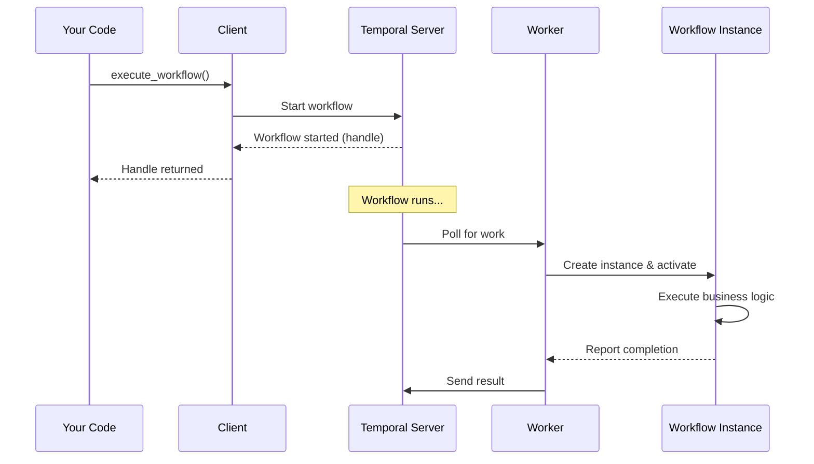
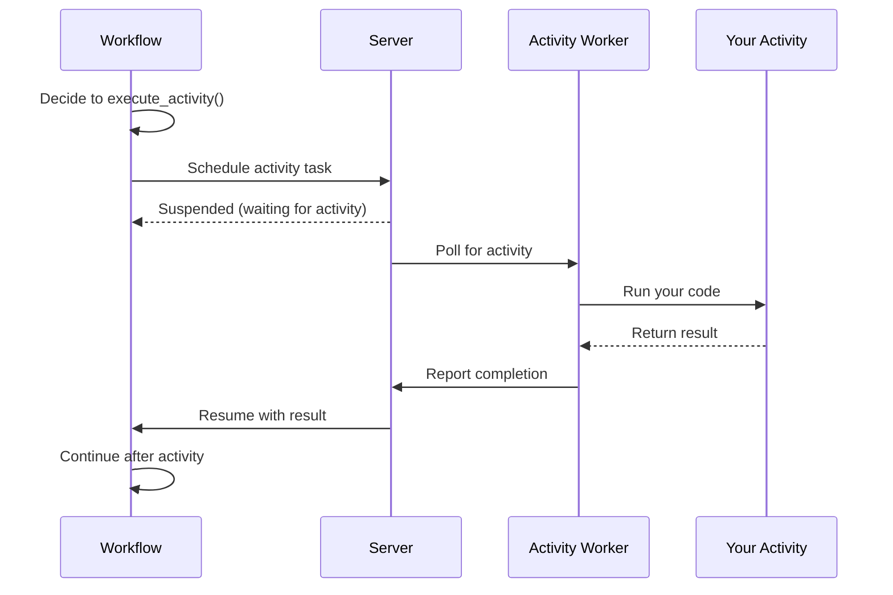
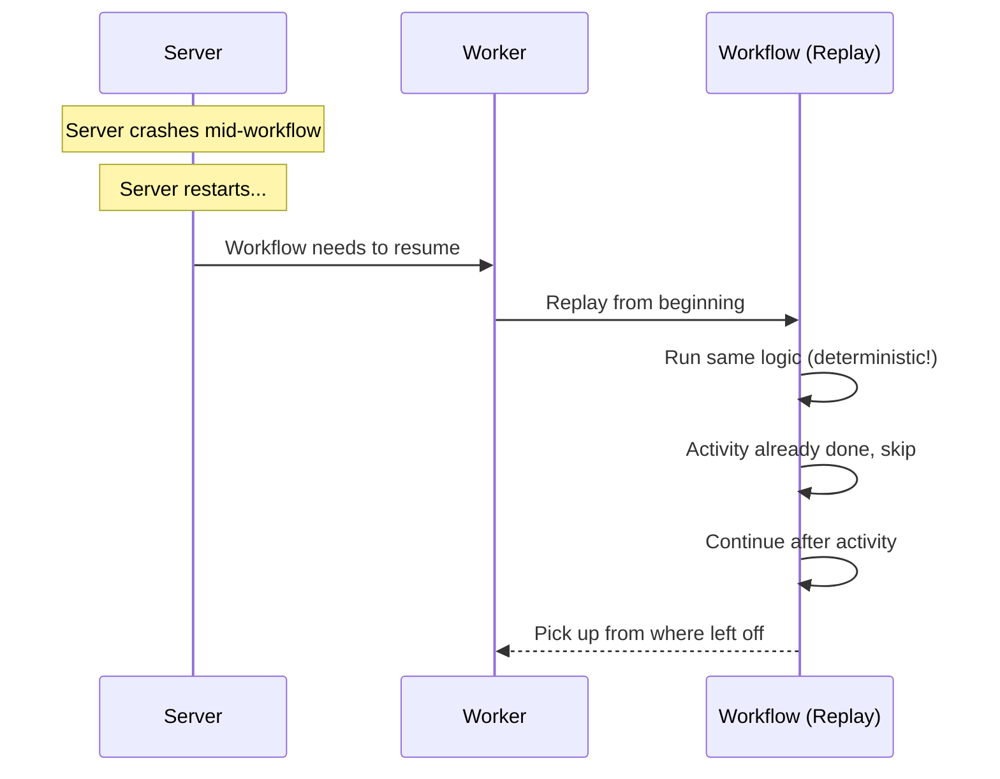

# Chapter 4: Workflow

In the previous chapter, [Runtime](03_runtime_.md), you learned about the engine that powers the entire SDK with logging, metrics, and threading. Now you're ready to learn about the core of Temporal: the **Workflow**.

## The Problem We're Solving

Imagine you're building an e-commerce system. When a customer places an order, you need to:

1. Charge their credit card
2. Update the inventory
3. Send a confirmation email
4. Schedule a shipment

Simple enough, right? But what happens when something goes wrong?

- **Server crashes during step 2?** The credit card was charged but inventory wasn't updated. Your system is broken!
- **Email service is temporarily down?** Do you retry automatically or give up?
- **Two weeks later, you need to know the state of an order.** Where do you find that information?

Without Temporal, you'd need to write complex code to handle all these scenarios: retry logic, state management, error recovery, and persistence. You'd repeat this pattern in every microservice. It would be messy!

**The Solution:** A Workflow is a guaranteed-to-complete sequence of steps that orchestrates your business logic. Think of it like a conductor directing an orchestra:

```
Customer places order
        ↓
    ╔═══════════════════════╗
    ║  Workflow (Conductor) ║
    ║  1. Charge card       ║
    ║  2. Update inventory  ║
    ║  3. Send email        ║
    ║  4. Ship order        ║
    ╚═══════════════════════╝
```

The Workflow remembers what it was doing, survives server restarts, and automatically retries failed steps. You write the business logic once, and Temporal handles all the hard stuff.

## Key Concepts

Let's understand what makes Workflows powerful:

### 1. Workflows Are Deterministic

"Deterministic" is a fancy word that means: **given the same input, a Workflow always does the same thing**.

This is crucial! Here's why:

```python
# ✗ Bad: Non-deterministic (uses current time)
@workflow.defn
class OrderWorkflow:
    @workflow.run
    async def run(self) -> str:
        now = datetime.now()  # Changes every time!
        return f"Order at {now}"

# ✓ Good: Deterministic (uses workflow time)
@workflow.defn
class OrderWorkflow:
    @workflow.run
    async def run(self) -> str:
        now = workflow.now()  # Same within workflow
        return f"Order at {now}"
```

**Why?** Temporal records every decision your Workflow makes. If a server crashes and restarts, it replays your Workflow from the beginning to get back to where it was. If your Workflow uses random numbers or current time differently on replay, it might make different decisions and everything breaks!

### 2. Workflows Cannot Access External Resources Directly

This is the biggest "gotcha" for new users. You might think:

```python
# ✗ WRONG: Don't do this!
@workflow.defn
class OrderWorkflow:
    @workflow.run
    async def run(self) -> str:
        response = requests.post("http://payment-api/charge", ...)
        return response
```

**Why is this wrong?** 
- When the Workflow replays, it would call the payment API again!
- You'd double-charge the customer. Bad!

Instead, you must use Activities:

```python
# ✓ RIGHT: Use an Activity
@activity.defn
async def charge_card(amount: float) -> str:
    return requests.post("http://payment-api/charge", ...)

@workflow.defn
class OrderWorkflow:
    @workflow.run
    async def run(self) -> str:
        result = await workflow.execute_activity(
            charge_card, 99.99
        )
        return result
```

**How it works:** When Temporal replays your Workflow, it doesn't re-execute the Activity. It remembers the result from the first time. We'll learn more about Activities in [Chapter 5: Activity](05_activity_.md).

### 3. Workflows Are Fault-Tolerant

Your Workflow automatically survives failures:

```python
@workflow.defn
class OrderWorkflow:
    @workflow.run
    async def run(self) -> str:
        # If payment fails, it retries automatically
        result = await workflow.execute_activity(
            charge_card,
            99.99,
            retry_policy=RetryPolicy(
                max_attempts=3
            )
        )
        return result
```

**What happens if payment fails?**
- Temporal retries it (up to 3 times)
- If it still fails, the Workflow fails
- But you can catch the error and handle it!

### 4. Workflows Can Wait for a Long Time

Unlike regular functions, Workflows can wait for days, weeks, or even longer:

```python
@workflow.defn
class SubscriptionWorkflow:
    @workflow.run
    async def run(self, customer_id: str) -> str:
        # Wait one month for renewal
        await workflow.sleep(timedelta(days=30))
        # Charge them for renewal
        await workflow.execute_activity(charge_card, 9.99)
        return "Renewed"
```

**Why is this useful?** Your subscription system doesn't need a cron job or scheduler. Temporal keeps track of when the sleep ends and wakes up automatically.

### 5. Workflows Can Be Queried

You can ask a running Workflow questions:

```python
@workflow.defn
class OrderWorkflow:
    def __init__(self):
        self.status = "pending"
    
    @workflow.run
    async def run(self) -> str:
        self.status = "charging"
        await workflow.execute_activity(charge_card, 99.99)
        self.status = "shipped"
        return "Done"
    
    @workflow.query
    def get_status(self) -> str:
        return self.status
```

**What this enables:** While the Workflow is running, you can ask "What's the current status?" and get an answer immediately:

```python
# Later, from your API endpoint
client = await Client.connect("localhost:7233")
handle = client.get_workflow_handle("order-123")
status = await handle.query(OrderWorkflow.get_status)
print(status)  # "charging" or "shipped" or "pending"
```

### 6. Workflows Are Version-Safe

Temporal helps you update Workflow logic safely:

```python
@workflow.defn
class OrderWorkflow:
    @workflow.run
    async def run(self, order: Order) -> str:
        # Old workflow logic
        if workflow.patched("add-discount"):
            # New logic for new runs
            discount = await workflow.execute_activity(
                calculate_discount, order
            )
        # Old workflow replays continue without new logic
        return "Completed"
```

**Why?** Old Workflows that are replaying shouldn't use new logic. `patched()` ensures backward compatibility.

## How to Use Workflows

Let's solve the central use case: **Create and run an order processing Workflow**.

### Step 1: Define Your Activity

First, define what external work needs to happen (we'll learn more in [Chapter 5: Activity](05_activity_.md)):

```python
from temporalio import activity

@activity.defn
async def charge_card(amount: float) -> str:
    print(f"Charging ${amount}")
    return f"Charged ${amount}"
```

**What this does:** Defines a reusable, fault-tolerant operation for charging a card.

### Step 2: Define Your Workflow

```python
from temporalio import workflow
from datetime import timedelta

@workflow.defn(name="OrderWorkflow")
class OrderWorkflow:
    @workflow.run
    async def run(self, order_id: str) -> str:
        result = await workflow.execute_activity(
            charge_card,
            99.99,
            start_to_close_timeout=timedelta(seconds=10)
        )
        return f"Order {order_id}: {result}"
```

**What this does:**
- Defines a Workflow named "OrderWorkflow"
- The `run` method is the main logic
- It executes the `charge_card` Activity with a timeout
- Returns a completion message

**Output:** A Workflow definition ready to run.

### Step 3: Start the Workflow

```python
from temporalio.client import Client

client = await Client.connect("localhost:7233")
handle = await client.execute_workflow(
    OrderWorkflow.run,
    "order-123",
    id="order-123"
)
```

**What happens:**
- The Workflow starts running on the Temporal server
- You get back a `handle` to the running Workflow
- The handle lets you query or wait for results

**Output:** The Workflow is now executing on the server.

### Step 4: Check the Result

```python
result = await handle.result()
print(result)  # "Order order-123: Charged $99.99"
```

**What happens:**
- Waits for the Workflow to complete
- Returns the final result
- If it was already complete, returns immediately

**Output:** The final result from your Workflow.

## Understanding the Internal Implementation

Now let's peek under the hood to understand how Workflows work.

### What Happens When You Start a Workflow

Here's the flow when you call `execute_workflow()`:



**Step-by-step:**

1. Your code asks the Client to execute a Workflow
2. The Client tells the Temporal server to start it
3. The server acknowledges and returns a handle
4. You get the handle (and can immediately return to user)
5. Meanwhile, a Worker polls for Workflow work
6. The Worker creates an instance of your Workflow class
7. It runs the `run` method
8. The Workflow completes and sends the result back

### What Happens When a Workflow Executes an Activity

Here's what happens inside the Workflow execution:



**Step-by-step:**

1. Workflow code calls `execute_activity()`
2. Workflow sends a message to the server: "Please run this Activity"
3. Workflow suspends (pauses) and waits
4. Meanwhile, an Activity Worker picks up the task
5. The Activity Worker runs your actual code
6. It returns the result
7. The server receives the result
8. The server tells the Workflow to resume with this result
9. Workflow continues its logic

### What Happens on Server Restart

This is the magic that makes Temporal powerful:



**Why this works:**

1. The server writes every decision to a log (event history)
2. When it restarts, it replays those decisions
3. Because your Workflow is deterministic, it makes the same decisions
4. Activities are detected as "already done" from the history
5. The Workflow skips re-executing them
6. It picks up right where it left off

## Code Deep Dive

Let's look at how Workflows are implemented:

### The Workflow Class

In your code, a Workflow is just a class with special decorators:

```python
@workflow.defn(name="MyWorkflow")
class MyWorkflow:
    @workflow.run
    async def run(self, param1: str) -> str:
        return f"Got {param1}"
```

**What the decorators do:**
- `@workflow.defn` - Marks this as a Workflow definition
- `@workflow.run` - Marks this as the main entry point

### The _WorkflowWorker (from provided code)

Looking at `temporalio/worker/_workflow.py`, the `_WorkflowWorker` class handles running Workflows:

```python
class _WorkflowWorker:
    async def run(self) -> None:
        while True:
            act = await self._bridge_worker().poll_workflow_activation()
            task = asyncio.create_task(
                self._handle_activation(act)
            )
```

**What this does:**
- Continuously polls the server for work (activations)
- Creates an async task for each Workflow activation
- Runs them in the background

### Handling a Workflow Activation

```python
async def _handle_activation(self, act: WorkflowActivation):
    workflow = self._running_workflows.get(act.run_id)
    if not workflow:
        workflow = self._create_workflow_instance(act, init_job)
    completion = await self._activate_workflow(workflow, act)
    await self._bridge_worker().complete_workflow_activation(
        completion
    )
```

**What this does:**
- Gets the existing Workflow or creates a new instance
- Runs the Workflow logic (activation)
- Reports completion back to server

## Practical Example: Complete Order Workflow

Let's put it all together - a complete order processing system:

```python
@activity.defn
async def charge_card(amount: float) -> str:
    print(f"Charging ${amount}...")
    return f"Charged ${amount}"

@workflow.defn(name="ProcessOrder")
class ProcessOrderWorkflow:
    @workflow.run
    async def run(self, order_id: str, amount: float) -> str:
        result = await workflow.execute_activity(
            charge_card,
            amount,
            start_to_close_timeout=timedelta(minutes=5),
            retry_policy=RetryPolicy(max_attempts=3)
        )
        return f"Order {order_id}: {result}"
```

**Usage:**

```python
client = await Client.connect("localhost:7233")
handle = await client.execute_workflow(
    ProcessOrderWorkflow.run,
    "order-456",
    99.99,
    id="order-456"
)
result = await handle.result()
print(result)  # "Order order-456: Charged $99.99"
```

**Output:**
```
Charged $99.99...
Order order-456: Charged $99.99
```

## Key Takeaways

Before moving on, remember:

1. **Workflows are deterministic** - Same input, same output, every time
2. **Workflows can't access external resources directly** - Use Activities instead
3. **Workflows are fault-tolerant** - They automatically retry and survive restarts
4. **Workflows can wait for long periods** - Temporal tracks time for you
5. **Workflows can be queried** - Ask running Workflows for their status
6. **Workflows replay on restart** - The server replays history to recover state

## Conclusion

You've learned what Workflows are and why they're powerful:

- **Workflows orchestrate your business logic** - Define the steps your system must take
- **Workflows are guaranteed to complete** - Temporal handles retries and fault tolerance
- **Workflows survive restarts** - The server replays history to recover state
- **Workflows must be deterministic** - Never use random numbers or current time directly

Now that you understand how to define Workflows, you're ready to learn about [Activity](05_activity_.md) — the work that Workflows orchestrate. Activities are where your Workflows interact with the external world!

---

Generated by [AI Codebase Knowledge Builder](https://github.com/The-Pocket/Tutorial-Codebase-Knowledge)