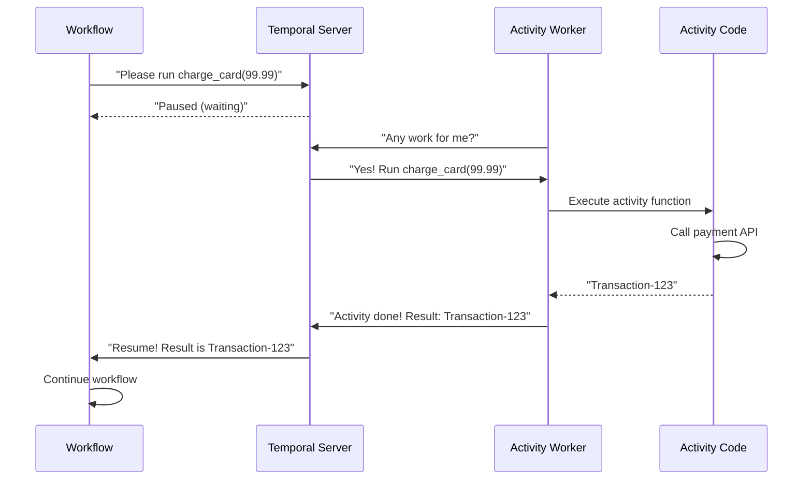
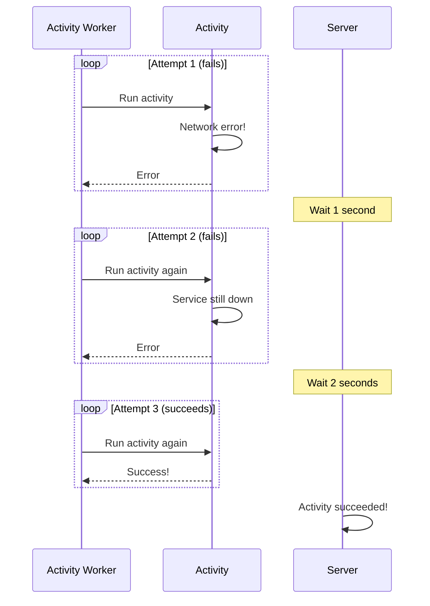

# Chapter 5: Activity

In the previous chapter, [Workflow](04_workflow_.md), you learned how to define the orchestration logic that coordinates your system. You discovered that Workflows must be deterministic and can't directly call external services. You might have wondered: "So how do I actually charge the credit card, call the API, or write to the database?"

**The answer: Activities.**

## The Problem We're Solving

Let's revisit the order processing example from [Chapter 4: Workflow](04_workflow_.md):

```python
# Inside a Workflow
result = await workflow.execute_activity(charge_card, 99.99)
```

This line calls an Activity, but we never defined what `charge_card` actually does. That's what this chapter is about!

Imagine your order processing system needs to:

1. **Charge a customer's credit card** - Call an external payment API
2. **Update inventory** - Write to a database
3. **Send a confirmation email** - Call an email service
4. **Arrange shipment** - Integrate with a shipping company

All of these involve calling external services. Your Workflow can't do it directly (it must stay deterministic). Instead, each of these operations becomes an **Activity**.

Think of it like a factory:
- The **Workflow** is the manager who decides the sequence of steps
- **Activities** are the workers who actually do each step

The manager doesn't do the work — the manager tells workers what to do and collects the results.

## Key Concepts

Let's understand what makes Activities special:

### 1. Activities Are Where the Real Work Happens

Unlike Workflows (which must be deterministic and can't access external resources), Activities are where you write normal, everyday code:

```python
@activity.defn
async def charge_card(amount: float) -> str:
    # Here you can do "dangerous" stuff!
    response = requests.post(
        "https://payment-api.example.com/charge",
        json={"amount": amount}
    )
    return response.json()["transaction_id"]
```

**What this does:** Defines an Activity that makes a real HTTP request to a payment API. This is exactly the kind of code Workflows can't run directly.

### 2. Activities Are Automatically Retried if They Fail

Networks fail. Services go down temporarily. Activities handle this gracefully:

```python
@activity.defn
async def charge_card(amount: float) -> str:
    # If this fails, Temporal automatically retries
    response = requests.post(...)
    return response.json()["transaction_id"]
```

**What happens if the payment API is temporarily down:**
- First attempt fails → Temporal waits a bit → Automatic retry
- Second attempt fails → Waits longer → Automatic retry
- Third attempt succeeds → Result sent back to Workflow

**Without Activities**, you'd have to write retry logic yourself. With Activities, it's automatic!

### 3. Activities Send Heartbeats to Show They're Alive

Imagine a long-running Activity that processes a huge file upload. How does Temporal know it's still working and hasn't crashed?

```python
from temporalio import activity

@activity.defn
async def process_large_file(file_path: str) -> str:
    # Every 30 seconds, tell Temporal "I'm still working!"
    for chunk in chunks:
        activity.heartbeat(f"Processed {chunk}")
        process(chunk)
    return "Done"
```

**What heartbeats do:** They tell Temporal "Hey, I'm still here and making progress!" If an Activity doesn't heartbeat for too long, Temporal assumes it crashed and restarts it.

### 4. Activities Have Timeouts

An Activity shouldn't run forever. You define how long it's allowed to take:

```python
# In the Workflow
result = await workflow.execute_activity(
    charge_card,
    99.99,
    start_to_close_timeout=timedelta(seconds=30)
)
```

**What this does:** "Activity, you have 30 seconds to charge the card. If you take longer, I'm giving up and failing this Activity."

### 5. Activities Get Information About Why They Were Called

When an Activity runs, it can ask: "What am I doing?" and "Is someone asking me to stop?"

```python
@activity.defn
async def charge_card(amount: float) -> str:
    # Get info about this activity execution
    info = activity.info()
    print(f"This is attempt {info.attempt} of this activity")
    
    # Check if cancellation was requested
    if activity.is_cancelled():
        print("Someone asked me to stop!")
    
    return "Charged"
```

**Why useful:** Helps with retry logic ("Is this my first attempt or my third?") and graceful shutdown ("Should I stop what I'm doing?").

### 6. Activities Are Resilient to Workflow Restarts

This is the magic part. If your Workflow server crashes mid-execution:

1. The Workflow replays from the beginning (as we learned in [Chapter 4: Workflow](04_workflow_.md))
2. When the Workflow replays and reaches the Activity call, Temporal **doesn't re-execute the Activity**
3. Instead, it remembers the result from the first time and gives it to the Workflow immediately

```python
# Workflow runs on Server 1
result = await workflow.execute_activity(charge_card, 99.99)
# Server 1 crashes AFTER charging but BEFORE completing

# Server 1 restarts
# Workflow replays
result = await workflow.execute_activity(charge_card, 99.99)
# ← Returns the result from the first execution (no double-charge!)
```

**Why this matters:** You never accidentally charge a customer twice!

## How to Use Activities

Let's solve our central use case: **Define and run an Activity that charges a credit card**.

### Step 1: Import and Define the Activity

```python
from temporalio import activity

@activity.defn
async def charge_card(amount: float) -> str:
    print(f"Charging ${amount}...")
    return f"Transaction-{amount}"
```

**What this does:**
- `@activity.defn` marks this as an Activity
- Takes `amount` as input
- Returns a transaction ID string
- Can make API calls, access databases, etc.

### Step 2: Call It from a Workflow

```python
@workflow.defn
class OrderWorkflow:
    @workflow.run
    async def run(self, order_id: str) -> str:
        tx_id = await workflow.execute_activity(
            charge_card,
            99.99
        )
        return f"Order {order_id}: {tx_id}"
```

**What this does:**
- Workflow calls the Activity with `execute_activity()`
- Passes the `charge_card` function and its argument
- Waits for the Activity to complete
- Gets the result (transaction ID)

**Output:** The Workflow receives `"Transaction-99.99"` from the Activity.

### Step 3: Register It with a Worker

We'll learn more about Workers in [Chapter 6: Worker](06_worker_.md), but here's the preview:

```python
from temporalio.worker import Worker

worker = Worker(
    client,
    task_queue="default",
    activities=[charge_card]  # Register the activity
)
```

**What this does:** Tells the Worker "If anyone asks you to run `charge_card`, here it is!"

### Step 4: With Timeouts and Retries

```python
from temporalio.common import RetryPolicy
from datetime import timedelta

result = await workflow.execute_activity(
    charge_card,
    99.99,
    start_to_close_timeout=timedelta(seconds=30),
    retry_policy=RetryPolicy(max_attempts=3)
)
```

**What this does:**
- Activity must complete within 30 seconds
- If it fails, retry up to 3 times automatically
- After 3 failures, give up and fail the Workflow

## Understanding the Internal Implementation

Now let's peek under the hood to understand how Activities work.

### What Happens When a Workflow Calls an Activity

Here's the flow:



**Step-by-step:**

1. Workflow calls `execute_activity(charge_card, 99.99)`
2. Workflow pauses and tells the server to schedule this Activity
3. An Activity Worker polls the server asking for work
4. Server gives the Activity Worker the task
5. Activity Worker executes your `charge_card` function
6. Function runs your code (payment API call)
7. Function returns a result
8. Activity Worker sends result back to server
9. Server wakes up the Workflow with the result
10. Workflow continues from where it left off

### What Happens on Failure and Retry



**What's happening:**
- Temporal automatically retries the Activity
- Wait time increases each time (exponential backoff)
- After 3 attempts, it either succeeds or finally fails
- The Workflow gets notified of the final result

## Code Deep Dive

Let's look at how Activities are implemented:

### The Activity Decorator

In `temporalio/activity.py`, the `@activity.defn` decorator does several things:

```python
def defn(fn=None, *, name=None, no_thread_cancel_exception=False):
    def decorator(fn):
        # Validates the function
        _Definition._apply_to_callable(
            fn,
            activity_name=name or fn.__name__,
        )
        return fn
    return decorator(fn) if fn else decorator
```

**What it does:**
- Validates that your function is callable
- Extracts type hints (input and output types)
- Stores metadata on the function

### The Activity Context

While an Activity runs, it has access to context information:

```python
# From temporalio/activity.py
@dataclass(frozen=True)
class Info:
    activity_id: str
    activity_type: str
    attempt: int
    started_time: datetime
    schedule_to_close_timeout: Optional[timedelta]
    # ... and more
```

**Usage in your activity:**

```python
@activity.defn
async def charge_card(amount: float) -> str:
    info = activity.info()
    print(f"Attempt {info.attempt} of charging ${amount}")
    return "Done"
```

### The Activity Worker

The Activity Worker (in `temporalio/worker/_activity.py`) continuously polls for work:

```python
class _ActivityWorker:
    async def run(self) -> None:
        while True:
            # Poll server: "Do you have any work?"
            task = await self._bridge_worker().poll_activity_task()
            # Execute the activity
            result = await self._execute_activity(task)
            # Report result back to server
            await self._bridge_worker().complete_activity_task(result)
```

**What this does:**
- Runs in a loop waiting for Activities to execute
- Gets a task from the server (includes function name and arguments)
- Executes your Activity code
- Sends the result back to the server

### Handling Retries

When an Activity fails, the retry logic kicks in:

```python
# In the worker's task completion handling
if activity_failed:
    # Check retry policy
    if attempt < retry_policy.max_attempts:
        # Schedule another attempt (with backoff delay)
        schedule_retry_after_backoff()
    else:
        # Max retries reached, fail the workflow
        complete_workflow_with_failure()
```

**The retry happens automatically** — the server reschedules the Activity after a delay.

### Heartbeating

When you call `activity.heartbeat()`, here's what happens:

```python
def heartbeat(*details):
    # Get current activity context
    ctx = _Context.current()
    # Convert details using the data converter
    encoded = data_converter.encode(details)
    # Send to server
    bridge_worker.record_activity_heartbeat(encoded)
```

**What the server does with heartbeats:**
- Records the heartbeat details
- Resets the heartbeat timeout timer
- If an Activity crashes and restarts, these details are available as `activity.info().heartbeat_details`

## Practical Example: Complete Activity

Let's create a complete example with retries, heartbeats, and error handling:

```python
@activity.defn
async def charge_card(amount: float) -> str:
    info = activity.info()
    print(f"Charging ${amount} (attempt {info.attempt})")
    
    # Heartbeat to show progress
    activity.heartbeat("Starting charge...")
    
    try:
        response = requests.post(
            "https://api.payment.com/charge",
            json={"amount": amount, "timeout": 10}
        )
        activity.heartbeat("API call completed")
        return response.json()["transaction_id"]
    except Exception as e:
        # If it's the first attempt, retry will happen automatically
        if info.attempt < 3:
            print(f"Failed, will retry. Error: {e}")
        raise  # Let Temporal handle the retry
```

**Usage in a Workflow:**

```python
result = await workflow.execute_activity(
    charge_card,
    99.99,
    start_to_close_timeout=timedelta(minutes=1),
    retry_policy=RetryPolicy(
        max_attempts=3,
        initial_interval=timedelta(seconds=1)
    )
)
print(f"Transaction ID: {result}")
```

**Output:**
```
Charging $99.99 (attempt 1)
Transaction ID: txn-12345
```

If the payment API is temporarily down:
```
Charging $99.99 (attempt 1)
Failed, will retry. Error: Connection timeout
[Wait 1 second]
Charging $99.99 (attempt 2)
Failed, will retry. Error: Connection timeout
[Wait 2 seconds]
Charging $99.99 (attempt 3)
Transaction ID: txn-12345
```

## Key Takeaways

Before moving on, remember:

1. **Activities do the real work** - They call APIs, databases, and external services
2. **Workflows orchestrate Activities** - Workflows decide the sequence; Activities execute it
3. **Activities are automatically retried** - No need to write retry logic yourself
4. **Activities send heartbeats** - Show progress for long-running operations
5. **Activities survive server restarts** - Results are cached so you don't accidentally repeat work
6. **Activities have timeouts** - You control how long they're allowed to take

## Conclusion

You've learned what Activities are and why they're crucial to Temporal:

- **Activities bridge the gap** between the deterministic Workflow world and the real, messy external systems
- **Activities are resilient** - They retry automatically and survive crashes
- **Activities show progress** - Through heartbeats, you can monitor long-running operations
- **Activities never run twice** - Results are cached to prevent duplicate work

Activities are the workers in your factory. Workflows decide what work to do, and Activities actually do it!

Now that you understand Activities, you're ready to learn about [Worker](06_worker_.md) — how to actually run Activities and Workflows on your machines!

---

Generated by [AI Codebase Knowledge Builder](https://github.com/The-Pocket/Tutorial-Codebase-Knowledge)