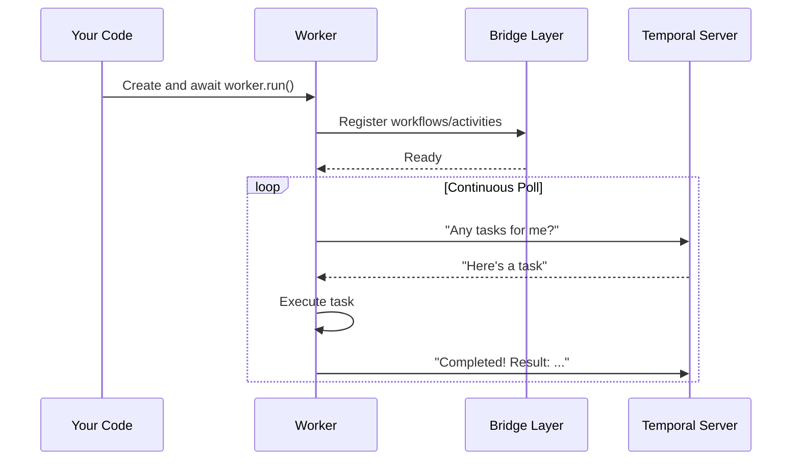
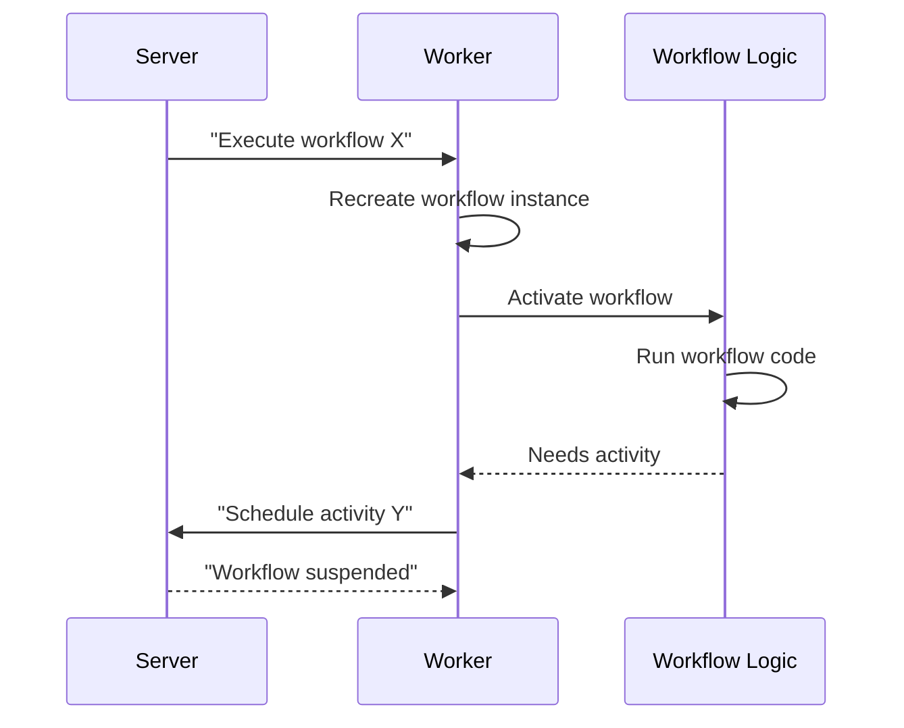
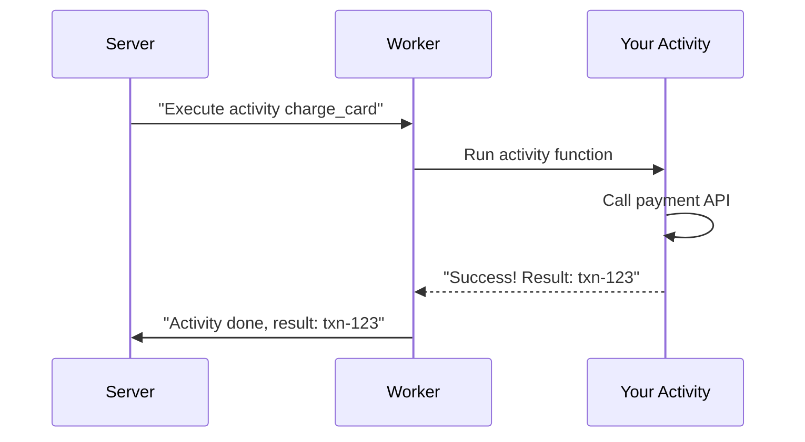

# Chapter 6: Worker

In the previous chapter, [Activity](05_activity_.md), you learned how to define units of work that your system executes — Activities that call APIs, write to databases, and interact with external services. You also defined [Workflows](04_workflow_.md) that orchestrate these Activities in a specific sequence.

But here's the big question: **Where does all this actually run?**

Who polls the Temporal server asking "Do you have any work for me?" Who executes your Activities? Who keeps your Workflows running? 

**The answer: Workers.**

## The Problem We're Solving

Imagine you've built a complete order processing system:

- **Workflows** define the steps: charge card → update inventory → send email → schedule shipment
- **Activities** implement each step: `charge_card()`, `update_inventory()`, `send_email()`, `schedule_shipment()`

But right now, they only exist as code definitions. They're not running anywhere!

You need something to:

1. **Poll the Temporal server continuously** - "Hey server, do you have any work for me?"
2. **Fetch tasks from the queue** - "I'll take this workflow task and this activity task"
3. **Execute your code** - Actually run the Activities and Workflows you defined
4. **Report results back** - "I finished! Here's what happened"
5. **Handle errors gracefully** - "The Activity crashed, I'm reporting that"
6. **Manage resources** - "Don't give me too much work at once, I can only handle N tasks"

Without a Worker, your definitions just sit in code files doing nothing. It's like having a brilliant business plan but nobody to execute it!

**The Solution:** A Worker is the actual executor. Think of it like a factory worker:

```
Temporal Server (Boss)
        ↓
   "I have work!"
        ↓
    Worker
    (Executes tasks)
        ↓
  [Runs Activity]
  [Runs Workflow]
        ↓
   "Done! Result: ..."
```

The Worker continuously checks with the server for work, picks it up, executes it, and reports results.

## Key Concepts

Let's understand what a Worker does:

### 1. A Worker Polls the Server for Work

The Worker is always asking: "Do you have any tasks for me?" This happens automatically in a loop:

```python
while True:
    task = await server.give_me_work()
    execute(task)
    report_result(task)
```

**Why polling?** It's simpler than the server pushing work to you. The Worker controls when it's ready for more work.

### 2. A Worker Handles Multiple Task Types

The same Worker can execute:

- **Workflow Tasks** - Run workflow logic
- **Activity Tasks** - Run activity logic
- **Nexus Tasks** - (Advanced) Call external services through Nexus

```python
worker = Worker(
    task_queue="orders",
    workflows=[OrderWorkflow],     # ← Can run workflows
    activities=[charge_card]       # ← Can run activities
)
```

**Result:** One Worker handles all types of tasks for your `orders` task queue.

### 3. Workers Are Tied to Task Queues

Think of a task queue like a specific queue at a bank. Different queues for different services:

```
Temporal Server
    ├─ Queue: "orders"
    │  └─ Worker A listens here
    │
    └─ Queue: "payments"
       └─ Worker B listens here
```

Workers listen to specific queues and only pick up work from their assigned queue.

### 4. Workers Run in the Background

Once you start a Worker, it runs continuously and doesn't return:

```python
worker = Worker(...)
await worker.run()  # ← This blocks and runs forever
```

**Normal pattern:** Start the Worker in one thread/process and your API server in another.

### 5. Workers Manage Resources

Workers have limits to prevent overwhelming your machine:

```python
worker = Worker(
    task_queue="orders",
    max_concurrent_activity_task_executions=10,
    # ← Max 10 activities at the same time
)
```

**Why?** If you have 1000 pending tasks, the Worker won't try to run all 1000 simultaneously. It throttles itself.

### 6. Workers Report Back to Server

Every action gets reported:

- "I completed workflow X with result Y"
- "I started activity Z, currently in progress"
- "Activity Q failed with error R"

The server uses these reports to update workflow state and decide next steps.

## How to Use Workers

Let's solve the central use case: **Start a Worker that executes your Workflows and Activities**.

### Step 1: Create a Client Connection

```python
from temporalio.client import Client

client = await Client.connect("localhost:7233")
```

**What this does:** Connects to your Temporal server. The Worker will use this to communicate.

### Step 2: Create a Worker

```python
from temporalio.worker import Worker

worker = Worker(
    client,
    task_queue="orders",
    workflows=[OrderWorkflow],
    activities=[charge_card, update_inventory]
)
```

**What this does:**
- Creates a Worker that listens on the "orders" task queue
- Registers your Workflow class
- Registers your Activity functions
- Worker is now configured but not running yet

**Output:** A `worker` object ready to execute.

### Step 3: Run the Worker

```python
await worker.run()
```

**What happens:**
- Worker starts polling the Temporal server
- Whenever a task arrives in the "orders" queue, the Worker picks it up
- Your Workflow or Activity code executes
- Results are reported back

**Output:** Worker runs continuously (until you stop the process).

### Step 4: Combine with Your Application

```python
# In your main.py
async def main():
    client = await Client.connect("localhost:7233")
    worker = Worker(client, task_queue="orders", ...)
    await worker.run()  # Runs forever

asyncio.run(main())
```

**Result:** Your Worker is now alive and executing tasks!

## Understanding the Internal Implementation

Now let's peek under the hood to understand what happens when a Worker executes work.

### What Happens When a Worker Starts

Here's the flow:



**Step-by-step:**

1. Your code creates a Worker with task queue and registered definitions
2. Worker configures the Bridge Layer with your definitions
3. Worker enters a loop, continuously asking the server for work
4. Server responds with a task (workflow or activity)
5. Worker executes the task (your code runs)
6. Worker reports completion back to server
7. Loop continues, waiting for next task

### What Happens When a Workflow Task Arrives



**Step-by-step:**

1. Server sends a workflow activation task
2. Worker creates or recreates a Workflow instance
3. Worker activates the Workflow (runs its logic)
4. Workflow code runs and decides to execute an Activity
5. Workflow suspends (pauses)
6. Worker reports to server what to do next

### What Happens When an Activity Task Arrives



**Step-by-step:**

1. Server sends an activity task
2. Worker executes your Activity function
3. Your Activity code runs (real work happens)
4. Activity returns a result
5. Worker reports completion with result to server

## Code Deep Dive

Let's look at how Workers are implemented:

### The Worker Class

In `temporalio/worker/_worker.py`, the Worker class:

```python
class Worker:
    def __init__(
        self,
        client: Client,
        task_queue: str,
        workflows: Sequence[Type] = [],
        activities: Sequence[Callable] = [],
    ):
        self.client = client
        self.task_queue = task_queue
        self.workflows = workflows
        self.activities = activities
```

**What this does:** Stores all configuration needed to execute work.

### Starting the Worker

```python
async def run(self) -> None:
    # Create internal workers for workflows and activities
    workflow_worker = _WorkflowWorker(...)
    activity_worker = _ActivityWorker(...)
    
    # Run both in parallel
    await asyncio.gather(
        workflow_worker.run(),
        activity_worker.run()
    )
```

**What this does:**
- Creates specialized workers for workflows and activities
- Runs both simultaneously (using `asyncio.gather`)
- Blocks forever until cancelled

### The Workflow Worker

In `temporalio/worker/_workflow.py`:

```python
class _WorkflowWorker:
    async def run(self) -> None:
        while True:
            # Poll for workflow activation
            activation = await self._poll_workflow()
            # Execute the workflow
            await self._handle_activation(activation)
            # Report completion
            await self._complete_activation(activation)
```

**What this does:** Continuously polls, executes, and reports.

### The Activity Worker

In `temporalio/worker/_activity.py`:

```python
class _ActivityWorker:
    async def run(self) -> None:
        while True:
            # Poll for activity task
            task = await self._poll_activity()
            # Execute the activity
            result = await self._execute_activity(task)
            # Report completion
            await self._complete_activity(result)
```

**Same pattern:** Poll → Execute → Report.

### Registering Definitions

When you pass workflows and activities:

```python
worker = Worker(
    client,
    task_queue="orders",
    workflows=[OrderWorkflow],
    activities=[charge_card]
)
```

Internally, the Worker:

```python
# Stores the classes/functions
self._workflow_definitions = {
    "OrderWorkflow": OrderWorkflow  # Maps name to class
}
self._activity_definitions = {
    "charge_card": charge_card  # Maps name to function
}

# When a task arrives with name "OrderWorkflow",
# look it up in this dict and instantiate it
```

## Practical Example: Complete Worker Setup

Let's create a complete, working example:

```python
from temporalio.client import Client
from temporalio.worker import Worker

# Define your activity
@activity.defn
async def charge_card(amount: float) -> str:
    print(f"Charging ${amount}")
    return f"txn-{amount}"

# Define your workflow
@workflow.defn
class OrderWorkflow:
    @workflow.run
    async def run(self, order_id: str) -> str:
        result = await workflow.execute_activity(
            charge_card, 99.99
        )
        return f"Order {order_id}: {result}"
```

Now start the Worker:

```python
async def main():
    client = await Client.connect("localhost:7233")
    worker = Worker(
        client,
        task_queue="orders",
        workflows=[OrderWorkflow],
        activities=[charge_card]
    )
    await worker.run()

asyncio.run(main())
```

**Output:** Worker starts and waits for tasks:
```
Worker started on task queue: orders
Listening for work...
```

When you start a workflow from another process:

```python
# In a different process
handle = await client.execute_workflow(
    OrderWorkflow.run,
    "order-123",
    id="order-123"
)
result = await handle.result()
print(result)  # "Order order-123: txn-99.99"
```

**What the Worker sees:**
```
[Workflow Task Received] OrderWorkflow
[Executing] order-123
[Activity Scheduled] charge_card
[Activity Task Received] charge_card
Charging $99.99
[Activity Completed] txn-99.99
[Workflow Completed]
```

## Multiple Workers, Scaling Up

As your system grows, you might run multiple Workers:

```
Machine 1: Worker listening to "orders" queue
Machine 2: Worker listening to "orders" queue  
Machine 3: Worker listening to "payments" queue
```

The Temporal server automatically distributes work among Workers on the same queue. This is how you scale!

## Key Takeaways

Before moving on, remember:

1. **Workers execute your code** - They're the runtime that actually runs Workflows and Activities
2. **Workers poll continuously** - They ask the server for work in a loop
3. **Workers are tied to task queues** - Each Worker listens to a specific queue
4. **Workers manage resources** - They throttle work to prevent overload
5. **Workers report everything** - Every action is reported back to the server
6. **Multiple Workers = scaling** - Add more Workers to process more work in parallel

## Conclusion

You've learned what Workers do and why they're essential:

- **Workers are the executors** - They take your Workflow and Activity definitions and actually run them
- **Workers are simple** - Create one, tell it what to run, call `await worker.run()`, and you're done
- **Workers are scalable** - Run multiple Workers to handle more work
- **Workers bridge the gap** - They connect your Python code to the Temporal server

The Worker is the final piece that brings everything together. You have Workflows that orchestrate, Activities that execute external work, and now Workers that run it all.

With a running Worker, your Temporal system is complete and executing real work! Now you're ready to learn about [Data Converter](07_data_converter_.md) — how Temporal serializes and deserializes the data that flows through your Workflows and Activities.

---

Generated by [AI Codebase Knowledge Builder](https://github.com/The-Pocket/Tutorial-Codebase-Knowledge)