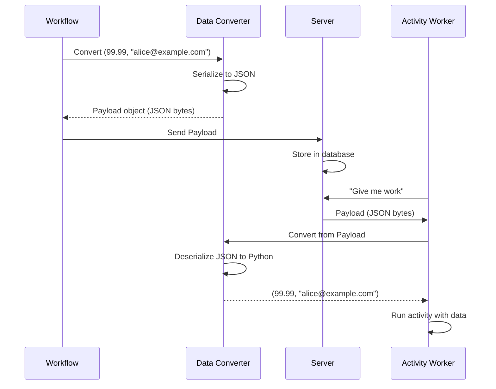
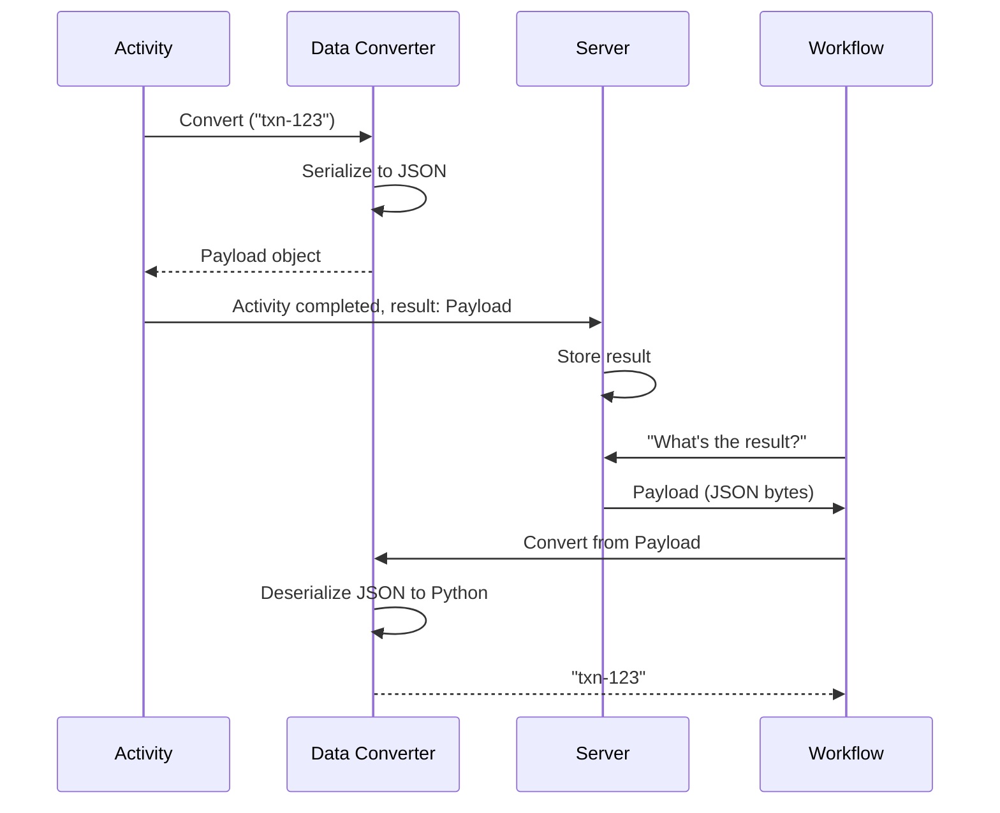

# Chapter 7: Data Converter

In the previous chapter, [Worker](06_worker_.md), you learned how to create Workers that continuously poll the Temporal server and execute your Workflows and Activities. Your Workers are running, tasks are executing, and everything seems great!

But then you realize a problem: **How does the data actually travel?**

When your Workflow calls an Activity with a parameter like `charge_card(99.99)`, that number needs to be sent over the network to the Activity Worker. When the Activity returns `"Transaction-123"`, that string needs to be sent back over the network to the Workflow. 

Computers can't send Python objects over the network directly. They need to convert them to bytes (a format that can travel). This is where the **Data Converter** comes in.

## The Problem We're Solving

Imagine you're building a workflow that passes data between different parts of your system:

```python
# Workflow sends data to Activity
result = await workflow.execute_activity(
    charge_card,
    99.99,          # ← This number needs to travel over network
    customer_id=456 # ← This too
)
```

Without a Data Converter, you'd have to manually:

1. **Convert the number `99.99` to bytes** - "How do I turn a Python float into bytes?"
2. **Send those bytes over the network**
3. **On the other side, convert bytes back to a float** - "Was this 99.99 or 999.9?"
4. **Do the same for every data type** - Strings, lists, dictionaries, custom objects

This would be tedious and error-prone. You'd write the same serialization code over and over.

**The Solution:** The Data Converter is an automatic translator. Think of it like a postal service:

```
Your Python object (99.99)
        ↓
   Data Converter (Packages it)
        ↓
   Bytes over network (portable)
        ↓
   Data Converter (Unpacks it)
        ↓
   Python object again (99.99)
```

The Data Converter automatically handles the conversion to/from a format Temporal can store and transmit. You just pass your Python objects normally, and the converter handles the complexity.

## Key Concepts

Let's understand what Data Converters do:

### 1. Serialization: Converting Python Objects to Bytes

Serialization means "turning a Python object into a format that can be stored or transmitted."

```python
# Before: Python object
data = {"amount": 99.99, "customer": "Alice"}

# Data Converter serializes it
bytes_data = b'{"amount": 99.99, "customer": "Alice"}'

# Now it can be stored in a database or sent over network
```

**Why?** Bytes are universal. Every computer can read bytes. Python objects are specific to Python. A Java service or database can't directly understand a Python dictionary.

### 2. Deserialization: Converting Bytes Back to Python Objects

Deserialization is the reverse: "turning stored bytes back into a Python object."

```python
# Before: Raw bytes
bytes_data = b'{"amount": 99.99, "customer": "Alice"}'

# Data Converter deserializes it
data = {"amount": 99.99, "customer": "Alice"}

# Now you have a Python object you can use
```

**Why?** You want to work with Python objects in your code, not raw bytes. The converter handles the conversion automatically.

### 3. Different Formats: JSON, Pydantic, and Custom

Data can be serialized in different formats. The built-in ones are:

**JSON Format** - Simple text-based format, human-readable:
```json
{"amount": 99.99, "customer": "Alice"}
```

**Pydantic Format** - Uses Python dataclasses for type safety:
```python
@dataclass
class Payment:
    amount: float
    customer: str
```

**Custom Format** - You write your own serialization logic for special needs.

### 4. Payloads: The Envelope

Temporal wraps serialized data in a "Payload" object. Think of it like a mail envelope:

```
┌─────────────────────┐
│     Payload         │
├─────────────────────┤
│ encoding: "json/plain" │
│ data: b'..bytes..'  │
│ metadata: {...}     │
└─────────────────────┘
```

The Payload contains:
- The actual bytes
- Information about how it was encoded (so you know how to decode it)
- Optional metadata about the data

### 5. Automatic Conversion: You Don't Think About It

Once you configure a Data Converter, conversion happens automatically:

```python
# In your Workflow
result = await workflow.execute_activity(
    charge_card,
    99.99  # ← Data Converter automatically serializes
)

# In your Activity
@activity.defn
async def charge_card(amount: float) -> str:
    # amount is already a float! ← Data Converter automatically deserialized
    print(f"Charging ${amount}")
    return "Done"
```

You never think about serialization. It just works!

## How to Use Data Converters

Let's solve the central use case: **Use the default JSON Data Converter to send complex Python objects between Workflows and Activities**.

### Step 1: Create a Data Converter

```python
from temporalio.converter import JSONDataConverter

converter = JSONDataConverter()
```

**What this does:** Creates a Data Converter that uses JSON format. JSON can handle numbers, strings, lists, and dictionaries.

**Output:** A converter object ready to use.

### Step 2: Use It When Creating a Client

```python
client = await Client.connect(
    "localhost:7233",
    data_converter=converter
)
```

**What happens:** The client now uses your JSON converter for all serialization/deserialization.

**Output:** The client is configured with the Data Converter.

### Step 3: Define Activities with Complex Types

```python
@activity.defn
async def charge_card(amount: float, email: str) -> dict:
    # Both parameters are automatically deserialized from JSON
    result = {
        "transaction_id": "txn-123",
        "amount": amount,
        "email": email
    }
    return result
```

**What happens:**
- Workflow passes `amount` and `email`
- Data Converter serializes them to JSON bytes
- Activity Worker receives bytes, Data Converter deserializes back to Python types
- Your activity code works with normal Python values

### Step 4: Use It in Workers

```python
worker = Worker(
    client,
    task_queue="default",
    workflows=[MyWorkflow],
    activities=[charge_card],
    data_converter=converter
)
```

**What happens:** Worker uses the same converter, so serialization/deserialization is consistent across the system.

**Output:** Worker can now correctly deserialize tasks it receives from the server.

## Understanding the Internal Implementation

Now let's peek under the hood to understand how Data Conversion works.

### What Happens When You Send Data

Here's the flow when a Workflow passes data to an Activity:



**Step-by-step:**

1. Workflow calls `execute_activity(charge_card, 99.99, email)`
2. Data Converter takes those Python objects
3. Converter serializes them to JSON bytes
4. Wraps bytes in a Payload object
5. Workflow sends Payload to server
6. Server stores the Payload (as bytes, in a database)
7. Activity Worker polls for work
8. Server sends the Payload back
9. Data Converter deserializes Payload back to Python objects
10. Activity receives the original Python objects

### What Happens When You Return Data

When an Activity returns a value, the same process happens in reverse:



**Result:** The Workflow gets back the string `"txn-123"` as if the Activity returned it directly.

## Code Deep Dive

Let's look at how Data Converters are implemented:

### The DataConverter Interface

In `temporalio/converter.py`, the base class looks like:

```python
class DataConverter(ABC):
    @abstractmethod
    def encode(self, values: Sequence[Any]) -> List[Payload]:
        """Convert Python objects to Payloads."""
        ...
    
    @abstractmethod
    def decode(self, payloads: Sequence[Payload]) -> List[Any]:
        """Convert Payloads back to Python objects."""
        ...
```

**What this shows:**
- `encode()` takes Python values and returns Payload objects
- `decode()` takes Payload objects and returns Python values

### JSONDataConverter Implementation

The built-in JSON converter:

```python
class JSONDataConverter(DataConverter):
    def encode(self, values: Sequence[Any]) -> List[Payload]:
        result = []
        for value in values:
            # Convert Python object to JSON string
            json_str = json.dumps(value)
            # Wrap in Payload
            payload = Payload(
                data=json_str.encode(),
                metadata={"encoding": b"json/plain"}
            )
            result.append(payload)
        return result
```

**What this does:**
1. Takes Python objects (numbers, strings, dictionaries, etc.)
2. Converts each to a JSON string
3. Encodes the string as bytes
4. Wraps in a Payload with metadata indicating JSON format

### How Deserialization Works

```python
class JSONDataConverter(DataConverter):
    def decode(self, payloads: Sequence[Payload]) -> List[Any]:
        result = []
        for payload in payloads:
            # Read the bytes
            json_bytes = payload.data
            # Decode bytes to string
            json_str = json_bytes.decode()
            # Parse JSON string to Python object
            value = json.loads(json_str)
            result.append(value)
        return result
```

**What this does:**
1. Takes Payload objects with JSON bytes
2. Decodes bytes to strings
3. Parses JSON strings to Python objects
4. Returns the Python objects

### Type Hints for Better Conversion

Type hints help the converter know what to expect:

```python
@activity.defn
async def charge_card(
    amount: float,        # ← Type hint
    email: str            # ← Type hint
) -> dict:               # ← Type hint
    pass
```

**Why?** The converter can use these hints to deserialize the right types. Without hints, JSON numbers are just "numbers" - the converter might not know if you wanted an `int` or `float`.

## Practical Example: Custom Data Types

Let's create a complete example with a custom Python class:

```python
from dataclasses import dataclass
from temporalio.converter import JSONDataConverter

@dataclass
class PaymentRequest:
    amount: float
    email: str
```

Now use it in a Workflow:

```python
@activity.defn
async def charge_card(request: PaymentRequest) -> dict:
    print(f"Charging {request.email}: ${request.amount}")
    return {"success": True, "txn": "txn-123"}
```

And call it from Workflow:

```python
@workflow.defn
class OrderWorkflow:
    @workflow.run
    async def run(self) -> dict:
        request = PaymentRequest(
            amount=99.99,
            email="alice@example.com"
        )
        result = await workflow.execute_activity(
            charge_card,
            request
        )
        return result
```

**What happens:**
- Workflow creates a `PaymentRequest` object
- Data Converter serializes it to JSON: `{"amount": 99.99, "email": "alice@example.com"}`
- Activity Worker receives JSON and deserializes back to `PaymentRequest`
- Activity runs with the original object

**Output:** Seamless data passing between Workflow and Activity!

## Using Different Data Converters

The SDK supports multiple converters. Here's how to use Pydantic:

```python
from temporalio.converter import PydanticDataConverter

converter = PydanticDataConverter()
client = await Client.connect(
    "localhost:7233",
    data_converter=converter
)
```

**Why Pydantic?** It provides strong type validation and is great for complex data models with validation rules.

## Chaining Converters

You can combine converters for different encoding strategies:

```python
from temporalio.converter import CompositeDataConverter, JSONDataConverter

composite = CompositeDataConverter(
    encoders=[JSONDataConverter()],
    decoders=[JSONDataConverter()]
)
```

**Why?** Different parts of your system might use different formats. The composite converter tries each one.

## Key Takeaways

Before moving on, remember:

1. **Data Converters are translators** - They convert Python objects to/from bytes for transmission
2. **Serialization = Python → Bytes** - Converter packages your objects
3. **Deserialization = Bytes → Python** - Converter unpacks the bytes
4. **Automatic and transparent** - Once configured, you don't think about conversion
5. **Multiple formats available** - JSON, Pydantic, or custom converters
6. **Type hints help** - Converters can use hints to deserialize correctly
7. **Consistency matters** - Use the same converter everywhere (Client, Worker, Activities)

## Conclusion

You've learned what Data Converters do and why they're essential:

- **Data Converters bridge the gap** between Python objects and bytes that travel over networks
- **They're automatic** - Once configured, you pass Python objects normally without thinking about serialization
- **They're flexible** - Choose JSON, Pydantic, or create your own based on your needs
- **They're transparent** - The conversion happens behind the scenes

Data Converters are like the postal service of your Temporal system. They package, transport, and unpack data between Workflows and Activities without you having to think about the details.

Now that you understand how data flows through your Temporal system, you're ready to learn about [Exception Handling](08_exception_handling_.md) — what happens when things go wrong and how Temporal helps you handle errors gracefully!

---

Generated by [AI Codebase Knowledge Builder](https://github.com/The-Pocket/Tutorial-Codebase-Knowledge)