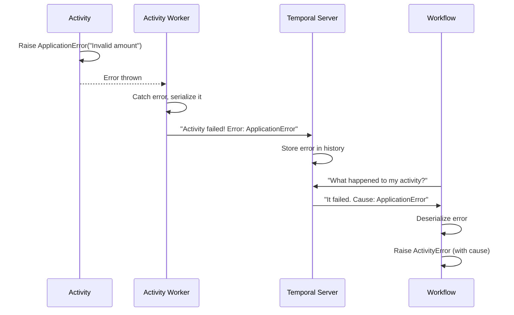
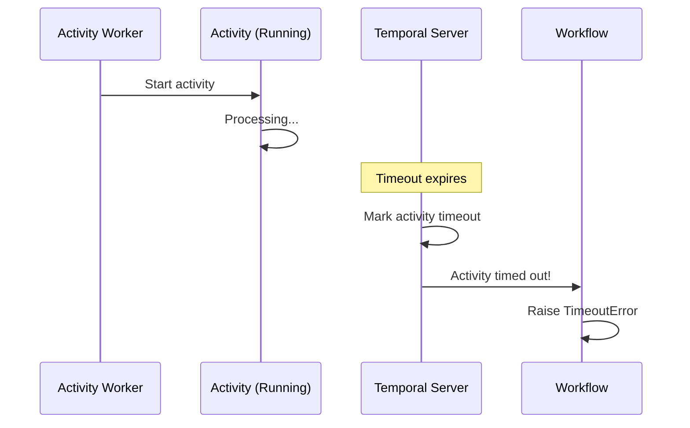
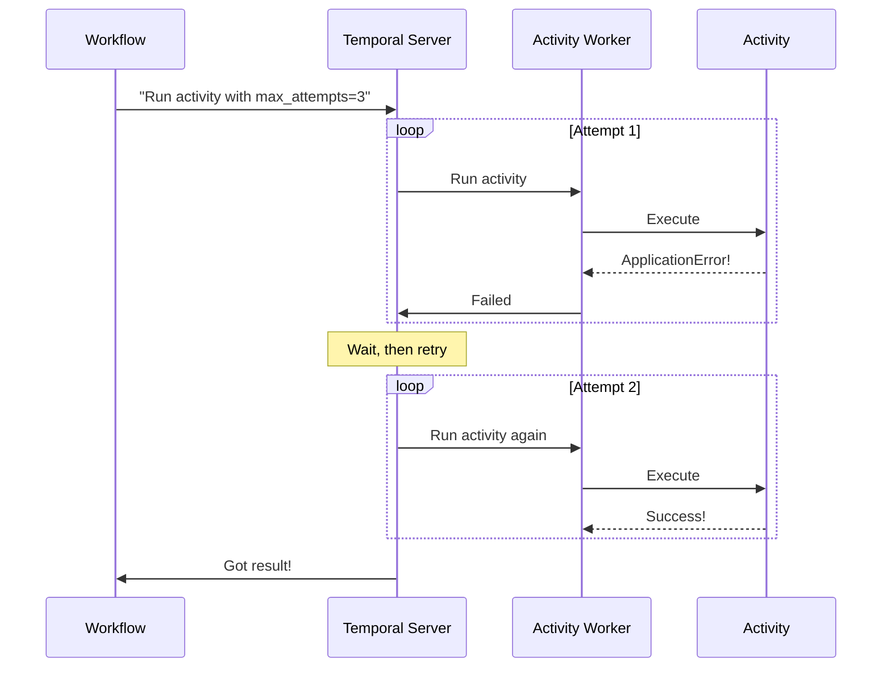

# Chapter 8: Exception Handling

In the previous chapter, [Data Converter](07_data_converter_.md), you learned how data flows through your Temporal system — how Workflows send parameters to Activities and receive results back. Everything works smoothly when everything succeeds.

But what happens when something goes wrong?

## The Problem We're Solving

Imagine you're building an order processing system with a Workflow that charges customers:

```python
result = await workflow.execute_activity(
    charge_card,
    99.99,
    customer_id=123
)
```

Many things could go wrong:

- **The payment API is temporarily down** - Network error, should retry
- **The credit card is declined** - User error, don't retry
- **The activity took too long** - Timeout, should retry
- **The user cancelled the order** - Cancellation, stop gracefully
- **The server crashed** - System failure, should recover

Without proper exception handling, you'd have no way to tell these apart. They'd all look like generic failures. You couldn't decide which to retry, which to show to the user, or which to log as bugs.

**The Solution:** Exception Handling is a structured set of exception types that represent different failure scenarios. Think of it like a postal service with different categories for problems:

```
Problem with delivery?
    ├─ Address wrong (User Error) → Tell customer
    ├─ Package lost (Retry) → Send again
    ├─ Recipient not home (Retry) → Try tomorrow
    ├─ Bad weather (Retry) → Wait and try again
    └─ Post office on fire (System Error) → Alert manager
```

Each exception type tells you what went wrong and how to handle it.

## Key Concepts

Let's understand the different types of failures:

### 1. ApplicationError: User Errors

An `ApplicationError` represents something your code decided went wrong — a business logic error.

```python
@activity.defn
async def charge_card(amount: float) -> str:
    if amount <= 0:
        raise ApplicationError(
            "Amount must be positive",
            type="InvalidAmount"
        )
    return "txn-123"
```

**What this means:** "The amount was invalid. This is a problem with the input, not the service. Don't retry."

**When to use:** Invalid data, business rule violations, permission denied.

### 2. TimeoutError: Taking Too Long

A `TimeoutError` means an Activity or Workflow took too long to complete.

```python
# In Workflow
result = await workflow.execute_activity(
    charge_card,
    99.99,
    start_to_close_timeout=timedelta(seconds=30)
)
# If activity takes >30 seconds, TimeoutError is raised
```

**What this means:** "The operation timed out. Maybe retry with more time."

**When to use:** Activities that take too long. Network timeouts. Workflows waiting too long.

### 3. CancelledError: Stop What You're Doing

A `CancelledError` means someone asked the Workflow or Activity to stop.

```python
try:
    result = await workflow.execute_activity(
        charge_card,
        99.99
    )
except CancelledError:
    print("Customer cancelled the order")
    # Clean up gracefully
```

**What this means:** "Stop immediately. Don't retry. Clean up and finish."

**When to use:** User cancellations, system shutdowns, explicit cancellation requests.

### 4. ServerError: Temporal Server Problem

A `ServerError` means the Temporal server itself had an issue, not your code.

```python
# You don't usually raise this yourself
# Temporal raises it when the server fails
# Generally shouldn't retry right away
```

**What this means:** "The Temporal server had a problem. Contact your ops team."

**When to use:** Server connection issues, database errors on Temporal side.

### 5. ActivityError: Activity Failed

When an Activity fails, it's wrapped in an `ActivityError`.

```python
try:
    result = await workflow.execute_activity(
        charge_card,
        99.99,
        retry_policy=RetryPolicy(max_attempts=3)
    )
except ActivityError as e:
    print(f"Activity failed: {e}")
    print(f"Activity type: {e.activity_type}")
    print(f"Attempt: {e.retry_state}")
```

**What this means:** "An Activity failed. Check the cause to understand why."

**The cause inside:** Could be an `ApplicationError`, `TimeoutError`, or other error from the Activity.

### 6. ChildWorkflowError: Child Workflow Failed

When a Workflow calls another Workflow as a child, failures are wrapped in `ChildWorkflowError`.

```python
try:
    result = await workflow.execute_child_workflow(
        PaymentWorkflow.run,
        99.99
    )
except ChildWorkflowError as e:
    print(f"Child workflow failed: {e}")
    print(f"Child workflow ID: {e.workflow_id}")
```

**What this means:** "A child Workflow failed. Check what went wrong inside it."

**The cause inside:** Could be any exception from the child Workflow.

### 7. TerminatedError: Workflow Terminated

A `TerminatedError` means the Workflow was terminated (forcefully stopped), not just cancelled.

```python
# Raised by Temporal when workflow.terminate() is called
# Similar to CancelledError but more forceful
```

**What this means:** "Someone forcefully terminated this Workflow."

**When to use:** System admin termination, cleanup after critical failures.

## How to Use Exception Handling

Let's solve the central use case: **Catch different exceptions and handle them appropriately in a Workflow**.

### Step 1: Import Exception Types

```python
from temporalio.exceptions import (
    ApplicationError,
    TimeoutError,
    CancelledError,
    ActivityError
)
```

**What this does:** Brings in the exception classes you'll catch.

### Step 2: Wrap Activity Calls in Try-Catch

```python
try:
    result = await workflow.execute_activity(
        charge_card,
        99.99,
        start_to_close_timeout=timedelta(seconds=30)
    )
except ApplicationError as e:
    print(f"User error: {e.message}")
    # Don't retry user errors
    raise
```

**What this does:** Catches `ApplicationError` and handles it. The `raise` statement re-raises the error so the Workflow fails.

### Step 3: Handle Different Error Types

```python
try:
    result = await workflow.execute_activity(charge_card, 99.99)
except TimeoutError:
    print("Payment processing took too long")
    # Maybe try again with different approach
except CancelledError:
    print("User cancelled payment")
    # Stop gracefully, don't retry
except ActivityError as e:
    print(f"Activity failed: {e}")
    # Check the underlying cause
```

**What this does:** Different handlers for different failure types.

### Step 4: Get Information About the Error

```python
except ActivityError as e:
    print(f"Activity: {e.activity_type}")
    print(f"Activity ID: {e.activity_id}")
    print(f"Retry state: {e.retry_state}")
    if e.cause:
        print(f"Original error: {e.cause}")
```

**What this does:** Extract details about what failed and why.

## Understanding the Internal Implementation

Now let's peek under the hood to understand how exception handling works.

### What Happens When an Activity Fails

Here's the flow when an Activity raises an exception:



**Step-by-step:**

1. Your Activity code raises an `ApplicationError`
2. The Activity Worker catches it and converts to a failure message
3. Worker sends the failure to the server with error details
4. Server stores this in the Workflow history
5. Workflow wakes up and asks "what happened?"
6. Server sends back the error information
7. Workflow deserializes it back to an exception
8. Workflow receives it as `ActivityError` with the original error as the cause

### What Happens with Timeouts



**Step-by-step:**

1. Activity starts running
2. Timeout is set (e.g., 30 seconds)
3. If activity doesn't complete in time, Temporal marks it as timeout
4. Server notifies the Workflow
5. Workflow receives a `TimeoutError`

### What Happens with Retries



**Step-by-step:**

1. Workflow requests activity with retry policy
2. First attempt fails with an error
3. Server checks retry policy (max_attempts=3)
4. Server waits a bit, then reschedules
5. Second attempt succeeds
6. Workflow receives the result

## Code Deep Dive

Let's look at how exceptions are implemented:

### The Exception Hierarchy

In `temporalio/exceptions.py`:

```python
class TemporalError(Exception):
    """Base for all Temporal exceptions."""
    pass

class FailureError(TemporalError):
    """Base for runtime failures."""
    pass

class ApplicationError(FailureError):
    """User error from application code."""
    pass
```

**What this shows:** Exception types are organized in a hierarchy. You can catch `FailureError` to catch all runtime failures.

### ApplicationError with Details

```python
class ApplicationError(FailureError):
    def __init__(
        self,
        message: str,
        *details: Any,
        type: Optional[str] = None,
        non_retryable: bool = False
    ) -> None:
        self._message = message
        self._details = details
        self._type = type
        self._non_retryable = non_retryable
```

**What this shows:** You can create an `ApplicationError` with:
- A message
- Custom details (any Python objects)
- A type string (for categorizing errors)
- Whether it's retryable or not

### Checking if Something is Cancelled

There's a helper function to check for cancellation:

```python
from temporalio.exceptions import is_cancelled_exception

try:
    await workflow.execute_activity(...)
except Exception as e:
    if is_cancelled_exception(e):
        print("This is a cancellation")
    else:
        print("This is something else")
```

**Why this helper?** Cancellation can come in different forms (`CancelledError`, wrapped in `ActivityError`, etc.). This function handles all of them.

### Retry States

When an Activity fails, you can check why it won't retry anymore:

```python
from temporalio.exceptions import RetryState

except ActivityError as e:
    if e.retry_state == RetryState.MAXIMUM_ATTEMPTS_REACHED:
        print("Tried 3 times, giving up")
    elif e.retry_state == RetryState.NON_RETRYABLE_FAILURE:
        print("Marked as non-retryable")
    elif e.retry_state == RetryState.TIMEOUT:
        print("Overall timeout exceeded")
```

**What this shows:** Different reasons why an Activity won't retry anymore.

## Practical Example: Complete Error Handling

Let's create a complete example handling all error types:

```python
@activity.defn
async def charge_card(amount: float) -> str:
    if amount <= 0:
        raise ApplicationError(
            "Invalid amount",
            type="InvalidAmount",
            non_retryable=True
        )
    return "txn-123"
```

Now handle it in a Workflow:

```python
@workflow.defn
class OrderWorkflow:
    @workflow.run
    async def run(self, order_id: str) -> str:
        try:
            tx_id = await workflow.execute_activity(
                charge_card,
                99.99,
                start_to_close_timeout=timedelta(minutes=1),
                retry_policy=RetryPolicy(max_attempts=3)
            )
            return f"Order {order_id}: {tx_id}"
        except ApplicationError as e:
            print(f"Invalid input: {e.message}")
            return f"Order {order_id}: FAILED - {e.message}"
        except TimeoutError as e:
            print("Payment took too long")
            return f"Order {order_id}: TIMEOUT"
        except CancelledError:
            print("Order cancelled by user")
            return f"Order {order_id}: CANCELLED"
        except ActivityError as e:
            print(f"Unknown activity error: {e}")
            return f"Order {order_id}: ERROR"
```

**What happens with amount = 50:**
```
Order order-123: txn-123
```

**What happens with amount = -10:**
```
Invalid input: Invalid amount
Order order-123: FAILED - Invalid amount
```

**What happens if payment API is down (first attempt):**
```
[Retry attempt 1 fails]
[Wait and retry]
[Retry attempt 2 succeeds]
Order order-123: txn-123
```

**What happens if workflow is cancelled:**
```
Order cancelled by user
Order order-123: CANCELLED
```

## Common Exception Handling Patterns

### Pattern 1: Retry with Backoff

```python
retry_policy=RetryPolicy(
    max_attempts=5,
    initial_interval=timedelta(seconds=1),
    max_interval=timedelta(seconds=60),
    backoff_coefficient=2.0  # Double wait each time
)
```

**Result:** First retry waits 1s, second waits 2s, third waits 4s, etc.

### Pattern 2: Non-Retryable Errors

```python
raise ApplicationError(
    "Invalid credit card",
    type="InvalidCard",
    non_retryable=True
)
```

**Result:** Temporal won't retry this Activity, even if you have `max_attempts=10`.

### Pattern 3: Custom Retry Delay

```python
raise ApplicationError(
    "Rate limited",
    type="RateLimited",
    next_retry_delay=timedelta(seconds=60)
)
```

**Result:** Temporal will retry after waiting 60 seconds specifically.

## Key Takeaways

Before moving on, remember:

1. **Different exceptions for different problems** - `ApplicationError`, `TimeoutError`, `CancelledError`, etc.
2. **ApplicationError is for user errors** - Invalid data, business rule violations
3. **TimeoutError for operations taking too long** - Configure timeouts when calling activities
4. **CancelledError for graceful stopping** - Someone asked the workflow/activity to stop
5. **ActivityError wraps activity failures** - Check the `.cause` to see the original error
6. **Retry policies control retrying** - Set `max_attempts`, `initial_interval`, etc.
7. **Catch exceptions to handle them** - Different handlers for different error types
8. **Check retry_state for why it stopped retrying** - `MAXIMUM_ATTEMPTS_REACHED`, `NON_RETRYABLE_FAILURE`, etc.

## Conclusion

You've learned how exception handling works in Temporal:

- **Exceptions are structured** - Different exception types represent different failure scenarios
- **Exceptions carry context** - You know what went wrong, where, and why
- **Exceptions guide decisions** - Should I retry? Should I give up? Should I alert someone?
- **Exceptions are automatic** - Temporal wraps failures in appropriate exception types

Exception handling is how your Temporal system communicates problems. Instead of generic "it failed" messages, you get specific information that lets you make smart decisions about recovery.

With exception handling, your Workflows can gracefully handle failures, retry intelligently, and provide meaningful error messages to users.

Now that you understand how exceptions work, you're ready to learn about [Interceptor](09_interceptor_.md) — a powerful mechanism for observing and modifying SDK behavior at a low level!

---

Generated by [AI Codebase Knowledge Builder](https://github.com/The-Pocket/Tutorial-Codebase-Knowledge)