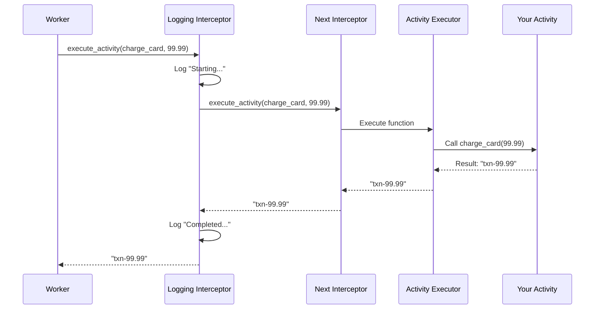
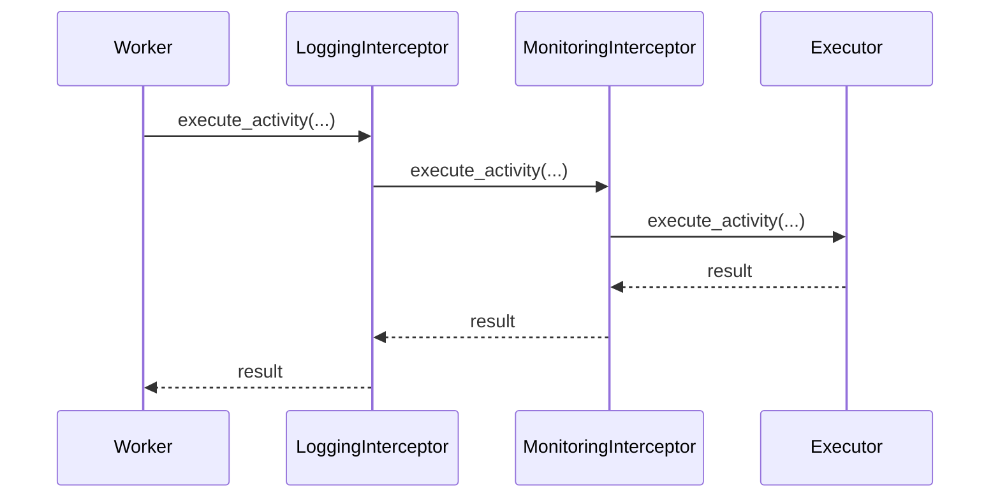

# Chapter 9: Interceptor

In the previous chapter, [Exception Handling](08_exception_handling_.md), you learned how to catch and handle different types of errors that occur in your Workflows and Activities. You now know how to distinguish between user errors, timeouts, and cancellations.

But what if you need to observe *everything* that's happening in your system? What if you want to:

- **Log every Activity execution** - "Which activities ran and how long did they take?"
- **Monitor performance** - "Which activities are slow? Which workflows fail most often?"
- **Inject security checks** - "Is this user allowed to run this activity?"
- **Transform data** - "Encrypt sensitive data before storing it"

Without a proper mechanism, you'd have to sprinkle logging and monitoring code everywhere — in every Activity, every Workflow, every callback. You'd repeat the same patterns over and over. This is messy and error-prone.

**The Solution:** Interceptors are like checkpoints where you can observe, log, or modify behavior without changing your core business logic. Think of them like airport security:

```
Your Activity/Workflow
        ↓
    Interceptor (Checkpoint)
    ├─ Check: Is this allowed?
    ├─ Log: What's happening?
    ├─ Modify: Transform data
    └─ Call: Your actual code
        ↓
    Results
```

The Interceptor sees everything passing through. You can observe it, modify it, or make decisions about it — all without touching your Activity or Workflow code.

## Key Concepts

Let's understand what Interceptors do:

### 1. Interceptors Are Like Middleware

If you've used web frameworks like Django or Flask, you know about middleware. Middleware wraps request handlers to add logging, authentication, or error handling. Interceptors do the same thing for Temporal:

```
Request → [Interceptor 1] → [Interceptor 2] → [Your Code]
                                                    ↓
Response ← [Interceptor 1] ← [Interceptor 2] ← Result
```

**Why?** You get to observe and modify behavior at a central point instead of scattered throughout your code.

### 2. There Are Two Types: Inbound and Outbound

**Inbound Interceptors** observe incoming requests (Activities being executed, Workflows starting, signals arriving):

```python
# Someone is calling my activity
# Inbound Interceptor sees: "execute_activity(charge_card, 99.99)"
```

**Outbound Interceptors** observe outgoing calls (Activities being scheduled, child Workflows starting):

```python
# My Workflow is calling an Activity
# Outbound Interceptor sees: "I'm about to schedule charge_card"
```

### 3. Interceptors Can Be Chained

Multiple interceptors can be stacked on top of each other. Each one wraps the next:

```python
# User code calls activity
result = await workflow.execute_activity(charge_card, 99.99)

# Path through interceptors (first to last):
LoggingInterceptor → MonitoringInterceptor → EncryptionInterceptor → Actual Code
```

**Why?** You can compose multiple concerns independently. One interceptor handles logging, another handles monitoring, another handles security. They don't interfere with each other.

### 4. Interceptors Work at Different Levels

- **Activity Interceptors** - See and modify Activity execution
- **Workflow Interceptors** - See and modify Workflow execution
- **Client Interceptors** - See and modify client API calls (from [Chapter 2: Service Client](02_service_client_.md))

Each level intercepts different operations.

### 5. You Get Context About What's Happening

When an Interceptor is called, you get detailed information about what's happening:

```python
# For activities
input.fn          # The actual function being called
input.args        # Arguments being passed
input.executor    # The executor running it
input.headers     # Metadata (user can add custom headers)
```

**Why?** You can make smart decisions based on context. "If this is a payment activity, encrypt the data. If it's logging, don't."

## How to Use Interceptors

Let's solve the central use case: **Create an Activity Interceptor that logs every Activity execution with timing information**.

### Step 1: Define Your Interceptor Class

```python
from temporalio.worker import ActivityInboundInterceptor
from temporalio.worker import ExecuteActivityInput
import time

class LoggingActivityInterceptor(ActivityInboundInterceptor):
    async def execute_activity(self, input: ExecuteActivityInput) -> Any:
        print(f"Starting activity: {input.fn.__name__}")
        start = time.time()
        
        result = await self.next.execute_activity(input)
        
        elapsed = time.time() - start
        print(f"Completed: {input.fn.__name__} ({elapsed:.2f}s)")
        return result
```

**What this does:**
- Extends `ActivityInboundInterceptor` (the base class for activity interceptors)
- Logs when an Activity starts
- Calls `self.next.execute_activity()` to actually run the Activity
- Logs when it finishes with elapsed time

**Key insight:** `self.next` is the next interceptor in the chain. You must call it to continue execution!

### Step 2: Create an Interceptor Instance

```python
activity_interceptor = LoggingActivityInterceptor(
    next=... # Don't worry about this yet, framework handles it
)
```

Actually, you don't create instances directly. Let me show you the real way:

### Step 3: Create an Interceptor Base Class

```python
from temporalio.worker import Interceptor, ActivityInboundInterceptor

class MyInterceptor(Interceptor):
    def intercept_activity(
        self, next: ActivityInboundInterceptor
    ) -> ActivityInboundInterceptor:
        return LoggingActivityInterceptor(next)
```

**What this does:**
- Extends the base `Interceptor` class
- Implements `intercept_activity()` which creates your custom interceptor
- Returns your logging interceptor wrapping the next one

### Step 4: Register with Worker

```python
from temporalio.worker import Worker

worker = Worker(
    client,
    task_queue="default",
    activities=[charge_card],
    interceptors=[MyInterceptor()]  # ← Add here
)
```

**What happens:**
- Worker receives your interceptor
- Every Activity execution goes through your interceptor
- You see logs for every Activity!

### Complete Example: Activity Execution

```python
# Activity definition
@activity.defn
async def charge_card(amount: float) -> str:
    return f"txn-{amount}"

# Usage (from workflow)
result = await workflow.execute_activity(
    charge_card, 99.99
)
```

**Output from your interceptor:**
```
Starting activity: charge_card
Completed: charge_card (0.05s)
```

## Understanding the Internal Implementation

Now let's peek under the hood to understand how Interceptors work.

### What Happens When an Activity Executes with an Interceptor

Here's the flow:



**Step-by-step:**

1. Worker receives an Activity task
2. Worker calls your Logging Interceptor with the activity details
3. Interceptor logs "Starting activity"
4. Interceptor calls `self.next` to continue the chain
5. Eventually reaches the actual executor
6. Executor runs your Activity function
7. Activity returns a result
8. Result travels back through the chain
9. Interceptor logs "Completed" with timing
10. Result returns to Worker

### What Happens When Multiple Interceptors Are Chained



**Step-by-step:**

1. Worker calls Logging Interceptor
2. Logging calls Monitoring (stored as `self.next`)
3. Monitoring calls Executor
4. Executor runs your code
5. Results bubble back through the chain in reverse order

This is why you must always call `self.next` — you're responsible for passing control to the next thing in the chain!

## Code Deep Dive

Let's look at how Interceptors are implemented:

### The Base Interceptor Class

In `temporalio/worker/_interceptor.py`:

```python
class Interceptor:
    def intercept_activity(
        self, next: ActivityInboundInterceptor
    ) -> ActivityInboundInterceptor:
        return next  # Default: don't intercept
```

**What this shows:** The base class provides a hook for creating custom interceptors. Default behavior is to just pass through.

### The ActivityInboundInterceptor Class

```python
class ActivityInboundInterceptor:
    def __init__(self, next: ActivityInboundInterceptor) -> None:
        self.next = next
    
    async def execute_activity(
        self, input: ExecuteActivityInput
    ) -> Any:
        return await self.next.execute_activity(input)
```

**What this shows:**
- Every interceptor stores a reference to the next one
- Default implementation just delegates to `self.next`
- You override this to add custom behavior

### The ExecuteActivityInput Class

```python
@dataclass
class ExecuteActivityInput:
    fn: Callable[..., Any]           # The activity function
    args: Sequence[Any]              # Arguments to pass
    executor: Optional[Executor]     # Thread executor
    headers: Mapping[str, Payload]   # Metadata headers
```

**What this shows:** You get all the context about the Activity being executed.

### Workflow Interceptors Work Similarly

For Workflows, there's `WorkflowInboundInterceptor` and `WorkflowOutboundInterceptor`:

```python
class WorkflowInboundInterceptor:
    # Called when workflow starts, signals arrive, queries come
    async def execute_workflow(self, input) -> Any:
        return await self.next.execute_workflow(input)
```

**Pattern is identical:** Store next, call it, wrap with your logic.

## Practical Example: Multiple Interceptors

Let's create a realistic example with logging and monitoring:

```python
class LoggingInterceptor(ActivityInboundInterceptor):
    async def execute_activity(self, input):
        print(f"▶ {input.fn.__name__}")
        try:
            return await self.next.execute_activity(input)
        except Exception as e:
            print(f"✗ {input.fn.__name__}: {e}")
            raise

class MonitoringInterceptor(ActivityInboundInterceptor):
    async def execute_activity(self, input):
        start = time.time()
        result = await self.next.execute_activity(input)
        duration = time.time() - start
        print(f"⏱ {input.fn.__name__}: {duration:.3f}s")
        return result
```

Register both:

```python
class MyInterceptor(Interceptor):
    def intercept_activity(self, next):
        # Chain: Logging → Monitoring → Executor
        next = MonitoringInterceptor(next)
        next = LoggingInterceptor(next)
        return next
```

**Usage:**
```python
worker = Worker(
    client, task_queue="default",
    activities=[charge_card],
    interceptors=[MyInterceptor()]
)
```

**Output when Activity runs:**
```
▶ charge_card
⏱ charge_card: 0.025s
```

## Workflow Interceptors

Workflow Interceptors work similarly but see Workflow execution:

```python
from temporalio.worker import WorkflowInboundInterceptor
from temporalio.worker import ExecuteWorkflowInput

class LoggingWorkflowInterceptor(WorkflowInboundInterceptor):
    async def execute_workflow(self, input: ExecuteWorkflowInput):
        print(f"Workflow starting: {input.type.__name__}")
        return await self.next.execute_workflow(input)
```

Register it:

```python
class MyInterceptor(Interceptor):
    def workflow_interceptor_class(self, input):
        return LoggingWorkflowInterceptor
```

## Activity Outbound Interceptors

These intercept calls *from within* Activities (like getting activity info or heartbeating):

```python
from temporalio.worker import ActivityOutboundInterceptor

class LoggingOutboundActivity(ActivityOutboundInterceptor):
    def heartbeat(self, *details):
        print(f"Heartbeating: {details}")
        self.next.heartbeat(*details)
```

**Use case:** Monitor every heartbeat sent from Activities.

## Common Interceptor Patterns

### Pattern 1: Request/Response Logging

```python
async def execute_activity(self, input):
    print(f"Request: {input.fn.__name__}({input.args})")
    result = await self.next.execute_activity(input)
    print(f"Response: {result}")
    return result
```

### Pattern 2: Timing and Metrics

```python
async def execute_activity(self, input):
    start = time.perf_counter()
    result = await self.next.execute_activity(input)
    duration = time.perf_counter() - start
    metrics.record_activity_duration(
        input.fn.__name__, duration
    )
    return result
```

### Pattern 3: Error Tracking

```python
async def execute_activity(self, input):
    try:
        return await self.next.execute_activity(input)
    except Exception as e:
        errors.record_error(input.fn.__name__, e)
        raise
```

## Why Interceptors Matter

Instead of this (code scattered everywhere):

```python
@activity.defn
async def charge_card(amount):
    logger.info(f"Starting charge_card")
    start = time.time()
    try:
        result = request.post(...)
        logger.info(f"Success in {time.time()-start}s")
        return result
    except Exception as e:
        logger.error(f"Failed: {e}")
        raise

@activity.defn
async def send_email(email):
    logger.info(f"Starting send_email")
    start = time.time()
    # ... same logging pattern again ...
```

You get this (centralized in one place):

```python
# One interceptor for ALL activities
class LoggingInterceptor(ActivityInboundInterceptor):
    async def execute_activity(self, input):
        logger.info(f"Starting {input.fn.__name__}")
        start = time.time()
        try:
            result = await self.next.execute_activity(input)
            logger.info(f"Success in {time.time()-start}s")
            return result
        except Exception as e:
            logger.error(f"Failed: {e}")
            raise
```

**Result:** DRY principle (Don't Repeat Yourself). Logging logic lives in one place!

## Key Takeaways

Before moving on, remember:

1. **Interceptors are middleware** - Checkpoints where you observe and modify behavior
2. **Inbound vs Outbound** - Inbound sees incoming requests, Outbound sees outgoing calls
3. **Chain of Responsibility** - Multiple interceptors wrap each other
4. **You must call `self.next`** - Responsibility to pass control to the next interceptor
5. **Full context available** - You get function, arguments, headers, everything
6. **Works for Activities and Workflows** - Both have inbound and outbound interceptors
7. **Transparent to business logic** - Your Activity/Workflow code doesn't know about interceptors

## Conclusion

You've learned what Interceptors are and why they're powerful:

- **Interceptors observe everything** - Every Activity execution, every Workflow event passes through them
- **Interceptors are composable** - Chain multiple interceptors for different concerns
- **Interceptors keep code DRY** - Write logging/monitoring logic once, apply to everything
- **Interceptors are central** - Instead of scattered logging code, one place manages all observation

Interceptors are the final piece for advanced observability and customization. With them, you can add logging, monitoring, security checks, and data transformation — all without modifying your core business logic.

You now understand the complete Temporal Python SDK architecture! From configuration through runtime, from Workflows and Activities through Workers, from data serialization through exception handling, and finally to the powerful extensibility provided by Interceptors.

Ready to go deeper? Next, learn about the [Bridge Layer](10_bridge_layer_.md) — the Rust-based foundation that makes all of this work efficiently and reliably!

---

Generated by [AI Codebase Knowledge Builder](https://github.com/The-Pocket/Tutorial-Codebase-Knowledge)