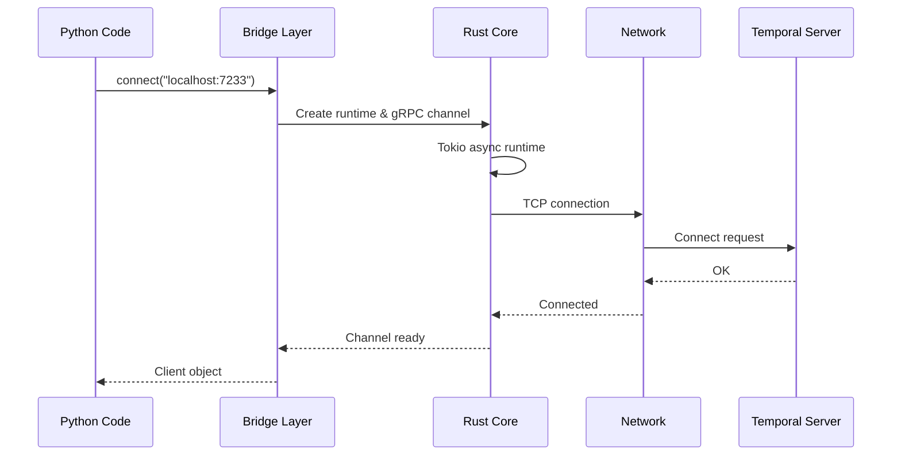
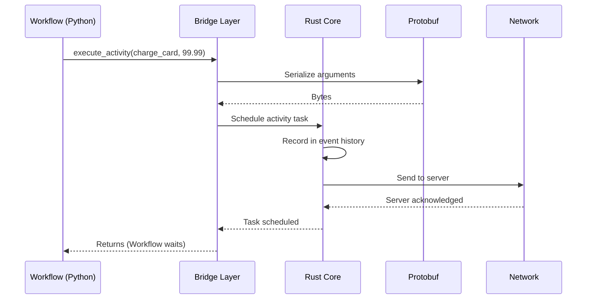
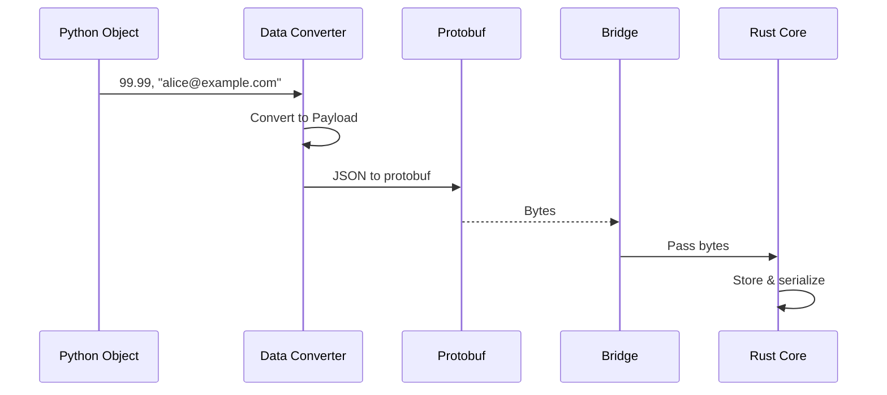

# Chapter 10: Bridge Layer

In the previous chapter, [Interceptor](09_interceptor_.md), you learned how to observe and modify SDK behavior at a high level through interceptors. You discovered how to add logging, monitoring, and security checks without changing your core business logic.

But what if I told you that everything we've learned so far — all the Workflows, Activities, Workers, Data Converters, and Interceptors — ultimately relies on a hidden layer underneath? A layer that translates between the Python world and a high-performance Rust engine?

**Welcome to the Bridge Layer.**

## The Problem We're Solving

Imagine you're building a high-performance system with Temporal. You've written brilliant Python code:

- Workflows that orchestrate your business logic
- Activities that interact with external services
- Workers that execute everything

Everything works great! But then you wonder: **How is this actually happening?**

When your Python code says "execute this Activity," how does that message get to the Temporal server? How does the server's response make it back to Python? What happens to all that data in between?

The naive approach would be: write everything in Python. Pure Python implementation. But that would be slow. The server needs to:

- Handle thousands of concurrent workflows
- Manage retry logic with precise timing
- Process events efficiently
- Maintain state consistently

Pure Python struggles with these requirements. Python has the Global Interpreter Lock (GIL) which limits concurrency. It's not as fast as compiled languages for intensive computation.

**The Solution:** Use Rust for the performance-critical "Core" engine, but expose it through a Python-friendly interface. The Bridge Layer is this interface — a translator between the Python world and the Rust engine beneath.

Think of it like a pharmaceutical company:

```
Research Lab (Python SDK)
        ↓
    Translation
  Manufacturing (Rust Core)
        ↓
    Translation
  Delivery to Patient
        ↓
    Translation
Results back to Lab
```

The Bridge Layer handles all the translation so Python can stay high-level and Rust can stay fast.

## Key Concepts

Let's understand what the Bridge Layer does:

### 1. It's a FFI (Foreign Function Interface)

FFI is a way for different programming languages to call each other's code. The Bridge Layer is Temporal's FFI:

```python
# Python world (what you write)
await workflow.execute_activity(charge_card, 99.99)

# Bridge Layer translates to:
# → Convert to protobuf bytes
# → Call Rust function
# → Get bytes back
# → Convert back to Python

# Rust world (what actually happens)
// High-performance core engine
// Manages gRPC, retry logic, etc.
```

**Why?** You get Python's simplicity for writing code, but Rust's speed for executing it.

### 2. It Handles Serialization and Deserialization

When data crosses from Python to Rust (or vice versa), it must be converted to a format both understand. That's protobuf (Protocol Buffers — Google's serialization format):

```
Python Object (99.99)
    ↓ (Bridge Layer)
Protobuf Bytes (binary format)
    ↓ (Network/Storage)
Protobuf Bytes (binary format)
    ↓ (Bridge Layer)
Rust Data (f64)
```

**Why protobuf?** It's language-independent, compact, and fast to parse.

### 3. It Manages the gRPC Connection

When you connect to the Temporal server, the Bridge Layer:

- Creates a gRPC connection (using Rust's high-performance HTTP/2 implementation)
- Manages the connection lifecycle
- Handles retries automatically
- Keeps connections alive with keep-alive messages

```python
# Your code
client = await Client.connect("localhost:7233")

# Bridge Layer (behind the scenes)
# → Create async runtime for networking
# → Open gRPC channel
# → Authenticate
# → Keep connection healthy
```

**Why use Rust for this?** Rust's gRPC implementation is faster and more memory-efficient than Python libraries.

### 4. It Powers Async I/O

The Bridge Layer manages asynchronous operations efficiently:

```python
# Your code (looks synchronous in a way)
result = await workflow.execute_activity(charge_card, 99.99)

# Bridge Layer (actually async)
# → Schedule work on Rust thread pool
# → Don't block Python thread
# → When ready, notify Python
# → Python continues
```

**Why?** Rust's async implementation (using Tokio) is battle-tested and highly optimized.

### 5. It Acts as the "Operator" Between Worlds

Everything flows through the Bridge:

```
Python Code
    ↓
Client → [Bridge Layer] ← Server
    ↓
Worker → [Bridge Layer] ← Worker
    ↓
Data Converter → [Bridge Layer] ← Data Converter
```

Every operation, every message, every bit of data goes through this layer.

## How the Bridge Layer Works (Without Direct Usage)

Here's the key insight: **You don't directly use the Bridge Layer. It uses you.**

Instead, you interact through higher-level APIs:

```python
# High-level (what you write)
client = await Client.connect("localhost:7233")

# Internally, Client uses Bridge Layer
client._service_client._core_client._ref  # ← Bridge reference
```

But understanding how it works helps you understand why certain things work the way they do.

## Understanding the Internal Implementation

Let's peek under the hood to see what happens when the SDK operates.

### What Happens When You Connect to Temporal

Here's the complete flow from Python to Rust to server and back:



**Step-by-step:**

1. Python code calls `Client.connect()`
2. Bridge Layer receives this call
3. Bridge Layer tells Rust Core to create a connection
4. Rust Core uses Tokio (async runtime) to establish TCP connection
5. Rust sends a gRPC connection handshake over network
6. Server responds
7. Rust Core confirms to Bridge Layer that connection is ready
8. Bridge Layer returns a Python Client object to your code

**Why this journey?** Python → Bridge → Rust → Network ensures the connection is managed efficiently.

### What Happens When You Execute an Activity

Here's what happens when a Workflow calls an Activity:



**Step-by-step:**

1. Workflow calls `execute_activity()`
2. Bridge Layer intercepts this
3. Bridge Layer serializes arguments to protobuf bytes
4. Bridge Layer tells Rust Core to schedule the task
5. Rust Core records this in its internal event history
6. Rust Core sends the task to the server via gRPC
7. Server acknowledges receipt
8. Rust Core confirms to Bridge Layer
9. Bridge Layer returns to Workflow (which suspends/waits)

**Key insight:** The Workflow waits while the Bridge/Rust handle all the async work.

### Data Transformation Pipeline

This diagram shows how data transforms as it crosses boundaries:



**What we see:** Each boundary requires conversion to ensure compatibility.

## Code Deep Dive

Now let's look at actual code to understand the implementation:

### The Client Bridge Reference

From `temporalio/bridge/client.py`, the `Client` class wraps a Rust reference:

```python
class Client:
    def __init__(
        self,
        runtime: temporalio.bridge.runtime.Runtime,
        ref: temporalio.bridge.temporal_sdk_bridge.ClientRef,
    ):
        self._runtime = runtime
        self._ref = ref  # ← The Rust reference
```

**What this shows:** Every Bridge Layer `Client` holds a reference to Rust-side data (`ClientRef`). This reference is opaque to Python — you can't inspect it directly.

### The Magic: `await call()`

When you make an RPC call, the Bridge handles everything:

```python
async def call(
    self,
    service: str,
    rpc: str,
    req: google.protobuf.message.Message,
    resp_type: Type[ProtoMessage],
    ...
) -> ProtoMessage:
    # Serialize Python protobuf to bytes
    call = RpcCall(
        rpc, 
        req.SerializeToString(),  # ← Convert to bytes
        ...
    )
    
    # Call Rust (this is async!)
    resp_bytes = await self._ref.call_workflow_service(call)
    
    # Deserialize bytes back to Python protobuf
    resp = resp_type()
    resp.ParseFromString(resp_bytes)
    return resp
```

**What happens:**
1. Python protobuf message is serialized to bytes
2. Bytes are sent to Rust via the Bridge
3. Rust handles gRPC communication asynchronously
4. Rust returns bytes
5. Bytes are parsed back to Python protobuf
6. You get a Python object

**The `await`:** This is key! The `await` means Python suspends here, letting other code run while Rust handles networking.

### The Worker Bridge Reference

From `temporalio/bridge/worker.py`, similar pattern:

```python
class Worker:
    @staticmethod
    def create(
        client: temporalio.bridge.client.Client,
        config: WorkerConfig
    ) -> Worker:
        return Worker(
            temporalio.bridge.temporal_sdk_bridge.new_worker(
                client._runtime._ref,  # ← Runtime reference
                client._ref,           # ← Client reference
                config                 # ← Worker configuration
            )
        )
```

**What this shows:** To create a Worker, you need:
- Runtime reference (for async operations)
- Client reference (for server communication)
- Configuration

All passed to Rust, which creates a worker.

### Polling for Work

The Bridge Layer Worker continuously asks the server for work:

```python
async def poll_workflow_activation(self):
    # Ask Rust to poll server
    activation_bytes = await self._ref.poll_workflow_activation()
    
    # Convert bytes to Python object
    return (
        temporalio.bridge.proto.workflow_activation
        .WorkflowActivation.FromString(activation_bytes)
    )
```

**What happens:**
1. `await` sends request to Rust
2. Rust polls Temporal server
3. When work arrives, Rust gets bytes from server
4. Bytes are returned to Python
5. Python converts bytes to object
6. Your code receives the object

**The bridge:** Handles the blocking network wait in Rust, not Python!

### Payload Visiting

One complex part is the PayloadVisitor pattern (from `temporalio/bridge/_visitor.py`):

```python
class PayloadVisitor:
    async def visit(self, fs: VisitorFunctions, root: Any):
        # Recursively visit all payloads
        # Call fs.visit_payload() for each payload
        method_name = "_visit_" + root.DESCRIPTOR.full_name.replace(".", "_")
        method = getattr(self, method_name)
        await method(fs, root)
```

**Why this?** Payloads can be nested deep in protobuf messages. This visitor traverses the entire message tree to find all payloads and transform them (encode/decode).

**Example:** A Workflow activation has payloads nested in arguments, signals, query results, etc. The visitor finds all of them.

## Practical Example: Complete Request Flow

Let's trace a complete request from Python all the way to Rust and back:

```python
# Your Python code
handle = await client.execute_workflow(
    OrderWorkflow.run,
    "order-123",
    id="order-123"
)
```

**What the Bridge Layer does:**

```python
# 1. Serialize arguments
request = StartWorkflowExecutionRequest(
    workflow_id="order-123",
    arguments=[Payload(...)]  # Serialized
)

# 2. Convert to protobuf bytes
request_bytes = request.SerializeToString()

# 3. Pass to Rust with gRPC details
await self._ref.call_workflow_service(
    RpcCall("StartWorkflowExecution", request_bytes, ...)
)

# 4. Rust sends over gRPC
# (This happens in Rust, Python waits)

# 5. Server responds with bytes

# 6. Rust returns bytes to Python

# 7. Parse bytes to response
response = StartWorkflowExecutionResponse()
response.ParseFromString(response_bytes)

# 8. Return to Python
return response
```

**Result:** Your Python code gets a clean response object, unaware of all the serialization/deserialization happening underneath.

## Why the Bridge Layer Matters

### Performance

Temporal handles thousands of workflows. A pure Python implementation would be slow. The Bridge Layer enables:

- **Non-blocking I/O** - Rust handles network without blocking Python threads
- **Efficient memory** - Rust manages data efficiently
- **Fast serialization** - Protobuf is faster than JSON for binary data

### Reliability

The Bridge Layer ensures:

- **Deterministic replay** - Rust core handles history replay precisely
- **Consistent state** - All state management in Rust core
- **Correct gRPC** - Battle-tested Rust gRPC implementation

### Compatibility

The Bridge Layer allows:

- **Polyglot workflows** - Workflows can call services in any language
- **Server compatibility** - Works with any Temporal server version
- **Network resilience** - Automatic retries, connection recovery

## Key Takeaways

Before concluding, remember:

1. **Bridge Layer is the translator** - Between Python world and Rust Core
2. **You don't use it directly** - Higher-level APIs use it for you
3. **Everything flows through it** - Client, Worker, Data Converter — all use Bridge
4. **It handles serialization** - Converting between Python objects and protobuf bytes
5. **It manages networking** - gRPC communication, connection lifecycle, retries
6. **It powers async I/O** - Rust async runtime handles networking efficiently
7. **It's invisible but essential** - You benefit from its performance without seeing it

## Conclusion

You've learned what the Bridge Layer is and why it exists:

- **Bridge Layer is the foundation** - Everything in the SDK ultimately relies on it
- **It's a performance multiplier** - Rust core handles demanding operations efficiently
- **It's a translator** - Seamlessly converts between Python and Rust representations
- **It's invisible** - You interact through high-level APIs without thinking about it

The Bridge Layer represents the architectural wisdom of the Temporal SDK: use Python's expressiveness and accessibility for the API, use Rust's performance and reliability for the core engine, and bridge the gap seamlessly.

You've now completed your journey through the entire Temporal Python SDK architecture! You understand:

1. **[Configuration & Plugins](01_configuration___plugins_.md)** - How to configure the SDK and extend it
2. **[Service Client](02_service_client_.md)** - How to communicate with Temporal servers
3. **[Runtime](03_runtime_.md)** - How the SDK manages logging, metrics, and threading
4. **[Workflow](04_workflow_.md)** - How to define resilient orchestration logic
5. **[Activity](05_activity_.md)** - How to define units of work that interact with external systems
6. **[Worker](06_worker_.md)** - How to execute Workflows and Activities
7. **[Data Converter](07_data_converter_.md)** - How data travels between components
8. **[Exception Handling](08_exception_handling_.md)** - How to handle different failure scenarios gracefully
9. **[Interceptor](09_interceptor_.md)** - How to observe and modify SDK behavior
10. **Bridge Layer** - The foundation that makes everything work efficiently

From configuration through the high-level orchestration APIs down to the Rust-powered core, you now understand how Temporal's Python SDK is architected for both developer experience and production performance. You're ready to build sophisticated, resilient distributed systems! 🚀

---

Generated by [AI Codebase Knowledge Builder](https://github.com/The-Pocket/Tutorial-Codebase-Knowledge)