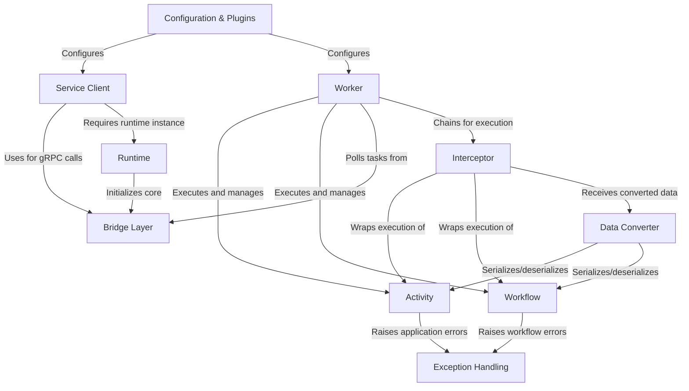

# Tutorial: sdk-python

The **Temporal Python SDK** is a client library for building **resilient distributed workflows** and **activities**. 
It provides a framework where **workflows** orchestrate long-running business logic using **activities** (resilient tasks), 
all coordinated through a **Service Client** connecting to Temporal servers. The SDK includes a **Worker** that polls 
and executes workflows and activities, with support for **customization via interceptors**, **data serialization**, 
**exception handling**, and **configuration management**, all powered by an underlying **Bridge Layer** to a high-performance Rust implementation.

**Source Repository:** [None](None)

## Chapters

1. [Configuration & Plugins
](01_configuration___plugins_.md)
2. [Service Client
](02_service_client_.md)
3. [Runtime
](03_runtime_.md)
4. [Workflow
](04_workflow_.md)
5. [Activity
](05_activity_.md)
6. [Worker
](06_worker_.md)
7. [Data Converter
](07_data_converter_.md)
8. [Exception Handling
](08_exception_handling_.md)
9. [Interceptor
](09_interceptor_.md)
10. [Bridge Layer
](10_bridge_layer_.md)

---

Generated by [AI Codebase Knowledge Builder](https://github.com/The-Pocket/Tutorial-Codebase-Knowledge)