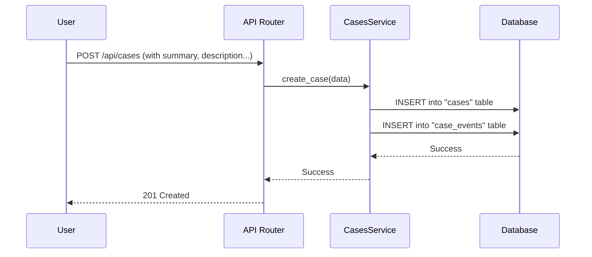

# Chapter 1: Cases

Welcome to Tracecat! This journey will guide you through the core concepts that make Tracecat a powerful automation platform. Let's start with the most fundamental building block: the **Case**.

## What's a Case? And Why Do You Need One?

Imagine you're a security analyst. An employee, Alex, forwards you a suspicious email with the subject "Urgent: Action Required on Your Account." Is it a phishing attempt? A real alert? You need a place to track your investigation.

This is where a **Case** comes in.

A Case is the central record for any issue, incident, or ticket you want to track and automate. Think of it as a **patient's medical chart**. It holds all the vital information in one place, ensuring nothing gets lost.

Without a Case, your investigation might be scattered across emails, chat messages, and sticky notes. With a Case, you have a single source of truth that contains:
*   A quick **summary** of the issue.
*   A detailed **description**.
*   The current **status** (e.g., `NEW`, `IN_PROGRESS`, `CLOSED`).
*   Its **priority** (e.g., `LOW`, `MEDIUM`, `HIGH`).

As you or your automated workflows investigate, the Case grows, accumulating a complete history of comments, file attachments (like that suspicious email), and a log of every single event. This rich context is exactly what our automation engine will use to make smart decisions later on.

## The Anatomy of a Case

A Case is more than just a simple ticket. It's a rich data object with several key components.

| Component             | Analogy (Medical Chart)   | Description                                                                                                                             |
| --------------------- | ------------------------- | --------------------------------------------------------------------------------------------------------------------------------------- |
| **Standard Fields**   | Patient Vitals            | The basics: `summary`, `description`, `status`, `priority`, and `severity`. Every case has these.                                         |
| **Custom Fields**     | Lab Results               | Extra data fields you can define yourself, like `reporter_email` or `malicious_url`, to store specific information for your use cases. |
| **Attachments**       | X-Rays & Test Results     | Any files related to the case, like screenshots, log files, or the original phishing email itself.                                      |
| **Comments & Events** | Doctor's Notes & Timeline | A complete, timestamped log of everything that has happened, from user comments to automated actions.                                     |

This structure makes the Case the perfect input for a [Workflow & DSL](02_workflow___dsl_.md), which we'll explore in the next chapter. The workflow can read the `priority`, check a custom `malicious_url` field, and decide what to do next.

## Under the Hood: How a Case is Stored

So, what does a Case look like in the code? At its heart, it's a record in our database. When Tracecat is set up, a database migration script runs to create the `cases` table.

Here's a simplified look at the database schema definition from that script. You can see how the core fields are defined.

```python
# A simplified view of the 'cases' table schema
# from: alembic/versions/1ccd61edfcaa_add_case_and_casefields_schemas.py
op.create_table(
    "cases",
    sa.Column("id", sqlmodel.sql.sqltypes.GUID(), nullable=False),
    sa.Column("summary", sqlmodel.sql.sqltypes.AutoString(), nullable=False),
    sa.Column("description", sqlmodel.sql.sqltypes.AutoString(), nullable=False),
    sa.Column("priority", postgresql.ENUM(...), nullable=False),
    sa.Column("status", postgresql.ENUM(...), nullable=False),
    # ... other columns like created_at, owner_id, etc.
)
```
This code tells the database to create a table named `cases` with columns for an `id`, `summary`, `description`, and the predefined options for `priority` and `status`.

### The Flow: From API Request to Database Record

Creating a case typically starts with an API request. Let's follow the journey of creating our "phishing email" case.

1.  A user (or an external tool) sends an HTTP POST request to the `/api/cases` endpoint.
2.  The API Router receives the request and validates the data.
3.  The Router calls the `CasesService`, which contains the core business logic.
4.  The `CasesService` creates the case object, records a "Case Created" event, and saves everything to the database.

Here is a diagram illustrating this simple flow:



### Diving into the Code

Let's look at the key pieces of code that make this happen.

**1. The Data Shape (`CaseCreate`)**

First, we define what data is required to create a case. We use a Pydantic model for this, which gives us automatic data validation.

```python
# Defines the input data needed to create a case.
# from: tracecat/cases/models.py
class CaseCreate(BaseModel):
    summary: str
    description: str
    status: CaseStatus
    priority: CasePriority
    severity: CaseSeverity
```
This tells us that to create a case, you *must* provide a `summary`, `description`, `status`, `priority`, and `severity`.

**2. The API Endpoint (`/cases`)**

Next, the API router defines the endpoint that listens for incoming requests. It's a thin layer that takes the request and passes it to the service layer.

```python
# The API endpoint for creating a new case.
# from: tracecat/cases/router.py
@cases_router.post("", status_code=HTTP_201_CREATED)
async def create_case(
    *,
    role: WorkspaceUser,
    session: AsyncDBSession,
    params: CaseCreate,  # Expects data matching the CaseCreate model
) -> None:
    service = CasesService(session, role)
    await service.create_case(params)
```
This function is decorated with `@cases_router.post`, linking it to the `POST /api/cases` path. It takes the request data (`params`) and uses the `CasesService` to do the actual work.

**3. The Service Logic (`create_case`)**

Finally, the service layer orchestrates the creation of the database records. This is where the real magic happens.

```python
# The core logic for creating a case and its initial event.
# from: tracecat/cases/service.py
async def create_case(self, params: CaseCreate) -> Case:
    # 1. Create the main Case database object
    case = Case(
        owner_id=self.workspace_id,
        summary=params.summary,
        description=params.description,
        # ... other fields
    )
    self.session.add(case)
    await self.session.flush()  # Assigns an ID to the case

    # 2. Create an event to log that the case was created
    await self.events.create_event(case=case, event=CreatedEvent())

    # 3. Save everything to the database
    await self.session.commit()
    return case
```
This method does three key things:
1.  It creates the `Case` record with the data provided.
2.  It calls *another* service to create a `CreatedEvent`, which becomes the first entry in the case's history.
3.  It commits the transaction, saving both the case and its first event to the database atomically.

## Conclusion: The Foundation for Automation

You've now learned about the most critical concept in Tracecat: the **Case**. It's not just a ticket; it's a comprehensive, living record that acts as the central hub for all information and activity related to an issue.

By structuring data this way, we create the perfect foundation for automation. Every piece of information—from the initial description to the latest comment—is now accessible to our powerful automation engine.

In the next chapter, we'll explore how to act on this information. Get ready to dive into the heart of Tracecat's automation power with [Workflow & DSL](02_workflow___dsl_.md).

---

Generated by [AI Codebase Knowledge Builder](https://github.com/The-Pocket/Tutorial-Codebase-Knowledge)