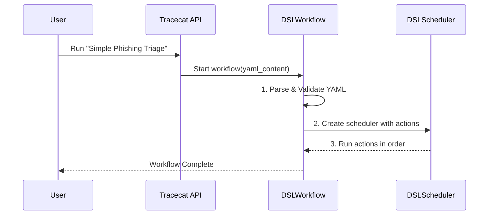

# Chapter 2: Workflow & DSL

In the [previous chapter](01_cases_.md), we learned about the **Case**, the central record for any incident you want to track. A Case holds all the *what* and *why* of an issue. Now, let's explore the *how*—how Tracecat automates the response.

## What's a Workflow? And What's a DSL?

Imagine you've received that suspicious email Case from Chapter 1. What's your plan? You'd probably follow a series of steps:
1.  Extract the link from the email body.
2.  Check if that link is on a known blacklist.
3.  If it's malicious, add a comment to the Case and raise the priority.

That series of steps is a **Workflow**.

A Workflow is your automation "recipe." It's a predefined plan that tells Tracecat exactly what to do when a certain event happens.

But how do you write this recipe down so a computer can understand it? You use a special language called a **DSL**, which stands for **Domain-Specific Language**. In Tracecat, this language is simple, human-readable YAML.

> **Analogy: The Recipe**
> *   **Workflow**: The entire recipe for "Phishing Analysis Cake."
> *   **DSL**: The language the recipe is written in (e.g., English, with terms like "mix," "bake," "cups"). For Tracecat, it's YAML with terms like `action`, `ref`, and `depends_on`.
> *   **Action**: A single step in the recipe, like "Preheat the oven" or "Mix the flour and sugar."

Using a YAML file to define the workflow is incredibly powerful. It means your entire automation logic lives in a single, structured text file that you can easily read, share, and even store in version control like Git.

## Anatomy of a Workflow DSL

Let's write a simple workflow for our phishing email use case. The goal is to extract a URL from the case description and then add a comment back to the case with that URL.

Here's what the DSL for that workflow looks like in YAML:

```yaml
# A simple workflow definition file
title: Simple Phishing Triage
description: Extracts a URL from a case and adds it as a comment.

# The entrypoint defines the start of the workflow.
# For now, we'll keep it simple.
entrypoint:
  ref: null # This means any action without dependencies can start.

# 'actions' is a list of all the steps in our recipe.
actions:
  - ref: extract_url_from_description
    action: core.text.extract_url
    args:
      text: "This is the suspicious email body with a link: https://evil.com"

  - ref: add_url_as_a_comment
    action: core.case.create_comment
    depends_on:
      - extract_url_from_description
    args:
      comment: "Found suspicious URL: ${{ actions.extract_url_from_description.result }}"
```

This might look complex at first, but it's just a few key ideas. Let's break it down.

### Key Concepts in the DSL

| Concept | Recipe Analogy | Description | Example from above |
| --- | --- | --- | --- |
| **`title`** & **`description`** | Recipe Name | High-level details about what the workflow does. | `title: Simple Phishing Triage` |
| **`actions`** | Recipe Steps | A list of all the individual steps to be executed. | The entire list under the `actions:` key. |
| **`ref`** | Step Nickname | A unique, simple name you give to a step (lowercase_with_underscores). | `extract_url_from_description` |
| **`action`** | The Verb | The *actual* function to run. This comes from the [Action Registry](03_action_registry_.md). | `core.text.extract_url` |
| **`args`** | Ingredients | The inputs required for the action to run. | `text: "..."` |
| **`depends_on`** | Step Order | Tells Tracecat that this action must wait for another one to finish first. This creates the flow. | `depends_on: [extract_url_from_description]` |

The most important concept here is **`depends_on`**. It’s how you create connections and ensure steps run in the right order. In our example, we can't `add_url_as_a_comment` until we have successfully run `extract_url_from_description`.

You'll also notice this strange syntax: `${{ ... }}`. This is a powerful feature we will cover in detail in the [Expressions](04_expressions______________.md) chapter. For now, just know that it's how you pass data from one step to another.

## Under the Hood: From YAML to Execution

So what happens when you tell Tracecat to run this workflow? How does a simple text file turn into a running process?

1.  **Parsing:** Tracecat reads the YAML file and parses it into a structured Python object. This object is a direct representation of your recipe.
2.  **Validation:** It checks your recipe for mistakes. Do all your actions have unique `ref` names? Does every `depends_on` point to a real action?
3.  **Scheduling:** A component called the **DSLScheduler** takes the validated recipe. It builds a graph of your actions and their dependencies.
4.  **Execution:** The scheduler identifies the first action(s) with no dependencies and tells the [Execution Engine](06_execution_engine__temporal___ray__.md) to run them. As each action finishes, the scheduler checks if any new actions are now ready to run, and the process continues until all steps are complete.

Here’s a simplified diagram of that flow:



### Diving into the Code

Let's peek at the Python code that makes this happen.

**1. The Main Workflow Definition (`DSLInput`)**

When Tracecat reads your YAML file, it validates and loads the contents into a Pydantic model. This ensures the structure is always correct.

```python
# A simplified view of the DSL's main structure.
# from: tracecat/dsl/common.py
class DSLInput(BaseModel):
    title: str
    description: str
    entrypoint: DSLEntrypoint
    actions: list[ActionStatement] # A list of actions
    # ... other configuration fields
```

This code defines the top-level keys of our YAML file (`title`, `description`, `actions`). Notice that `actions` is a list of `ActionStatement` objects.

**2. The Action Step Definition (`ActionStatement`)**

Each item in the `actions` list of your YAML becomes an `ActionStatement` object. This model defines the structure of a single step.

```python
# A simplified view of a single action's structure.
# from: tracecat/dsl/models.py
class ActionStatement(BaseModel):
    ref: str  # e.g., 'extract_url_from_description'
    action: str # e.g., 'core.text.extract_url'
    args: Mapping[str, Any] = {}
    depends_on: list[str] = []
    # ... other control flow fields
```

This model perfectly mirrors the fields you write in the YAML for each action. By using these models, Tracecat guarantees that your workflow definition is valid before it even tries to run it.

**3. The Conductor (`DSLScheduler`)**

The `DSLScheduler` is the brains of the operation. While its full code is complex, its core job is to manage the order of execution. Think of it as a conductor with a musical score (your DSL).

In plain English, here is what the scheduler does:

*   **"What can I play first?"**: It looks at all actions and finds those with an empty `depends_on` list. These are the entry points.
*   **"Play the note!"**: It sends these actions to be executed.
*   **"What's next?"**: When an action finishes, the scheduler looks at all other actions that depended on it. It reduces their "dependency count."
*   **"Ready for the next part!"**: If an action's dependency count reaches zero, it's ready to be played. The scheduler adds it to the queue and the cycle continues.

This process ensures your workflow runs exactly as you designed it, respecting the data flow and order you defined with `depends_on`.

## Conclusion: You've Written Your First Recipe!

You now understand the two most fundamental concepts for automation in Tracecat: the **Workflow** and the **DSL**. You've seen how a simple, human-readable YAML file can define a powerful, automated process. By defining `actions` and connecting them with `depends_on`, you create a recipe that Tracecat can follow reliably every time.

But what "actions" are available to us? We used `core.text.extract_url` and `core.case.create_comment`, but where did they come from? It's time to open up the cookbook and see all the available ingredients.

In the next chapter, we'll explore the [Action Registry](03_action_registry_.md), the central library of all the built-in and custom tools you can use in your workflows.

---

Generated by [AI Codebase Knowledge Builder](https://github.com/The-Pocket/Tutorial-Codebase-Knowledge)