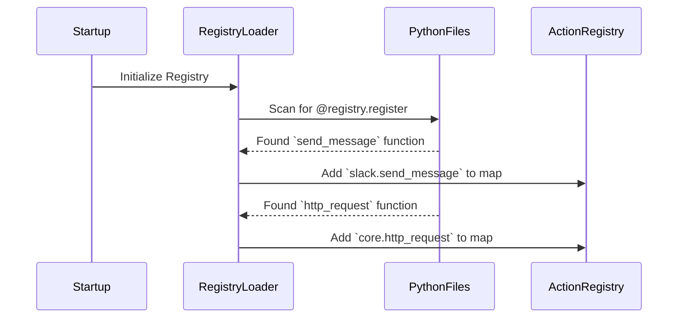

# Chapter 3: Action Registry

In the [previous chapter on Workflow & DSL](02_workflow___dsl_.md), we wrote an automation "recipe" using actions like `core.text.extract_url` and `core.case.create_comment`. We treated them like magic spells that just worked.

But where do these spells come from? How does Tracecat know what `core.text.extract_url` is and what code to run for it?

Welcome to the **Action Registry**, Tracecat's toolbox.

## What is the Action Registry?

Imagine you're building a car. You don't create every single nut, bolt, and wire from scratch. You go to a toolbox that has wrenches, screwdrivers, and pliers—each designed for a specific job.

The **Action Registry** is that toolbox for your automation workflows.

Each "tool" is a normal Python function that has been specially marked, or "registered," to be available to the workflow engine. This simple act of registering a function turns it into an **Action**, a reusable building block that anyone can use in a workflow without ever touching the underlying Python code.

These actions form the core of Tracecat's power, allowing you to:
*   **Integrate with anything:** Actions can send a Slack message, query an AWS service, or make an HTTP request to any API.
*   **Build reusable logic:** Write a function once (e.g., to look up an IP address in a threat database) and use it across hundreds of workflows.
*   **Keep workflows clean:** Your YAML workflow file remains a simple, high-level plan, while the complex logic lives in the Python code.

## Anatomy of an Action

So how do we turn a regular Python function into a powerful workflow Action? We use a special Python feature called a **decorator**: `@registry.register`.

Let's look at a simple example. We want to create an action that sends a message to a Slack channel.

```python
# from: tracecat_registry/integrations/slack_sdk.py (simplified)
from tracecat_registry import registry, secrets, RegistrySecret

# 1. Define any required API keys or secrets.
slack_secret = RegistrySecret(name="slack", keys=["SLACK_BOT_TOKEN"])

# 2. Use the decorator to register the function as an action.
@registry.register(
    namespace="slack",
    description="Sends a message to a Slack channel.",
    secrets=[slack_secret]
)
async def send_message(channel: str, text: str):
    """A simple function to post a message."""
    bot_token = secrets.get("SLACK_BOT_TOKEN")
    # ... code to initialize Slack client and send message ...
    print(f"Message sent to {channel}: {text}")
```

This might look like normal Python, but the `@registry.register` line above the function definition is the key. It tells Tracecat, "Hey! This `send_message` function is a tool. Add it to the toolbox!"

Let's break down the decorator's parameters:

| Parameter     | Analogy (Tool Label) | Description                                                                                                       |
| ------------- | -------------------- | ----------------------------------------------------------------------------------------------------------------- |
| **`namespace`** | Tool Category        | Groups related actions together. Here, it's `slack`. The full action name becomes `slack.send_message`.           |
| **`description`** | What it Does         | A human-readable explanation of the action's purpose. This appears in the UI to help users build workflows.     |
| **`secrets`**   | Power Cord           | A list of secret credentials the action needs, like an API key. Tracecat will securely provide these at runtime. |

Once this function is registered, you can immediately use it in your workflow DSL:

```yaml
actions:
  - ref: notify_analyst_on_slack
    action: slack.send_message
    args:
      channel: "#security-alerts"
      text: "A new high-priority case has been created!"
```

Notice how the `action` name `slack.send_message` directly maps to the `namespace` and the function name. The `args` (`channel` and `text`) map directly to the function's parameters. It's a perfect one-to-one match.

## Under the Hood: How Registration Works

How does a decorator in a Python file magically become available in a YAML workflow? It happens when Tracecat starts up.

1.  **Scanning:** When Tracecat launches, it scans specific folders for Python files.
2.  **Discovery:** It looks for any function that has the `@registry.register` decorator on it.
3.  **Registration:** For each function it finds, it reads the decorator's parameters (`namespace`, `description`, etc.) and the function's own details (its name, its input arguments).
4.  **Storing:** It stores all this information in an in-memory "registry"—essentially a big dictionary that maps an action name (like `"slack.send_message"`) to the function and its metadata.

When you later run a workflow, the execution engine just looks up the action name in this pre-built registry and calls the corresponding Python function with the arguments you provided.

Here’s a diagram of the startup process:



### Diving into the Code

Let's look at the key pieces of code that enable this.

**1. The Decorator Factory (`registry.py`)**

The `register` decorator itself is a function that returns another function (a "decorator factory"). Its job is to attach all the metadata to the function it's decorating.

```python
# A simplified view of the decorator.
# from: packages/tracecat-registry/tracecat_registry/_internal/registry.py

def register(
    *,
    namespace: str,
    description: str,
    secrets: list[RegistrySecretType] | None = None,
    # ... other optional metadata ...
) -> Callable:
    def decorator_register(fn: Callable) -> Callable:
        # Attach all the metadata directly to the function object
        setattr(fn, "__tracecat_udf_key", f"{namespace}.{fn.__name__}")
        setattr(fn, "__tracecat_udf_kwargs", {
            "namespace": namespace,
            "description": description,
            "secrets": secrets,
        })
        return fn
    return decorator_register
```
This code defines the `register` function. When you use `@registry.register(...)`, Python calls this function, which then wraps your code. It uses `setattr` to attach your metadata (like a label on a tool) directly to your function, so the Registry Loader can find it later.

**2. A Real-World Example (`http.py`)**

Let's look at the `http_request` action we've seen before. It's just a Python function with the `@registry.register` decorator.

```python
# A simplified view of the http_request action.
# from: packages/tracecat-registry/tracecat_registry/core/http.py

@registry.register(
    namespace="core",
    description="Perform a HTTP request to a given URL.",
    default_title="HTTP request",
    secrets=[ssl_secret],
)
async def http_request(
    url: str,
    method: str,
    headers: dict | None = None,
    # ... more arguments
) -> dict:
    # ... a lot of code to make a real HTTP request ...
    return {"status_code": 200, "data": "OK"}
```
This is a perfect example of the registry in action. A complex, powerful function (`http_request`) is made simple and accessible to any workflow author, just by adding the decorator.

**3. The In-Memory Blueprint (`BoundRegistryAction`)**

After the Registry Loader scans the code, it creates a structured object for each action to hold its metadata and the function itself. This is called a `BoundRegistryAction`.

```python
# Simplified model for a registered action.
# from: tracecat/registry/actions/models.py

class BoundRegistryAction(BaseModel):
    # The actual Python function to call
    fn: Callable[..., Any]

    # Metadata from the decorator
    name: str
    description: str
    namespace: str
    secrets: list[RegistrySecretType] | None = None

    # Information about its inputs
    args_cls: type[BaseModel]
```
Think of this as the final, labeled entry in our toolbox's catalog. It contains the tool itself (`fn`), its name and description, and a clear blueprint of what "ingredients" (`args_cls`) it needs to work.

## Conclusion: Bridging Code and Workflows

You now understand the magic behind Tracecat's automation building blocks. The **Action Registry** is the simple yet powerful system that turns ordinary Python functions into reusable tools for your workflows.

By using the `@registry.register` decorator, developers can contribute new integrations and custom logic to the platform, making it accessible to everyone through the simple YAML DSL. This separation is key: developers write the tools, and analysts use the tools to build automation.

But how do these tools talk to each other? If one action extracts a URL, how do we pass that URL to the next action that needs to check it? That's where our next topic comes in.

Get ready to unlock the full dynamic power of workflows in the next chapter: [Expressions (`${{...}}`)](04_expressions______________.md).

---

Generated by [AI Codebase Knowledge Builder](https://github.com/The-Pocket/Tutorial-Codebase-Knowledge)