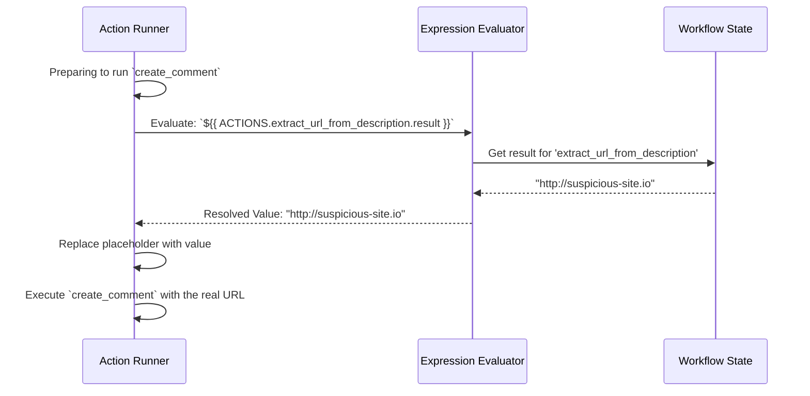

# Chapter 4: Expressions (`${{...}}`)

In the [previous chapter on the Action Registry](03_action_registry_.md), we learned about the "tools" in our automation toolbox. We wrote a simple workflow, but it had a big problem: it was static. The values were hardcoded.

```yaml
# Our old, static workflow action
- ref: extract_url_from_description
  action: core.text.extract_url
  args:
    # This text is always the same!
    text: "This is the suspicious email body with a link: https://evil.com"
```

This workflow can only ever analyze that one specific sentence. How do we make it work with *any* case description? How do we pass the output of one action as the input to the next?

This is where **Expressions** come in. They are the glue that makes workflows dynamic.

## What's an Expression?

An expression is a special placeholder that gets replaced with a real value when the workflow runs. It's written inside `${{ ... }}`.

> **Analogy: Spreadsheet Formulas**
> Think of expressions like formulas in a spreadsheet. Instead of typing the number `10` into cell C1, you can type `=A1+B1`. Now, C1 will *dynamically update* whenever A1 or B1 changes.
>
> An expression like `${{ TRIGGER.case.description }}` is the same idea. It doesn't contain the description itself; it's a *pointer* that says, "When this workflow runs, go find the description from the case that started it and put it here."

Expressions allow you to:
*   **Access trigger data:** Get the summary, priority, or custom fields from the [Case](01_cases_.md) that started the workflow.
*   **Chain actions together:** Use the output (the "result") of one action as the input for another.
*   **Use secrets securely:** Access API keys without writing them directly in your workflow file.
*   **Transform data:** Use built-in functions to change data on the fly, like converting text to lowercase or extracting a date.

## The Anatomy of an Expression

Expressions follow a simple pattern: `CONTEXT.path.to.value`. Let's break down the most common contexts.

| Context   | Analogy (Spreadsheet)         | Description                                                                                              | Example                                               |
| --------- | ----------------------------- | -------------------------------------------------------------------------------------------------------- | ----------------------------------------------------- |
| `TRIGGER` | The Initial Data              | The object that started the workflow. For most of our examples, this is the `case` object.               | `${{ TRIGGER.case.summary }}`                          |
| `ACTIONS` | Results of Previous Cells     | The outputs from all previous actions that have already finished running.                                | `${{ ACTIONS.extract_url_from_description.result }}` |
| `SECRETS` | A Locked Password Manager     | A secure vault where you store API keys and other sensitive credentials.                                 | `${{ SECRETS.slack.SLACK_BOT_TOKEN }}`                 |
| `FN`      | Built-in Functions (`SUM`, `AVG`) | A library of helper functions for manipulating data, like changing case or formatting text.            | `${{ FN.lowercase(TRIGGER.case.summary) }}`           |

The part after the context (e.g., `case.summary` or `extract_url_from_description.result`) is a path that tells Tracecat exactly which piece of data you want.

## Making Our Workflow Dynamic

Let's fix our phishing workflow from the [Workflow & DSL](02_workflow___dsl_.md) chapter. Our goal is to make it work for *any* case.

1.  The first action should get its text from the case description.
2.  The second action should use the URL found by the first action.

Here's the new, dynamic workflow:

```yaml
title: Dynamic Phishing Triage
description: Extracts a URL from any case and adds it as a comment.

actions:
  - ref: extract_url_from_description
    action: core.text.extract_url
    args:
      # FROM: The case that triggered the workflow
      # GET: The 'description' field
      text: "${{ TRIGGER.case.description }}"

  - ref: add_url_as_a_comment
    action: core.case.create_comment
    depends_on:
      - extract_url_from_description
    args:
      # FROM: The output of the previous action
      # GET: The 'result' field
      comment: "Found suspicious URL: ${{ ACTIONS.extract_url_from_description.result }}"
```

Look at the `args` in each step. No more hardcoded values!

*   `text: "${{ TRIGGER.case.description }}"`: This tells Tracecat to use the description of whatever case started this workflow.
*   `comment: "..."`: This expression tells Tracecat to wait for `extract_url_from_description` to finish, then take its `result` and use it to build the comment string.

Now, if a case is created with the description "Please investigate http://suspicious-site.io", the workflow will automatically extract `http://suspicious-site.io` and add a comment with that exact URL. It's reusable and flexible.

## Under the Hood: The Expression Evaluator

How does a string like `"${{ TRIGGER.case.description }}"` turn into the actual case description? This is handled by a core component called the **Expression Evaluator**.

When the [Execution Engine (Temporal + Ray)](06_execution_engine__temporal___ray__.md) is about to run an action, it first scans the action's arguments for any `${{...}}` patterns.

1.  **Detection:** The engine sees a string starting with `${{` and ending with `}}`.
2.  **Extraction:** It pulls out the content inside, like `TRIGGER.case.description`.
3.  **Parsing:** The Expression Evaluator parses this string. It understands that `TRIGGER` is a context and `case.description` is a path to a value.
4.  **Resolution:** It looks up the value in the workflow's current state. It knows where to find the trigger data, the results of all completed actions, and the secrets.
5.  **Replacement:** It replaces the original `${{...}}` placeholder with the real value it found.
6.  **Execution:** Finally, it calls the action's Python function with the now-concrete, resolved values.

Here's a simplified diagram of that process:



### Diving into the Code

Let's peek at the code that powers this process.

**1. Finding and Replacing Templates (`eval.py`)**

The journey starts with a function that can walk through any data structure (dictionaries, lists, strings) and find our `${{...}}` placeholders.

```python
# A simplified function to find and evaluate expressions in an object.
# from: tracecat/expressions/eval.py
def eval_templated_object(obj: Any, *, operand: ExprOperand | None = None) -> Any:
    """Populate templated fields with actual values."""

    def operator(line: str) -> Any:
        # If the string is *only* an expression, return the raw result
        if is_template_only(line):
            return TemplateExpression(line, operand=operand).result()

        # Otherwise, replace expressions inside a larger string
        # ... logic to find and replace all matches ...

    # Recursively walk through the object and apply the operator to all strings
    processed_obj = _eval_templated_obj_rec(obj, operator)
    return processed_obj
```
This function is the main entry point. `eval_templated_object` recursively searches the `args` of an action for strings. When it finds one, the `operator` inner function determines if it's a pure expression (like `${{...}}`) or an inline expression (like `URL: ${{...}}`) and calls the core `Expression` logic to get the result.

**2. The Core `Expression` Class (`core.py`)**

Once an expression string is extracted, it's wrapped in an `Expression` object. This class is responsible for parsing and evaluating it.

```python
# A simplified view of the Expression class.
# from: tracecat/expressions/core.py
class Expression:
    def __init__(self, expression: str, *, operand: ExprOperand | None = None):
        self._expr = expression  # e.g., "ACTIONS.step.result"
        self._operand = operand  # The current workflow state
        self._parser = parser   # The language parser

    def result(self) -> Any:
        """Evaluate the expression and return the result."""
        # 1. Parse the string into a syntax tree
        parse_tree = self._parser.parse(self._expr)

        # 2. Walk the tree to find the value in the operand
        visitor = ExprEvaluator(operand=self._operand)
        return visitor.evaluate(parse_tree)
```
The `result()` method is key. It first uses a parser to turn the expression string into a structured tree (an Abstract Syntax Tree). Then, an `ExprEvaluator` "visits" or walks through this tree to navigate the `operand` (the workflow state) and retrieve the final value.

**3. Built-in Functions (`functions.py`)**

The `FN` context is powered by a simple dictionary that maps function names to actual Python functions. This makes it incredibly easy to add new helpers.

```python
# A small sample of the function mapping.
# from: tracecat/expressions/functions.py
_FUNCTION_MAPPING = {
    # String transforms
    "lowercase": lowercase,
    "uppercase": uppercase,
    "split": split,

    # Math
    "add": add,
    "sum": sum_,

    # Generators
    "uuid4": generate_uuid,
    # ... and many more
}
```
When the evaluator sees an expression like `${{ FN.uuid4() }}`, it simply looks up `"uuid4"` in this mapping and calls the associated `generate_uuid` function.

## Conclusion: The Power of Dynamic Data

You've now mastered one of the most powerful concepts in Tracecat. **Expressions** are what transform your workflows from rigid, static scripts into flexible, intelligent automations.

By using contexts like `TRIGGER`, `ACTIONS`, and `FN`, you can build recipes that react to incoming data, chain tools together seamlessly, and perform complex data transformations with ease. You're no longer just defining a set of steps; you're defining the *flow of data* through those steps.

With this newfound power, we can start building even more sophisticated automations. What if a workflow could not only process data but also make decisions and interact with users?

In the next chapter, we'll explore how Tracecat leverages this dynamic capability to power [AI Agents & Chat](05_ai_agents___chat_.md).

---

Generated by [AI Codebase Knowledge Builder](https://github.com/The-Pocket/Tutorial-Codebase-Knowledge)