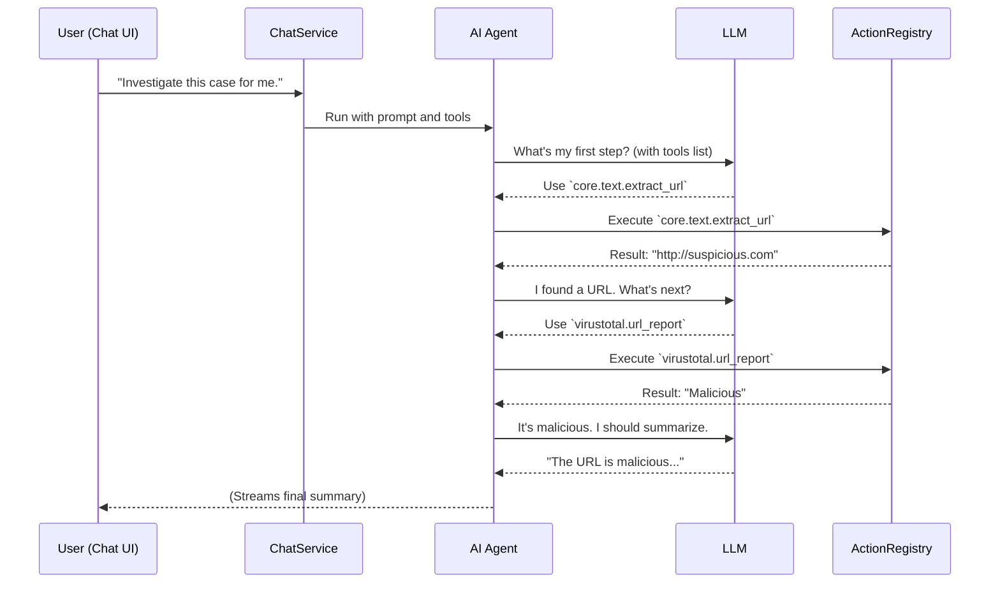

# Chapter 5: AI Agents & Chat

In the [previous chapter on Expressions](04_expressions______________.md), you learned how to make workflows dynamic by passing data between actions. This is incredibly powerful, but the logic is still fixed. You have to define every single step and connection in advance.

But what if you don't know the exact steps to solve a problem? What if the investigation requires judgment calls and a flexible approach?

This is where Tracecat's **AI Agent** comes in. It's like moving from a fixed assembly line to hiring a smart assistant who can think for themselves.

## What is an AI Agent?

Imagine you're a senior security analyst and you have a new junior analyst on your team. You wouldn't give them a 100-step checklist for every single task. Instead, you'd give them a **goal** and a **toolbox**.

*   **Goal:** "Investigate this suspicious email and tell me if it's a threat."
*   **Toolbox:** "Here's how you extract URLs, check them on VirusTotal, and add comments to a case."

The junior analyst would then use their own intelligence to decide which tools to use and in what order to achieve the goal.

That's exactly what a Tracecat AI Agent is. It's a smart assistant powered by a Large Language Model (LLM) that you can give a goal (your instructions) and a set of available actions (tools from the [Action Registry](03_action_registry_.md)). The agent intelligently decides which tools to use to get the job done.

## Interacting with Agents via Chat

The most natural way to work with an assistant is to talk to them. Tracecat's **Chat** interface provides a conversational way for you to interact with an AI agent. You can ask it to investigate a case, execute a runbook, or answer questions, all within a familiar chat window.

As the agent works, it streams its thought process and actions back to you in real-time. You're not just waiting for a final answer; you're watching it work, which provides transparency and builds trust.

Let's see how we can use this to supercharge our phishing investigation. Instead of a rigid workflow, a user can simply open a chat connected to the phishing case and type:

> "Investigate this case. Extract any URLs, check their reputation, and summarize your findings for me."

## Using the Agent in a Workflow

While chat is a primary interface, you can also use the AI Agent as a powerful step within a larger, more structured workflow. Tracecat provides a built-in `ai.agent` action for this.

Here’s how you would define that action in your DSL:

```yaml
actions:
  - ref: intelligent_phishing_analysis
    action: ai.agent
    args:
      # The Goal: What you want the agent to do
      user_prompt: "Investigate this case. Find URLs, check them, and summarize."
      
      # The Toolbox: Which actions it is allowed to use
      actions:
        - "core.text.extract_url"
        - "virustotal.url_report" # (Example action)
        - "core.case.create_comment"
        
      # The Context: Information the agent needs to get started
      instructions: "You are an AI security analyst. Here is the case data: ${{ TRIGGER.case.description }}"
      
      # Model configuration
      model_name: "gpt-4-turbo"
      model_provider: "openai"
```

Let's break down the `args`:
*   **`user_prompt`**: The main goal or question you're giving the agent.
*   **`actions`**: A list of tool names from the [Action Registry](03_action_registry_.md). This is the agent's "toolbox." Limiting the tools is a crucial safety and performance feature.
*   **`instructions`**: A system prompt that gives the agent context, like its persona ("You are a security analyst") and key data, which we provide dynamically using an [Expression](04_expressions______________.md).
*   **`model_name` / `model_provider`**: Specifies which LLM should power the agent's "brain."

When this action runs, the agent will receive the instructions and prompt, analyze the list of available tools, and start a cycle of thinking, acting, and observing until it has fulfilled your request.

## Under the Hood: The Life of an Agent Interaction

So what happens when you send a message in the chat? How does the agent decide to call `core.text.extract_url`?

1.  **Request Received:** Your chat message is sent to Tracecat's API.
2.  **Service Layer:** The `ChatService` receives the message, loads the context (e.g., the case data), and prepares the full set of instructions for the agent.
3.  **Agent Invocation:** It calls the core `run_agent` function, passing it your message, the instructions, and the list of available tools.
4.  **LLM Call (Thinking):** The `Agent` formats your request and the tool descriptions into a special prompt for the LLM. It asks the LLM, "Based on this goal and these tools, what is the very next step?"
5.  **Tool Selection:** The LLM responds with a decision, saying, "I should use the `core.text.extract_url` tool with the case description as input."
6.  **Tool Execution:** The Tracecat agent receives this decision, finds the `core.text.extract_url` function in the [Action Registry](03_action_registry_.md), and executes it.
7.  **Observation:** The result of the tool (the extracted URL) is sent back to the LLM. The agent essentially tells it, "I ran the tool you asked for, and here's what I found: `http://suspicious-site.io`."
8.  **Repeat:** The cycle repeats. The agent, now knowing the URL, might decide its next step is to call the `virustotal.url_report` tool.
9.  **Final Response:** Once the agent determines the goal is complete, it generates a final summary and sends it back to you.

Throughout this process, each step—thinking, tool call, tool result—is **streamed** back to the UI, so you can see what's happening in real-time.

Here's a diagram illustrating this loop:



### Diving into the Code

Let's look at the key pieces of code that enable this agentic behavior.

**1. The Agent Action (`agent.py`)**

First, the `ai.agent` function is registered just like any other action, making it available to the DSL.

```python
# A simplified view of the AI agent action.
# from: packages/tracecat-registry/tracecat_registry/core/agent.py
@registry.register(
    namespace="ai",
    description="AI agent with tool calling capabilities.",
    # ... other metadata
)
async def agent(
    user_prompt: str,
    actions: list[str], # The list of tool names
    instructions: str | None = None,
    model_name: str,
    model_provider: str,
    # ... other config
) -> dict[str, Any]:
    # This action is a wrapper around the core agent runtime
    output = await run_agent(
        user_prompt=user_prompt,
        actions=actions,
        instructions=instructions,
        model_name=model_name,
        model_provider=model_provider,
        # ... pass other args
    )
    return output.model_dump(mode="json")
```
This code defines the `ai.agent` action. It takes your prompt, instructions, and list of tools, and passes them directly to the `run_agent` function, which does the heavy lifting.

**2. The Chat Entrypoint (`router.py`)**

When you interact via the UI, the request comes through a dedicated chat router. It's set up to handle streaming responses, which is crucial for real-time feedback.

```python
# The API endpoint for a streaming chat response.
# from: tracecat/chat/router.py
@router.post("/{chat_id}/vercel")
async def chat_with_vercel_streaming(
    chat_id: uuid.UUID,
    request: ChatRequest,
    # ... other dependencies
) -> StreamingResponse:
    svc = ChatService(session, role)
    # 1. Start the agent execution in the background
    await svc.start_chat_turn(
        chat_id=chat_id, request=request, executor=executor
    )

    # 2. Immediately return a streaming response connection
    return StreamingResponse(
        # ... logic to stream events from the agent run ...
    )
```
This endpoint is designed for interactivity. It kicks off the agent's process (`start_chat_turn`) and immediately opens a connection to stream events back to the user's browser.

**3. The Agent Builder (`factory.py`)**

Inside the agent runtime, the `build_agent` function assembles the agent object. It combines the LLM, your instructions, and the Python functions for the tools you specified.

```python
# Simplified logic for creating an agent.
# from: tracecat/agent/factory.py
async def build_agent(config: AgentConfig) -> Agent[Any, Any]:
    # 1. Get the actual Python functions for the tool names
    agent_tools: list[Tool] = await build_agent_tools(actions=config.actions)
    
    # 2. Select the LLM model
    model = get_model(config.model_name, config.model_provider)

    # 3. Create the Agent object with instructions and tools
    agent = Agent(
        model=model,
        instructions=config.instructions,
        tools=agent_tools,
    )
    return agent
```
This is the heart of the setup process. It translates the list of tool *names* (e.g., `"core.text.extract_url"`) into actual, callable `Tool` objects and hands them, along with your instructions, to the `pydantic-ai` `Agent` class.

**4. The Streaming Adapter (`vercel.py`)**

The agent's internal events (like `PartStartEvent` or `FunctionToolResultEvent`) are just Python objects. To show them in the UI, they need to be converted into a format the browser understands. The `VercelStreamContext` handles this translation.

```python
# Simplified logic for handling an agent stream event.
# from: tracecat/agent/adapter/vercel.py
async def handle_event(self, event: AgentStreamEvent) -> AsyncIterator[str]:
    # When the agent starts thinking...
    if isinstance(event, PartStartEvent) and isinstance(event.part, ThinkingPart):
        # ...send a "reasoning-start" message to the UI.
        yield format_sse({"type": "reasoning-start", ...})

    # When the agent calls a tool...
    if isinstance(event, FunctionToolResultEvent):
        # ...send a "tool-output-available" message to the UI.
        yield format_sse({"type": "tool-output-available", ...})
```
This code acts as a real-time translator. It listens for events from the running agent and converts them into formatted Server-Sent Events (SSE) that the chat UI can display as the agent's "thoughts" or tool usage.

## Conclusion: Flexible, Intelligent Automation

You've now seen how **AI Agents & Chat** add a new layer of intelligence and interactivity to Tracecat. Instead of pre-defining every step of a workflow, you can give a smart agent a goal and a toolbox, and it will figure out the rest. This allows you to tackle complex, ambiguous problems that are impossible to script with a rigid workflow.

This conversational approach, powered by a real-time streaming architecture, makes automation more transparent, trustworthy, and powerful than ever before.

But how does Tracecat manage to run all these different tasks—from simple workflow actions to complex AI agent loops—reliably and at scale? The answer lies in its powerful backbone.

In the next chapter, we will explore the [Execution Engine (Temporal + Ray)](06_execution_engine__temporal___ray__.md), the distributed system that brings your workflows and agents to life.

---

Generated by [AI Codebase Knowledge Builder](https://github.com/The-Pocket/Tutorial-Codebase-Knowledge)