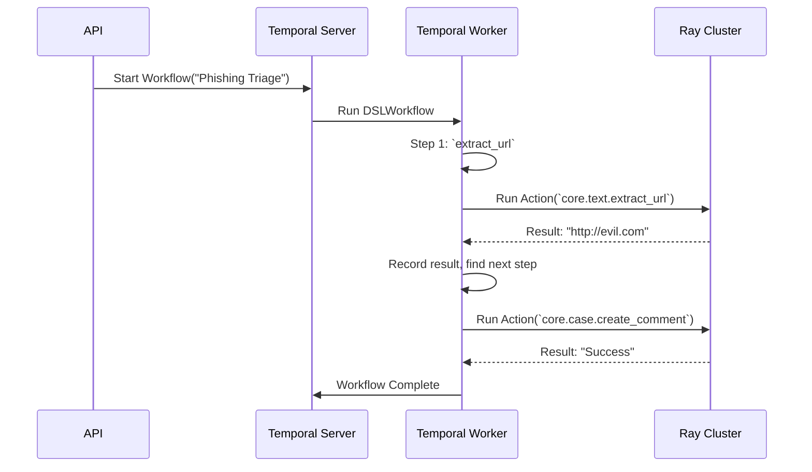

# Chapter 6: Execution Engine (Temporal + Ray)

In the [previous chapter on AI Agents & Chat](05_ai_agents___chat_.md), we saw how Tracecat can run complex, intelligent tasks. We've defined workflows, chained actions together, and even given goals to AI agents.

But how does Tracecat actually *run* all of this? What happens if a server crashes in the middle of a 10-step workflow? How does it handle running hundreds of actions at the same time without getting overwhelmed?

Welcome to the **Execution Engine**, the powerful and reliable factory floor of Tracecat.

## Why a Simple "Run" Button Isn't Enough

Imagine you have a critical workflow that needs to run. A simple script might work for a while, but what happens when:
*   **The server reboots?** Your workflow stops halfway through and never resumes. State is lost.
*   **An action fails?** An API you're calling is temporarily down. The whole workflow fails, and you have to start over manually.
*   **You get a flood of alerts?** Your single script gets overloaded trying to run 100 workflows at once, and everything grinds to a halt.

To solve these problems, Tracecat doesn't just "run" your workflow. It uses a sophisticated engine built on two industry-leading technologies: **Temporal** and **Ray**.

> **Analogy: The Smart Factory**
> Think of your workflow as the blueprint for building a car.
> *   You need a **Foreman** who reads the blueprint, assigns tasks, tracks progress, and ensures quality control. Even if the lights go out, the foreman knows exactly where every car was in the assembly line. This is **Temporal**.
> *   You need a **Workshop** full of powerful, specialized machines that can build the parts quickly and efficiently. If you need to build more cars, you can just add more machines. This is **Ray**.

Together, Temporal and Ray create an execution engine that is both incredibly reliable and massively scalable.

## Key Concepts: Foreman and Workshop

Let's break down the two main components of the engine.

### Temporal: The Reliable Foreman

**Temporal** is an orchestrator. Its only job is to manage the state and progress of your workflow. It is obsessed with reliability.

When you start a workflow, you're handing the blueprint to Temporal. The Temporal "foreman" will:
*   **Run steps in order:** It reads your `depends_on` rules and ensures actions are executed only when their prerequisites are met.
*   **Handle retries:** If an action fails (e.g., a network error), Temporal can automatically try it again according to your configured policy.
*   **Maintain state:** It durably saves the result of every single step. If the server running Tracecat restarts, Temporal can resume the workflow from the exact point it left off, with all the data intact. It's like it has a perfect memory.

Crucially, **Temporal does not run your action's code itself**. It's purely a manager. When it's time to perform a task, it delegates.

### Ray: The Scalable Workshop

**Ray** is a distributed computing framework. Its job is to run the actual code of your actions. It is obsessed with performance and scale.

When Temporal's foreman needs a task done, it hands the job over to the Ray "workshop." Ray will:
*   **Find an available worker:** The Ray cluster is made up of many worker processes. It finds one that's free and gives it the action to run.
*   **Execute the code:** The worker runs the Python function for your action (e.g., `core.http_request`) in a sandboxed environment.
*   **Scale on demand:** If 100 workflows all need to run an action at the same time, Ray can distribute that work across all its available workers, running them in parallel.

This separation is the key to Tracecat's power. Temporal provides the brains and reliability; Ray provides the muscle and speed.

## Under the Hood: A Workflow's Journey

Let's follow our simple phishing workflow as it travels through the Execution Engine.

1.  **Workflow Start:** A user triggers the "Phishing Triage" workflow. The Tracecat API sends a "start workflow" command to the **Temporal Server**.
2.  **Orchestration Begins:** The Temporal Server finds an available **Temporal Worker** and tells it to begin executing the `DSLWorkflow` logic.
3.  **First Task Assignment:** The Temporal Worker looks at the workflow's actions and sees the first step is `extract_url_from_description`. It creates a job ticket for this, called an "Activity."
4.  **Hand-off to Ray:** The Activity code for `run_action` doesn't execute the logic itself. Instead, it makes a request to the **Ray Cluster**, saying, "Please run the `core.text.extract_url` action with these arguments."
5.  **Distributed Execution:** A Ray worker process picks up the job, executes the Python code, and gets the result (the URL).
6.  **Result Returned:** The result is sent back to the Temporal Worker. Temporal records this result in the workflow's history, ensuring it's saved permanently.
7.  **Next Step:** The Temporal Worker sees that the next action, `add_url_as_a_comment`, can now run. The cycle repeats, with Temporal handing off the next job to Ray.

Here is a diagram of this flow:



### Diving into the Code

Let's look at the key code that forms the bridge between these systems.

**1. The Temporal Worker (`dsl/worker.py`)**

When Tracecat starts, it launches a Temporal Worker process. This worker constantly polls a task queue, waiting for jobs from the Temporal Server.

```python
# from: tracecat/dsl/worker.py (simplified)
async def main() -> None:
    client = await get_temporal_client()

    # Create a worker that listens on a specific task queue
    async with Worker(
        client,
        task_queue="tracecat-task-queue",
        workflows=[DSLWorkflow],      # It knows how to run our workflows
        activities=get_activities(),  # It knows what jobs it can do
    ):
        # ... wait forever for jobs ...
```
This code initializes the "foreman." It tells Temporal that this process is ready to execute `DSLWorkflow` logic and can handle any of the registered `activities` (our action runners).

**2. The Bridge: Temporal Activity to Ray (`dsl/action.py`)**

When the Temporal Worker needs to run an action, it executes an "Activity." This is just a Python function. Our activity for running actions is the critical bridge to Ray.

```python
# from: tracecat/dsl/action.py (conceptual)
from temporalio import activity

@activity.defn
async def run_action(input: RunActionInput) -> Any:
    """This is a Temporal Activity. It's the bridge to Ray."""
    # This function doesn't do the work itself.
    # It sends the job to the Ray cluster for execution.
    result = await dispatch_action_on_cluster(input)
    return result
```
The `@activity.defn` decorator marks this as a job that Temporal can manage. Notice that its only job is to call `dispatch_action_on_cluster`, which sends the task to Ray. This keeps the foreman (Temporal) separate from the workshop (Ray).

**3. The Ray Executor (`executor/engine.py`)**

Tracecat also runs an executor service that is connected to the Ray cluster. This service is responsible for receiving jobs and putting them on the Ray workshop floor.

```python
# from: tracecat/executor/engine.py (simplified)
from contextlib import contextmanager
import ray

@contextmanager
def setup_ray():
    # Connect to the Ray cluster when the service starts
    context = ray.init(namespace="tracecat")
    try:
        yield # The service runs while connected
    finally:
        # Disconnect when the service shuts down
        ray.shutdown()
```
This `setup_ray` function ensures that our executor is part of the Ray cluster and can submit tasks to it.

**4. The Ray Task (`executor/service.py`)**

Finally, this is how we define a piece of work for Ray. The `@ray.remote` decorator transforms a normal Python function into a distributed task that can run on any worker machine in the cluster.

```python
# from: tracecat/executor/service.py (simplified)
import ray

# This decorator turns a Python function into a Ray task.
@ray.remote
def run_action_task(input: RunActionInput, role: Role):
    """Ray task that runs an action in a separate process."""
    # ... logic to run the actual action function ...

async def run_action_on_ray_cluster(input: RunActionInput, ...):
    # Schedule the remote task to run on the Ray cluster
    obj_ref = run_action_task.remote(input, ctx.role)

    # Wait for the result to come back from the Ray worker
    return await asyncio.to_thread(ray.get, obj_ref)
```
When `run_action_task.remote(...)` is called, Ray takes care of serializing the function and its arguments, sending them to an available worker, executing the code, and returning the result.

## Conclusion: Reliability Meets Scalability

You've now seen the engine that powers all of Tracecat's automation. The **Execution Engine** is not a single program but a partnership between two powerful systems:
*   **Temporal** acts as the reliable foreman, guaranteeing your workflows run to completion, in the right order, even in the face of failures.
*   **Ray** acts as the scalable workshop, providing the distributed computing power to execute your actions quickly and in parallel.

This architecture ensures that Tracecat can be a robust and performant platform for all your automation needs, from the simplest workflows to the most complex AI-driven investigations.

Now that we understand the internal machinery, let's zoom back out. How do users, and other systems, talk to Tracecat? The answer is through a well-defined API. In the next chapter, we'll explore the front door to the application: [Services & API Routers](07_services___api_routers_.md).

---

Generated by [AI Codebase Knowledge Builder](https://github.com/The-Pocket/Tutorial-Codebase-Knowledge)