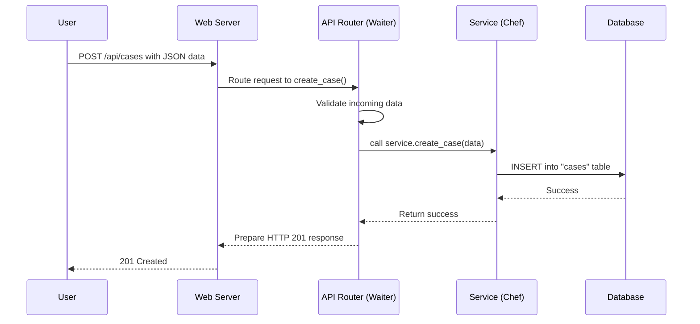

# Chapter 7: Services & API Routers

In the [previous chapter on the Execution Engine](06_execution_engine__temporal___ray__.md), we explored the powerful internal machinery—the "factory floor"—that runs your workflows reliably and at scale. We know how Tracecat *executes* tasks, but how does it *receive* them in the first place? How do you, or other applications, tell Tracecat to create a [Case](01_cases_.md) or get a list of workflows?

The answer is through a web API. This chapter will introduce the standard architecture that powers this API, ensuring the backend code is organized, maintainable, and easy to understand.

## The Restaurant Model: A Clean Separation

Imagine you're at a restaurant. There's a clear division of labor that makes everything run smoothly:
*   **Waiters** work in the dining room. They greet you at your table, present the menu (the available API endpoints), take your order (the HTTP request), and bring you your food (the HTTP response).
*   **Chefs** work in the kitchen. They are experts in cooking (the business logic). They take the orders from the waiters, use their tools and ingredients (the database), and prepare the meal.

A waiter doesn't cook, and a chef doesn't take orders from tables. This separation makes the restaurant efficient.

Tracecat's backend is organized just like this:
*   **API Routers are the Waiters.** They handle all the direct communication with the outside world (HTTP requests and responses). They validate incoming "orders" and pass them to the kitchen.
*   **Services are the Chefs.** They contain the core application logic. They fulfill the orders by interacting with the database and performing the actual work.

This separation of concerns is a fundamental software design pattern. It keeps the code clean: routers are responsible for the "how" of web communication, while services are responsible for the "what" of the application's logic.

## Anatomy of an API Request: Creating a Case

Let's revisit the simple use case of creating a new "phishing email" case. When you send a request to create a case, it goes on a journey through these two distinct layers.

### Step 1: The API Router (The Waiter)

The request first arrives at an **API Router**. The router's job is to listen at a specific URL, like `/api/cases`, for a specific HTTP method, like `POST`.

```python
# The waiter listening at the '/api/cases' table for new orders.
# from: tracecat/cases/router.py
@cases_router.post("", status_code=HTTP_201_CREATED)
async def create_case(
    *,
    role: WorkspaceUser,
    session: AsyncDBSession,
    params: CaseCreate,
) -> None:
    # 1. Take the order (params)
    # 2. Pass it to the chef (CasesService)
    service = CasesService(session, role)
    await service.create_case(params)
    # 3. The chef handles the rest!
```
This code does a few simple things, just like a waiter:
1.  It listens for `POST` requests at the `/cases` URL.
2.  It takes the incoming data and makes sure it looks correct (FastAPI does this automatically using the `CaseCreate` model).
3.  It finds the right chef—the `CasesService`—and hands off the order.

Notice that the router has no idea how to create a case in the database. It just knows who to ask.

### Step 2: The Service (The Chef)

The `CasesService` is the chef who receives the order. It has the recipe and the tools to get the job done.

```python
# The chef in the kitchen preparing the 'create case' order.
# from: tracecat/cases/service.py
class CasesService(BaseWorkspaceService):
    # ...

    async def create_case(self, params: CaseCreate) -> Case:
        # 1. Prepare the ingredients (the database object)
        case = Case(
            owner_id=self.workspace_id,
            summary=params.summary,
            description=params.description,
            # ... other fields
        )
        # 2. Cook! (Save to the database)
        self.session.add(case)
        await self.session.commit()
        return case
```
This service layer contains the actual business logic:
1.  It creates a `Case` database object using the data from the order.
2.  It uses its special tool, the database session (`self.session`), to save the new case.

The service never talks directly to the user. It gets its instructions from the router and returns the finished "dish."

## Under the Hood: The Request Lifecycle

Let's trace the full journey of an API request from the user to the database and back.

1.  A user sends a `POST` request with JSON data to `/api/cases`.
2.  The web server (FastAPI) receives the request and, based on the URL, routes it to the `create_case` function in the `CasesRouter`.
3.  The `CasesRouter` (the waiter) validates the incoming JSON against the `CaseCreate` model. If it's invalid, it sends back an error immediately.
4.  The router creates an instance of the `CasesService` (the chef) and calls its `create_case` method, passing along the validated data.
5.  The `CasesService` performs the core logic: it creates a `Case` object and tells the database to save it.
6.  The service layer finishes its work and returns control to the router.
7.  The router, seeing that the job was successful, tells the web server to send a `201 Created` HTTP response back to the user.

Here's a diagram illustrating this clean handoff:



### Diving into the Code

Let's look at the key pieces of code that build this architecture.

**1. The Router (`tracecat/cases/router.py`)**

A router is a self-contained unit for a specific feature. The `cases_router` handles everything related to cases.

```python
# from: tracecat/cases/router.py
from fastapi import APIRouter
from tracecat.cases.service import CasesService

# Create a router for the 'cases' feature
cases_router = APIRouter(prefix="/cases", tags=["cases"])

@cases_router.post("")
async def create_case(params: CaseCreate, ...):
    service = CasesService(...)
    await service.create_case(params)
```
The `APIRouter` object from the FastAPI framework is the core of this file. The `@cases_router.post("")` decorator is what connects a URL path and an HTTP method to a specific Python function.

**2. The Service (`tracecat/cases/service.py`)**

The service is a Python class that groups related business logic. The `CasesService` has methods for creating, updating, getting, and listing cases.

```python
# from: tracecat/cases/service.py
from tracecat.service import BaseWorkspaceService

class CasesService(BaseWorkspaceService):
    service_name = "cases"

    def __init__(self, session: AsyncSession, role: Role | None = None):
        # Gets the database session and user info
        super().__init__(session, role)

    async def get_case(self, case_id: uuid.UUID) -> Case | None:
        # ... logic to get a case from the database ...

    async def create_case(self, params: CaseCreate) -> Case:
        # ... logic to create a case in the database ...
```
By inheriting from `BaseWorkspaceService`, it automatically gets access to important tools like the database session (`self.session`) and information about the current user (`self.role`). This keeps the code DRY (Don't Repeat Yourself).

**3. The Main App (`tracecat/api/app.py`)**

Finally, how does the application know about all these different routers? In the main `app.py` file, we "include" them, like a restaurant manager assigning sections to all the waiters.

```python
# from: tracecat/api/app.py
from fastapi import FastAPI
from tracecat.cases.router import cases_router
from tracecat.workspaces.router import router as workspaces_router

# The main application object
app = FastAPI()

# Tell the app to use our routers
app.include_router(cases_router)
app.include_router(workspaces_router)
# ... include all other routers ...
```
This simple act of including each router builds the entire API for the Tracecat application. It creates a complete map of all available endpoints that users can interact with.

## Conclusion: An Organized Backend

You've now learned about the fundamental architectural pattern that keeps Tracecat's backend organized: the separation of **Services** and **API Routers**.

*   **Routers** are the front-of-house staff, handling web requests and responses. They are the "waiters."
*   **Services** are the back-of-house experts, containing the core business logic and database interactions. They are the "chefs."

This separation makes the application easier to develop, test, and maintain. When you need to change how a case is created, you know to look in the `CasesService`. When you need to add a new API endpoint, you know to start in a `router.py` file.

We now understand the application's front door (the API) and its internal factory (the [Execution Engine](06_execution_engine__temporal___ray__.md)). But one crucial question remains: who is allowed to open which doors? How do we ensure that only authorized users can create cases or modify workflows?

In the final chapter, we'll explore the security layer that protects the entire system: [Authentication & Authorization (Role/ACL)](08_authentication___authorization__role_acl_.md).

---

Generated by [AI Codebase Knowledge Builder](https://github.com/The-Pocket/Tutorial-Codebase-Knowledge)