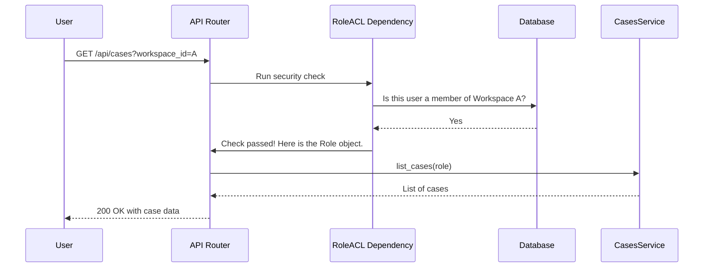

# Chapter 8: Authentication & Authorization (Role/ACL)

In the [previous chapter on Services & API Routers](07_services___api_routers_.md), we learned about the organized "restaurant" model that powers Tracecat's backend. We have waiters (API Routers) taking orders and chefs (Services) preparing them in the kitchen.

But our restaurant has a problem: there's no security! Anyone can walk in, go into any private dining room (a "workspace"), and even go into the kitchen and change the recipes (the workflows). We need a security guard.

This is where **Authentication** and **Authorization** come in.

## What's the Difference? And What's a `Role`?

Let's imagine our security guard, who is responsible for protecting the restaurant. Their job has two parts:

1.  **Authentication (Who are you?):** When you arrive, the guard asks for your ID. This is authentication—proving your identity. In Tracecat, this is usually done with a username/password or an API key.
2.  **Authorization (What are you allowed to do?):** Once the guard knows who you are, they check your name against a list. Are you a regular customer? A VIP with access to a private room? Or the head chef who can go anywhere? This is authorization—determining your permissions.

To make this simple, Tracecat combines all this information into a single, central concept: the **`Role`** object.

The `Role` is your digital ID badge. It's created after you successfully authenticate, and it contains everything the application needs to know about what you're allowed to do.

> **Analogy: The ID Badge**
> Think of your `Role` as a company ID badge. It has:
> *   Your name and picture (`user_id`).
> *   The department you work in (your current `workspace_id`).
> *   Your job title, like "Intern" or "CEO" (your `access_level` and `workspace_role`).

This `Role` object follows you everywhere as you interact with the Tracecat API. Every time you try to do something, the system looks at your `Role` to decide if you have permission.

## Anatomy of a `Role`

Let's look at what the `Role` object looks like in the code. It's a simple Pydantic model that holds all the key authorization information.

```python
# A simplified view of the Role object.
# from: tracecat/types/auth.py
class Role(BaseModel):
    # Are you a human user or an internal automated service?
    type: Literal["user", "service"]
    
    # Which workspace are you currently operating in?
    workspace_id: WorkspaceID | None
    
    # What is your role within that workspace (e.g., Admin)?
    workspace_role: WorkspaceRole | None

    # What is your unique user ID?
    user_id: UserID | None
    
    # What is your organization-wide access level?
    access_level: AccessLevel = AccessLevel.BASIC
```
This simple object is the single source of truth for security. Now let's see how we use it to protect our application.

## Guarding the Door: `RoleACL` on API Routers

The first line of defense is at the API endpoint itself. Before any of our "waiter" code from the [Services & API Routers](07_services___api_routers_.md) chapter even runs, we need to check the user's ID badge.

We do this using a special FastAPI dependency called `RoleACL` (Access Control List). You can think of it as a set of instructions for the security guard posted on the door of each room.

Let's protect our endpoint for listing cases. We only want users who are members of a specific workspace to be able to see that workspace's cases.

```python
# from: tracecat/cases/router.py (conceptual)
from tracecat.auth.dependencies import WorkspaceUserRole

@cases_router.get("")
async def list_cases(
    # This is the security guard at the door!
    role: WorkspaceUserRole,
    session: AsyncDBSession,
):
    # If the code reaches this point, the user is authorized.
    service = CasesService(session, role)
    return await service.list_cases()
```
The magic is in `role: WorkspaceUserRole`. This isn't a normal function argument. It's a dependency that tells FastAPI: "Before running this function, perform a security check."

`WorkspaceUserRole` is just a shortcut for a more complex `RoleACL` definition. It enforces rules like:
1.  Is this a real, logged-in user? (Authentication)
2.  Did they provide a `workspace_id` in their request?
3.  Are they actually a member of that workspace? (Authorization)

If any of these checks fail, the dependency immediately stops the request and sends back a `403 Forbidden` error. The user is turned away at the door, and the service logic is never even touched.

## Guarding the Kitchen: Service-Level Checks

Sometimes, a check at the front door isn't specific enough. Imagine we have an action that allows a user to add another user to a workspace.

Anyone who is a member of the workspace can get through the front door (the API endpoint). But we probably only want users who are *Admins* within that workspace to be able to add new members. This is a more granular rule that belongs inside the "kitchen" (the Service layer).

For this, we use decorator-based controls.

```python
# from: tracecat/authz/service.py
from tracecat.authz.controls import require_workspace_role

class MembershipService(BaseService):

    # This decorator protects the method.
    @require_workspace_role(WorkspaceRole.ADMIN)
    async def create_membership(self, ...):
        # This code will only run if the user's ID badge
        # shows they have the 'ADMIN' role in this workspace.
        # ... logic to add a new user to the workspace ...
```
The `@require_workspace_role(WorkspaceRole.ADMIN)` decorator wraps our service method. Before the `create_membership` code runs, this decorator inspects the `Role` object that was passed into the service. If `role.workspace_role` is not `ADMIN`, it raises an error, stopping the operation.

## Under the Hood: The Authorization Flow

Let's trace the journey of a secure API request to understand how these pieces fit together. A user wants to list the cases for Workspace `A`.

1.  **Request Sent:** The user's browser sends a request to `GET /api/cases?workspace_id=A`, including their authentication token.
2.  **Router Receives:** FastAPI routes this to our `list_cases` function.
3.  **`RoleACL` Dependency Runs:** Before `list_cases` is executed, FastAPI runs the `WorkspaceUserRole` dependency.
4.  **Security Checks:** The dependency performs its checks:
    *   It validates the user's token to confirm their identity (`user_id`).
    *   It queries the database to see if this user is a member of Workspace `A`.
5.  **`Role` is Created:** If all checks pass, the dependency creates the `Role` object (e.g., `{user_id: ..., workspace_id: 'A', workspace_role: 'MEMBER'}`).
6.  **Endpoint Execution:** The `Role` object is passed into the `list_cases` function.
7.  **Service Called:** The router calls the `CasesService`, passing the `Role` along. The service can now use this `Role` for any further, more specific permission checks.

Here is a diagram showing this security checkpoint:



### Diving into the Code

Let's look at the key pieces of code that build these security controls.

**1. The `RoleACL` Dependency Factory (`credentials.py`)**

The `RoleACL` function isn't a simple dependency; it's a "factory" that builds the right dependency based on the rules you give it.

```python
# A simplified view of the RoleACL factory.
# from: tracecat/auth/credentials.py
def RoleACL(
    *,
    allow_user: bool = True,
    require_workspace: Literal["yes", "no", "optional"] = "yes",
    min_access_level: AccessLevel | None = None,
    require_workspace_roles: list[WorkspaceRole] | None = None,
) -> Any:
    # ... complex logic to build and return a FastAPI dependency ...
    # ... that enforces all the rules you specified. ...
```
When you use `RoleACL(...)`, this function constructs a custom security check on the fly. This is how we can create different security policies, like `WorkspaceUserRole` (a user in a required workspace) or `OrgAdminUser` (a user with the global admin access level).

**2. The `WorkspaceUserRole` Shortcut (`dependencies.py`)**

To make our code cleaner, we define common security patterns as type-annotated shortcuts.

```python
# Defining a reusable security policy.
# from: tracecat/auth/dependencies.py
WorkspaceUserRole = Annotated[
    Role,
    RoleACL(allow_user=True, allow_service=False, require_workspace="yes"),
]
```
This code creates the `WorkspaceUserRole` alias. It uses the `RoleACL` factory to build a dependency that requires an authenticated user (`allow_user=True`) who is operating within a specific workspace (`require_workspace="yes"`).

**3. The Service-Level Decorator (`controls.py`)**

The `@require_workspace_role` decorator is a function that wraps another function. Its logic is very straightforward.

```python
# A simplified view of the workspace role decorator.
# from: tracecat/authz/controls.py
def require_workspace_role(*roles: WorkspaceRole):
    def decorator(fn):
        @functools.wraps(fn)
        async def async_wrapper(self: BaseService, *args, **kwargs):
            # 1. Get the role from the service instance
            user_role = self.role
            # 2. Check if the role is in the allowed list
            if user_role.workspace_role not in roles:
                raise TracecatAuthorizationError("Not allowed!")
            # 3. If it is, run the original function
            return await fn(self, *args, **kwargs)
        return async_wrapper
    return decorator
```
This is a standard Python decorator pattern. It checks the `self.role` attribute of the service object against the required roles. If the check passes, it proceeds; otherwise, it raises an error.

## Conclusion: A Secure and Organized System

Congratulations! You have now completed the tour of Tracecat's core concepts.

In this final chapter, you've learned about the critical security layer that protects the entire application. By using the central **`Role`** object as a digital ID badge, Tracecat enforces security at two key levels:
*   At the **API Router** with `RoleACL` dependencies, acting as the guard at the front door.
*   At the **Service** with decorators like `@require_workspace_role`, acting as specific rules inside the kitchen.

This layered approach ensures that every action is checked against a clear policy, making the platform robust and secure.

From the humble [Case](01_cases_.md) to the powerful [Execution Engine](06_execution_engine__temporal___ray__.md), and all the way to this security framework, you now have a comprehensive understanding of how Tracecat works. You have the foundational knowledge to start building, extending, and using Tracecat to automate your world. Happy building

---

Generated by [AI Codebase Knowledge Builder](https://github.com/The-Pocket/Tutorial-Codebase-Knowledge)