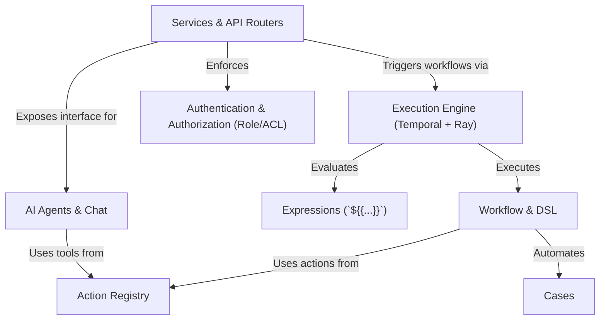

# Tutorial: tracecat

Tracecat is a platform for automating responses to security incidents or IT tickets.
You create a **Workflow**, which is like a step-by-step *recipe*, using a library of pre-built **Actions** (e.g., sending a Slack message).
When a new **Case** (an alert or ticket) is created, the *Execution Engine* runs the appropriate workflow to handle it automatically.
The platform also includes a smart **AI Agent** that can intelligently choose which actions to use to investigate and resolve cases.

**Source Repository:** [https://github.com/TracecatHQ/tracecat](https://github.com/TracecatHQ/tracecat)

## Chapters

1. [Cases
](01_cases_.md)
2. [Workflow & DSL
](02_workflow___dsl_.md)
3. [Action Registry
](03_action_registry_.md)
4. [Expressions (`${{...}}`)
](04_expressions______________.md)
5. [AI Agents & Chat
](05_ai_agents___chat_.md)
6. [Execution Engine (Temporal + Ray)
](06_execution_engine__temporal___ray__.md)
7. [Services & API Routers
](07_services___api_routers_.md)
8. [Authentication & Authorization (Role/ACL)
](08_authentication___authorization__role_acl__.md)

---

Generated by [AI Codebase Knowledge Builder](https://github.com/The-Pocket/Tutorial-Codebase-Knowledge)